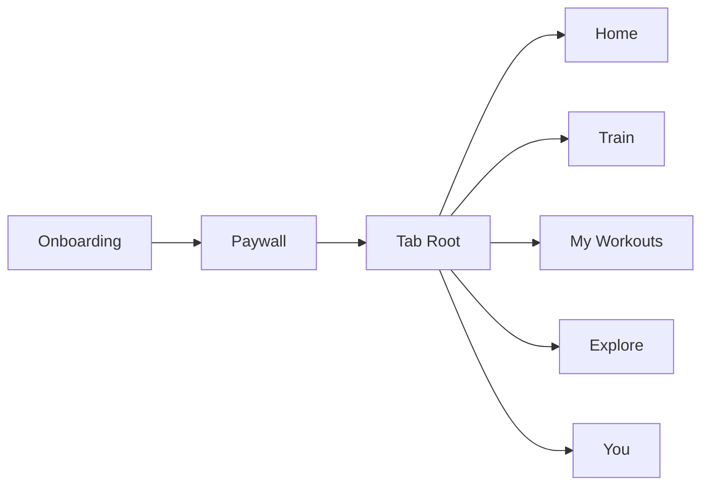

# Product Architecture Review

## 1. Product Summary

The product is a **strength training and workout logging platform** with a routine/program marketplace layer. Core pillars are elite workout execution, AI-generated programs and routines, analytics, creator profiles, and Apple ecosystem integration.

Marketplace model: the core objects are **programs**, **routines/workouts**, and **creators**. User actions are discover, save, copy, start, complete, rate, and follow creators.

Creator model: publishing is threshold-gated and requires eligibility checks before publish is enabled. Distribution is credibility-gated with visibility tiers (`Tier 0` drafts, `Tier 1` published low distribution, `Tier 2` ranked distribution eligibility).

Distribution gating inputs: profile completeness, routine/program completeness, copies, starts, completions, completion rate, completion-gated ratings, PR outcomes, spam/report signals. Likes are not primary ranking signals.

Launch exclusions: generic social feeds, comments, DMs, groups/forums, influencer timelines/subscriptions, nutrition tracking, mobility modules, rehab modules.

## 2. Final App Navigation Model

### Navigation Diagram

### Home
- Purpose: daily context and insight surface.
- Owned Features: CF-012 AI Program Generation and Evolution, CF-030 Weekly KPI Dashboard, CF-037 Goal and Target Modeling, CF-038 Routine and Program Discovery Marketplace, CF-041 Creator Distribution Eligibility, Credibility, Visibility, and Safety Controls
- Primary Surfaces: today planned workout card (informational), active program progress, key insight card, lightweight personalized recommendations.
- Key Flows: view daily context, route to Train for execution, route to Explore for discovery, route to You for deep metrics.

### Train
- Purpose: primary execution surface for workouts.
- Owned Features: CF-020 Session Entry and Start Modes, CF-021 Set Logging Interaction Model, CF-022 Effort and Intensity Capture, CF-023 Timer Stack, CF-024 Adaptive Defaults and PR Feedback, CF-025 Session Safeguards and Controls, CF-026 Session Completion Outputs and Routine Progress Tracking, CF-048 Live Activity and Lock-screen Runtime
- Primary Surfaces: segmented entry (`Today`, `Instant`, `Recent`), active workout session, timer stack, completion summary.
- Key Flows: start/resume workout, log sets, finish workout, persist completion evidence, trigger rating eligibility updates.

### My Workouts
- Purpose: user-owned structured training assets.
- Owned Features: CF-011 Workout, Routine, and Program Publishing Foundation, CF-012 AI Program Generation and Evolution, CF-013 Workout, Routine, and Program Catalog, CF-014 Workout, Routine, and Program Builder Structure, CF-015 Exercise Search and Filter Engine, CF-016 Exercise Preference Curation, CF-017 Custom Exercise Authoring, CF-018 Routine Composition Controls, CF-039 Routine Lifecycle Actions and Creator Follow
- Primary Surfaces: segmented asset views (`Programs`, `Routines`, `Saved`, `Drafts`), builder workspace, published-by-me surface.
- Key Flows: create/edit routine/program, save drafts, publish assets, manage copied assets, move saved assets into owned My Workouts assets.

### Explore
- Purpose: routine/program discovery marketplace.
- Owned Features: CF-013 Workout, Routine, and Program Catalog, CF-015 Exercise Search and Filter Engine, CF-038 Routine and Program Discovery Marketplace, CF-039 Routine Lifecycle Actions and Creator Follow, CF-040 Completion-Gated Ratings, CF-041 Creator Distribution Eligibility, Credibility, Visibility, and Safety Controls, CF-042 Creator and User Profile Management
- Primary Surfaces: horizontal category rail, vertical ranked discovery feed, search results for routines/programs/creators, routine/program detail, creator profile.
- Key Flows: discover assets, inspect trust metadata, save/copy/start, follow creator, submit completion-gated rating.

### You
- Purpose: identity, progress, and settings.
- Owned Features: CF-001 Account Authentication and Login, CF-007 Paywall Plan Packaging, CF-009 Purchase Recovery and Billing Controls, CF-027 Strength and Recovery Scoring, CF-028 Muscle Distribution Analytics, CF-030 Weekly KPI Dashboard, CF-031 Performance Trends and Rankings, CF-032 History and Report Windows, CF-033 Body Measurement Tracking, CF-035 Achievements and Milestones, CF-036 Streak and Habit Continuity Metrics, CF-042 Creator and User Profile Management, CF-043 Account Lifecycle and Recovery, CF-044 Appearance Localization and Units, CF-045 Notification and Reminder Controls, CF-046 Support and Product Communications, CF-047 Data Governance Controls, CF-050 Fitness Ecosystem Integrations, CF-052 Sync Export Import and Cloud, CF-053 Personal Coach and Trainer Modes
- Primary Surfaces: segmented views (`Profile`, `Progress`, `Settings`), history and PR analytics, subscription/integrations/settings.
- Key Flows: manage profile and creator page, review progress and history, control settings/subscription/integrations, access support/data governance.

## 3. Core User Flows

### Workout Execution Flow
1. User enters `Train` and selects `Today`, `Instant`, or `Recent`.
2. Workout session starts in `SYS-06 Workout Logging Engine` with runtime support from `SYS-07`.
3. User logs sets/reps/weight/RPE and manages timers.
4. Completion is confirmed, summary is rendered, and completion evidence is written to `SYS-13 Completion Tracking System`.
5. Analytics events are emitted to `SYS-08`; rating eligibility is updated in `SYS-14`.

### Routine Creation Flow
1. User enters `My Workouts` and opens program/routine builder.
2. Structure and exercises are authored in `SYS-04 Routine Builder System`, consuming library entities from `SYS-05`.
3. Drafts are persisted (Tier 0).
4. Publish action submits package to `SYS-10 Routine Publishing System`.

### Routine Discovery Flow
1. User enters `Explore` and sees category rail plus ranked vertical feed.
2. Discovery data and ranking lanes are resolved by `SYS-11 Routine Discovery System`.
3. Ranking and visibility eligibility are filtered by `SYS-14` tier and trust signals.
4. User opens routine/program detail or creator profile.

### Routine Copy/Start Flow
1. On detail screen user taps `Save`, `Copy`, or `Start`.
2. `Copy` dispatches to `SYS-04` and creates user-owned assets in My Workouts.
3. `Start` dispatches to `SYS-06` and routes into Train execution.
4. Follow action updates creator graph in `SYS-12` and personalization signals back to discovery.

### Routine Rating Flow
1. System checks eligibility using completion evidence from `SYS-13`.
2. Eligibility thresholds: workout completed once, routine at least 2 sessions, program 25-40% completion.
3. Eligible users submit rating via `SYS-14`; ineligible users receive locked-state requirements.
4. Ratings update trust metrics and discovery ranking signals; no comments are created.

### Creator Publishing Flow
1. Publishing via `SYS-10` requires eligibility thresholds before publish actions are enabled.
2. Newly published assets enter distribution with low/default discoverability tier.
3. `SYS-14` recalculates creator/asset credibility based on usage and quality signals.
4. Assets become eligible for ranked Explore distribution when tier requirements are met.

## 4. Feature System Map

| Canonical Feature ID | Feature Name | Domain | Priority | Owning System |
|---|---|---|---|---|
| CF-001 | Account Authentication and Login | Identity & Onboarding | P0 | SYS-01 Identity & Access System |
| CF-002 | Onboarding Personalization Core | Identity & Onboarding | P0 | SYS-02 Onboarding Orchestration System |
| CF-003 | Onboarding Context Inputs | Identity & Onboarding | P0 | SYS-02 Onboarding Orchestration System |
| CF-004 | Onboarding Progress Feedback | Identity & Onboarding | P1 | SYS-02 Onboarding Orchestration System |
| CF-005 | Pre-permission Education | Identity & Onboarding | P0 | SYS-02 Onboarding Orchestration System |
| CF-006 | Onboarding Monetization Gate | Identity & Onboarding | P0 | SYS-15 Monetization System |
| CF-007 | Paywall Plan Packaging | Monetization & Growth | P0 | SYS-15 Monetization System |
| CF-008 | Promotions and Offer Mechanics | Monetization & Growth | P1 | SYS-15 Monetization System |
| CF-009 | Purchase Recovery and Billing Controls | Monetization & Growth | P0 | SYS-15 Monetization System |
| CF-010 | Referral and Free-pass Growth Loops | Monetization & Growth | P2 | SYS-15 Monetization System |
| CF-011 | Workout, Routine, and Program Publishing Foundation | Routine System | P0 | SYS-10 Routine Publishing System |
| CF-012 | AI Program Generation and Evolution | Routine System | P0 | SYS-09 AI Coaching System |
| CF-013 | Workout, Routine, and Program Catalog | Routine System | P0 | SYS-11 Routine Discovery System |
| CF-014 | Workout, Routine, and Program Builder Structure | Routine System | P0 | SYS-04 Routine Builder System |
| CF-015 | Exercise Search and Filter Engine | Exercise Library | P0 | SYS-05 Exercise Library System |
| CF-016 | Exercise Preference Curation | Exercise Library | P1 | SYS-05 Exercise Library System |
| CF-017 | Custom Exercise Authoring | Exercise Library | P1 | SYS-05 Exercise Library System |
| CF-018 | Routine Composition Controls | Exercise Library | P0 | SYS-04 Routine Builder System |
| CF-019 | Exercise Knowledge Surfaces | Exercise Library | P1 | SYS-05 Exercise Library System |
| CF-020 | Session Entry and Start Modes | Workout Logging | P0 | SYS-06 Workout Logging Engine |
| CF-021 | Set Logging Interaction Model | Workout Logging | P0 | SYS-06 Workout Logging Engine |
| CF-022 | Effort and Intensity Capture | Workout Logging | P1 | SYS-06 Workout Logging Engine |
| CF-023 | Timer Stack | Workout Logging | P0 | SYS-07 Session Runtime System |
| CF-024 | Adaptive Defaults and PR Feedback | Workout Logging | P1 | SYS-06 Workout Logging Engine |
| CF-025 | Session Safeguards and Controls | Workout Logging | P0 | SYS-06 Workout Logging Engine |
| CF-026 | Session Completion Outputs and Routine Progress Tracking | Workout Logging | P0 | SYS-13 Completion Tracking System |
| CF-027 | Strength and Recovery Scoring | Analytics | P1 | SYS-08 Analytics Engine |
| CF-028 | Muscle Distribution Analytics | Analytics | P1 | SYS-08 Analytics Engine |
| CF-029 | Target Radar Analytics | Analytics | N/A | SYS-08 Analytics Engine |
| CF-030 | Weekly KPI Dashboard | Analytics | P0 | SYS-08 Analytics Engine |
| CF-031 | Performance Trends and Rankings | Analytics | P1 | SYS-08 Analytics Engine |
| CF-032 | History and Report Windows | Analytics | P0 | SYS-08 Analytics Engine |
| CF-033 | Body Measurement Tracking | Analytics | P0 | SYS-08 Analytics Engine |
| CF-034 | Body Transformation and Nutrition Targets | Analytics | N/A | SYS-08 Analytics Engine |
| CF-035 | Achievements and Milestones | Analytics | P1 | SYS-08 Analytics Engine |
| CF-036 | Streak and Habit Continuity Metrics | Analytics | P1 | SYS-08 Analytics Engine |
| CF-037 | Goal and Target Modeling | Analytics | P0 | SYS-08 Analytics Engine |
| CF-038 | Routine and Program Discovery Marketplace | Routine Marketplace Community | P0 | SYS-11 Routine Discovery System |
| CF-039 | Routine Lifecycle Actions and Creator Follow | Routine Marketplace Community | P0 | SYS-11 Routine Discovery System |
| CF-040 | Completion-Gated Ratings | Routine Marketplace Community | P0 | SYS-14 Routine Credibility Metrics System |
| CF-041 | Creator Distribution Eligibility, Credibility, Visibility, and Safety Controls | Routine Marketplace Community | P0 | SYS-14 Routine Credibility Metrics System |
| CF-042 | Creator and User Profile Management | Account & UX Infrastructure | P0 | SYS-12 Creator Profile System |
| CF-043 | Account Lifecycle and Recovery | Account & UX Infrastructure | P0 | SYS-01 Identity & Access System |
| CF-044 | Appearance Localization and Units | Account & UX Infrastructure | P0 | SYS-03 User Preferences & Settings System |
| CF-045 | Notification and Reminder Controls | Account & UX Infrastructure | P0 | SYS-16 Notification System |
| CF-046 | Support and Product Communications | Account & UX Infrastructure | P0 | SYS-20 Support & Feedback System |
| CF-047 | Data Governance Controls | Account & UX Infrastructure | P0 | SYS-18 Sync & Data Portability System |
| CF-048 | Live Activity and Lock-screen Runtime | Platform Features | P1 | SYS-21 Platform Experience System |
| CF-049 | Voice Assistant Integrations | Platform Features | P2 | SYS-21 Platform Experience System |
| CF-050 | Fitness Ecosystem Integrations | Platform Features | P0 | SYS-17 Integration Layer |
| CF-051 | AI Assistant Integrations | Platform Features | N/A | SYS-17 Integration Layer |
| CF-052 | Sync Export Import and Cloud | Platform Features | P0 | SYS-18 Sync & Data Portability System |
| CF-053 | Personal Coach and Trainer Modes | Coaching | P1 | SYS-09 AI Coaching System |

## 5. Creator Marketplace Model

### Publishing Model
- Threshold-gated publishing: publish actions are enabled only after eligibility thresholds are met.
- Eligibility examples: minimum completed workouts, minimum training days, minimum routine completions.
- Draft/public states are tracked through visibility tiers.

### Distribution Tiers
- Tier 0: private drafts.
- Tier 1: published with low distribution.
- Tier 2: eligible for ranked Explore distribution.

### Ranking Signals
- Profile completeness.
- Routine/program completeness.
- Copies, starts, completions, completion rate.
- Completion-gated ratings.
- PR outcomes while following the asset.
- Spam/report signals.
- Likes are not primary ranking inputs.

### Rating Rules
- Workout rating: allowed only after completion evidence exists.
- Routine rating: allowed only after at least 2 completed sessions.
- Program rating: allowed only after 25-40% completion.
- Comments are excluded from launch.

## 6. System Architecture Overview

| Core System | System ID | Responsibilities | Owned Data | Key Interactions |
|---|---|---|---|---|
| Identity (Identity & Access System) | SYS-01 | Apple/Google/Email auth; Session token lifecycle; Verification and recovery flows; Account deletion identity checks | user_identity; auth_provider_link; auth_session; recovery_token; deletion_request | Publishes identity events to SYS-18 and SYS-15; Supplies identity claims to all tab surfaces |
| Workout Logging (Workout Logging Engine) | SYS-06 | Start/resume/end workout; Set entry; Intensity capture; Save/discard controls | workout_session; session_exercise; session_set; session_note; session_summary | Publishes completion evidence to SYS-13; Publishes analytics events to SYS-08; Requests timers from SYS-07 |
| Routine Builder (Routine Builder System) | SYS-04 | Routine/program create/edit; Day structure; Composition controls; Draft lifecycle | routine_draft; program_draft; routine_day; routine_exercise; builder_validation_result | Consumes exercise library from SYS-05; Receives AI plan updates from SYS-09; Sends publish packages to SYS-10 |
| Routine Publishing (Routine Publishing System) | SYS-10 | Publish/unpublish; Versioning; Publish validation; Creator ownership linkage; Publish-threshold eligibility enforcement | published_routine; published_program; publish_version; publish_status; attribution_record; publish_access_policy | Accepts publish requests only when eligibility thresholds are satisfied; Emits published assets to SYS-11; Binds creator ownership via SYS-12 |
| Routine Discovery (Routine Discovery System) | SYS-11 | Category rail rendering data; Ranked lane generation; Search index; Save/copy/start dispatch; Distribution-eligibility filtering | discovery_index; ranked_lane_snapshot; category_rail_state; search_document; routine_action_event; distribution_filter_state | Consumes publish outputs from SYS-10; Applies credibility tier gating from SYS-14; Dispatches copy/start to SYS-04/SYS-06; Reads creator data from SYS-12 |
| Completion Tracking (Completion Tracking System) | SYS-13 | Completion evidence write; Routine/program progress counters; Active runner state; Rating eligibility counters | completion_event; routine_progress_state; program_progress_state; active_runner_state; eligibility_counter; start_event_counter | Consumes workout completion events; Supplies completion data to SYS-08/SYS-11/SYS-14 |
| Credibility Metrics (Routine Credibility Metrics System) | SYS-14 | Rating eligibility enforcement; Rating submission; Credibility scoring; Tier assignment; Spam/report penalty processing | routine_rating; program_rating; rating_eligibility_state; creator_credibility_score; distribution_tier_state; trust_signal_snapshot | Publishes ranking and tier signals to SYS-11; Publishes creator trust metrics to SYS-12; No comment thread ownership |
| Analytics (Analytics Engine) | SYS-08 | KPI aggregation; Trend computation; History windows; PR and milestone tracking | analytics_fact_workout; analytics_fact_set; metric_snapshot; trend_series; milestone_state; history_snapshot | Consumes workout and completion events; Supplies features to SYS-09 and SYS-14; Serves You > Progress |
| AI Coaching (AI Coaching System) | SYS-09 | AI plan generation; Progression phase adaptation; In-session coaching prompts | ai_plan_run; progression_phase_state; coaching_prompt_history; recommendation_explanation | Writes plans to SYS-04; Sends cues to SYS-06; Uses completion and creator quality data from SYS-13/SYS-12 |

### Key Interaction Spine
1. Routine creation in SYS-04 publishes to SYS-10.
2. SYS-10 feeds SYS-11 for marketplace indexing.
3. Workout completion in SYS-06 writes evidence to SYS-13.
4. SYS-13 and SYS-08 feed SYS-14 for rating/trust/tier scoring.
5. SYS-14 publishes ranking eligibility signals to SYS-11.
6. SYS-11 dispatches copy/start actions back into SYS-04 and SYS-06.

## 7. Competitor Positioning Snapshot

### Overall Coverage Counts (Across CF-001 to CF-053)
| Competitor | yes | partial | no_evidence | unknown |
|---|---|---|---|---|
| Hevy | 20 | 22 | 11 | 0 |
| JEFIT | 13 | 28 | 11 | 1 |
| SmartGym | 14 | 26 | 12 | 1 |
| Fitbod | 22 | 18 | 13 | 0 |
| GymVerse | 18 | 16 | 19 | 0 |
| Stronger | 20 | 20 | 13 | 0 |

### Capability Area Snapshot
| Capability Area | Evidence Pattern |
|---|---|
| Publishing | Strongest evidence: JEFIT (yes 3, partial 0), GymVerse (yes 3, partial 0) |
| Workout Execution | Strongest evidence: Fitbod (yes 3, partial 3) |
| Marketplace & Trust | Strongest evidence: Stronger (yes 4, partial 1) |
| Analytics Core | Strongest evidence: Fitbod (yes 4, partial 0) |

### Observed Competitor Strength
- Routine/program catalog and builder basics are broadly present (`CF-013`, `CF-014`).
- Workout logging fundamentals are broadly present (`CF-020`, `CF-021`, `CF-023`, `CF-025`, `CF-026`).
- Weekly KPI dashboards are consistently present (`CF-030`).

### Observed Competitor Weakness
- Completion-gated ratings are weak or absent in most products (`CF-040` has mostly `no_evidence`/`partial`).
- Marketplace trust and creator distribution control are inconsistent (`CF-041` mostly `partial` or `no_evidence`).
- Threshold-gated publishing + credibility-gated distribution as an explicit operating model is not strongly evidenced as an integrated pattern.

### Product Differentiation Position
- Threshold-gated publishing with tiered distribution gating is codified in system policy (`SYS-10` + `SYS-14` + `SYS-11`).
- Completion evidence is explicitly wired into ratings and ranking, creating trust-weighted discovery.
- Five-tab architecture separates context (`Home`) from execution (`Train`) and concentrates discovery in marketplace-native Explore.

## 8. Launch Feature Set

### Home
- CF-012 AI Program Generation and Evolution
- CF-030 Weekly KPI Dashboard
- CF-037 Goal and Target Modeling
- CF-038 Routine and Program Discovery Marketplace
- CF-041 Creator Distribution Eligibility, Credibility, Visibility, and Safety Controls

### Train
- CF-020 Session Entry and Start Modes
- CF-021 Set Logging Interaction Model
- CF-023 Timer Stack
- CF-025 Session Safeguards and Controls
- CF-026 Session Completion Outputs and Routine Progress Tracking

### My Workouts
- CF-011 Workout, Routine, and Program Publishing Foundation
- CF-012 AI Program Generation and Evolution
- CF-013 Workout, Routine, and Program Catalog
- CF-014 Workout, Routine, and Program Builder Structure
- CF-015 Exercise Search and Filter Engine
- CF-018 Routine Composition Controls
- CF-039 Routine Lifecycle Actions and Creator Follow

### Explore
- CF-013 Workout, Routine, and Program Catalog
- CF-015 Exercise Search and Filter Engine
- CF-038 Routine and Program Discovery Marketplace
- CF-039 Routine Lifecycle Actions and Creator Follow
- CF-040 Completion-Gated Ratings
- CF-041 Creator Distribution Eligibility, Credibility, Visibility, and Safety Controls
- CF-042 Creator and User Profile Management

### You
- CF-001 Account Authentication and Login
- CF-007 Paywall Plan Packaging
- CF-009 Purchase Recovery and Billing Controls
- CF-030 Weekly KPI Dashboard
- CF-032 History and Report Windows
- CF-033 Body Measurement Tracking
- CF-042 Creator and User Profile Management
- CF-043 Account Lifecycle and Recovery
- CF-044 Appearance Localization and Units
- CF-045 Notification and Reminder Controls
- CF-046 Support and Product Communications
- CF-047 Data Governance Controls
- CF-050 Fitness Ecosystem Integrations
- CF-052 Sync Export Import and Cloud

## 9. Explicit Launch Exclusions

### Product-Scope Exclusions
- Generic social feeds.
- Comments (including rating comments and routine/program comment threads).
- Direct messaging.
- Groups/forums.
- Influencer content timelines and creator subscription monetization.
- Nutrition tracking.
- Mobility modules.
- Rehab modules.
- TikTok-style fullscreen discovery as launch default.

### Rejected Canonical Features (N/A Priority)
- CF-029 Target Radar Analytics (MF-074)
- CF-034 Body Transformation and Nutrition Targets (MF-083, MF-084)
- CF-051 AI Assistant Integrations (MF-110, MF-111)

### Launch Architecture Exclusions
- No root tabs beyond `Home`, `Train`, `My Workouts`, `Explore`, `You`.
- No standalone `Progress`, `Community`, `Feed`, or `Library` root tab.
- No comment system ownership in architecture; `CF-040` is ratings-only.
