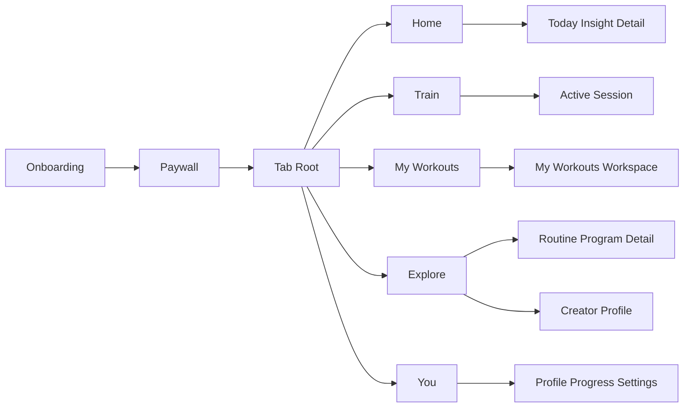

# Yoked Product Information Architecture

Source constraints:
- Canonical features derived from `MF-001` to `MF-130` only.
- No net-new feature invention in this architecture.
- Community model is a routine/program marketplace, not a social network feed.
- Launch navigation uses exactly five tabs.

## Yoked Training Object Model

1. `Workout`: single training session template.
2. `Routine`: repeating structure of workouts.
3. `Program`: time-bounded progression over multiple weeks.
4. Hierarchy usage in IA: Train executes workout instances, My Workouts manages workout/routine/program assets, and Explore discovers published workout/routine/program content.

## 1. Main Tabs (Final)

1. `Home`
Purpose: daily context and insight surface.
Mapped canonical features: `CF-012`, `CF-030`, `CF-037`, `CF-038`, `CF-041`.
Home content:
- Today's planned workout card (informational only).
- Active program progress snapshot.
- One key insight/progress card.
- Lightweight personalized recommendations.
Home exclusions:
- no resume workout controls,
- no quick-start workout controls,
- no start-workout buttons,
- no deep discovery feed interactions.
Home navigation handoffs:
- `View in Train` route for execution,
- `View in Explore` route for marketplace browsing,
- `View in You` route for full analytics.

2. `Train`
Purpose: primary execution surface for workouts.
Mapped canonical features: `CF-020`, `CF-021`, `CF-022`, `CF-023`, `CF-024`, `CF-025`, `CF-026`, `CF-048`.
Top segmented control:
- `Today`.
- `Instant`.
- `Recent`.
Train contains:
- resume active workout,
- start today's planned workout,
- start empty workout,
- quick exercise log,
- recent workouts/routines for rerun.
Train exclusivity:
- all active workout session routes and runtime controls stay inside Train.

3. `My Workouts`
Purpose: user-owned structured training assets.
Mapped canonical features: `CF-011`, `CF-012`, `CF-013`, `CF-014`, `CF-015`, `CF-016`, `CF-017`, `CF-018`, `CF-039`.
Top segmented control:
- `Programs`.
- `Routines`.
- `Saved`.
- `Drafts`.
My Workouts contains:
- My Programs,
- My Routines,
- Saved Routines,
- Draft Routines/Programs,
- Published by Me.
My Workouts exclusions:
- no workout history,
- no deep analytics modules,
- no profile settings controls.

4. `Explore`
Purpose: routine/program discovery marketplace.
Mapped canonical features: `CF-013`, `CF-015`, `CF-038`, `CF-039`, `CF-040`, `CF-041`, `CF-042`.
Launch Explore structure:
- horizontal category rail (or segmented categories),
- vertical scrolling ranked feed under category rail,
- metadata-rich routine/program cards.
Explore discovery lanes:
- Trending,
- Most Copied,
- Most Completed,
- Best Rated,
- Beginner Programs,
- By Goal,
- By Equipment,
- By Duration,
- By Muscle Group,
- Creator Spotlights.
Explore search scope:
- routines,
- programs,
- creators.
Explore exclusions:
- no TikTok-style fullscreen discovery default,
- no generic social timeline,
- no comments,
- no DM/forum/group surfaces.

5. `You`
Purpose: identity, progress, and settings.
Mapped canonical features: `CF-001`, `CF-007`, `CF-009`, `CF-027`, `CF-028`, `CF-030`, `CF-031`, `CF-032`, `CF-033`, `CF-035`, `CF-036`, `CF-042`, `CF-043`, `CF-044`, `CF-045`, `CF-046`, `CF-047`, `CF-050`, `CF-052`, `CF-053`.
Top segmented control:
- `Profile`.
- `Progress`.
- `Settings`.
You contains:
- user profile,
- creator profile page,
- published routines/programs,
- follower surfaces,
- workout history,
- PRs,
- analytics and metrics,
- settings,
- subscription,
- integrations.

## 2. Navigation Model

## 2.1 Structural Pattern

1. Root model: tab bar with independent stack per tab (`Home`, `Train`, `My Workouts`, `Explore`, `You`).
2. Modal overlays for transactional flows:
- paywall,
- routine/program copy confirmation,
- completion-gated rating submission,
- publish confirmation,
- restore purchases.
3. Full-screen covers for immersive and focused flows:
- onboarding,
- active workout session,
- AI program generation,
- post-workout summary.
4. Bottom sheets for contextual edits:
- rest timer override,
- routine metadata edits,
- distribution-eligibility status details,
- creator external-link preview.

## 2.2 Global Route Map

## 2.3 Global UX State Policies

1. Loading policy:
- use skeleton cards in Explore lane lists,
- use deterministic staged loading for AI generation and completion processing.
2. Error policy:
- every network-backed region has local retry,
- draft edits and in-progress sessions persist locally.
3. Offline policy:
- Train execution remains fully local-first,
- copy/save/rating requests queue only with valid local prerequisites,
- You analytics shows last synced snapshot with staleness markers.
4. Permission policy:
- no OS permission prompt without pre-permission education flow.

## 3. Train Execution Flow

1. Entry routes:
- `Train > Today` -> start today's planned workout,
- `Train > Instant` -> start empty workout or quick exercise log,
- `Train > Recent` -> rerun recent workout/routine,
- routine/program detail action (`Start`) routes into Train.
2. Active session structure:
- session header (elapsed time, progress, finish),
- exercise blocks with set tables,
- keypad and set completion controls,
- timer stack and overrides,
- intensity prompts.
3. Completion output:
- confirmation,
- completion processing,
- summary,
- completion evidence write,
- optional completion-gated rating prompt.

## 4. My Workouts Asset Flow

1. Programs segment:
- create/import/select program,
- assign schedule,
- publish by me controls,
- view copied program variants.
2. Routines segment:
- create/edit routine,
- configure exercise composition,
- publish by me controls,
- assign to program days.
3. Saved segment:
- saved marketplace routines/programs,
- convert saved item to copied item,
- add to My Programs/My Routines.
4. Drafts segment:
- private drafts (Tier 0),
- draft completeness checklist,
- publish action entry.

## 5. Explore Marketplace Flow

1. Discover structure:
- horizontal category rail at top,
- vertical ranked feed below,
- metadata-rich cards with trust signals.
2. Card metadata:
- title,
- creator,
- goal/equipment/duration/muscle tags,
- copy count,
- starts,
- completions,
- completion rate,
- completion-gated rating,
- active runners,
- PR outcomes indicator.
3. Search behavior:
- unified search with type filters (`Routines`, `Programs`, `Creators`),
- ranked results by relevance plus trust score.
4. Detail action set:
- save,
- copy,
- start,
- follow creator,
- rate (eligibility-gated).

## 6. Routine and Program Detail Flow

1. Entry points:
- Explore card,
- creator library,
- shared deep link.
2. Layout:
- identity block (title, creator, tags),
- trust metric block,
- structure preview,
- action bar.
3. Action contracts:
- `Save` stores in My Workouts > Saved,
- `Copy` creates user-owned copy in My Workouts,
- `Start` routes into Train,
- `Follow` updates creator-follow graph and recommendation model,
- `Rate` opens completion-gated modal when eligible.
4. Launch exclusion:
- no comment thread, no comment composer, no comment moderation surface.

## 7. Completion-Gated Rating Flow

1. Eligibility thresholds:
- workout rating: completion evidence exists,
- routine rating: at least 2 completed sessions,
- program rating: 25-40 percent completion threshold reached.
2. Submission flow:
- eligibility check from completion ledger,
- rating modal,
- write rating,
- update credibility and ranking signals.
3. Ineligible behavior:
- display lock state with requirement remaining,
- no draft comment or text discussion fallback.

## 8. Creator Profile Flow

1. Entry points:
- creator tap from card,
- creator search result,
- You > Profile creator mode.
2. Profile surface blocks:
- identity and bio,
- style/specialization tags,
- trust and credibility metrics,
- published routines/programs,
- follower surface,
- external social links.
3. Creator visibility tiers shown:
- Tier 0 draft/private status for unpublished assets,
- Tier 1 published low-distribution status,
- Tier 2 ranked-distribution eligibility status.

## 9. Home and You Cross-Surface Rules

1. Home cards are context-only and cannot directly start workouts.
2. Home execution-intent taps route to Train context entry screens.
3. All deep analytics, history, PRs, and settings routes live in You.
4. There is no standalone Progress tab.

## 10. Information Architecture Constraints for Implementation

1. Required launch tabs are exactly: `Home`, `Train`, `My Workouts`, `Explore`, `You`.
2. Explore launch rendering is category rail + vertical ranked cards; immersive fullscreen discovery is post-launch only.
3. Comments are excluded from launch routes, APIs, and moderation surfaces.
4. Generic social feed, DM, groups, forums, and influencer content timelines remain excluded from launch.
5. Rejected feature routes remain excluded from launch implementation: `CF-029`, `CF-034`, `CF-051`.
