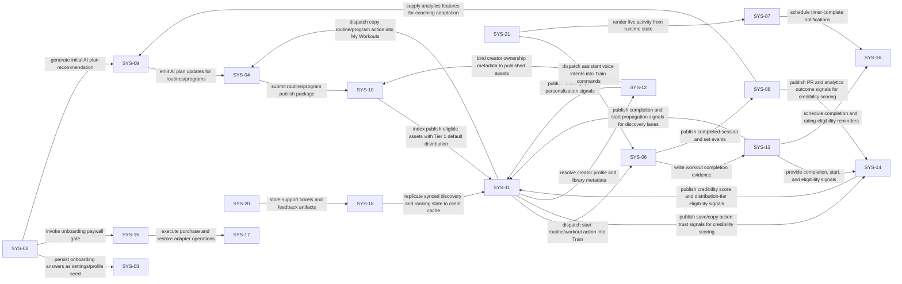

# Yoked System Architecture

Source inputs:
- `feature_inventory/canonical_feature_ontology.md`
- `feature_inventory/product_design_strategy.md`
- `feature_inventory/product_information_architecture.md`
- `feature_inventory/feature_priorities.md`

## Yoked Training Object Model

1. `Workout`: single training session template object.
2. `Routine`: repeating structure composed of workout templates.
3. `Program`: time-bounded progression composed of routines over multiple weeks.
4. System hierarchy: `SYS-04` authors workout/routine/program structures, `SYS-10` publishes eligible workout/routine/program assets, `SYS-11` distributes discoverable assets by credibility tier.

## 1. Canonical Product Systems

| System ID | System Name | Boundary Definition |
|---|---|---|
| SYS-01 | Identity & Access System | Owns authentication providers, account sessions, verification, and account recovery orchestration. |
| SYS-02 | Onboarding Orchestration System | Owns first-run questionnaire, personalization sequence, and onboarding progression. |
| SYS-03 | User Preferences & Settings System | Owns user preferences and settings rendered in You > Settings. |
| SYS-04 | Routine Builder System | Owns user-editable routine/program structure in My Workouts. |
| SYS-05 | Exercise Library System | Owns exercise catalog, filtering, and custom exercise definitions. |
| SYS-06 | Workout Logging Engine | Owns Train execution lifecycle and set-level workout commands. |
| SYS-07 | Session Runtime System | Owns timer and runtime checkpoint loop for active sessions. |
| SYS-08 | Analytics Engine | Owns aggregated analytics and history datasets surfaced in You > Progress. |
| SYS-09 | AI Coaching System | Owns AI routine/program generation and coaching adaptation. |
| SYS-10 | Routine Publishing System | Owns threshold-gated publishing lifecycle for workout/routine/program assets. |
| SYS-11 | Routine Discovery System | Owns Explore category rails, ranked vertical feed lanes, search, and lifecycle action dispatch. |
| SYS-12 | Creator Profile System | Owns creator profile surfaces, follow graph, creator libraries, and external links. |
| SYS-13 | Completion Tracking System | Owns completion ledger and progress state used by ratings and distribution gates. |
| SYS-14 | Routine Credibility Metrics System | Owns trust scoring, completion-gated ratings, and distribution tier eligibility. |
| SYS-15 | Monetization System | Owns paywall, offers, trial state, and entitlement lifecycle. |
| SYS-16 | Notification System | Owns notification schedules, categories, and delivery records. |
| SYS-17 | Integration Layer | Owns external provider adapters across health, wearable, billing, and assistants. |
| SYS-18 | Sync & Data Portability System | Owns local-first storage, cloud sync, import/export, and erase controls. |
| SYS-19 | Media System | Owns exercise media retrieval, caching, and playback telemetry. |
| SYS-20 | Support & Feedback System | Owns FAQ/help/contact and feature feedback workflows. |
| SYS-21 | Platform Experience System | Owns Live Activity, lock-screen runtime, and voice intent bridges. |

## 2. System Responsibilities, Owned Data, Dependencies, and Interactions

| System ID | Responsibilities | Owned Data | Dependencies | Interactions with Other Systems |
|---|---|---|---|---|
| SYS-01 Identity & Access System | Apple/Google/Email auth; Session token lifecycle; Verification and recovery flows; Account deletion identity checks | user_identity; auth_provider_link; auth_session; recovery_token; deletion_request | SYS-18; SYS-03; SYS-15 | Publishes identity events to SYS-18 and SYS-15; Supplies identity claims to all tab surfaces |
| SYS-02 Onboarding Orchestration System | Question flow; Input validation; Pre-permission education; First-run route selection | onboarding_step_state; onboarding_answers; onboarding_progress_state; onboarding_completion_state | SYS-03; SYS-09; SYS-15; SYS-16; SYS-17 | Writes onboarding context to SYS-03; Triggers AI initial plan in SYS-09; Triggers onboarding paywall in SYS-15 |
| SYS-03 User Preferences & Settings System | Units/theme/language controls; Reminder defaults; Account-level app settings | unit_preference; appearance_preference; localization_preference; app_setting | SYS-18; SYS-01 | Serves settings state to You; Supplies preference context to Train and Analytics flows |
| SYS-04 Routine Builder System | Workout/routine/program create/edit; Hierarchy composition; Day structure; Draft lifecycle | workout_template_draft; routine_draft; program_draft; routine_day; routine_exercise; builder_validation_result | SYS-05; SYS-09; SYS-18 | Consumes exercise library from SYS-05; Receives AI plan updates from SYS-09; Sends publish packages to SYS-10 |
| SYS-05 Exercise Library System | Search index; Filter execution; Exercise metadata retrieval; Custom exercise authoring | exercise; exercise_filter_index; custom_exercise; exercise_instruction; exercise_media_manifest | SYS-19; SYS-18 | Serves exercise data to SYS-04/SYS-06/SYS-11 |
| SYS-06 Workout Logging Engine | Start/resume/end workout; Set entry; Intensity capture; Save/discard controls | workout_session; session_exercise; session_set; session_note; session_summary | SYS-04; SYS-05; SYS-07; SYS-08; SYS-09; SYS-13; SYS-16; SYS-17; SYS-18; SYS-19; SYS-21 | Publishes completion evidence to SYS-13; Publishes analytics events to SYS-08; Requests timers from SYS-07 |
| SYS-07 Session Runtime System | Rest timer orchestration; Elapsed timer; Runtime checkpointing | runtime_timer_state; runtime_checkpoint; rest_timer_policy | SYS-16; SYS-21; SYS-18 | Sends timer callbacks to SYS-06; Sends timer notifications to SYS-16; Supplies runtime state to SYS-21 |
| SYS-08 Analytics Engine | KPI aggregation; Trend computation; History windows; PR and milestone tracking | analytics_fact_workout; analytics_fact_set; metric_snapshot; trend_series; milestone_state; history_snapshot | SYS-06; SYS-13; SYS-18 | Consumes workout and completion events; Supplies features to SYS-09 and SYS-14; Serves You > Progress |
| SYS-09 AI Coaching System | AI plan generation; Progression phase adaptation; In-session coaching prompts | ai_plan_run; progression_phase_state; coaching_prompt_history; recommendation_explanation | SYS-08; SYS-04; SYS-06; SYS-12; SYS-13; SYS-18 | Writes plans to SYS-04; Sends cues to SYS-06; Uses completion and creator quality data from SYS-13/SYS-12 |
| SYS-10 Routine Publishing System | Publish/unpublish; Versioning; Publish validation; Creator ownership linkage; Publish-threshold eligibility enforcement | published_workout; published_routine; published_program; publish_version; publish_status; attribution_record; publish_access_policy; publish_eligibility_state | SYS-04; SYS-12; SYS-13; SYS-18 | Evaluates publish eligibility thresholds before accepting publish requests; Emits eligible published assets to SYS-11; Binds creator ownership via SYS-12 |
| SYS-11 Routine Discovery System | Category rail rendering data; Ranked lane generation; Search index; Save/copy/start dispatch; Distribution-eligibility filtering | discovery_index; ranked_lane_snapshot; category_rail_state; search_document; routine_action_event; distribution_filter_state | SYS-10; SYS-13; SYS-14; SYS-12; SYS-05; SYS-18 | Consumes publish outputs from SYS-10; Applies credibility tier gating from SYS-14; Dispatches copy/start to SYS-04/SYS-06; Reads creator data from SYS-12 |
| SYS-12 Creator Profile System | Creator profile CRUD; Follow/unfollow; Published library composition; Link validation | creator_profile; creator_tag; creator_specialization; creator_library_item; follow_edge; creator_external_link; profile_completeness_score | SYS-10; SYS-14; SYS-18 | Provides creator metadata to Explore and You; Receives credibility scores and tier states from SYS-14 |
| SYS-13 Completion Tracking System | Completion evidence write; Routine/program progress counters; Active runner state; Rating eligibility counters | completion_event; routine_progress_state; program_progress_state; active_runner_state; eligibility_counter; start_event_counter | SYS-06; SYS-18 | Consumes workout completion events; Supplies completion data to SYS-08/SYS-11/SYS-14 |
| SYS-14 Routine Credibility Metrics System | Rating eligibility enforcement; Rating submission; Credibility scoring; Tier assignment; Spam/report penalty processing | routine_rating; program_rating; rating_eligibility_state; creator_credibility_score; distribution_tier_state; trust_signal_snapshot | SYS-13; SYS-08; SYS-12; SYS-18 | Publishes ranking and tier signals to SYS-11; Publishes creator trust metrics to SYS-12; No comment thread ownership |
| SYS-15 Monetization System | Paywall composition; Offer eligibility; Entitlement state; Restore and billing links | subscription_product; offer_campaign; entitlement_state; trial_state; promo_redemption | SYS-01; SYS-17; SYS-18 | Exposes entitlement checks to all surfaces; Calls provider adapters via SYS-17 |
| SYS-16 Notification System | Reminder schedule management; Delivery orchestration; Deep-link payload generation | notification_preference; notification_schedule; delivery_receipt; deeplink_payload | SYS-03; SYS-07; SYS-13; SYS-18 | Receives timer events from SYS-07 and completion events from SYS-13; Routes alerts into Train/Explore/You |
| SYS-17 Integration Layer | Provider token lifecycle; Payload transforms; Integration job orchestration | integration_connection; provider_token; integration_job; adapter_capability | SYS-18; SYS-01; SYS-15 | Executes outbound/inbound sync for logging and billing systems |
| SYS-18 Sync & Data Portability System | Mutation queue; Delta sync; Conflict resolution; Import/export pipelines; Data erase | sync_cursor; pending_mutation; conflict_record; export_job; import_job; erase_job | SYS-17; SYS-01 | Replicates domain state across devices; Serves recovery and portability operations |
| SYS-19 Media System | Media manifest resolution; Asset caching; Playback session control | media_asset; media_cache_index; playback_session; playback_event | SYS-18 | Serves exercise guidance media for Train and My Workouts |
| SYS-20 Support & Feedback System | Help center indexing; Support intake; About/version exposure | help_article_index; support_ticket; feature_request; app_version_manifest | SYS-03; SYS-18 | Serves You > Settings support routes and writes support artifacts via SYS-18 |
| SYS-21 Platform Experience System | Live activity payload rendering; Lock-screen snapshot; Voice command routing | live_activity_state; lockscreen_snapshot; voice_intent_binding; capability_flag | SYS-06; SYS-07; SYS-17; SYS-16 | Consumes Train runtime state and routes assistant intents into workout actions |

## 3. System Interaction Map

### 3.1 Directed Interaction Graph

### 3.2 Interaction Contracts

| Source System | Target System | Contract Purpose | Contract Type |
|---|---|---|---|
| SYS-02 | SYS-03 | persist onboarding answers as settings/profile seed | state replication |
| SYS-02 | SYS-15 | invoke onboarding paywall gate | command |
| SYS-02 | SYS-09 | generate initial AI plan recommendation | command |
| SYS-04 | SYS-10 | submit routine/program publish package | event |
| SYS-10 | SYS-11 | index publish-eligible assets with Tier 1 default distribution | state replication |
| SYS-12 | SYS-10 | bind creator ownership metadata to published assets | state replication |
| SYS-06 | SYS-13 | write workout completion evidence | event |
| SYS-13 | SYS-14 | provide completion, start, and eligibility signals | state replication |
| SYS-13 | SYS-11 | publish completion and start propagation signals for discovery lanes | state replication |
| SYS-14 | SYS-11 | publish credibility score and distribution-tier eligibility signals | state replication |
| SYS-11 | SYS-04 | dispatch copy routine/program action into My Workouts | command |
| SYS-11 | SYS-06 | dispatch start routine/workout action into Train | command |
| SYS-11 | SYS-14 | publish save/copy action trust signals for credibility scoring | event |
| SYS-11 | SYS-12 | resolve creator profile and library metadata | event |
| SYS-06 | SYS-08 | publish completed-session and set events | event |
| SYS-08 | SYS-09 | supply analytics features for coaching adaptation | event |
| SYS-08 | SYS-14 | publish PR and analytics outcome signals for credibility scoring | event |
| SYS-09 | SYS-04 | emit AI plan updates for routines/programs | event |
| SYS-12 | SYS-11 | publish follow graph personalization signals | state replication |
| SYS-18 | SYS-11 | replicate synced discovery and ranking state to client cache | state replication |
| SYS-07 | SYS-16 | schedule timer-complete notifications | event |
| SYS-13 | SYS-16 | schedule completion and rating-eligibility reminders | event |
| SYS-21 | SYS-06 | dispatch assistant voice intents into Train commands | command |
| SYS-21 | SYS-07 | render live activity from runtime state | event |
| SYS-15 | SYS-17 | execute purchase and restore adapter operations | command |
| SYS-20 | SYS-18 | store support tickets and feedback artifacts | event |

## 4. Canonical Feature to System Mapping

| Canonical Feature ID | Canonical Feature | Source MF IDs | Primary Owner System | Supporting Systems |
|---|---|---|---|---|
| CF-001 | Account Authentication and Login | MF-001, MF-002 | SYS-01 Identity & Access System | SYS-02 Onboarding Orchestration System, SYS-03 User Preferences & Settings System |
| CF-002 | Onboarding Personalization Core | MF-003, MF-004, MF-005 | SYS-02 Onboarding Orchestration System | SYS-03 User Preferences & Settings System, SYS-09 AI Coaching System |
| CF-003 | Onboarding Context Inputs | MF-006, MF-007, MF-008, MF-009, MF-010, MF-011 | SYS-02 Onboarding Orchestration System | SYS-03 User Preferences & Settings System, SYS-04 Routine Builder System |
| CF-004 | Onboarding Progress Feedback | MF-012 | SYS-02 Onboarding Orchestration System | SYS-15 Monetization System |
| CF-005 | Pre-permission Education | MF-013, MF-014 | SYS-02 Onboarding Orchestration System | SYS-16 Notification System, SYS-17 Integration Layer |
| CF-006 | Onboarding Monetization Gate | MF-015 | SYS-15 Monetization System | SYS-02 Onboarding Orchestration System |
| CF-007 | Paywall Plan Packaging | MF-016 | SYS-15 Monetization System | SYS-01 Identity & Access System, SYS-17 Integration Layer |
| CF-008 | Promotions and Offer Mechanics | MF-017, MF-021, MF-125 | SYS-15 Monetization System | SYS-11 Routine Discovery System |
| CF-009 | Purchase Recovery and Billing Controls | MF-018, MF-019, MF-020, MF-097 | SYS-15 Monetization System | SYS-17 Integration Layer, SYS-18 Sync & Data Portability System |
| CF-010 | Referral and Free-pass Growth Loops | MF-022, MF-088 | SYS-15 Monetization System | SYS-11 Routine Discovery System, SYS-12 Creator Profile System |
| CF-011 | Workout, Routine, and Program Publishing Foundation | MF-023, MF-026 | SYS-10 Routine Publishing System | SYS-04 Routine Builder System, SYS-12 Creator Profile System |
| CF-012 | AI Program Generation and Evolution | MF-024, MF-123 | SYS-09 AI Coaching System | SYS-04 Routine Builder System, SYS-08 Analytics Engine |
| CF-013 | Workout, Routine, and Program Catalog | MF-025, MF-120 | SYS-11 Routine Discovery System | SYS-10 Routine Publishing System, SYS-05 Exercise Library System |
| CF-014 | Workout, Routine, and Program Builder Structure | MF-124 | SYS-04 Routine Builder System | SYS-05 Exercise Library System, SYS-10 Routine Publishing System |
| CF-015 | Exercise Search and Filter Engine | MF-027, MF-028, MF-029, MF-030 | SYS-05 Exercise Library System | SYS-04 Routine Builder System, SYS-11 Routine Discovery System |
| CF-016 | Exercise Preference Curation | MF-031 | SYS-05 Exercise Library System | SYS-09 AI Coaching System |
| CF-017 | Custom Exercise Authoring | MF-032 | SYS-05 Exercise Library System | SYS-04 Routine Builder System |
| CF-018 | Routine Composition Controls | MF-033, MF-034, MF-035 | SYS-04 Routine Builder System | SYS-05 Exercise Library System |
| CF-019 | Exercise Knowledge Surfaces | MF-065, MF-066, MF-067, MF-068, MF-069 | SYS-05 Exercise Library System | SYS-19 Media System |
| CF-020 | Session Entry and Start Modes | MF-038, MF-039, MF-040, MF-041, MF-042 | SYS-06 Workout Logging Engine | SYS-04 Routine Builder System, SYS-11 Routine Discovery System |
| CF-021 | Set Logging Interaction Model | MF-043, MF-044, MF-045, MF-046 | SYS-06 Workout Logging Engine | SYS-07 Session Runtime System |
| CF-022 | Effort and Intensity Capture | MF-047, MF-048, MF-054, MF-056 | SYS-06 Workout Logging Engine | SYS-09 AI Coaching System |
| CF-023 | Timer Stack | MF-036, MF-049, MF-050, MF-051, MF-052 | SYS-07 Session Runtime System | SYS-06 Workout Logging Engine, SYS-16 Notification System |
| CF-024 | Adaptive Defaults and PR Feedback | MF-037, MF-053, MF-055 | SYS-06 Workout Logging Engine | SYS-08 Analytics Engine, SYS-09 AI Coaching System |
| CF-025 | Session Safeguards and Controls | MF-057, MF-058, MF-059, MF-064 | SYS-06 Workout Logging Engine | SYS-18 Sync & Data Portability System |
| CF-026 | Session Completion Outputs and Routine Progress Tracking | MF-060, MF-061, MF-062, MF-063 | SYS-13 Completion Tracking System | SYS-06 Workout Logging Engine, SYS-08 Analytics Engine, SYS-14 Routine Credibility Metrics System |
| CF-027 | Strength and Recovery Scoring | MF-070, MF-071 | SYS-08 Analytics Engine | SYS-09 AI Coaching System |
| CF-028 | Muscle Distribution Analytics | MF-072, MF-073 | SYS-08 Analytics Engine | SYS-06 Workout Logging Engine |
| CF-029 | Target Radar Analytics | MF-074 | SYS-08 Analytics Engine | SYS-06 Workout Logging Engine |
| CF-030 | Weekly KPI Dashboard | MF-075 | SYS-08 Analytics Engine | SYS-13 Completion Tracking System |
| CF-031 | Performance Trends and Rankings | MF-076, MF-077, MF-078 | SYS-08 Analytics Engine | SYS-14 Routine Credibility Metrics System |
| CF-032 | History and Report Windows | MF-079, MF-080 | SYS-08 Analytics Engine | SYS-06 Workout Logging Engine |
| CF-033 | Body Measurement Tracking | MF-081, MF-082 | SYS-08 Analytics Engine | SYS-03 User Preferences & Settings System |
| CF-034 | Body Transformation and Nutrition Targets | MF-083, MF-084 | SYS-08 Analytics Engine | SYS-03 User Preferences & Settings System |
| CF-035 | Achievements and Milestones | MF-085, MF-086 | SYS-08 Analytics Engine | SYS-13 Completion Tracking System |
| CF-036 | Streak and Habit Continuity Metrics | MF-087, MF-127 | SYS-08 Analytics Engine | SYS-13 Completion Tracking System, SYS-16 Notification System |
| CF-037 | Goal and Target Modeling | MF-126 | SYS-08 Analytics Engine | SYS-04 Routine Builder System, SYS-09 AI Coaching System |
| CF-038 | Routine and Program Discovery Marketplace | MF-089 | SYS-11 Routine Discovery System | SYS-10 Routine Publishing System, SYS-14 Routine Credibility Metrics System, SYS-12 Creator Profile System |
| CF-039 | Routine Lifecycle Actions and Creator Follow | MF-090, MF-092 | SYS-11 Routine Discovery System | SYS-13 Completion Tracking System, SYS-12 Creator Profile System, SYS-06 Workout Logging Engine |
| CF-040 | Completion-Gated Ratings | MF-091 | SYS-14 Routine Credibility Metrics System | SYS-13 Completion Tracking System, SYS-11 Routine Discovery System |
| CF-041 | Creator Distribution Eligibility, Credibility, Visibility, and Safety Controls | MF-093, MF-094 | SYS-14 Routine Credibility Metrics System | SYS-12 Creator Profile System, SYS-11 Routine Discovery System, SYS-13 Completion Tracking System |
| CF-042 | Creator and User Profile Management | MF-095 | SYS-12 Creator Profile System | SYS-03 User Preferences & Settings System, SYS-14 Routine Credibility Metrics System |
| CF-043 | Account Lifecycle and Recovery | MF-096, MF-122 | SYS-01 Identity & Access System | SYS-03 User Preferences & Settings System, SYS-18 Sync & Data Portability System |
| CF-044 | Appearance Localization and Units | MF-098, MF-099, MF-100, MF-101 | SYS-03 User Preferences & Settings System | SYS-21 Platform Experience System |
| CF-045 | Notification and Reminder Controls | MF-102, MF-121 | SYS-16 Notification System | SYS-03 User Preferences & Settings System |
| CF-046 | Support and Product Communications | MF-115, MF-116, MF-117, MF-118 | SYS-20 Support & Feedback System | SYS-03 User Preferences & Settings System |
| CF-047 | Data Governance Controls | MF-128, MF-129 | SYS-18 Sync & Data Portability System | SYS-03 User Preferences & Settings System, SYS-20 Support & Feedback System |
| CF-048 | Live Activity and Lock-screen Runtime | MF-103 | SYS-21 Platform Experience System | SYS-07 Session Runtime System, SYS-06 Workout Logging Engine |
| CF-049 | Voice Assistant Integrations | MF-104, MF-105 | SYS-21 Platform Experience System | SYS-17 Integration Layer, SYS-06 Workout Logging Engine |
| CF-050 | Fitness Ecosystem Integrations | MF-106, MF-107, MF-108, MF-109 | SYS-17 Integration Layer | SYS-18 Sync & Data Portability System, SYS-06 Workout Logging Engine |
| CF-051 | AI Assistant Integrations | MF-110, MF-111 | SYS-17 Integration Layer | SYS-09 AI Coaching System |
| CF-052 | Sync Export Import and Cloud | MF-112, MF-113, MF-114, MF-130 | SYS-18 Sync & Data Portability System | SYS-17 Integration Layer, SYS-20 Support & Feedback System |
| CF-053 | Personal Coach and Trainer Modes | MF-119 | SYS-09 AI Coaching System | SYS-04 Routine Builder System, SYS-06 Workout Logging Engine, SYS-08 Analytics Engine |

## 5. Platform Modules

| Module ID | Module Name | Responsibilities | Systems Implemented/Served |
|---|---|---|---|
| MOD-01 | UI Composition Layer | SwiftUI/UIKit surfaces for Home, Train, My Workouts, Explore, and You. | Consumes SYS-01..SYS-21 via typed view models. |
| MOD-02 | Navigation & Flow Orchestration Layer | Tab-root routing, deep links, and modal orchestration across Yoked five-tab architecture. | Coordinates onboarding, Train execution, My Workouts management, Explore discovery, and You surfaces. |
| MOD-03 | Domain Logic Layer | Use cases, validators, policy evaluators, and command handlers. | Hosts business logic for SYS-01..SYS-21. |
| MOD-04 | Session Runtime Module | Low-latency workout runtime state machine and timer loop. | Implements SYS-06 and SYS-07 runtime contracts. |
| MOD-05 | Routine Publishing Module | Publishing pipeline, threshold eligibility checks, versioning, and publish-state management. | Implements SYS-10 and receives artifacts from SYS-04. |
| MOD-06 | Routine Discovery Module | Category rails, ranked vertical cards, search indexing, and action dispatch APIs. | Implements SYS-11 and consumes SYS-10/SYS-13/SYS-14 signals. |
| MOD-07 | Creator Profile Module | Creator profile surfaces, follow graph, and creator library composition. | Implements SYS-12 for Explore and You > Profile. |
| MOD-08 | Completion & Credibility Module | Completion ledger, completion-gated ratings, credibility scoring, and tier assignment. | Implements SYS-13 and SYS-14. |
| MOD-09 | Persistence Layer | Local repositories, query indexes, and cache stores. | Persists entities for SYS-01..SYS-21. |
| MOD-10 | Sync Layer | Mutation queue, delta sync, import/export, and conflict resolution. | Implements SYS-18 and synchronizes all mutable systems. |
| MOD-11 | Integration Adapter Layer | Adapters for Apple Health, Strava, Fitbit, Watch, billing, and voice providers. | Implements SYS-17 and supports SYS-15/SYS-21. |
| MOD-12 | AI Services Layer | AI generation pipelines and coaching adaptation services. | Implements SYS-09 using analytics and completion signals. |
| MOD-13 | Analytics Processing Layer | Event ingestion, metric materialization, trend computation, and history views. | Implements SYS-08 and serves You > Progress. |
| MOD-14 | Media Delivery Layer | Exercise media manifests, asset caching, and playback control. | Implements SYS-19 for My Workouts and Train. |
| MOD-15 | Notification Delivery Layer | Notification scheduling, categories, and deep-link callbacks. | Implements SYS-16 with Train/Explore/You targets. |
| MOD-16 | Monetization Layer | Paywall rendering, offer eligibility, and entitlement resolution. | Implements SYS-15. |
| MOD-17 | Support & Platform Capability Layer | Help/support workflows plus Live Activity and assistant wrappers. | Implements SYS-20 and SYS-21. |

## 6. Tab Surface Ownership Contracts

| Tab | Primary Owning Systems | Surface Contract |
|---|---|---|
| Home | SYS-08, SYS-11, SYS-09 | Context-only cards: today plan context, program progress, key insight, lightweight recommendations. No start/resume execution controls. |
| Train | SYS-06, SYS-07, SYS-13 | Exclusive workout execution: Today/Instant/Recent segmented entry and full active session lifecycle. |
| My Workouts | SYS-04, SYS-10, SYS-12 | User-owned assets: My Programs, My Routines, Saved, Drafts, Published by Me. |
| Explore | SYS-11, SYS-14, SYS-12 | Marketplace discovery with category rail + ranked vertical cards; credibility-tier distribution gating; no social feed/comment model. |
| You | SYS-12, SYS-08, SYS-03, SYS-20, SYS-15, SYS-17 | Identity, profile, history, analytics, metrics, settings, subscription, and integrations. |

## 7. System-to-Module Allocation Rules

1. Publish-threshold rule: `SYS-10` accepts publish commands only when creator eligibility thresholds are satisfied (minimum completed workouts, minimum training days, minimum routine completions).
2. Distribution-gating rule: `SYS-14` assigns visibility tiers and `SYS-11` enforces tier-gated distribution in Explore ranking lanes.
3. No-comment rule: no module or system owns routine/program comment threads at launch; `CF-040` is ratings-only.
4. Explore rendering rule: launch discovery defaults to category rail + ranked vertical cards; immersive fullscreen discovery is not enabled by default.
5. Train exclusivity rule: workout execution commands originate only from Train-owned systems (`SYS-06`, `SYS-07`).
6. You ownership rule: history, analytics, and settings are only surfaced through You and are not standalone root tabs.
7. Sync-first rule: mutating commands write local state before remote sync via `SYS-18`.
8. Integration isolation rule: external provider APIs are only called through `SYS-17`.
