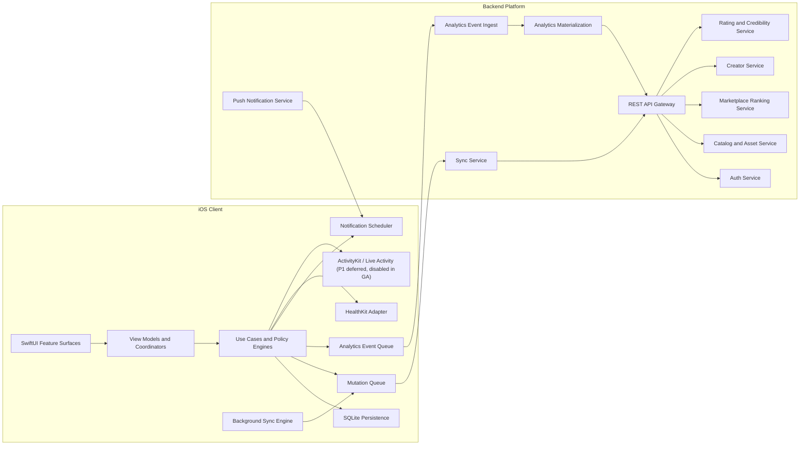
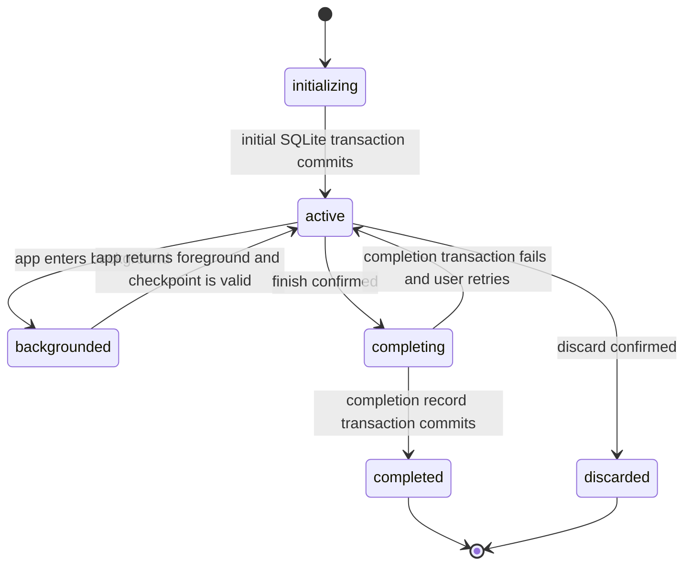
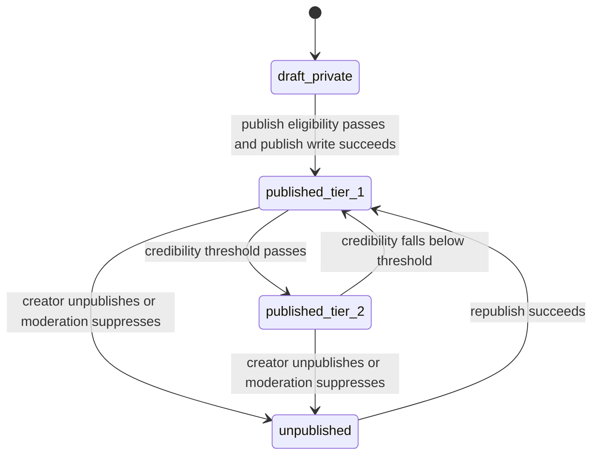
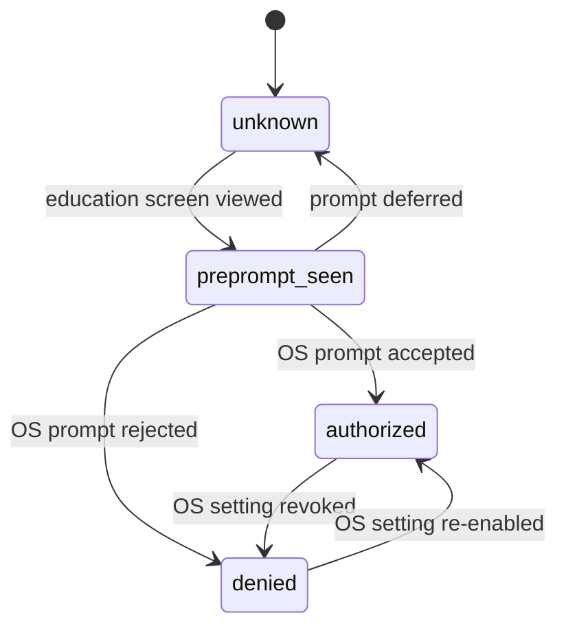

# yoked_engineering_spec.md

## 1. System Architecture

### 1.1 Architectural Principles

1. The application shall ship exactly five root tabs: `Home`, `Train`, `My Workouts`, `Explore`, and `You`.
2. Workout execution shall be owned only by `Train`. No screen outside `Train` may create, resume, complete, discard, or mutate an active `WorkoutSession`.
3. The persistence model shall be local-first. Every user mutation shall commit to SQLite before any remote request is attempted.
4. The backend shall be the source of truth for authentication, publication eligibility, creator distribution eligibility, marketplace ranking, subscription entitlements, and multi-device convergence.
5. The iOS client shall be the source of truth for active-session runtime state until a `CompletionRecord` is written.
6. The analytics system shall derive completion-based metrics only from `CompletionRecord` and completed `SetEntry` facts, using canonical total load fields and excluding `warmup` sets from KPI, workload, and PR aggregates.
7. The marketplace shall be a catalog and discovery system, not a social network. The launch architecture shall not include comments, posts, messaging, groups, forums, or generic social feeds.
8. Launch exclusions shall be structurally enforced in code ownership:
   1. no `CF-029 Target Radar Analytics`,
   2. no `CF-034 Body Transformation and Nutrition Targets`,
   3. no `CF-051 AI Assistant Integrations`,
   4. no additional root tabs,
   5. no TikTok-style fullscreen discovery default.
9. All mutable entities shall use device-generated UUIDv4 primary keys so the client can create complete objects offline.
10. All server-facing writes shall use idempotency keys and optimistic concurrency versions.
11. All time values written to the backend shall be ISO 8601 UTC strings. All locally indexed timestamps shall also be stored as epoch milliseconds for sort performance.
12. Apple Watch runtime architecture, watchOS companion targets, watch command transport, and watch session mirroring are excluded from launch scope and deferred to P2. The launch runtime client is iPhone only.
13. The launch canonical exercise library shall be an internal curated catalog named `Yoked Exercise Catalog` with a frozen launch size target of `900-1300` approved canonical exercises.
14. Third-party exercise datasets may be used only as ingest inputs, metadata references, duplicate-cluster aids, and gap-analysis references. They shall never be exposed directly in user-facing product surfaces.
15. Backend platform services shall run on Supabase:
    1. authentication on Supabase Auth,
    2. REST endpoints and background jobs on Supabase Edge Functions or equivalent REST wrappers,
    3. persisted backend data on Supabase Postgres,
    4. object asset storage on Supabase Storage where required for non-exercise media and exports.
16. iCloud shall be used only for device backup and restore continuity. It shall not be used as the live synchronization mechanism for SQLite or mutation queues.
17. Launch ad support shall be limited to banner ads only and shall be entitlement-gated so premium users never receive ad requests.
18. Launch platform scope is limited to iPhone only. Apple Watch, iPad, and AirPlay or TV casting are P2 only and may not be assumed by any launch requirement.

### 1.2 Runtime Topology



### 1.3 System Component Responsibilities

| Component | Owned Responsibilities | Inputs | Outputs | Failure Behavior |
|---|---|---|---|---|
| iOS App Shell | app lifecycle, tab shell, dependency injection, deep-link routing, entitlement gate routing | launch state, auth state, entitlement state | root route, full-screen cover presentation | fail closed to auth or cached tab shell; never blocks local DB open |
| Feature UI Layer | screen layout, gestures, animations, loading states, empty states, error states | view-state models | user intents | degrades to cached state; destructive actions remain disabled when validation is incomplete |
| Domain Layer | validators, publish eligibility checks, session commands, rating eligibility projection, lane query composition | repositories, policy config, clock, connectivity | SQLite transactions, queued mutations, queued events | returns deterministic user-facing error categories without dropping local state |
| Persistence Layer | SQLite schema, transactions, repository projections, search indexes, cache invalidation | domain commands | committed rows, query projections | rolls back the full transaction; leaves prior committed state intact |
| Sync Engine | queued mutation dispatch, delta pull, conflict detection, retry scheduling, background task execution | mutation queue, sync cursors, connectivity, auth token | server writes, local merges, conflict records | preserves queue item, increments retry schedule, never deletes unsynced local rows |
| Backend API | authentication, entity CRUD, publish pipeline, ranking, analytics ingest, and phased governance jobs (`P1` export, `P2` import) | HTTPS JSON requests | JSON responses, push requests | returns structured error envelope; client may retry only when `retryable=true` |
| Analytics Pipeline | raw event ingest, dedupe, metric materialization, snapshot publication | analytics event batch, completion records | KPI snapshots, trend series, credibility inputs | preserves raw events and marks materialization lag rather than emitting partial metrics |
| Notification System | local scheduling, remote push orchestration, deep-link payload creation, delivery dedupe | reminder preferences, session runtime, completion facts, program schedule | local notifications, APNs payloads | silently suppresses duplicate notifications; never blocks session completion |
| Ad Delivery Layer | banner-ad placement gating, entitlement-aware ad suppression, surface allowlist enforcement, session-safe refresh throttling | entitlement state, tab context, placement key, connectivity | banner ad view state, cached ad response, placement telemetry | suppresses ads on blocked surfaces or premium state; never delays workout logging |
| HealthKit Adapter | permission state, workout write jobs, write retry queue | completed workout sessions, user authorization | `HKWorkout` writes, status projection | marks write pending and retries later; no user data loss |
| Live Activity Adapter | `P1`-only active-session projection to lock screen and Dynamic Island | active session state, timer state | `Activity` updates | disabled in GA; when enabled later, active session continues normally if projection fails |

### 1.4 Backend Service Decomposition

| Service | Primary Tables | Non-Optional Behavior | Notes |
|---|---|---|---|
| Auth Service | `users`, `user_auth_providers`, `auth_sessions`, `refresh_tokens` | verifies Apple, Google, and email credentials; issues rotating refresh tokens; resolves duplicate-provider collisions | source of truth for `subscription_state` hydration at login |
| Catalog and Asset Service | `workouts`, `routines`, `programs`, asset-child tables | CRUD for drafts and owned copies; publish validation; version creation; detail hydration | all publish writes are versioned |
| Session and Completion Service | `workout_sessions`, `set_entries`, `completion_records` | accepts completed session payloads, validates immutable completion facts, returns authoritative completion snapshot | only completed sessions are pushed; active sessions remain local |
| Creator Service | `creator_profiles`, `creator_external_links`, `creator_blocks` | creator profile CRUD, public slug resolution, and block mutations | block lists apply before Explore lane rendering |
| Rating and Credibility Service | `ratings`, credibility materializations | enforces completion-gated rating eligibility; recalculates creator credibility and visibility tiers | no comment or thread model |
| Marketplace Ranking Service | cached published-asset projections, lane snapshots | candidate filtering, lane ranking, search ranking, staleness timestamps | only uses approved ranking signals |
| Runtime Configuration Service | config snapshots, config audit records | returns versioned launch-runtime config, staged rollout eligibility, and last-known-good fallback metadata | source of truth for slot cap, paywall triggers, feature gates, ranking weights, provider flags, ad placements, and starter-plan entitlement behavior |
| Moderation Operations Service | creator moderation flags, asset moderation flags, review audit records | stores manual operator-set safety flags, suppression reasons, and visibility overrides | no consumer-facing admin UI at launch |
| Sync Service | mutation journal, server change log, and phased governance jobs (`P1` export, `P2` import) | push acknowledgements, cursor-based pull, conflict descriptors, job polling | all writes are idempotent |
| Analytics Service | raw events, materialized snapshots, trend facts | accepts canonical events, dedupes by event UUID, produces KPI and progress snapshots | rejects forbidden event names |
| Notification Service | reminder schedules, delivery receipts | APNs scheduling for remote cases, local payload templates, rate limiting | rest timer completion remains local-first |

### 1.4.1 Supabase Platform Allocation

1. Supabase Auth shall own:
   1. Apple sign-in identity binding,
   2. Google sign-in identity binding,
   3. email login and password reset,
   4. refresh token rotation,
   5. account session invalidation.
2. Supabase Postgres shall own:
   1. creator profiles,
   2. published workouts,
   3. published routines,
   4. published programs,
   5. ratings,
   6. moderation projections,
   7. marketplace ranking inputs,
   8. credibility scoring inputs,
   9. notification jobs,
   10. governance jobs,
   11. entitlement mirror state,
   12. runtime configuration snapshots and audit history,
   13. creator moderation flags,
   14. asset moderation flags.
3. Supabase Edge Functions or equivalent REST wrappers shall own:
   1. publish eligibility evaluation,
   2. rating eligibility evaluation,
   3. marketplace ranking materialization,
   4. analytics batch ingest,
   5. phased governance job orchestration (`P1` export, `P2` import),
   6. notification job scheduling,
   7. App Store Server Notifications ingestion,
   8. entitlement mirror reconciliation with StoreKit 2 transaction state,
   9. runtime configuration snapshot delivery,
   10. moderation-flag projection delivery.
4. Supabase Storage shall not be used for exercise launch visuals because launch ships with no exercise images or videos.
5. Supabase Storage may be used for:
   1. profile avatars,
   2. `P1` export bundles,
   3. support attachments,
   4. future non-exercise media.

### 1.5 Data Flow Contracts

#### 1.5.1 Authentication and Onboarding

1. `AuthView` submits provider credentials to the Auth Service.
2. On successful auth, the client stores tokens in Keychain and writes the `User` shell row to SQLite.
3. If `onboarding_completed=false`, the app routes to `OnboardingFlow`.
4. Onboarding answers are saved to SQLite after every step.
5. Final onboarding submission writes the normalized user profile remotely and triggers exactly one included starter-plan generation for the account.
6. The onboarding flow shall not expose reroll, regenerate, rebuild, or evolution controls.
7. The included starter-plan entitlement shall be consumed on the first onboarding generation attempt, even if the AI step fails and deterministic starter templates are written instead.
8. If included starter-plan generation fails, the client writes deterministic starter templates locally and still marks onboarding complete.
9. Any non-included program save, copy, or start action shall use the same `premium_program_access` entitlement check after onboarding.
10. After onboarding, the app routes the user into free mode without an automatic paywall interruption.
11. The paywall is presented only when the user reaches a premium trigger:
   1. attempting to create, copy, or save the sixth active routine,
   2. attempting to use AI generation, regeneration, evolution, or rebuild after onboarding,
   3. attempting to access advanced analytics,
   4. attempting premium program access beyond the included onboarding starter plan, including save, copy, or start of a non-included program.

#### 1.5.2 Train Session Lifecycle

1. `TrainRoot` creates a `WorkoutSession` in SQLite in state `initializing`.
2. Hydrated exercise instances and planned set rows are inserted in the same transaction.
3. The session transitions to `active` only after the initial DB transaction commits.
4. Every set mutation updates `set_entries`, `workout_sessions.updated_at`, `runtime_checkpoints`, and `analytics_event_queue` in one SQLite transaction.
5. Launch previous-value preload shall source only from the most recent completed set for the same exercise variation in the current workout.
6. Launch previous-value preload shall not read cross-workout history, same-routine history, remote cache, or network state.
7. Finishing a workout freezes the session locally, computes the summary, writes `CompletionRecord`, increments progress projections, and queues the remote completion mutation.
8. Remote sync may fail without changing the local `completed` state.

#### 1.5.3 Explore Discovery Lifecycle

1. Explore requests lane snapshots from SQLite first.
2. The Sync Engine pulls fresher lane snapshots and search documents from the backend.
3. The UI renders cached cards immediately and overlays a visible staleness timestamp until the fresh payload arrives.
4. `Save`, `Copy`, and `Rate` commands write local optimistic state only when the action is allowed offline by product rules.
5. Rating submissions require network. `Save` and `Copy` may queue only if the referenced asset payload is already present in local cache.
6. Launch action semantics shall be:
   1. routine `Start` may execute against the published routine snapshot without creating an editable local copy,
   2. program `Start` requires a local saved or owned program context and must pass the same entitlement preflight as premium program save or copy before local materialization,
   3. `Start` shall never bypass slot-cap, premium-program, or moderation visibility rules.

#### 1.5.4 Analytics Lifecycle

1. Canonical events are written to `analytics_event_queue` as part of the same transaction that commits the source domain change.
2. The Analytics Service dedupes events by `event_id` and preserves the original `event_time` for offline-generated events.
3. KPI and trend snapshots are materialized server-side and pulled down as read models.
4. `Home` and `You > Progress` read the same KPI snapshot table locally.

### 1.6 Screen Ownership and UX Runtime Contracts

| Screen | Purpose | Entry Points | Layout Structure | Primary Components | Gestures | Animations | Loading State | Error State | Offline State |
|---|---|---|---|---|---|---|---|---|---|
| `Authentication` | establish durable account session | cold launch, expired session, logout | provider button stack, email form, recovery footer | Apple button, Google button, email field, password field, login CTA, recovery link | tap, keyboard dismissal | inline button spinner, error fade | controls disabled during submission | inline provider or credential error without clearing fields | sign-in disabled; cached user data remains inaccessible until auth restores |
| `OnboardingFlow` | collect personalization context | first successful auth without completed onboarding | one question per step, persistent progress header, bottom CTA | goal selector, experience selector, equipment chips, days stepper, environment selector, body metric form, attribution input | tap, back swipe, keyboard dismissal | progress bar advance, staged loading status text | previous valid answer snapshot shown while local save completes | step-level inline validation and full-screen retry on final submission failure | full flow continues locally; final remote submission queues when connectivity returns |
| `Paywall` | monetize premium features when triggered | premium entitlement triggers, later premium re-entry points | hero copy, annual card, monthly card, billing-timing reassurance strip, legal footer | plan cards, billing-timing strip, restore CTA, close CTA, terms, privacy | tap, vertical scroll when needed | selected-plan highlight transition | product skeleton cards | deterministic billing or catalog error sheet | last-known entitlement shown; purchase CTA disabled when catalog unavailable |
| `HomeRoot` | display informational daily context only | app root, return from completion, deep-link | greeting row, today summary card, program snapshot, KPI card, recommendation rail, optional free-tier banner slot after required modules and recommendation rail | today card, progress chip, KPI card, recommendation card rail, optional banner container | vertical scroll, pull to refresh, tap | skeleton fade, KPI count-up, progress bar fill | cached content with skeleton placeholders for missing regions; banner slot reserves no height until ad fill resolves | inline retry for recommendations, stale KPI timestamp, banner collapse on no-fill or load failure | renders cached context and marks cards stale; refresh disabled; banner suppressed in offline-cached-only browse |
| `TrainRoot` | choose Today, Instant, Recent session entry | tab selection, deep-link handoff, post-completion return | segmented header, list body, resume banner | segment control, planned card, empty workout CTA, recent list, recommendation cards | vertical scroll, swipe actions on recent, tap | segment transition, card insert/remove | hydration spinner for active session resume | local-write failure banner, resume rebuild fallback | full local functionality except cloud-only recommendations |
| `ActiveSession` | own all workout execution | start or resume from Train | sticky session header, exercise blocks, timer strip, keypad dock | set tables, numeric keypad, plate calculator or load-helper sheet, rest timer, finish CTA, discard CTA, in-session settings sheet | vertical scroll, tap, long-press timer adjust | checkmark pulse, timer pulse, sheet slide | session initialization overlay, summary processing overlay | non-blocking banner plus retry for local write, timer fallback to elapsed-only | fully functional; remote sync indicators hidden or queued |
| `PostWorkoutSummary` | show completion outputs and next actions | successful finish flow | metrics header, PR block, progress block, next actions | duration card, volume card, warm-up count, PR list, progress badge, route CTA | vertical scroll, tap | summary slide-up, PR highlight pulse | processing stage with deterministic loading copy | sync-warning banner with retry; summary still renders | summary renders from local completion record |
| `MyWorkoutsRoot` | manage owned assets and drafts | tab selection, copy/save success | segmented header with `Workouts`, `Programs`, `Routines`, `Saved`, `Drafts`; secondary `Owned` and `Published by Me` filter inside `Workouts`, `Programs`, and `Routines` when a creator profile exists; routine-slot usage strip; optional banner slot on non-builder list surfaces below management modules and above the asset list; asset list; floating create CTA with premium-gated program-create option | asset cards, publish badges, ownership filter row, routine-slot indicator, approaching-limit warning, upgrade card, optional banner container on eligible free-tier list surfaces, search, empty-state CTA, locked program-create upsell state | scroll, drag in builder routes, swipe row actions | card insertion, drag shadow | skeleton asset rows, autosave indicator, `Published by Me` keeps its filter row visible while hydrating, banner slot reserves no height until ad fill resolves | publish validation sheet, slot-cap paywall trigger, autosave retry banner, `Published by Me` inline retry state, banner collapse on no-fill or load failure | draft editing stays enabled; publish disabled; cached `Published by Me` items render stale and disable publish-state mutations while offline; builder stays ad-free |
| `BuilderWorkspace` | edit workouts, routines, and premium-entitled programs | create CTA, edit action, AI accept action | metadata header, day selector, composition canvas, sticky save/publish actions | title field, tags, day tabs, exercise rows, reorder handles, superset controls | drag and drop, tap to expand, swipe row actions | reorder shadow, autosave pulse | staged AI generation progress or autosave spinner | field-level validation messages, conflict prompt on unsafe merge | local autosave continues; publish unavailable |
| `ExerciseKnowledgeDetail` | teach correct exercise execution and show exact-variation performance plus related alternatives | builder search result, Train exercise row, Explore preview | single vertical scroll surface with optional anchors and stacked sections | overview block, how-to-perform steps, tips list, performance curve, recent history list, one similar-exercises section with same-family variations first and substitute rows second | vertical scroll, tap on optional section anchors, tap metric chip, tap history row, tap variation or similar-exercise row | anchor highlight transition, chart-point highlight, section fade-in on load | text and chart skeleton blocks | inline retry with cached text or analytics fallback | cached text-first detail renders without media and reuses cached performance or history payloads when present |
| `ExploreRoot` | browse ranked marketplace lanes | tab selection, Home recommendation handoff, deep link | search field, category rail, optional free-tier banner slot on root-lane and search-result browse surfaces below the controls and above the feed or results, vertical ranked list | category chips, trust-rich cards, search filters, optional banner container on eligible free-tier browse surfaces | horizontal category scroll, vertical list scroll, pull to refresh, tag tap | shimmer cards, chip selection morph | cached lane plus skeleton placeholders; banner slot reserves no height until ad fill resolves | retry card, action failure toast, cached detail fallback, banner collapse on no-fill or load failure | cached browse only; rate and uncached save or copy actions disabled; banner suppressed in offline-cached-only browse |
| `MarketplaceAssetDetail` | inspect a routine or program before acting | card tap, search result, deep link | hero block, trust block, structure preview, action bar | `Start` primary button followed by `Save`, `Copy`, and `Rate`; launch metric rows limited to `copy_count`, `start_count`, `completion_count`, `completion_rate`, and `rating_score` only | vertical scroll, tap | action button morph, rating lock transition | content placeholders until detail fully hydrated | cached summary fallback with retry; lock reasons for blocked save, copy, or start must resolve before any paywall handoff | full cached read if locally stored; routine start may execute from cached published snapshot, while program start remains gated until a valid local program context exists |
| `CreatorProfile` | show public creator page and trust state | creator tap, search result, You creator mode | identity block, tags, trust block, published routine and program rails, external links | specialization chips, asset rails, external link cells | vertical scroll, tap | asset rail insert | skeleton profile and rail cards | link validation message, retry card | cached profile renders without follow controls or follower counts at launch |
| `YouRoot` | own profile, progress, settings, subscription, integrations, support | tab selection, Home KPI handoff, support notifications | segmented header, nested lists and modules | profile header, KPI cards, read-only body-map preview card, optional free-tier banner slot after required overview modules on Profile and Progress only, settings rows including `Training > Load Helper`, integration rows, support rows | vertical scroll, pull to refresh, KPI-drill-in tap, body-map-preview tap | chart redraw, avatar crossfade, entitlement badge transition | analytics skeletons, reconnect spinner, no reserved banner height during overview loading | stale snapshot fallback, restore failure sheet, job failure status cards, banner no-fill collapse | cached analytics and settings render; connect and support submission disabled, and `You` overview banners stay suppressed in offline-cached-only states |

### 1.6.0 Active Session Load Entry Modes

1. Purpose: define launch load-entry behavior inside `ActiveSession` without requiring screen-to-screen navigation or network support.
2. Mode resolution shall be exercise-driven:
   1. `single` when the exercise uses standard bilateral barbell, cable, or machine load entry,
   2. `per_dumbbell` when the exercise is a bilateral dumbbell movement,
   3. `left_right` when the exercise is unilateral and asymmetry tracking is relevant.
3. Train-row behavior shall be:
   1. `single` shows one inline load field,
   2. `per_dumbbell` shows one inline load field labeled `Each`,
   3. `left_right` expands the focused load cell into compact inline `L` and `R` fields inside the same set row.
4. Launch side-specific scope applies to load only; reps remain one shared field for the set row.
5. Persistence rules shall be:
   1. `planned_load` and `actual_load` remain the canonical total load fields used by analytics, HealthKit, and summaries,
   2. `planned_load_left`, `planned_load_right`, `actual_load_left`, and `actual_load_right` preserve entry detail when the mode is not `single`,
   3. `per_dumbbell` mirrors the entered value to left and right detail fields and stores canonical total load as the sum of both sides,
   4. `left_right` stores canonical total load as `left + right`.
6. Failure handling shall be:
   1. if mode metadata is unavailable, the client falls back to `single`,
   2. if derived canonical total load cannot be recomputed locally, the mutation is rejected and the current row stays editable.

### 1.6.1 Active Session Plate Calculator and Load Helper Contract

1. Purpose: provide a fast load-breakdown utility inside `ActiveSession` so users can translate a target working load into an immediately actionable plate setup without leaving workout logging.
2. Entry points shall be:
   1. helper accessory attached to `planned_load` or `actual_load` cells on plate-loadable set rows only,
   2. set-row overflow action labeled `Plate Calculator` or `Load Helper`.
3. Supported launch use cases shall be:
   1. exact per-side plate breakdown for a target total load,
   2. nearest-achievable load when the exact request cannot be assembled,
   3. alternate base-implement profiles for `20 kg` Olympic bar, `15 kg` technique bar, `45 lb` Olympic bar, `35 lb` technique bar, `EZ` bar, trap bar, and configurable plate-loaded machine start weight,
   4. hydration of the saved default preset for the current unit system and implement type from the user settings payload.
4. Runtime rules shall be:
   1. open as a bottom sheet over `ActiveSession`,
   2. prefill from the focused set row `planned_load` or `actual_load` when present,
   3. require no network call and no backend roundtrip,
   4. continue elapsed-session and rest-timer progression while the sheet is open,
   5. write the selected achieved load back only to the focused `planned_load` or `actual_load` field in one local transaction,
   6. preserve scroll position and current session context when dismissed or applied,
   7. allow temporary preset switching inside the sheet without mutating the persisted preset library,
   8. keep all preset-library editing and default-preset mutation in `You > Settings > Training > Load Helper`.
5. Calculation algorithm shall be:
   1. validate that the current set row is load-bearing and that `target_total_load >= base_implement_weight`,
   2. subtract `base_implement_weight` from `target_total_load`,
   3. divide the remaining load by `2` to derive the per-side target,
   4. sort available plate denominations descending,
   5. greedily allocate plates per side for an exact match when possible,
   6. if an exact match is impossible, return the nearest lower achievable load by default and optionally expose the nearest higher achievable load only when it exceeds the request by no more than one smallest available plate pair,
   7. return `plate_stack_per_side`, `achieved_total_load`, and `delta_from_requested_load`.
6. Visibility rules shall be:
   1. show only for plate-loadable barbell, trap-bar, EZ-bar, and configurable plate-loaded machine contexts whose set rows accept `planned_load` or `actual_load`,
   2. hide for bodyweight-only, timed-only, dumbbell `Each` entry, left-right side-specific entry, and unsupported machine-stack-only contexts.
7. Failure behavior shall be:
   1. invalid or negative target loads show inline validation inside the sheet,
   2. if the apply transaction fails, the sheet remains open and the current session state is preserved while the user receives a non-blocking error.

### 1.6.2 Load Helper Preference Persistence Contract

1. Purpose: persist user-scoped load-helper preset libraries through the existing user settings contract so launch clients can reuse bar, plate, and machine defaults across sessions and devices.
2. User-facing ownership shall be:
   1. `You > Settings > Training > Load Helper` is the only launch editing surface for saved presets,
   2. `ActiveSession` may read the saved library and temporarily switch presets, but it shall not create, delete, or permanently edit saved presets.
3. Persistence shape shall be a `load_helper_preferences` object containing `preset_groups`, where each unit-system group conforms to:
   1. `unit_system`: `metric|imperial`,
   2. `default_preset_key`: string fallback key used when implement type cannot be inferred before first sheet render,
   3. `presets[]`: array of preset objects,
   4. `machine_start_weight`: number.
4. Each preset object shall include:
   1. `preset_key`: stable string key,
   2. `implement_type`: `olympic_bar|technique_bar|ez_bar|trap_bar|plate_loaded_machine`,
   3. `base_weight`: numeric weight value in the owning unit system,
   4. `plate_pairs[]`: descending numeric plate-pair denominations available to the user,
   5. `is_default`: boolean.
5. Validation rules shall be:
   1. `preset_key` must be unique within its `unit_system` group,
   2. each `unit_system` group must contain at least one preset for every launch-supported `implement_type`,
   3. at most one preset per `implement_type` may have `is_default = true` within the same `unit_system` group,
   4. `default_preset_key` must reference an existing preset inside the same `unit_system` group and that preset must have `is_default = true`,
   5. `plate_pairs[]` must remain strictly descending and contain only positive numeric values,
   6. `machine_start_weight` must be `>= 0`.
6. Seed defaults shall be written on user bootstrap or first missing-payload hydration:
   1. metric plate pairs: `25`, `20`, `15`, `10`, `5`, `2.5`, `1.25`,
   2. imperial plate pairs: `45`, `35`, `25`, `10`, `5`, `2.5`,
   3. Olympic bar base weight: `20 kg` and `45 lb`,
   4. technique bar base weight: `15 kg` and `35 lb`,
   5. EZ bar base weight: `10 kg` and `25 lb`,
   6. trap bar base weight: `25 kg` and `55 lb`,
   7. plate-loaded machine start weight: `0` in both unit groups until edited by the user.
7. Hydration rules shall be:
   1. the client resolves the current `unit_preference` first,
   2. the helper selects the saved preset in the matching `unit_system` group whose `implement_type` matches the focused set-row implement and whose `is_default = true`,
   3. if implement type cannot be inferred before the first sheet render, the client may preselect the group `default_preset_key` until implement-specific resolution completes,
   4. if no valid saved preset exists for the resolved unit system and implement type, the client falls back to the seeded default preset for that unit system and implement type,
   5. invalid synced payloads shall be rejected for remote apply and replaced locally with the seeded default group while surfacing a non-blocking settings error.
8. Sync rules shall be:
   1. `GET /v1/users/me` returns the full `load_helper_preferences` object,
   2. `PATCH /v1/users/me` accepts the full `load_helper_preferences` object and replaces the persisted JSON atomically,
   3. omitted `load_helper_preferences` on patch means no mutation,
   4. launch clients must not attempt partial nested merges of preset groups server-side.

### 1.7 State Machines

#### 1.7.1 Active Session State Machine



#### 1.7.2 Published Asset Visibility State Machine



#### 1.7.3 Notification Authorization State Machine



### 1.8 Storage Architecture Boundaries

1. Local device storage shall use SQLite for:
   1. workout sessions,
   2. set entries,
   3. exercise history,
   4. workout drafts,
   5. routine drafts,
   6. program drafts,
   7. progress metrics,
   8. offline discovery caches,
   9. local search indexes,
   10. mutation queues,
   11. analytics event queues,
   12. exercise-detail performance snapshots,
   13. exercise-detail recent-history snapshots,
   14. muscle-distribution snapshots,
   15. Apple Health integration status cache.
2. Backend storage shall use Supabase for:
   1. authentication,
   2. creator profiles,
   3. published workouts,
   4. published routines,
   5. published programs,
   6. ratings,
   7. marketplace ranking inputs,
   8. credibility scoring inputs,
   9. notification jobs.
3. iCloud backup shall be treated as operating-system backup and restore continuity only.
4. The app shall never mount iCloud Drive as the live SQLite location.
5. Multi-device sync shall use the REST sync layer and mutation queue only.

### 1.9 Exercise Catalog Architecture

1. The shipped canonical catalog shall be the internal `Yoked Exercise Catalog`.
2. Launch freeze target is `900-1300` approved canonical exercises.
3. Catalog build pipeline stages shall be:
   1. Stage 1 ingest permissive datasets with `yuhonas/free-exercise-db` as the primary ingest source and `wrkout/exercises.json` as the secondary ingest source,
   2. Stage 2 metadata normalization,
   3. Stage 3 duplicate clustering,
   4. Stage 4 canonical selection,
   5. Stage 5 alias mapping,
   6. Stage 6 gap analysis against `exercemus/exercises`, `ExerciseDB/exercisedb-api`, and `wger`,
   7. Stage 7 manual review queue for ambiguous clusters, important missing exercises, and canonical naming decisions,
   8. Stage 8 launch catalog freeze.
4. The runtime app shall consume only the frozen internal catalog output and shall not read third-party datasets directly.
5. Canonical naming shall embed equipment in the exercise name when relevant.
6. The catalog shall support two levels:
   1. movement family,
   2. canonical exercise variation.
7. Launch exercise detail shall be text-first and shall not depend on images, video assets, or animation assets.
8. Launch exercise detail layouts shall not include image placeholders, empty media containers, poster frames, or reserved future-media regions.
9. Launch exercise detail shall render as one continuous vertical text-first surface with the ordered sections `Overview`, `How to Perform`, `Tips`, `Performance`, `Recent History`, and `Similar Exercises`, where the instructional text sections remain above analytics modules and `Similar Exercises` lists other approved same-family variations before substitute families.
10. Launch exercise detail shall not use tabs or segmented controls.
11. Optional section anchors may be rendered, but they shall jump within the same vertical surface rather than switch subsections.
12. Launch exercise-detail performance curves and recent-history lists shall not reserve media layout space or change the launch interaction model into tabs or segmented navigation.
13. Popularity metrics shall be computed internally and shall influence search ranking, exercise suggestions, and default ordering.

### 1.9.1 Billing Architecture

1. Billing shall use StoreKit 2 on device for product retrieval, purchase, restore, and transaction verification.
2. Supabase shall maintain the server-side entitlement mirror used by the app backend and sync layer.
3. App Store Server Notifications shall feed entitlement updates into the Supabase entitlement mirror so renewals, grace periods, expirations, refunds, and revocations converge without requiring foreground app launch.
4. The app shall never present an automatic paywall immediately after onboarding completion.

### 1.9.2 Launch Entitlement Matrix

1. Free tier shall allow:
   1. unlimited workout logging,
   2. unlimited workout templates,
   3. up to `5` active locally materialized routine records,
   4. one included onboarding-generated starter plan,
   5. Explore browsing,
   6. saving and copying routines into available free routine slots,
   7. exercise search,
   8. exercise instructions,
   9. basic analytics and workout history,
   10. local storage.
2. Free tier shall be limited to:
   1. a maximum of `5` active routine records in My Workouts, where the count includes `saved_state in ('owned', 'saved', 'draft', 'published_copy')` and excludes archived, deleted, and soft-deleted routines,
   2. workout templates shall never count toward the routine slot cap,
   3. programs shall be premium-only except the one included onboarding starter plan,
   4. free users may view and execute the included onboarding starter plan but program authoring and multi-week program editing remain premium-only,
   5. the included onboarding starter-plan entitlement is consumed on the first onboarding generation attempt, even if the fallback template path is used,
   6. ads enabled on approved surfaces only.
3. Premium shall unlock:
   1. unlimited routines,
   2. AI routine and program generation,
   3. AI regeneration, evolution, and rebuild,
   4. advanced analytics,
   5. advanced progress charts,
   6. advanced builder tools consisting of program authoring, multi-week schedule editing, and progression-phase editing,
   7. programs beyond the included onboarding starter plan,
   8. ad removal,
   9. future media packs.
4. Paywall triggers shall be:
   1. attempting to create, copy, or save the sixth active routine in My Workouts before the local routine insert is committed,
   2. attempting to use AI generation, regeneration, evolution, or rebuild after onboarding,
   3. attempting to access advanced analytics,
   4. attempting premium program access beyond the included onboarding starter plan, including save, copy, or start of a non-included program.

### 1.9.3 Runtime Configuration System

1. `SYS-22 Runtime Configuration System` shall be a launch P0 system.
2. Ownership shall be:
   1. backend runtime-configuration service owns write access, publication, and audit history,
   2. iPhone client owns read-only cache, evaluation, and offline fallback.
3. The configuration schema shall include:
   1. `schema_version`,
   2. `config_version`,
   3. `published_at`,
   4. `published_by`,
   5. `change_note`,
   6. `routine_slot_cap`,
   7. `paywall_triggers`,
   8. `feature_gates`,
   9. `ranking_weights`,
   10. `provider_capability_flags`,
   11. `ad_placement_allowlist`,
   12. `starter_plan_entitlement_behavior`.
4. Launch defaults shall be:
   1. `routine_slot_cap = 5`,
   2. `paywall_triggers = ['sixth_active_routine', 'post_onboarding_ai_generation', 'advanced_analytics', 'premium_program_access']`,
   3. `feature_gates.csv_export = false`,
   4. `provider_capability_flags.apple_health = true`,
   5. `provider_capability_flags.strava = false`,
   6. `provider_capability_flags.fitbit = false`,
   7. `provider_capability_flags.apple_watch = false`,
   8. `ad_placement_allowlist = ['home', 'my_workouts_non_builder', 'explore', 'you_profile_overview', 'you_progress_overview']`,
   9. `starter_plan_entitlement_behavior = {included_generation_count: 1, onboarding_reroll_enabled: false, post_onboarding_ai_requires_premium: true}`.
5. Cache TTL shall be:
   1. `15` minutes for foreground refresh eligibility,
   2. last-known-good snapshot valid indefinitely for offline fallback until a newer compatible snapshot is retrieved.
6. Offline fallback rules shall be:
   1. use the newest non-expired cached snapshot when available,
   2. if all cached snapshots are expired, continue using the latest compatible snapshot with an internal stale flag,
   3. if no snapshot exists yet, use hardcoded launch defaults.
7. Rollout rules shall support:
   1. app-version targeting,
   2. account-cohort targeting,
   3. staged percentage rollout,
   4. immediate rollback to the previous published version.
8. Versioning and audit trail rules shall be:
   1. every publish increments `config_version`,
   2. every publish stores `published_at`, `published_by`, and `change_note`,
   3. historical versions are immutable,
   4. clients ignore unknown keys but reject incompatible `schema_version` values and fall back to the last compatible snapshot.

### 1.9.4 Free Routine Slot-Cap UX Contract

1. `MyWorkoutsRoot` shall render an active routine usage indicator formatted as `x/5 active routines used` for free users.
2. The usage indicator query shall count only routines in `saved_state in ('owned', 'saved', 'draft', 'published_copy')` and shall exclude archived, deleted, and soft-deleted routines.
3. Workout templates shall not contribute to the active routine usage indicator or the routine slot cap.
4. When the free-user active routine count reaches `4/5`, `MyWorkoutsRoot` shall render an approaching-limit warning adjacent to the usage indicator.
5. When the free-user active routine count reaches `5/5`, `MyWorkoutsRoot` shall render an upgrade card or locked-state upsell stating:
   1. workouts are unlimited,
   2. active routines are capped at `5`,
   3. premium unlocks unlimited routines.
6. Save, copy, and create flows that may consume a routine slot shall present the same explanatory copy before confirmation when the viewer is on free entitlement.
7. The routine slot-cap gate shall execute before any local create, copy, or save insert transaction commits the sixth active routine row.
8. If the slot cap blocks the action, the pending routine insert shall not be written to SQLite, no optimistic asset card shall be inserted, and the paywall shall open immediately.
9. This routine slot-cap UX contract is launch-required and may not be deferred to a later-phase UX decision.

### 1.10 Ad Delivery Boundaries

1. Free tier may request banner ads.
2. Premium tier shall suppress all ad requests and all ad placeholders.
3. Ad provider shall be Google AdMob.
4. Ad policy shall be contextual ads only with no personalized ads at launch.
5. App Tracking Transparency shall not be requested at launch because personalized ads are disabled.
6. Banner refresh interval shall be `60` seconds.
7. Banner load failure shall collapse the banner container rather than preserve empty layout height.
8. Allowed launch placements are:
   1. `HomeRoot`,
   2. `MyWorkoutsRoot` non-builder list surfaces,
   3. `ExploreRoot` lane and search-result browse surfaces only,
   4. `YouRoot` profile overview module only, below the profile header and creator summary block or below the first non-ad overview module when creator summary is absent,
   5. `YouRoot` progress overview module only, below the primary KPI and overview analytics cluster.
9. Blocked launch placements are:
   1. onboarding,
   2. paywall,
   3. purchase flow,
   4. restore purchase,
   5. post-workout summary,
   6. `TrainRoot`,
   7. `BuilderWorkspace`,
   8. `ActiveSession`,
   9. `YouRoot` profile edit and creator-management screens,
   10. `YouRoot` progress history, report, chart-detail, and drill-down screens,
   11. `You > Settings`,
   12. `You > Subscription`,
   13. `You > Support`,
   14. `You > Integrations`,
   15. `You > Privacy` and governance surfaces,
   16. `MarketplaceAssetDetail`,
   17. `CreatorProfile`.
10. `You` may show banner ads only on the root `Profile` and `Progress` overview modules for free users. All settings, billing, support, integration, privacy, governance, edit, and drill-down routes shall remain ad-free.
11. `YouRoot > Profile` shall render at most one banner slot, below the profile header and creator summary block or below the first non-ad overview module when creator summary is absent, and shall never place that slot above identity or trust-critical overview content.
12. `YouRoot > Progress` shall render at most one banner slot, shall require at least one completed non-ad overview section above the slot, and shall never place the slot between cards inside the same KPI cluster.
13. Loaded `You` overview banners shall use the standard page horizontal inset plus `24 pt` top spacing and `24 pt` bottom spacing around the banner section.
14. Banner no-fill or banner-load failure on `You` overview surfaces shall collapse the section to zero height and restore the normal `16 pt` inter-section spacing between adjacent non-ad modules.
15. `You` overview banners shall not reserve layout height during skeleton or overview-loading states.
16. `You` overview banners shall be suppressed on loading, empty, error, offline-cached-only, and drill-down states.
17. Interstitial and rewarded ad flows are excluded from launch code paths and remote config.

### 1.11 Launch Platform Scope

1. Supported launch clients are:
   1. iPhone.
2. P2-only clients and surfaces are:
   1. Apple Watch,
   2. iPad,
   3. AirPlay or TV casting.
3. Apple Watch runtime architecture is excluded from launch topology, launch repository targets, launch API contracts, launch performance budgets, and Stage-3C launch UX scope.
4. No launch layout, API, cache policy, or interaction contract may depend on Apple Watch-specific, iPad-specific, or AirPlay-specific behavior.

## 2. Repository Structure

### 2.1 Top-Level Repository Layout

```text
Yoked/
  App/
    iOS/
      YokedApp.swift
      AppDelegate.swift
      SceneDelegate.swift
      DependencyContainer/
      Routing/
      Environment/
    Widgets/
      LiveActivity/
      LockScreen/
  Features/
    Authentication/
    Onboarding/
    Paywall/
    Home/
    Train/
      Root/
      ActiveSession/
      Summary/
      ExerciseKnowledge/
    MyWorkouts/
      Root/
      Builder/
      AssetDetail/
      Publish/
    Explore/
      Root/
      Search/
      AssetDetail/
      CreatorProfile/
      Ratings/
    You/
      Profile/
      Progress/
      Settings/
      Subscription/
      Integrations/
      Support/
      Governance/
  DataModels/
    Domain/
    DTO/
    Persistence/
    Analytics/
    Marketplace/
  Networking/
    APIClient/
    Endpoints/
    Requests/
    Responses/
    Middleware/
    Auth/
  Persistence/
    Database/
    Migrations/
    Repositories/
    Queries/
    SearchIndex/
    Cache/
  Services/
    Sync/
    SessionRuntime/
    Marketplace/
    Creator/
    Rating/
    Billing/
    Ads/
    Integrations/
    Support/
  AI/
    Prompting/
    Generation/
    Validation/
    Fallbacks/
    Explanations/
  Analytics/
    EventLogging/
    MaterializedViews/
    Charts/
    KPIs/
    Progress/
  Notifications/
    Scheduler/
    Categories/
    DeepLinks/
    Permissions/
  SharedUI/
    Components/
    Theme/
    Typography/
    Icons/
    Skeletons/
  SharedLogic/
    Validation/
    Policies/
    Formatting/
    Time/
  Resources/
    Localizable/
    Assets.xcassets/
    Config/
  Tests/
    Unit/
    Integration/
    Snapshot/
    Performance/
    UITests/
  Scripts/
    lint/
    migration/
    codegen/
    exercise_catalog/
      ingest/
      normalize/
      cluster/
      canonicalize/
      gap_analysis/
      manual_review/
      freeze/
```

### 2.2 Module Ownership Rules

1. `App/` shall own app targets, dependency graph wiring, environment selection, and root routing only.
2. `Features/` shall own SwiftUI views, feature coordinators, feature reducers or view models, and feature-specific use cases.
3. `DataModels/Domain/` shall contain pure Swift structs and enums mirroring the canonical business model.
4. `DataModels/DTO/` shall contain network request and response contracts.
5. `DataModels/Persistence/` shall contain GRDB or raw-SQL row models, migration constants, and row-to-domain mappers.
6. `Networking/` shall own no business logic. It shall own transport, auth middleware, decoding, retries for idempotent reads, and request signing.
7. `Persistence/` shall own all SQL migrations, repository protocols, query builders, and local projections.
8. `Services/Sync/` shall own mutation queue dispatch, pull cursor management, background tasks, and conflict recording.
9. `Services/SessionRuntime/` shall own timer checkpointing, `P1`-only deferred Live Activity projection payload assembly, and active-session recovery.
10. `AI/` shall own prompt construction, deterministic pre-validation, output schema validation, fallback starter templates, and explanation generation.
11. `Analytics/` shall own client event assembly, queue writes, read-model rendering helpers, and analytics-specific formatting.
12. `Notifications/` shall own notification category keys, deep-link payload generation, local scheduling, and APNs payload decoding.
13. `Widgets/LiveActivity/` is a `P1`-deferred module only. When implemented later, it shall read only immutable projections passed from `SessionRuntime`; it shall not own timers independently.
14. `Services/Ads/` shall own banner placement eligibility, entitlement gating, blocked-surface enforcement, and ad refresh throttling.
15. `Scripts/exercise_catalog/` shall own the deterministic catalog ingest, normalization, duplicate clustering, canonical selection, gap-analysis, manual-review export, and launch-freeze tooling used to build the `Yoked Exercise Catalog`.

### 2.3 Target Boundaries

1. `Yoked iOS App` target: primary app, SQLite store, sync engine, all features.
2. `Yoked Widgets` target: `P1`-deferred Live Activity and lock-screen views only; excluded from GA launch target planning.
3. `YokedTests` target: unit and integration tests with in-memory SQLite.
4. `YokedUITests` target: navigation, active-session, publish-gating, and offline-behavior UI validation.

## 3. Database Schema

### 3.1 Schema Principles

1. SQLite shall be the only client-side source of persisted state.
2. `PRAGMA foreign_keys = ON` shall be enabled on every connection.
3. Every mutable row shall include `created_at`, `updated_at`, `deleted_at`, `sync_state`, and `local_updated_at_ms`.
4. Arrays and nested objects that are not query-critical shall be stored as JSON text with `json_valid(...)` constraints.
5. Query-critical repeated values shall be normalized into child tables or search indexes.
6. `publish_version` shall be `0` for drafts and increment from `1` for published assets.
7. `deleted_at` plus `is_deleted` or `is_removed` shall be used for soft-delete projection. Default application queries shall filter them out.

### 3.2 SQLite DDL

```sql
PRAGMA foreign_keys = ON;

CREATE TABLE IF NOT EXISTS users (
    id TEXT PRIMARY KEY,
    user_id TEXT NOT NULL UNIQUE CHECK (user_id = id),
    email TEXT COLLATE NOCASE,
    email_verified INTEGER NOT NULL DEFAULT 0 CHECK (email_verified IN (0, 1)),
    display_name TEXT NOT NULL CHECK (length(display_name) BETWEEN 1 AND 60),
    avatar_url TEXT,
    bio TEXT CHECK (bio IS NULL OR length(bio) <= 300),
    onboarding_completed INTEGER NOT NULL DEFAULT 0 CHECK (onboarding_completed IN (0, 1)),
    primary_goal TEXT NOT NULL,
    experience_level TEXT NOT NULL CHECK (experience_level IN ('beginner', 'intermediate', 'advanced')),
    training_days_per_week INTEGER NOT NULL CHECK (training_days_per_week BETWEEN 1 AND 7),
    training_environment TEXT NOT NULL CHECK (training_environment IN ('commercial_gym', 'home_gym', 'mixed')),
    body_metrics_json TEXT NOT NULL CHECK (json_valid(body_metrics_json)),
    onboarding_source_attribution TEXT CHECK (onboarding_source_attribution IS NULL OR length(onboarding_source_attribution) <= 100),
    unit_preference TEXT NOT NULL CHECK (unit_preference IN ('metric', 'imperial')),
    language_code TEXT NOT NULL,
    appearance_mode TEXT NOT NULL CHECK (appearance_mode IN ('system', 'light', 'dark')),
    app_icon_key TEXT,
    notification_permission_state TEXT NOT NULL CHECK (notification_permission_state IN ('unknown', 'preprompt_seen', 'authorized', 'denied')),
    health_permission_state TEXT NOT NULL CHECK (health_permission_state IN ('unknown', 'preprompt_seen', 'authorized', 'denied', 'partial_authorization')),
    apple_health_workout_write_enabled INTEGER NOT NULL DEFAULT 0 CHECK (apple_health_workout_write_enabled IN (0, 1)),
    apple_health_body_metric_read_enabled INTEGER NOT NULL DEFAULT 0 CHECK (apple_health_body_metric_read_enabled IN (0, 1)),
    apple_health_last_sync_at TEXT,
    apple_health_last_sync_status TEXT NOT NULL DEFAULT 'never_synced' CHECK (apple_health_last_sync_status IN ('never_synced', 'idle', 'syncing', 'succeeded', 'failed', 'permission_required', 'disabled')),
    subscription_state TEXT NOT NULL CHECK (subscription_state IN ('none', 'trial', 'active', 'grace', 'expired')),
    starter_plan_generation_state TEXT NOT NULL CHECK (starter_plan_generation_state IN ('not_started', 'generating', 'completed', 'failed')),
    included_starter_plan_consumed_at TEXT,
    included_starter_plan_program_id TEXT REFERENCES programs(id) ON DELETE SET NULL,
    goal_targets_json TEXT NOT NULL CHECK (json_valid(goal_targets_json)),
    load_helper_preferences_json TEXT NOT NULL CHECK (json_valid(load_helper_preferences_json)),
    created_at TEXT NOT NULL,
    updated_at TEXT NOT NULL,
    deleted_at TEXT,
    sync_state TEXT NOT NULL CHECK (sync_state IN ('synced', 'pending', 'failed')),
    is_deleted INTEGER NOT NULL DEFAULT 0 CHECK (is_deleted IN (0, 1)),
    local_updated_at_ms INTEGER NOT NULL
);

CREATE UNIQUE INDEX IF NOT EXISTS idx_users_email_active
ON users(email)
WHERE email IS NOT NULL AND is_deleted = 0;

CREATE INDEX IF NOT EXISTS idx_users_updated_at ON users(updated_at);

CREATE TABLE IF NOT EXISTS user_auth_providers (
    user_id TEXT NOT NULL REFERENCES users(id) ON DELETE CASCADE,
    provider TEXT NOT NULL CHECK (provider IN ('apple', 'google', 'email')),
    provider_subject TEXT NOT NULL,
    linked_email TEXT COLLATE NOCASE,
    linked_at TEXT NOT NULL,
    PRIMARY KEY (user_id, provider)
);

CREATE TABLE IF NOT EXISTS user_equipment_profile (
    user_id TEXT NOT NULL REFERENCES users(id) ON DELETE CASCADE,
    equipment_tag TEXT NOT NULL,
    sort_order INTEGER NOT NULL CHECK (sort_order >= 0),
    PRIMARY KEY (user_id, equipment_tag)
);

CREATE TABLE IF NOT EXISTS creator_profiles (
    id TEXT PRIMARY KEY,
    creator_profile_id TEXT NOT NULL UNIQUE CHECK (creator_profile_id = id),
    user_id TEXT NOT NULL UNIQUE REFERENCES users(id) ON DELETE CASCADE,
    public_slug TEXT NOT NULL UNIQUE CHECK (length(public_slug) BETWEEN 3 AND 40),
    creator_display_name TEXT NOT NULL CHECK (length(creator_display_name) BETWEEN 1 AND 60),
    creator_bio TEXT CHECK (creator_bio IS NULL OR length(creator_bio) <= 500),
    avatar_url TEXT,
    profile_completeness_score REAL NOT NULL CHECK (profile_completeness_score BETWEEN 0.0 AND 1.0),
    publishing_eligibility_json TEXT NOT NULL CHECK (json_valid(publishing_eligibility_json)),
    visibility_tier TEXT NOT NULL CHECK (visibility_tier IN ('tier_0', 'tier_1', 'tier_2')),
    credibility_score REAL NOT NULL CHECK (credibility_score BETWEEN 0.0 AND 1.0),
    published_asset_ids_json TEXT NOT NULL DEFAULT '[]' CHECK (json_valid(published_asset_ids_json)),
    created_at TEXT NOT NULL,
    updated_at TEXT NOT NULL,
    deleted_at TEXT,
    sync_state TEXT NOT NULL CHECK (sync_state IN ('synced', 'pending', 'failed')),
    is_deleted INTEGER NOT NULL DEFAULT 0 CHECK (is_deleted IN (0, 1)),
    local_updated_at_ms INTEGER NOT NULL
);

CREATE INDEX IF NOT EXISTS idx_creator_profiles_tier_score
ON creator_profiles(visibility_tier, credibility_score DESC)
WHERE is_deleted = 0;

CREATE TABLE IF NOT EXISTS creator_specialization_tags (
    creator_profile_id TEXT NOT NULL REFERENCES creator_profiles(id) ON DELETE CASCADE,
    specialization_tag TEXT NOT NULL,
    PRIMARY KEY (creator_profile_id, specialization_tag)
);

CREATE TABLE IF NOT EXISTS creator_external_links (
    id TEXT PRIMARY KEY,
    creator_profile_id TEXT NOT NULL REFERENCES creator_profiles(id) ON DELETE CASCADE,
    platform_key TEXT NOT NULL,
    title TEXT NOT NULL,
    url TEXT NOT NULL,
    display_order INTEGER NOT NULL CHECK (display_order >= 0),
    is_verified_domain INTEGER NOT NULL DEFAULT 0 CHECK (is_verified_domain IN (0, 1)),
    created_at TEXT NOT NULL,
    updated_at TEXT NOT NULL
);

CREATE TABLE IF NOT EXISTS creator_blocks (
    blocker_user_id TEXT NOT NULL REFERENCES users(id) ON DELETE CASCADE,
    creator_profile_id TEXT NOT NULL REFERENCES creator_profiles(id) ON DELETE CASCADE,
    created_at TEXT NOT NULL,
    deleted_at TEXT,
    sync_state TEXT NOT NULL CHECK (sync_state IN ('synced', 'pending', 'failed')),
    PRIMARY KEY (blocker_user_id, creator_profile_id)
);

CREATE TABLE IF NOT EXISTS exercise_families (
    id TEXT PRIMARY KEY,
    family_id TEXT NOT NULL UNIQUE CHECK (family_id = id),
    family_name TEXT NOT NULL CHECK (length(family_name) BETWEEN 1 AND 100),
    canonical_slug TEXT NOT NULL UNIQUE,
    primary_muscle TEXT NOT NULL,
    movement_pattern TEXT NOT NULL,
    equipment_scope_json TEXT NOT NULL CHECK (json_valid(equipment_scope_json)),
    visual_family TEXT,
    created_at TEXT NOT NULL,
    updated_at TEXT NOT NULL
);

CREATE TABLE IF NOT EXISTS exercise_definitions (
    id TEXT PRIMARY KEY,
    exercise_id TEXT NOT NULL UNIQUE CHECK (exercise_id = id),
    family_id TEXT REFERENCES exercise_families(id) ON DELETE SET NULL,
    source_type TEXT NOT NULL CHECK (source_type IN ('canonical', 'custom')),
    owner_user_id TEXT REFERENCES users(id) ON DELETE SET NULL,
    canonical_name TEXT NOT NULL CHECK (length(canonical_name) BETWEEN 1 AND 120),
    variation TEXT,
    primary_muscle TEXT NOT NULL,
    secondary_muscles_json TEXT CHECK (secondary_muscles_json IS NULL OR json_valid(secondary_muscles_json)),
    equipment_key TEXT NOT NULL,
    movement_pattern TEXT NOT NULL,
    difficulty_level TEXT NOT NULL CHECK (difficulty_level IN ('beginner', 'intermediate', 'advanced')),
    instructions_json TEXT NOT NULL CHECK (json_valid(instructions_json)),
    tips_json TEXT CHECK (tips_json IS NULL OR json_valid(tips_json)),
    visual_media_url TEXT,
    visual_family TEXT,
    source_dataset TEXT NOT NULL CHECK (source_dataset IN ('yoked_exercise_catalog', 'yuhonas_free_exercise_db', 'wrkout_exercises_json', 'custom_user_authored')),
    source_url TEXT,
    license_type TEXT NOT NULL,
    approved_for_launch_use INTEGER NOT NULL DEFAULT 0 CHECK (approved_for_launch_use IN (0, 1)),
    is_unilateral INTEGER NOT NULL DEFAULT 0 CHECK (is_unilateral IN (0, 1)),
    is_compound INTEGER NOT NULL DEFAULT 0 CHECK (is_compound IN (0, 1)),
    primary_muscle_groups_json TEXT NOT NULL CHECK (json_valid(primary_muscle_groups_json)),
    secondary_muscle_groups_json TEXT CHECK (secondary_muscle_groups_json IS NULL OR json_valid(secondary_muscle_groups_json)),
    equipment_tags_json TEXT NOT NULL CHECK (json_valid(equipment_tags_json)),
    duration_tag TEXT,
    instruction_overview TEXT CHECK (instruction_overview IS NULL OR length(instruction_overview) <= 1000),
    guide_steps_json TEXT CHECK (guide_steps_json IS NULL OR json_valid(guide_steps_json)),
    form_cues_json TEXT CHECK (form_cues_json IS NULL OR json_valid(form_cues_json)),
    common_mistakes_json TEXT CHECK (common_mistakes_json IS NULL OR json_valid(common_mistakes_json)),
    analytics_supported INTEGER NOT NULL DEFAULT 1 CHECK (analytics_supported IN (0, 1)),
    created_at TEXT NOT NULL,
    updated_at TEXT NOT NULL,
    deleted_at TEXT,
    sync_state TEXT NOT NULL CHECK (sync_state IN ('synced', 'pending', 'failed')),
    is_deleted INTEGER NOT NULL DEFAULT 0 CHECK (is_deleted IN (0, 1)),
    local_updated_at_ms INTEGER NOT NULL
);

CREATE INDEX IF NOT EXISTS idx_exercises_source_owner
ON exercise_definitions(source_type, owner_user_id)
WHERE is_deleted = 0;

CREATE INDEX IF NOT EXISTS idx_exercises_family_launch
ON exercise_definitions(family_id, approved_for_launch_use, canonical_name)
WHERE is_deleted = 0;

CREATE INDEX IF NOT EXISTS idx_exercises_primary_muscle_equipment
ON exercise_definitions(primary_muscle, equipment_key, movement_pattern, duration_tag)
WHERE is_deleted = 0;

CREATE TABLE IF NOT EXISTS exercise_aliases (
    exercise_id TEXT NOT NULL REFERENCES exercise_definitions(id) ON DELETE CASCADE,
    alias TEXT NOT NULL,
    normalized_alias TEXT NOT NULL,
    source_dataset TEXT NOT NULL,
    PRIMARY KEY (exercise_id, normalized_alias)
);

CREATE TABLE IF NOT EXISTS exercise_popularity_metrics (
    exercise_id TEXT PRIMARY KEY REFERENCES exercise_definitions(id) ON DELETE CASCADE,
    times_logged INTEGER NOT NULL DEFAULT 0 CHECK (times_logged >= 0),
    unique_users INTEGER NOT NULL DEFAULT 0 CHECK (unique_users >= 0),
    routine_usage_count INTEGER NOT NULL DEFAULT 0 CHECK (routine_usage_count >= 0),
    search_frequency INTEGER NOT NULL DEFAULT 0 CHECK (search_frequency >= 0),
    popularity_score REAL NOT NULL DEFAULT 0.0 CHECK (popularity_score >= 0.0),
    updated_at TEXT NOT NULL
);

CREATE TABLE IF NOT EXISTS exercise_similarity_edges (
    exercise_id TEXT NOT NULL REFERENCES exercise_definitions(id) ON DELETE CASCADE,
    similar_exercise_id TEXT NOT NULL REFERENCES exercise_definitions(id) ON DELETE CASCADE,
    similarity_reason TEXT NOT NULL CHECK (similarity_reason IN ('same_family', 'same_primary_muscle', 'same_pattern', 'equipment_alternative')),
    similarity_score REAL NOT NULL CHECK (similarity_score BETWEEN 0.0 AND 1.0),
    updated_at TEXT NOT NULL,
    PRIMARY KEY (exercise_id, similar_exercise_id)
);

CREATE TABLE IF NOT EXISTS user_exercise_preferences (
    user_id TEXT NOT NULL REFERENCES users(id) ON DELETE CASCADE,
    exercise_id TEXT NOT NULL REFERENCES exercise_definitions(id) ON DELETE CASCADE,
    preference_state TEXT NOT NULL CHECK (preference_state IN ('excluded')),
    created_at TEXT NOT NULL,
    updated_at TEXT NOT NULL,
    deleted_at TEXT,
    sync_state TEXT NOT NULL CHECK (sync_state IN ('synced', 'pending', 'failed')),
    PRIMARY KEY (user_id, exercise_id)
);

CREATE VIRTUAL TABLE IF NOT EXISTS exercise_search USING fts5(
    exercise_id UNINDEXED,
    canonical_name,
    family_name,
    aliases,
    primary_muscle,
    equipment_key,
    movement_pattern,
    content=''
);

CREATE TABLE IF NOT EXISTS workouts (
    id TEXT PRIMARY KEY,
    workout_id TEXT NOT NULL UNIQUE CHECK (workout_id = id),
    owner_user_id TEXT NOT NULL REFERENCES users(id) ON DELETE CASCADE,
    source_type TEXT NOT NULL CHECK (source_type IN ('manual', 'ai_generated', 'copied', 'imported')),
    source_asset_id TEXT,
    source_creator_profile_id TEXT REFERENCES creator_profiles(id) ON DELETE SET NULL,
    title TEXT NOT NULL CHECK (length(title) BETWEEN 1 AND 80),
    description TEXT CHECK (description IS NULL OR length(description) <= 500),
    goal_tags_json TEXT NOT NULL CHECK (json_valid(goal_tags_json)),
    equipment_tags_json TEXT NOT NULL CHECK (json_valid(equipment_tags_json)),
    muscle_group_tags_json TEXT NOT NULL CHECK (json_valid(muscle_group_tags_json)),
    estimated_duration_minutes INTEGER NOT NULL CHECK (estimated_duration_minutes BETWEEN 5 AND 240),
    default_rest_seconds INTEGER NOT NULL CHECK (default_rest_seconds BETWEEN 0 AND 1800),
    is_bodyweight_only INTEGER NOT NULL DEFAULT 0 CHECK (is_bodyweight_only IN (0, 1)),
    publish_status TEXT NOT NULL CHECK (publish_status IN ('draft', 'published', 'unpublished', 'archived')),
    publish_version INTEGER NOT NULL DEFAULT 0 CHECK (publish_version >= 0),
    visibility_tier TEXT CHECK (visibility_tier IS NULL OR visibility_tier IN ('tier_0', 'tier_1', 'tier_2')),
    credibility_snapshot_id TEXT,
    created_at TEXT NOT NULL,
    updated_at TEXT NOT NULL,
    deleted_at TEXT,
    sync_state TEXT NOT NULL CHECK (sync_state IN ('synced', 'pending', 'failed')),
    is_deleted INTEGER NOT NULL DEFAULT 0 CHECK (is_deleted IN (0, 1)),
    local_updated_at_ms INTEGER NOT NULL
);

CREATE INDEX IF NOT EXISTS idx_workouts_owner_status
ON workouts(owner_user_id, publish_status, updated_at DESC)
WHERE is_deleted = 0;

CREATE TABLE IF NOT EXISTS workout_exercise_blocks (
    id TEXT PRIMARY KEY,
    workout_id TEXT NOT NULL REFERENCES workouts(id) ON DELETE CASCADE,
    exercise_id TEXT NOT NULL REFERENCES exercise_definitions(id) ON DELETE RESTRICT,
    order_index INTEGER NOT NULL CHECK (order_index >= 0),
    block_type TEXT NOT NULL CHECK (block_type IN ('single', 'superset', 'drop', 'circuit', 'giant', 'amrap', 'timed')),
    set_group_id TEXT,
    group_label TEXT,
    notes TEXT CHECK (notes IS NULL OR length(notes) <= 500),
    default_rest_seconds INTEGER NOT NULL CHECK (default_rest_seconds BETWEEN 0 AND 1800),
    created_at TEXT NOT NULL,
    updated_at TEXT NOT NULL,
    UNIQUE (workout_id, order_index)
);

CREATE TABLE IF NOT EXISTS workout_block_sets (
    id TEXT PRIMARY KEY,
    workout_block_id TEXT NOT NULL REFERENCES workout_exercise_blocks(id) ON DELETE CASCADE,
    order_index INTEGER NOT NULL CHECK (order_index >= 0),
    set_type TEXT NOT NULL CHECK (set_type IN ('normal', 'warmup', 'superset', 'drop', 'circuit', 'giant', 'amrap', 'timed')),
    set_group_position INTEGER,
    round_index INTEGER,
    amrap_window_seconds INTEGER,
    planned_reps INTEGER CHECK (planned_reps IS NULL OR planned_reps BETWEEN 0 AND 999),
    planned_load REAL CHECK (planned_load IS NULL OR planned_load >= 0),
    target_rpe REAL CHECK (target_rpe IS NULL OR (target_rpe BETWEEN 1.0 AND 10.0)),
    target_rir INTEGER CHECK (target_rir IS NULL OR target_rir BETWEEN 0 AND 10),
    duration_seconds INTEGER CHECK (duration_seconds IS NULL OR duration_seconds >= 0),
    note TEXT CHECK (note IS NULL OR length(note) <= 240),
    created_at TEXT NOT NULL,
    updated_at TEXT NOT NULL,
    UNIQUE (workout_block_id, order_index)
);

CREATE TABLE IF NOT EXISTS routines (
    id TEXT PRIMARY KEY,
    routine_id TEXT NOT NULL UNIQUE CHECK (routine_id = id),
    owner_user_id TEXT NOT NULL REFERENCES users(id) ON DELETE CASCADE,
    source_type TEXT NOT NULL CHECK (source_type IN ('manual', 'ai_generated', 'copied', 'imported')),
    source_asset_id TEXT,
    source_creator_profile_id TEXT REFERENCES creator_profiles(id) ON DELETE SET NULL,
    title TEXT NOT NULL CHECK (length(title) BETWEEN 1 AND 80),
    description TEXT CHECK (description IS NULL OR length(description) <= 500),
    goal_tags_json TEXT NOT NULL CHECK (json_valid(goal_tags_json)),
    difficulty_level TEXT NOT NULL CHECK (difficulty_level IN ('beginner', 'intermediate', 'advanced')),
    weeks_recommended INTEGER CHECK (weeks_recommended IS NULL OR weeks_recommended BETWEEN 1 AND 52),
    equipment_tags_json TEXT NOT NULL CHECK (json_valid(equipment_tags_json)),
    estimated_sessions_per_week INTEGER NOT NULL CHECK (estimated_sessions_per_week BETWEEN 1 AND 7),
    saved_state TEXT NOT NULL CHECK (saved_state IN ('owned', 'saved', 'draft', 'published_copy')),
    publish_status TEXT NOT NULL CHECK (publish_status IN ('draft', 'published', 'unpublished', 'archived')),
    publish_version INTEGER NOT NULL DEFAULT 0 CHECK (publish_version >= 0),
    visibility_tier TEXT CHECK (visibility_tier IS NULL OR visibility_tier IN ('tier_0', 'tier_1', 'tier_2')),
    credibility_snapshot_id TEXT,
    created_at TEXT NOT NULL,
    updated_at TEXT NOT NULL,
    deleted_at TEXT,
    sync_state TEXT NOT NULL CHECK (sync_state IN ('synced', 'pending', 'failed')),
    is_deleted INTEGER NOT NULL DEFAULT 0 CHECK (is_deleted IN (0, 1)),
    local_updated_at_ms INTEGER NOT NULL
);

CREATE INDEX IF NOT EXISTS idx_routines_owner_status
ON routines(owner_user_id, saved_state, updated_at DESC)
WHERE is_deleted = 0;

CREATE TABLE IF NOT EXISTS routine_day_assignments (
    id TEXT PRIMARY KEY,
    routine_id TEXT NOT NULL REFERENCES routines(id) ON DELETE CASCADE,
    day_index INTEGER NOT NULL CHECK (day_index >= 0),
    weekday_key TEXT,
    workout_id TEXT NOT NULL REFERENCES workouts(id) ON DELETE RESTRICT,
    day_title TEXT,
    notes TEXT CHECK (notes IS NULL OR length(notes) <= 500),
    created_at TEXT NOT NULL,
    updated_at TEXT NOT NULL,
    UNIQUE (routine_id, day_index)
);

CREATE TABLE IF NOT EXISTS programs (
    id TEXT PRIMARY KEY,
    program_id TEXT NOT NULL UNIQUE CHECK (program_id = id),
    owner_user_id TEXT NOT NULL REFERENCES users(id) ON DELETE CASCADE,
    source_type TEXT NOT NULL CHECK (source_type IN ('manual', 'ai_generated', 'copied', 'imported')),
    source_asset_id TEXT,
    source_creator_profile_id TEXT REFERENCES creator_profiles(id) ON DELETE SET NULL,
    title TEXT NOT NULL CHECK (length(title) BETWEEN 1 AND 80),
    description TEXT CHECK (description IS NULL OR length(description) <= 700),
    goal_tags_json TEXT NOT NULL CHECK (json_valid(goal_tags_json)),
    duration_weeks INTEGER NOT NULL CHECK (duration_weeks BETWEEN 1 AND 52),
    progression_phase_model_json TEXT CHECK (progression_phase_model_json IS NULL OR json_valid(progression_phase_model_json)),
    equipment_tags_json TEXT NOT NULL CHECK (json_valid(equipment_tags_json)),
    difficulty_level TEXT NOT NULL CHECK (difficulty_level IN ('beginner', 'intermediate', 'advanced')),
    completion_requirements_json TEXT CHECK (completion_requirements_json IS NULL OR json_valid(completion_requirements_json)),
    saved_state TEXT NOT NULL CHECK (saved_state IN ('owned', 'saved', 'draft', 'published_copy')),
    is_included_starter_plan INTEGER NOT NULL DEFAULT 0 CHECK (is_included_starter_plan IN (0, 1)),
    publish_status TEXT NOT NULL CHECK (publish_status IN ('draft', 'published', 'unpublished', 'archived')),
    publish_version INTEGER NOT NULL DEFAULT 0 CHECK (publish_version >= 0),
    visibility_tier TEXT CHECK (visibility_tier IS NULL OR visibility_tier IN ('tier_0', 'tier_1', 'tier_2')),
    credibility_snapshot_id TEXT,
    created_at TEXT NOT NULL,
    updated_at TEXT NOT NULL,
    deleted_at TEXT,
    sync_state TEXT NOT NULL CHECK (sync_state IN ('synced', 'pending', 'failed')),
    is_deleted INTEGER NOT NULL DEFAULT 0 CHECK (is_deleted IN (0, 1)),
    local_updated_at_ms INTEGER NOT NULL
);

CREATE INDEX IF NOT EXISTS idx_programs_owner_status
ON programs(owner_user_id, saved_state, updated_at DESC)
WHERE is_deleted = 0;

CREATE TABLE IF NOT EXISTS program_week_assignments (
    id TEXT PRIMARY KEY,
    program_id TEXT NOT NULL REFERENCES programs(id) ON DELETE CASCADE,
    week_index INTEGER NOT NULL CHECK (week_index >= 0),
    day_index INTEGER NOT NULL CHECK (day_index >= 0),
    routine_id TEXT NOT NULL REFERENCES routines(id) ON DELETE RESTRICT,
    weekday_key TEXT,
    progression_phase_key TEXT,
    deload_factor REAL CHECK (deload_factor IS NULL OR (deload_factor > 0.0 AND deload_factor <= 1.0)),
    notes TEXT CHECK (notes IS NULL OR length(notes) <= 500),
    created_at TEXT NOT NULL,
    updated_at TEXT NOT NULL,
    UNIQUE (program_id, week_index, day_index)
);

CREATE TABLE IF NOT EXISTS workout_sessions (
    id TEXT PRIMARY KEY,
    workout_session_id TEXT NOT NULL UNIQUE CHECK (workout_session_id = id),
    owner_user_id TEXT NOT NULL REFERENCES users(id) ON DELETE CASCADE,
    workout_id TEXT REFERENCES workouts(id) ON DELETE SET NULL,
    source_routine_id TEXT REFERENCES routines(id) ON DELETE SET NULL,
    source_program_id TEXT REFERENCES programs(id) ON DELETE SET NULL,
    entry_mode TEXT NOT NULL CHECK (entry_mode IN ('today', 'instant', 'recent', 'detail_start', 'resume')),
    state TEXT NOT NULL CHECK (state IN ('initializing', 'active', 'backgrounded', 'completing', 'completed', 'discarded')),
    started_at TEXT NOT NULL,
    ended_at TEXT,
    elapsed_seconds INTEGER NOT NULL DEFAULT 0 CHECK (elapsed_seconds >= 0),
    notes TEXT CHECK (notes IS NULL OR length(notes) <= 1000),
    settings_snapshot_json TEXT NOT NULL CHECK (json_valid(settings_snapshot_json)),
    live_activity_enabled INTEGER NOT NULL DEFAULT 0 CHECK (live_activity_enabled IN (0, 1)),
    version INTEGER NOT NULL DEFAULT 1 CHECK (version >= 1),
    created_at TEXT NOT NULL,
    updated_at TEXT NOT NULL,
    deleted_at TEXT,
    sync_state TEXT NOT NULL CHECK (sync_state IN ('synced', 'pending', 'failed')),
    is_deleted INTEGER NOT NULL DEFAULT 0 CHECK (is_deleted IN (0, 1)),
    local_updated_at_ms INTEGER NOT NULL
);

CREATE INDEX IF NOT EXISTS idx_workout_sessions_owner_state
ON workout_sessions(owner_user_id, state, started_at DESC)
WHERE is_deleted = 0;

CREATE TABLE IF NOT EXISTS session_exercise_instances (
    id TEXT PRIMARY KEY,
    workout_session_id TEXT NOT NULL REFERENCES workout_sessions(id) ON DELETE CASCADE,
    source_block_id TEXT REFERENCES workout_exercise_blocks(id) ON DELETE SET NULL,
    exercise_id TEXT NOT NULL REFERENCES exercise_definitions(id) ON DELETE RESTRICT,
    order_index INTEGER NOT NULL CHECK (order_index >= 0),
    display_name TEXT NOT NULL,
    source_block_type TEXT NOT NULL CHECK (source_block_type IN ('single', 'superset', 'drop', 'circuit', 'giant', 'amrap', 'timed')),
    rest_seconds_default INTEGER NOT NULL CHECK (rest_seconds_default BETWEEN 0 AND 1800),
    is_swapped INTEGER NOT NULL DEFAULT 0 CHECK (is_swapped IN (0, 1)),
    created_at TEXT NOT NULL,
    updated_at TEXT NOT NULL,
    UNIQUE (workout_session_id, order_index)
);

CREATE TABLE IF NOT EXISTS set_entries (
    id TEXT PRIMARY KEY,
    set_id TEXT NOT NULL UNIQUE CHECK (set_id = id),
    workout_session_id TEXT NOT NULL REFERENCES workout_sessions(id) ON DELETE CASCADE,
    session_exercise_instance_id TEXT NOT NULL REFERENCES session_exercise_instances(id) ON DELETE CASCADE,
    exercise_id TEXT NOT NULL REFERENCES exercise_definitions(id) ON DELETE RESTRICT,
    order_index INTEGER NOT NULL CHECK (order_index >= 0),
    set_type TEXT NOT NULL CHECK (set_type IN ('normal', 'warmup', 'superset', 'drop', 'circuit', 'giant', 'amrap', 'timed')),
    set_group_id TEXT,
    set_group_position INTEGER,
    round_index INTEGER,
    amrap_window_seconds INTEGER CHECK (amrap_window_seconds IS NULL OR amrap_window_seconds > 0),
    planned_reps INTEGER CHECK (planned_reps IS NULL OR planned_reps BETWEEN 0 AND 999),
    actual_reps INTEGER CHECK (actual_reps IS NULL OR actual_reps BETWEEN 0 AND 999),
    load_entry_mode TEXT NOT NULL DEFAULT 'single' CHECK (load_entry_mode IN ('single', 'per_dumbbell', 'left_right')),
    planned_load REAL CHECK (planned_load IS NULL OR planned_load >= 0),
    planned_load_left REAL CHECK (planned_load_left IS NULL OR planned_load_left >= 0),
    planned_load_right REAL CHECK (planned_load_right IS NULL OR planned_load_right >= 0),
    actual_load REAL CHECK (actual_load IS NULL OR actual_load >= 0),
    actual_load_left REAL CHECK (actual_load_left IS NULL OR actual_load_left >= 0),
    actual_load_right REAL CHECK (actual_load_right IS NULL OR actual_load_right >= 0),
    rpe REAL CHECK (rpe IS NULL OR (rpe BETWEEN 1.0 AND 10.0)),
    reps_in_reserve INTEGER CHECK (reps_in_reserve IS NULL OR reps_in_reserve BETWEEN 0 AND 10),
    duration_seconds INTEGER CHECK (duration_seconds IS NULL OR duration_seconds >= 0),
    completed_at TEXT,
    is_completed INTEGER NOT NULL DEFAULT 0 CHECK (is_completed IN (0, 1)),
    rest_seconds_after INTEGER CHECK (rest_seconds_after IS NULL OR rest_seconds_after BETWEEN 0 AND 1800),
    note TEXT CHECK (note IS NULL OR length(note) <= 240),
    created_at TEXT NOT NULL,
    updated_at TEXT NOT NULL,
    deleted_at TEXT,
    sync_state TEXT NOT NULL CHECK (sync_state IN ('synced', 'pending', 'failed')),
    is_deleted INTEGER NOT NULL DEFAULT 0 CHECK (is_deleted IN (0, 1)),
    local_updated_at_ms INTEGER NOT NULL,
    UNIQUE (session_exercise_instance_id, order_index)
);

CREATE INDEX IF NOT EXISTS idx_set_entries_session_order
ON set_entries(workout_session_id, session_exercise_instance_id, order_index)
WHERE is_deleted = 0;

CREATE INDEX IF NOT EXISTS idx_set_entries_exercise_completed
ON set_entries(exercise_id, completed_at DESC)
WHERE is_deleted = 0 AND is_completed = 1;

CREATE TABLE IF NOT EXISTS completion_records (
    id TEXT PRIMARY KEY,
    completion_record_id TEXT NOT NULL UNIQUE CHECK (completion_record_id = id),
    owner_user_id TEXT NOT NULL REFERENCES users(id) ON DELETE CASCADE,
    workout_session_id TEXT NOT NULL UNIQUE REFERENCES workout_sessions(id) ON DELETE CASCADE,
    source_workout_id TEXT REFERENCES workouts(id) ON DELETE SET NULL,
    source_routine_id TEXT REFERENCES routines(id) ON DELETE SET NULL,
    source_program_id TEXT REFERENCES programs(id) ON DELETE SET NULL,
    completed_at TEXT NOT NULL,
    completion_type TEXT NOT NULL CHECK (completion_type IN ('workout', 'routine_session', 'program_session')),
    volume_snapshot_json TEXT NOT NULL CHECK (json_valid(volume_snapshot_json)),
    pr_snapshot_json TEXT CHECK (pr_snapshot_json IS NULL OR json_valid(pr_snapshot_json)),
    progress_snapshot_json TEXT NOT NULL CHECK (json_valid(progress_snapshot_json)),
    rating_eligibility_snapshot_json TEXT NOT NULL CHECK (json_valid(rating_eligibility_snapshot_json)),
    credibility_signal_snapshot_json TEXT NOT NULL CHECK (json_valid(credibility_signal_snapshot_json)),
    created_at TEXT NOT NULL,
    updated_at TEXT NOT NULL,
    deleted_at TEXT,
    sync_state TEXT NOT NULL CHECK (sync_state IN ('synced', 'pending', 'failed')),
    is_deleted INTEGER NOT NULL DEFAULT 0 CHECK (is_deleted IN (0, 1)),
    local_updated_at_ms INTEGER NOT NULL
);

CREATE INDEX IF NOT EXISTS idx_completion_records_owner_completed_at
ON completion_records(owner_user_id, completed_at DESC)
WHERE is_deleted = 0;

CREATE INDEX IF NOT EXISTS idx_completion_records_program_context
ON completion_records(source_program_id, source_routine_id, completed_at DESC)
WHERE is_deleted = 0;

CREATE TABLE IF NOT EXISTS ratings (
    id TEXT PRIMARY KEY,
    rating_id TEXT NOT NULL UNIQUE CHECK (rating_id = id),
    owner_user_id TEXT NOT NULL REFERENCES users(id) ON DELETE CASCADE,
    entity_type TEXT NOT NULL CHECK (entity_type IN ('routine', 'program')),
    entity_id TEXT NOT NULL,
    score INTEGER NOT NULL CHECK (score BETWEEN 1 AND 5),
    eligibility_basis_json TEXT NOT NULL CHECK (json_valid(eligibility_basis_json)),
    created_at TEXT NOT NULL,
    updated_at TEXT NOT NULL,
    deleted_at TEXT,
    version INTEGER NOT NULL DEFAULT 1 CHECK (version >= 1),
    is_removed INTEGER NOT NULL DEFAULT 0 CHECK (is_removed IN (0, 1)),
    sync_state TEXT NOT NULL CHECK (sync_state IN ('synced', 'pending', 'failed')),
    local_updated_at_ms INTEGER NOT NULL
);

CREATE UNIQUE INDEX IF NOT EXISTS idx_ratings_entity_owner_active
ON ratings(owner_user_id, entity_type, entity_id)
WHERE is_removed = 0;

CREATE INDEX IF NOT EXISTS idx_ratings_entity_lookup
ON ratings(entity_type, entity_id, score, updated_at DESC)
WHERE is_removed = 0;
```

### 3.3 Required Query Indexes and Projections

1. `users.email` shall support returning-user auth resolution.
2. `creator_profiles(public_slug)` shall support creator deep links.
3. `exercise_search` shall support local low-latency search without network.
4. `workouts(owner_user_id, publish_status)` shall support My Workouts filtering.
5. `routines(owner_user_id, saved_state)` shall support segmented My Workouts filters.
6. `programs(owner_user_id, saved_state)` shall support segmented My Workouts filters.
7. `workout_sessions(owner_user_id, state, started_at)` shall support Train resume, Recent, and history hydration.
8. `set_entries(workout_session_id, session_exercise_instance_id, order_index)` shall support active-session rendering and analytics extraction.
9. `completion_records(owner_user_id, completed_at)` shall support history and KPI refresh.
10. `ratings(entity_type, entity_id)` shall support aggregate rating materialization.
11. `exercise_definitions(family_id, approved_for_launch_use, canonical_name)` shall support family grouping, launch-freeze filtering, and deterministic display ordering.
12. `exercise_popularity_metrics(popularity_score)` shall support search ranking, suggestions, and default ordering.
13. `exercise_similarity_edges(exercise_id, similarity_score)` shall support similar exercise recommendations.

### 3.3.1 Exercise Detail Analytics Projection Rules

1. Launch exercise-detail analytics shall be scoped to the exact canonical variation or exact custom exercise only. Movement-family aggregates are not valid launch projections for performance or recent history.
2. Performance-curve default metric selection shall be:
   1. `estimated_1rm` when at least one completed non-warmup working set for the exercise has both load and reps,
   2. `top_set_load` when the exercise has load data but insufficient rep data for `estimated_1rm`,
   3. `best_completed_reps` for loadless rep-based exercises,
   4. `best_duration_seconds` for timed-only exercises.
3. Available launch metric switches shall be:
   1. `estimated_1rm`,
   2. `top_set_load`,
   3. `session_working_volume`,
   4. `best_completed_reps`,
   5. `best_duration_seconds`,
   with unsupported metrics omitted for the current exercise shape.
4. Launch performance windows shall be:
   1. `30d`,
   2. `90d`,
   3. `180d`,
   4. `1y`,
   5. `all_time`.
5. One curve point shall be emitted per completion record in the selected window. Warm-up sets are always excluded from the point calculation.
6. `estimated_1rm` shall use the best completed non-warmup working set for that exercise in the completion record with the Epley formula `load * (1 + reps / 30)`.
7. `top_set_load` shall use the highest canonical total load for a completed non-warmup working set for that exercise in the completion record.
8. `session_working_volume` shall sum canonical total load multiplied by completed reps for all completed non-warmup working sets for that exercise in the completion record.
9. `best_completed_reps` shall use the highest completed rep count for a loadless non-warmup working set for that exercise in the completion record.
10. `best_duration_seconds` shall use the longest completed non-warmup timed set duration for that exercise in the completion record.
11. Recent-history rows shall be sorted by `completed_at DESC` and shall include:
   1. `completion_record_id`,
   2. `completed_at`,
   3. `workout_title`,
   4. `source_context_label`,
   5. `best_set_summary`,
   6. `session_working_volume`,
   7. `is_pr`.
12. Custom-exercise performance and history projections shall query only the owning user’s private completion facts for the exact custom `exercise_id`.

### 3.3.2 Muscle Distribution Aggregation Rules

1. Launch muscle-distribution snapshots shall support exactly these range keys:
   1. `last_session`,
   2. `7d`,
   3. `30d`,
   4. `90d`.
2. Snapshot facts shall derive only from completed non-warmup working sets joined to the selected completion-record window.
3. Set workload contribution shall be calculated in this order:
   1. `actual_load * actual_reps` for load-bearing rep-based sets,
   2. `actual_reps` for loadless rep-based sets,
   3. `duration_seconds` for timed-only sets.
4. Workload allocation across exercise taxonomy shall be:
   1. `70%` evenly across `primary_muscle_groups`,
   2. `30%` evenly across `secondary_muscle_groups`,
   3. if no secondary groups exist, allocate `100%` evenly across primary groups,
   4. if no valid launch mapping exists, allocate `100%` to `unclassified`.
5. Body-map region keys shall be:
   1. front: `chest`, `anterior_shoulders`, `biceps`, `forearms`, `core`, `quadriceps`, `adductors`, `calves`,
   2. back: `upper_back`, `rear_shoulders`, `triceps`, `lats`, `lower_back`, `glutes`, `hamstrings`, `calves`.
6. Region mapping shall be deterministic from muscle-group taxonomy. Calf workload is mirrored onto both front and back calf regions using the same intensity value.
7. Intensity normalization shall be per selected range, where the highest non-zero region is normalized to `1.0` and all other non-zero regions use linear scaling against that region.
8. Legend bands shall be computed from normalized intensity:
   1. `none = 0`,
   2. `very_low = (0, 0.25]`,
   3. `low = (0.25, 0.50]`,
   4. `medium = (0.50, 0.75]`,
   5. `high = (0.75, 1.0]`.
9. Summary rows shall be ordered by descending contribution and shall include region key, percent of total selected-range workload, and top contributing exercise.
10. Region-selection drill-in is same-screen only. The client filters the contributing-exercise list using the selected region key and does not request a separate detail route.

### 3.4 Catalog Pipeline Persistence Contracts

1. The canonical launch catalog shall be generated by deterministic tooling, not edited manually inside the production app database.
2. The pipeline shall persist intermediate artifacts in backend or tooling-owned storage with the following logical record types:
   1. `catalog_ingest_source_snapshot`,
   2. `catalog_normalized_exercise_candidate`,
   3. `catalog_duplicate_cluster`,
   4. `catalog_canonical_selection`,
   5. `catalog_alias_mapping`,
   6. `catalog_gap_analysis_item`,
   7. `catalog_manual_review_item`,
   8. `catalog_launch_freeze_manifest`.
3. `catalog_manual_review_item` shall be created only for:
   1. ambiguous duplicate clusters,
   2. important missing exercises,
   3. canonical naming decisions.
4. `catalog_launch_freeze_manifest` shall record:
   1. freeze version,
   2. total approved canonical exercises,
   3. source dataset versions,
   4. manual review completion count,
   5. approval timestamp.
5. The runtime client shall sync only the finalized canonical outputs and shall never sync intermediate duplicate-cluster or manual-review records.

### 3.5 Launch Catalog Runtime Constraints

1. `visual_media_url` shall remain null for all launch-approved canonical exercises.
2. `approved_for_launch_use = 1` is required for any canonical exercise delivered to the app at launch.
3. `source_dataset` and `source_url` shall remain internal provenance fields and shall not be rendered in the user interface.
4. Custom exercises may have `approved_for_launch_use = 1` only within the owning user's private library; they are not part of the shared `Yoked Exercise Catalog`.
5. Launch publish validation shall reject any workout, routine, or program that references a `source_type = 'custom'` exercise because marketplace-published assets may reference only launch-approved canonical exercises.
6. Launch exercise detail screens shall not allocate layout space for future media and shall render no empty media shell when visual assets are absent.

### 3.6 Exercise Search Ranking Contract

1. Search shall support:
   1. alias mapping,
   2. fuzzy search,
   3. muscle filters,
   4. equipment filters,
   5. movement-pattern filters,
   6. similar exercise recommendations.
2. Runtime search ranking shall prioritize:
   1. popularity,
   2. relevance,
   3. text similarity.
3. Deterministic ranking formula for local and server search shall be:
   1. `0.45 * popularity_norm`,
   2. `0.35 * relevance_score`,
   3. `0.20 * text_similarity_score`.
4. `relevance_score` shall combine exact filter compliance and family-match boosts.
5. `text_similarity_score` shall combine exact canonical-name match, alias match, prefix match, and fuzzy-distance match.
6. `popularity_norm` shall derive from `exercise_popularity_metrics.popularity_score`, where:
   1. `0.40 * log_norm(times_logged)`,
   2. `0.20 * log_norm(unique_users)`,
   3. `0.25 * log_norm(routine_usage_count)`,
   4. `0.15 * log_norm(search_frequency)`.
7. Similar exercise recommendations shall rank by:
   1. same family first,
   2. same movement pattern second,
   3. same primary muscle with available-equipment compatibility third,
   4. equipment alternative of the same family fourth.

### 3.7 Custom Exercise Learning and Catalog Expansion Signals

1. The client shall emit a `custom_exercise_created` analytics event whenever a custom exercise is saved successfully in launch and later builds.
2. The event payload shall include:
   1. `exercise_name`,
   2. `equipment`,
   3. `muscle_tags`,
   4. `usage_frequency`,
   5. `unique_user_count`.
3. `usage_frequency` and `unique_user_count` shall be recomputed server-side from subsequent logging and routine usage events after the initial creation event.
4. The analytics pipeline shall materialize internal reports for:
   1. most created custom exercises,
   2. most searched missing exercises.
5. These reports shall be internal-only and shall not create public social, voting, or community surfaces.

## 4. Local Persistence Model

### 4.1 Additional SQLite Tables for Local-First Operation

```sql
CREATE TABLE IF NOT EXISTS sync_cursors (
    scope_key TEXT PRIMARY KEY,
    cursor_value TEXT NOT NULL,
    updated_at TEXT NOT NULL
);

CREATE TABLE IF NOT EXISTS sync_mutation_queue (
    id TEXT PRIMARY KEY,
    entity_type TEXT NOT NULL,
    entity_id TEXT NOT NULL,
    operation_type TEXT NOT NULL CHECK (operation_type IN ('create', 'update', 'delete', 'publish', 'unpublish', 'complete', 'rate', 'block', 'unblock')),
    request_path TEXT NOT NULL,
    request_method TEXT NOT NULL CHECK (request_method IN ('POST', 'PUT', 'PATCH', 'DELETE')),
    request_body_json TEXT NOT NULL CHECK (json_valid(request_body_json)),
    base_version INTEGER,
    dependency_keys_json TEXT NOT NULL DEFAULT '[]' CHECK (json_valid(dependency_keys_json)),
    priority INTEGER NOT NULL,
    state TEXT NOT NULL CHECK (state IN ('queued', 'in_flight', 'blocked', 'failed', 'dead_letter', 'completed')),
    idempotency_key TEXT NOT NULL UNIQUE,
    attempt_count INTEGER NOT NULL DEFAULT 0,
    last_error_code TEXT,
    last_error_message TEXT,
    next_attempt_at TEXT NOT NULL,
    created_at TEXT NOT NULL,
    updated_at TEXT NOT NULL
);

CREATE INDEX IF NOT EXISTS idx_sync_queue_dispatch
ON sync_mutation_queue(state, priority DESC, next_attempt_at ASC, created_at ASC);

CREATE TABLE IF NOT EXISTS conflict_records (
    id TEXT PRIMARY KEY,
    entity_type TEXT NOT NULL,
    entity_id TEXT NOT NULL,
    local_version INTEGER,
    server_version INTEGER,
    conflict_kind TEXT NOT NULL CHECK (conflict_kind IN ('version_mismatch', 'immutable_completed_session', 'published_asset_divergence', 'unsafe_field_merge')),
    local_payload_json TEXT NOT NULL CHECK (json_valid(local_payload_json)),
    server_payload_json TEXT NOT NULL CHECK (json_valid(server_payload_json)),
    resolution_state TEXT NOT NULL CHECK (resolution_state IN ('open', 'auto_resolved', 'user_action_required', 'discarded')),
    created_at TEXT NOT NULL,
    updated_at TEXT NOT NULL
);

CREATE TABLE IF NOT EXISTS runtime_checkpoints (
    workout_session_id TEXT PRIMARY KEY REFERENCES workout_sessions(id) ON DELETE CASCADE,
    checkpoint_json TEXT NOT NULL CHECK (json_valid(checkpoint_json)),
    elapsed_seconds INTEGER NOT NULL CHECK (elapsed_seconds >= 0),
    active_timer_end_at TEXT,
    backgrounded_at TEXT,
    updated_at TEXT NOT NULL
);

CREATE TABLE IF NOT EXISTS analytics_event_queue (
    id TEXT PRIMARY KEY,
    event_name TEXT NOT NULL,
    event_time TEXT NOT NULL,
    tab_context TEXT NOT NULL,
    payload_json TEXT NOT NULL CHECK (json_valid(payload_json)),
    dedupe_key TEXT NOT NULL UNIQUE,
    state TEXT NOT NULL CHECK (state IN ('queued', 'in_flight', 'failed', 'completed')),
    attempt_count INTEGER NOT NULL DEFAULT 0,
    next_attempt_at TEXT NOT NULL,
    created_at TEXT NOT NULL,
    updated_at TEXT NOT NULL
);

CREATE TABLE IF NOT EXISTS runtime_config_cache (
    config_key TEXT PRIMARY KEY,
    schema_version INTEGER NOT NULL,
    config_version INTEGER NOT NULL,
    payload_json TEXT NOT NULL CHECK (json_valid(payload_json)),
    fetched_at TEXT NOT NULL,
    expires_at TEXT NOT NULL,
    published_at TEXT NOT NULL,
    published_by TEXT NOT NULL,
    change_note TEXT
);

CREATE TABLE IF NOT EXISTS ranked_lane_snapshots (
    lane_key TEXT NOT NULL,
    filter_hash TEXT NOT NULL,
    payload_json TEXT NOT NULL CHECK (json_valid(payload_json)),
    source_revision TEXT NOT NULL,
    fetched_at TEXT NOT NULL,
    stale_after TEXT NOT NULL,
    PRIMARY KEY (lane_key, filter_hash)
);

CREATE TABLE IF NOT EXISTS search_document_cache (
    document_key TEXT PRIMARY KEY,
    document_type TEXT NOT NULL CHECK (document_type IN ('routine', 'program', 'creator')),
    payload_json TEXT NOT NULL CHECK (json_valid(payload_json)),
    updated_at TEXT NOT NULL
);

CREATE TABLE IF NOT EXISTS exercise_performance_snapshot_cache (
    exercise_id TEXT NOT NULL REFERENCES exercise_definitions(id) ON DELETE CASCADE,
    variation_scope_key TEXT NOT NULL,
    metric_key TEXT NOT NULL CHECK (metric_key IN ('estimated_1rm', 'top_set_load', 'session_working_volume', 'best_completed_reps', 'best_duration_seconds')),
    range_key TEXT NOT NULL CHECK (range_key IN ('30d', '90d', '180d', '1y', 'all_time')),
    payload_json TEXT NOT NULL CHECK (json_valid(payload_json)),
    updated_at TEXT NOT NULL,
    stale_after TEXT NOT NULL,
    PRIMARY KEY (exercise_id, variation_scope_key, metric_key, range_key)
);

CREATE TABLE IF NOT EXISTS exercise_history_snapshot_cache (
    exercise_id TEXT NOT NULL REFERENCES exercise_definitions(id) ON DELETE CASCADE,
    variation_scope_key TEXT NOT NULL,
    payload_json TEXT NOT NULL CHECK (json_valid(payload_json)),
    updated_at TEXT NOT NULL,
    stale_after TEXT NOT NULL,
    PRIMARY KEY (exercise_id, variation_scope_key)
);

CREATE TABLE IF NOT EXISTS muscle_distribution_snapshot_cache (
    range_key TEXT NOT NULL CHECK (range_key IN ('last_session', '7d', '30d', '90d')),
    payload_json TEXT NOT NULL CHECK (json_valid(payload_json)),
    updated_at TEXT NOT NULL,
    stale_after TEXT NOT NULL,
    PRIMARY KEY (range_key)
);

CREATE TABLE IF NOT EXISTS moderation_projection_cache (
    entity_type TEXT NOT NULL CHECK (entity_type IN ('creator', 'workout', 'routine', 'program')),
    entity_id TEXT NOT NULL,
    creator_safety_status TEXT CHECK (creator_safety_status IS NULL OR creator_safety_status IN ('clear', 'under_review', 'limited', 'suppressed')),
    asset_safety_status TEXT CHECK (asset_safety_status IS NULL OR asset_safety_status IN ('clear', 'under_review', 'limited', 'suppressed')),
    suppression_reason TEXT,
    visibility_override TEXT CHECK (visibility_override IS NULL OR visibility_override IN ('none', 'force_tier_0', 'force_tier_1', 'force_tier_2', 'suppress')),
    reviewed_at TEXT,
    reviewed_by TEXT,
    updated_at TEXT NOT NULL,
    PRIMARY KEY (entity_type, entity_id)
);

CREATE TABLE IF NOT EXISTS notification_schedule_cache (
    category_key TEXT NOT NULL,
    schedule_key TEXT NOT NULL,
    payload_json TEXT NOT NULL CHECK (json_valid(payload_json)),
    updated_at TEXT NOT NULL,
    PRIMARY KEY (category_key, schedule_key)
);

CREATE TABLE IF NOT EXISTS integration_status_cache (
    provider_key TEXT PRIMARY KEY CHECK (provider_key IN ('apple_health')),
    payload_json TEXT NOT NULL CHECK (json_valid(payload_json)),
    updated_at TEXT NOT NULL
);
```

### 4.2 Local-First Logging Contract

1. Every active-session mutation shall execute in a single SQLite transaction.
2. The transaction for `set logged` shall include:
   1. upsert `set_entries`,
   2. update `workout_sessions.updated_at` and `elapsed_seconds`,
   3. update `runtime_checkpoints`,
   4. enqueue `set_logged` analytics event,
   5. optionally enqueue or update timer scheduling state.
3. The UI shall update only after the transaction commits successfully.
4. If the transaction fails, the UI shall revert the speculative row change and show a non-blocking retry banner.
5. The app shall never require network to start, update, or finish a workout session.

### 4.3 Offline Workout Sessions

1. Active sessions shall be created entirely from local data.
2. The client shall not push in-progress `WorkoutSession` mutations to the backend.
3. The client shall push only immutable completion payloads after the finish flow commits locally.
4. `runtime_checkpoints` shall be updated on:
   1. every completed set,
   2. every rest-timer state change,
   3. app background,
   4. app termination notification.
5. On app relaunch, `Train` shall restore the newest `WorkoutSession` whose state is `active`, `backgrounded`, or `completing`.
6. If checkpoint restoration fails, the client shall rebuild the visible session from `set_entries` and `session_exercise_instances`, then mark timer state as unavailable instead of discarding the session.

### 4.4 Mutation Queue Rules

1. Queue priority shall be deterministic:
   1. `100` session completion writes,
   2. `90` rating eligibility-triggered rating writes,
   3. `80` asset publish and unpublish writes,
   4. `70` draft asset creates and updates,
   5. `60` profile edits,
   6. `50` block writes,
   7. `40` analytics event batches,
   8. `30` cached-lane refreshes,
   9. `20` support and governance jobs.
2. Queue ordering within the same priority shall be FIFO by `created_at`.
3. A queue item with unresolved `dependency_keys_json` shall remain in state `blocked`.
4. `complete` mutations shall depend on the existence of the finalized local `WorkoutSession`, `session_exercise_instances`, and `set_entries` rows but shall send one server request containing the entire immutable completion payload.
5. The queue shall not delete a failed item until it is either acknowledged by the server or manually moved to `dead_letter` after terminal failure.

### 4.5 Retry Logic

1. Retries shall use exponential backoff with jitter.
2. Default delay schedule shall be:
   1. attempt 1: immediate,
   2. attempt 2: 15 seconds,
   3. attempt 3: 60 seconds,
   4. attempt 4: 5 minutes,
   5. attempt 5: 15 minutes,
   6. attempt 6: 60 minutes,
   7. attempt 7 and above: 6 hours.
3. Jitter shall be uniform random ±20 percent of the scheduled delay.
4. Network-unreachable, HTTP `408`, HTTP `429`, and HTTP `5xx` errors shall be retried automatically.
5. HTTP `400`, `401`, `403`, `404`, and schema-validation errors shall not be retried automatically unless the server explicitly returns `retryable=true`.
6. When authentication is expired, the Sync Engine shall pause non-auth queue dispatch, refresh the token once, then resume.

### 4.6 Conflict Resolution Rules

1. `WorkoutSession` conflicts:
   1. active sessions never merge remotely because they are not synced until completion,
   2. completed sessions are immutable after local completion,
   3. if the server rejects a completion because the referenced asset version changed, the client still preserves the completed session and submits the session as completed against the original source snapshot.
2. Draft `Workout`, `Routine`, and `Program` conflicts:
   1. if local and server edits touch different top-level fields and share the same base version, auto-merge field-by-field,
   2. if both edits touch the same top-level field, create a `conflict_record` and open the builder conflict sheet,
   3. if the server copy has been published since the local draft diverged, preserve the server published version and convert the local divergent edit into a private draft copy.
3. Published asset conflicts:
   1. published versions are append-only,
   2. editing a published asset creates a new draft revision locally,
   3. republish creates `publish_version + 1`; it never mutates the historical published version in place.
4. `User` and `CreatorProfile` conflicts:
   1. text fields may auto-merge only if different fields changed,
   2. `public_slug` is server-authoritative and never auto-merges,
   3. block edges are last-write-wins by `updated_at`.
5. `Rating` conflicts:
   1. one active rating per user per entity,
   2. if server version is newer, the client fetches the current rating and asks the user whether to overwrite,
   3. offline duplicate rating attempts are deduped by `owner_user_id + entity_type + entity_id`.

### 4.6.1 Runtime Configuration Cache Rules

1. The client shall fetch the latest runtime configuration snapshot:
   1. after successful authentication,
   2. on app foreground when the cached snapshot TTL has expired,
   3. during background refresh when connectivity is available.
2. `runtime_config_cache` shall store only the latest compatible snapshot per `config_key`.
3. If the fetched snapshot has an incompatible `schema_version`, the client shall retain the last compatible snapshot and log a configuration-compatibility fault.
4. If no compatible snapshot exists, the client shall use hardcoded launch defaults for:
   1. routine slot cap,
   2. paywall triggers,
   3. feature gates,
   4. ranking weights,
   5. provider capability flags,
   6. ad placement allowlist,
   7. starter-plan entitlement behavior.
5. Runtime configuration evaluation shall happen before:
   1. routine create, copy, save, or archive actions,
   2. AI generation entry points,
   3. advanced analytics entry points,
   4. marketplace program-start entitlement preflight,
   5. ad placement requests,
   6. provider capability rendering in settings.
6. Routine slot-cap evaluation shall run before local insert commit and shall use the active-routine count query defined in Section `1.9.4`.

### 4.6.2 Moderation Projection Rules

1. `moderation_projection_cache` shall persist the last known operator-managed moderation flags for creators and published assets.
2. Explore, creator-profile, and detail surfaces shall consult `moderation_projection_cache` before rendering cached marketplace data.
3. If moderation projection data is missing for a cached asset, the client shall default to the last server-approved visibility state already stored with that asset.
4. If moderation projection data indicates suppression, the client shall:
   1. remove the asset or creator from ranked discovery lists,
   2. preserve the cached record only for internal reconciliation,
   3. avoid exposing suppressed content through stale cache hydration,
   4. suppress direct-link detail hydration, creator public rails, and search-result visibility for that entity.
5. If moderation projection data indicates `limited`, the client shall:
   1. exclude the entity from ranked amplification,
   2. allow direct-link detail only when the backend still marks the entity accessible,
   3. render the operator-provided warning or limited-visibility label when present.

### 4.7 Event Ordering Guarantees

1. `workout_started` shall be queued after `WorkoutSession.state` becomes `active`.
2. `program_started` shall be queued in the same transaction as `workout_started` when `source_program_id` is non-null.
3. `workout_completed` shall be queued only after the `CompletionRecord` row commits.
4. `program_completed` shall be queued only after the same `CompletionRecord` row commits and `source_program_id` is non-null.
5. `routine_copied`, `routine_published`, and `rating_submitted` shall be queued only after their source mutations commit locally.
6. Offline event batches shall preserve original `event_time` and upload order by `created_at`, but the analytics pipeline shall rely on `event_time` for reporting windows.

## 5. API Endpoints

### 5.1 Protocol Conventions

1. Base path: `/v1`.
2. Transport: HTTPS only.
3. Content type for requests and responses: `application/json`.
4. Authentication header for protected endpoints: `Authorization: Bearer <access_token>`.
5. Idempotent create, save, copy, publish, complete, rate, export, import, and erase requests shall require `Idempotency-Key`.
6. Optimistically versioned writes shall include `If-Match: <version>` or a request body `version` field when noted below.
7. Common success envelope for single-resource responses:

```json
{
  "data": {},
  "meta": {
    "server_time": "2026-03-08T18:00:00Z",
    "request_id": "uuid",
    "sync_revision": "opaque-string"
  }
}
```

8. Common success envelope for list responses:

```json
{
  "data": [],
  "page": {
    "next_cursor": "opaque-string-or-null",
    "has_more": true
  },
  "meta": {
    "server_time": "2026-03-08T18:00:00Z",
    "request_id": "uuid",
    "sync_revision": "opaque-string"
  }
}
```

9. Common error envelope:

```json
{
  "error": {
    "code": "string",
    "message": "string",
    "retryable": false,
    "details": {}
  }
}
```

10. Shared response DTOs shall use the canonical field names defined in Sections `3.2` and `3.3`.
11. Core detailed DTOs shall include:
    1. `ExerciseDefinitionDTO`: `id`, `family_id`, `family_name`, `canonical_name`, `variation`, `aliases`, `primary_muscle`, `secondary_muscles`, `equipment_key`, `movement_pattern`, `difficulty_level`, `instructions`, `tips`, `visual_media_url`, `visual_family`, `source_dataset`, `source_url`, `license_type`, `approved_for_launch_use`, `primary_muscle_groups`, `secondary_muscle_groups`, `equipment_tags`, `duration_tag`, `instruction_overview`, `guide_steps`, `form_cues`, `common_mistakes`, `analytics_supported`.
    2. `ExerciseFamilyDTO`: `id`, `family_name`, `primary_muscle`, `movement_pattern`, `visual_family`.
    3. `StarterPlanEntitlementDTO`: `included_generation_consumed`, `included_program_id`, `generation_state`.
    4. `ExercisePerformanceSnapshotDTO`: `variation_scope_key`, `default_metric`, `available_metrics`, `selected_range`, `available_ranges`, `series[]`, `state`, `last_synced_at`, where each `series[]` point exposes `completion_record_id`, `completed_at`, and `metric_value`.
    5. `ExerciseHistoryRowDTO`: `completion_record_id`, `completed_at`, `workout_title`, `source_context_label`, `best_set_summary`, `session_working_volume`, `is_pr`, `variation_scope_key`.
    6. `MuscleDistributionSnapshotDTO`: `range_key`, `front_regions[]`, `back_regions[]`, `legend_bands[]`, `summary_rows[]`, `contributing_exercises[]`, `state`, `last_synced_at`, where region items expose `region_key`, `normalized_intensity`, and `legend_band`, summary rows expose `region_key`, `workload_percent`, `top_exercise_id`, and `top_exercise_name`, and contributing-exercise rows expose `exercise_id`, `exercise_name`, `region_keys[]`, and `workload_percent`.
    7. `AppleHealthIntegrationStatusDTO`: `status`, `workout_write_enabled`, `body_metric_read_enabled`, `last_sync_at`, `last_sync_status`.
12. Shared list summary DTOs shall be:
    1. `ExerciseSummaryDTO`: `id`, `family_id`, `family_name`, `canonical_name`, `variation`, `primary_muscle`, `equipment_key`, `movement_pattern`, `difficulty_level`, `is_excluded`, `approved_for_launch_use`, `popularity_score`.
    2. `WorkoutSummaryDTO`: `id`, `title`, `goal_tags`, `equipment_tags`, `muscle_group_tags`, `estimated_duration_minutes`, `publish_status`, `publish_version`, `visibility_tier`, `source_type`, `source_asset_id`.
    3. `RoutineSummaryDTO`: `id`, `title`, `goal_tags`, `difficulty_level`, `estimated_sessions_per_week`, `saved_state`, `publish_status`, `publish_version`, `visibility_tier`, `creator_profile`, `metrics`, where launch `metrics` are limited to `copy_count`, `start_count`, `completion_count`, `completion_rate`, `rating_score`, `creator_credibility_score`, and `recency_weight`.
    4. `ProgramSummaryDTO`: `id`, `title`, `goal_tags`, `duration_weeks`, `difficulty_level`, `saved_state`, `publish_status`, `publish_version`, `visibility_tier`, `is_included_starter_plan`, `creator_profile`, `metrics`, where launch `metrics` are limited to `copy_count`, `start_count`, `completion_count`, `completion_rate`, `rating_score`, `creator_credibility_score`, and `recency_weight`.
    5. `CreatorProfileSummaryDTO`: `id`, `public_slug`, `creator_display_name`, `avatar_url`, `specialization_tags`, `visibility_tier`, `credibility_score`, `is_blocked`.
13. Launch payload constraints shall be:
    1. launch Explore and marketplace-detail payloads shall omit active-runners and PR-outcome display fields,
    2. launch post-workout summary payloads shall be limited to completion confirmation, duration, working volume, warm-up count, PR outputs, progress snapshot, and return-action metadata.
14. Shared write request DTOs shall be:
    1. `ExerciseCustomWriteRequest`: `canonical_name`, `family_id`, `family_name`, `variation`, `primary_muscle`, `secondary_muscles`, `equipment_key`, `movement_pattern`, `difficulty_level`, `instructions`, `tips`, `primary_muscle_groups`, `secondary_muscle_groups`, `equipment_tags`, `duration_tag`, `instruction_overview`, `guide_steps`, `form_cues`, `common_mistakes`.
    2. `ExercisePreferenceRequest`: `preference_state`, where value is `excluded` or `none` at launch.
    3. `WorkoutWriteRequest`: `title`, `description`, `goal_tags`, `equipment_tags`, `muscle_group_tags`, `estimated_duration_minutes`, `default_rest_seconds`, `is_bodyweight_only`, `exercise_blocks[]`.
    4. `RoutineWriteRequest`: `title`, `description`, `goal_tags`, `difficulty_level`, `weeks_recommended`, `estimated_sessions_per_week`, `day_assignments[]`.
    5. `ProgramWriteRequest`: `title`, `description`, `goal_tags`, `duration_weeks`, `difficulty_level`, `progression_phase_model`, `weekly_schedule[]`.
    6. `SessionStartRequest`: `entry_mode`, `workout_id`, `source_routine_id`, `source_program_id`, `bodyweight_only_override`, `swap_source_workout_id`, `settings_snapshot`.
    7. `SessionPatchRequest`: `state`, `elapsed_seconds`, `notes`, `session_exercise_instances[]`, `set_entries[]`, `runtime_checkpoint`.
    8. `SessionCompleteRequest`: `version`, `ended_at`, `elapsed_seconds`, `volume_snapshot`, `pr_snapshot`, `progress_snapshot`, `rating_eligibility_snapshot`, `credibility_signal_snapshot`, `completed_set_ids[]`.
    9. `CreatorProfileWriteRequest`: `public_slug`, `creator_display_name`, `creator_bio`, `specialization_tags[]`, `external_links[]`.
    10. `RatingWriteRequest`: `entity_type` (`routine|program` at launch), `entity_id`, `score`, `eligibility_basis`.
    11. `SessionPatchRequest.set_entries[]` items shall carry `load_entry_mode`, canonical `planned_load` or `actual_load`, and optional `planned_load_left`, `planned_load_right`, `actual_load_left`, and `actual_load_right` fields when the launch load-entry mode is not `single`.
    12. `SessionCompleteRequest.volume_snapshot` shall include separate `working_set_count` and `warmup_set_count`, `total_volume` shall exclude `warmup` sets, and `pr_snapshot` shall exclude `warmup` sets.

### 5.2 Authentication Endpoints

#### `POST /v1/auth/apple`

- Auth: none.
- Request schema:

```json
{
  "identity_token": "string",
  "authorization_code": "string",
  "nonce": "string",
  "device_id": "uuid",
  "device_name": "string",
  "timezone": "America/Los_Angeles",
  "locale": "en-US"
}
```

- Response schema:

```json
{
  "data": {
    "access_token": "jwt",
    "refresh_token": "opaque-string",
    "access_token_expires_at": "datetime",
    "refresh_token_expires_at": "datetime",
    "is_new_user": true,
    "onboarding_required": true,
    "entitlement_state": "none|trial|active|grace|expired",
    "starter_plan_entitlement": {
      "included_generation_consumed": false,
      "included_program_id": "uuid|null",
      "generation_state": "not_started|generating|completed|failed"
    },
    "user": "UserDTO",
    "creator_profile": "CreatorProfileDTO|null"
  },
  "meta": {}
}
```

- Status codes: `200`, `401`, `409` when provider email collides with an existing account requiring account-link flow.

#### `POST /v1/auth/google`

- Auth: none.
- Request schema: identical to Apple except `google_id_token` replaces `identity_token` and `authorization_code` is optional.
- Response schema: identical to Apple.
- Status codes: `200`, `401`, `409`.

#### `POST /v1/auth/email/register`

- Auth: none.
- Request schema:

```json
{
  "email": "user@example.com",
  "password": "string",
  "display_name": "string",
  "device_id": "uuid",
  "timezone": "America/Los_Angeles",
  "locale": "en-US"
}
```

- Response schema: identical to Apple, except `is_new_user=true` always.
- Status codes: `201`, `400`, `409` when email already exists.

#### `POST /v1/auth/email/login`

- Auth: none.
- Request schema:

```json
{
  "email": "user@example.com",
  "password": "string",
  "device_id": "uuid"
}
```

- Response schema: identical to Apple.
- Status codes: `200`, `401`, `423` when the account is temporarily locked.

#### `POST /v1/auth/email/request-password-reset`

- Auth: none.
- Request schema:

```json
{
  "email": "user@example.com"
}
```

- Response schema:

```json
{
  "data": {
    "accepted": true
  },
  "meta": {}
}
```

- Status codes: `202` always, even when the email does not exist.

#### `POST /v1/auth/email/reset-password`

- Auth: none.
- Request schema:

```json
{
  "reset_token": "string",
  "new_password": "string"
}
```

- Response schema: `accepted=true`.
- Status codes: `200`, `400`, `410` when the token is expired.

#### `POST /v1/auth/refresh`

- Auth: none.
- Request schema:

```json
{
  "refresh_token": "opaque-string",
  "device_id": "uuid"
}
```

- Response schema:

```json
{
  "data": {
    "access_token": "jwt",
    "refresh_token": "opaque-string",
    "access_token_expires_at": "datetime",
    "refresh_token_expires_at": "datetime",
    "entitlement_state": "none|trial|active|grace|expired"
  },
  "meta": {}
}
```

- Status codes: `200`, `401`.

#### `GET /v1/auth/session`

- Auth: bearer token.
- Request schema: none.
- Response schema:

```json
{
  "data": {
    "user": "UserDTO",
    "creator_profile": "CreatorProfileDTO|null",
    "entitlement_state": "none|trial|active|grace|expired",
    "starter_plan_entitlement": {
      "included_generation_consumed": true,
      "included_program_id": "uuid|null",
      "generation_state": "not_started|generating|completed|failed"
    },
    "onboarding_required": false
  },
  "meta": {}
}
```

- Status codes: `200`, `401`.

#### `POST /v1/auth/logout`

- Auth: bearer token.
- Request schema:

```json
{
  "refresh_token": "opaque-string"
}
```

- Response schema: `accepted=true`.
- Status codes: `200`, `401`.

### 5.3 Exercise Catalog Endpoints

#### `GET /v1/exercises`

- Auth: bearer token.
- Query parameters:
  1. `q` optional search string.
  2. `muscle` repeated controlled tag.
  3. `equipment` repeated controlled tag.
  4. `movement_pattern` repeated controlled tag.
  5. `duration` repeated controlled tag.
  6. `family_id` optional.
  7. `similar_to_exercise_id` optional.
  8. `include_custom` default `true`.
  9. `limit` default `50`, max `100`.
  10. `cursor` optional.
- Response schema:

```json
{
  "data": ["ExerciseSummaryDTO"],
  "page": {
    "next_cursor": "opaque-string-or-null",
    "has_more": true
  },
  "meta": {
    "ranking_factors": [
      "popularity",
      "relevance",
      "text_similarity"
    ]
  }
}
```

- Status codes: `200`, `400`.

#### `GET /v1/exercises/{exercise_id}`

- Auth: bearer token.
- Response schema:

```json
{
  "data": {
    "exercise": "ExerciseDefinitionDTO",
    "family": {
      "family_id": "uuid|null",
      "family_name": "string|null"
    },
    "preference_state": "excluded|none",
    "performance_snapshot": "ExercisePerformanceSnapshotDTO",
    "recent_history": ["ExerciseHistoryRowDTO"],
    "similar_exercises": {
      "same_family_variations": ["ExerciseSummaryDTO"],
      "substitute_exercises": ["ExerciseSummaryDTO"]
    }
  },
  "meta": {}
}
```

- Status codes: `200`, `404`.
- Implementation note: `performance_snapshot` and `recent_history` are launch-required and shall be scoped to the exact canonical variation or exact custom exercise only, never to the broader family aggregate.
- Implementation note: `same_family_variations` shall be ordered before `substitute_exercises` so the launch `Similar Exercises` section can remain one vertically scrolling section with same-family variation labels first and broader alternatives second.

#### `GET /v1/exercises/{exercise_id}/similar`

- Auth: bearer token.
- Response schema:

```json
{
  "data": {
    "exercise_id": "uuid",
    "results": [
      {
        "summary": "ExerciseSummaryDTO",
        "similarity_reason": "same_family|same_primary_muscle|same_pattern|equipment_alternative",
        "similarity_score": 0.92
      }
    ]
  },
  "meta": {}
}
```

- Status codes: `200`, `404`.

#### `POST /v1/exercises/custom`

- Phase: `P0`.

- Auth: bearer token.
- Request schema: `ExerciseCustomWriteRequest`.
- Response schema:

```json
{
  "data": {
    "exercise": "ExerciseDefinitionDTO"
  },
  "meta": {}
}
```

- Implementation note: created exercises remain private to the owning user, must become searchable immediately in builder and Train, and must never make a workout, routine, or program publish-eligible for marketplace distribution at launch.
- Status codes: `201`, `400`, `409` when the author already has an active custom exercise with the same normalized name.

#### `PATCH /v1/exercises/custom/{exercise_id}`

- Phase: `P0`.

- Auth: bearer token.
- Request schema: `ExerciseCustomWriteRequest` plus `version`.
- Response schema: updated `ExerciseDefinitionDTO`.
- Implementation note: updates preserve private ownership and shall invalidate any cached builder or Train search projections for the author immediately after commit.
- Status codes: `200`, `400`, `403`, `404`, `409`.

#### `DELETE /v1/exercises/custom/{exercise_id}`

- Phase: `P0`.

- Auth: bearer token.
- Request schema:

```json
{
  "replacement_exercise_id": "uuid|null"
}
```

- Response schema:

```json
{
  "data": {
    "deleted": true,
    "reassigned_asset_ids": ["uuid"]
  },
  "meta": {}
}
```

- Status codes: `200`, `400`, `403`, `404`, `409` if dependent drafts require reassignment and no replacement is supplied.

#### `PUT /v1/exercises/{exercise_id}/preference`

- Auth: bearer token.
- Request schema: `ExercisePreferenceRequest`.
- Response schema:

```json
{
  "data": {
    "exercise_id": "uuid",
    "preference_state": "excluded|none"
  },
  "meta": {}
}
```

- Status codes: `200`, `400`, `404`.
- Implementation note: launch preference state is exclude-only and must not accept or return any non-launch preference-state payload.

### 5.4 Workout and Workout Session Endpoints

#### `GET /v1/workouts`

- Auth: bearer token.
- Query parameters:
  1. `owner_scope`: `owned|published_by_me|all_owned`,
  2. `publish_status`,
  3. `cursor`,
  4. `limit` max `100`.
- Response schema: list of `WorkoutSummaryDTO`.
- Status codes: `200`, `400`.

#### `POST /v1/workouts`

- Auth: bearer token.
- Request schema: `WorkoutWriteRequest` plus `source_type` and optional `source_asset_id`.
- Response schema:

```json
{
  "data": {
    "workout": "WorkoutDTO",
    "exercise_blocks": [],
    "version": 1
  },
  "meta": {}
}
```

- Status codes: `201`, `400`.

#### `GET /v1/workouts/{workout_id}`

- Auth: bearer token.
- Response schema:

```json
{
  "data": {
    "workout": "WorkoutDTO",
    "exercise_blocks": [
      {
        "id": "uuid",
        "exercise_id": "uuid",
        "order_index": 0,
        "block_type": "single|superset|drop|circuit|giant|amrap|timed",
        "set_group_id": "uuid|null",
        "group_label": "string|null",
        "notes": "string|null",
        "default_rest_seconds": 90,
        "sets": []
      }
    ]
  },
  "meta": {}
}
```

- Status codes: `200`, `404`.

#### `PATCH /v1/workouts/{workout_id}`

- Auth: bearer token.
- Request schema: `WorkoutWriteRequest` plus `version`.
- Response schema: updated workout payload identical to `GET`.
- Status codes: `200`, `400`, `403`, `404`, `409`.

#### `POST /v1/workouts/{workout_id}/publish`

- Phase: `P0`.
- Auth: bearer token.
- Request schema:

```json
{
  "version": 3,
  "creator_profile_id": "uuid",
  "confirm_visibility_tier": "tier_1"
}
```

- Response schema:

```json
{
  "data": {
    "workout": "WorkoutDTO",
    "publish_status": "published",
    "publish_version": 1,
    "visibility_tier": "tier_1",
    "eligibility_snapshot": {}
  },
  "meta": {}
}
```

- Status codes: `200`, `400`, `403`, `409`, `422` when eligibility fails.
- Implementation note: published workout templates are launch-supported only for the author's published-by-me management surfaces. They must not appear in Explore lanes, Explore search, public creator-profile rails, launch save or copy or start actions, or launch rating flows.

#### `POST /v1/workout-sessions/start`

- Phase: `P2` support endpoint only.
- Auth: bearer token.
- Request schema: `SessionStartRequest`.
- Response schema:

```json
{
  "data": {
    "session_blueprint": {
      "workout_session": "WorkoutSessionDTO",
      "session_exercise_instances": [],
      "set_entries": []
    }
  },
  "meta": {}
}
```

- Status codes: `200`, `400`, `404`, `409` when another active session exists on the same account and the server policy requires explicit takeover acknowledgement.
- Implementation note: the `409` takeover case is reserved for future multi-device active-session continuity and is not part of the GA local-first execution path.

#### `PATCH /v1/workout-sessions/{workout_session_id}`

- Phase: `P2` support endpoint only.
- Auth: bearer token.
- Request schema: `SessionPatchRequest`.
- Response schema:

```json
{
  "data": {
    "workout_session": "WorkoutSessionDTO",
    "accepted_version": 2
  },
  "meta": {}
}
```

- Status codes: `200`, `400`, `404`, `409`.
- Implementation note: this endpoint is not used during local-first active execution at GA. It exists for future multi-device active-session continuity only.

#### `POST /v1/workout-sessions/{workout_session_id}/complete`

- Auth: bearer token.
- Request schema: `SessionCompleteRequest` plus the immutable session graph:

```json
{
  "version": 6,
  "ended_at": "datetime",
  "elapsed_seconds": 3820,
  "volume_snapshot": {},
  "pr_snapshot": {},
  "progress_snapshot": {},
  "rating_eligibility_snapshot": {},
  "credibility_signal_snapshot": {},
  "workout_session": "WorkoutSessionDTO",
  "session_exercise_instances": [],
  "set_entries": []
}
```

- Response schema:

```json
{
  "data": {
    "workout_session": "WorkoutSessionDTO",
    "completion_record": "CompletionRecordDTO",
    "analytics_refresh_required": true
  },
  "meta": {}
}
```

- Status codes: `200`, `400`, `404`, `409`, `422`.

### 5.5 Routine Endpoints

#### `GET /v1/routines`

- Auth: bearer token.
- Query parameters:
  1. `scope`: `owned|saved|drafts|published_by_me|discoverable_saved`,
  2. `cursor`,
  3. `limit`.
- Response schema: list of `RoutineSummaryDTO`.
- Status codes: `200`, `400`.

#### `POST /v1/routines`

- Auth: bearer token.
- Request schema: `RoutineWriteRequest` plus `source_type` and optional `source_asset_id`.
- Response schema:

```json
{
  "data": {
    "routine": "RoutineDTO",
    "day_assignments": []
  },
  "meta": {}
}
```

- Status codes: `201`, `400`, `403` when the free routine slot cap would be exceeded.

#### `GET /v1/routines/{routine_id}`

- Auth: bearer token.
- Response schema:

```json
{
  "data": {
    "routine": "RoutineDTO",
    "day_assignments": [
      {
        "id": "uuid",
        "day_index": 0,
        "weekday_key": "monday|null",
        "workout": "WorkoutSummaryDTO",
        "day_title": "string|null",
        "notes": "string|null"
      }
    ],
    "source_attribution": {
      "source_asset_id": "uuid|null",
      "source_creator_profile_id": "uuid|null"
    }
  },
  "meta": {}
}
```

- Status codes: `200`, `404`.

#### `PATCH /v1/routines/{routine_id}`

- Auth: bearer token.
- Request schema: `RoutineWriteRequest` plus `version`.
- Response schema: updated payload identical to `GET`.
- Status codes: `200`, `400`, `403`, `404`, `409`.

#### `POST /v1/routines/{routine_id}/copy`

- Auth: bearer token.
- Request schema:

```json
{
  "target_saved_state": "owned|published_copy"
}
```

- Response schema:

```json
{
  "data": {
    "copied_routine": "RoutineDTO",
    "day_assignments": [],
    "source_routine_id": "uuid"
  },
  "meta": {}
}
```

- Status codes: `201`, `400`, `403` when the free routine slot cap would be exceeded, `404`, `409`.

#### `POST /v1/routines/{routine_id}/publish`

- Auth: bearer token.
- Request schema: identical to workout publish but for routine version.
- Response schema:

```json
{
  "data": {
    "routine": "RoutineDTO",
    "publish_status": "published",
    "publish_version": 1,
    "visibility_tier": "tier_1",
    "eligibility_snapshot": {}
  },
  "meta": {}
}
```

- Status codes: `200`, `400`, `403`, `409`, `422`.

### 5.6 Program Endpoints

#### `GET /v1/programs`

- Auth: bearer token.
- Query parameters: `scope`, `cursor`, `limit`.
- Response schema: list of `ProgramSummaryDTO`.
- Status codes: `200`, `400`.

#### `POST /v1/programs`

- Auth: bearer token.
- Request schema: `ProgramWriteRequest` plus `source_type` and optional `source_asset_id`.
- Response schema:

```json
{
  "data": {
    "program": "ProgramDTO",
    "weekly_schedule": []
  },
  "meta": {}
}
```

- Status codes: `201`, `400`, `403` when the viewer lacks premium entitlement for program authoring.

#### `GET /v1/programs/{program_id}`

- Auth: bearer token.
- Response schema:

```json
{
  "data": {
    "program": "ProgramDTO",
    "weekly_schedule": [
      {
        "week_index": 0,
        "day_index": 0,
        "weekday_key": "monday|null",
        "routine": "RoutineSummaryDTO",
        "progression_phase_key": "string|null",
        "deload_factor": 1.0
      }
    ],
    "source_attribution": {
      "source_asset_id": "uuid|null",
      "source_creator_profile_id": "uuid|null"
    }
  },
  "meta": {}
}
```

- Status codes: `200`, `404`.

#### `PATCH /v1/programs/{program_id}`

- Auth: bearer token.
- Request schema: `ProgramWriteRequest` plus `version`.
- Response schema: updated payload identical to `GET`.
- Status codes: `200`, `400`, `403` when the viewer lacks premium entitlement for program editing, `404`, `409`.

#### `POST /v1/programs/{program_id}/copy`

- Auth: bearer token.
- Request schema:

```json
{
  "target_saved_state": "owned|published_copy"
}
```

- Response schema:

```json
{
  "data": {
    "copied_program": "ProgramDTO",
    "weekly_schedule": [],
    "source_program_id": "uuid"
  },
  "meta": {}
}
```

- Status codes: `201`, `400`, `403` when the viewer lacks premium entitlement for additional programs, `404`, `409`.

#### `POST /v1/programs/{program_id}/publish`

- Auth: bearer token.
- Request schema: identical to workout publish but for program version.
- Response schema: updated published `ProgramDTO` plus `eligibility_snapshot`.
- Status codes: `200`, `400`, `403`, `409`, `422`.

#### `POST /v1/ai/programs/generate`

- Auth: bearer token.
- Request schema: defined in Section `7.2 Input Schema`.
- Response schema: defined in Section `7.3 Output Schema`.
- Status codes: `200`, `400`, `403` when the included onboarding starter-plan generation has already been consumed and premium entitlement is absent, `422`, `503`.
- Implementation note: the one included onboarding starter-plan generation is executed by the onboarding completion pipeline and is not exposed as a user-invoked reroll or regenerate surface.

### 5.7 Creator Profile Endpoints

#### `GET /v1/creator-profiles/{public_slug}`

- Auth: bearer token.
- Response schema:

```json
{
  "data": {
    "creator_profile": "CreatorProfileDTO",
    "specialization_tags": ["string"],
    "external_links": [],
    "published_routines": ["RoutineSummaryDTO"],
    "published_programs": ["ProgramSummaryDTO"],
    "viewer_state": {
      "is_blocked": false
    }
  },
  "meta": {}
}
```

- Status codes: `200`, `404`.

#### `POST /v1/creator-profiles`

- Auth: bearer token.
- Request schema: `CreatorProfileWriteRequest`.
- Response schema: `CreatorProfileDTO` with tags and links.
- Status codes: `201`, `400`, `409` when slug is unavailable.

#### `PATCH /v1/creator-profiles/{creator_profile_id}`

- Auth: bearer token.
- Request schema: `CreatorProfileWriteRequest` plus `version`.
- Response schema: updated `CreatorProfileDTO`.
- Status codes: `200`, `400`, `403`, `404`, `409`.

#### `POST /v1/creator-profiles/{creator_profile_id}/block`

- Auth: bearer token.
- Request schema: empty JSON object.
- Response schema:

```json
{
  "data": {
    "creator_profile_id": "uuid",
    "is_blocked": true
  },
  "meta": {}
}
```

- Status codes: `200`, `404`.

#### `DELETE /v1/creator-profiles/{creator_profile_id}/block`

- Auth: bearer token.
- Response schema: identical to block, with `is_blocked=false`.
- Status codes: `200`, `404`.

### 5.8 Rating Endpoints

#### `GET /v1/ratings/eligibility`

- Auth: bearer token.
- Query parameters: `entity_type` (`routine|program`), `entity_id`.
- Response schema:

```json
{
  "data": {
    "eligible": false,
    "entity_type": "routine|program",
    "entity_id": "uuid",
    "remaining_requirements": [
      {
        "requirement_key": "routine_completed_sessions",
        "current_value": 1,
        "required_value": 2
      }
    ],
    "eligibility_basis": {}
  },
  "meta": {}
}
```

- Status codes: `200`, `400`, `404`.

#### `POST /v1/ratings`

- Auth: bearer token.
- Request schema: `RatingWriteRequest`.
- Response schema:

```json
{
  "data": {
    "rating": "RatingDTO",
    "aggregate": {
      "rating_count": 10,
      "average_score": 4.6,
      "normalized_rating_score": 0.9
    }
  },
  "meta": {}
}
```

- Status codes: `201`, `400`, `403`, `404`, `409`, `422` when eligibility fails.

#### `PATCH /v1/ratings/{rating_id}`

- Auth: bearer token.
- Request schema:

```json
{
  "score": 5,
  "version": 2
}
```

- Response schema: updated `RatingDTO` plus aggregate.
- Status codes: `200`, `400`, `403`, `404`, `409`.

#### `GET /v1/ratings/summary`

- Auth: bearer token.
- Query parameters: `entity_type` (`routine|program`), `entity_id`.
- Response schema:

```json
{
  "data": {
    "entity_type": "routine|program",
    "entity_id": "uuid",
    "rating_count": 32,
    "average_score": 4.4,
    "normalized_rating_score": 0.85,
    "viewer_rating": "RatingDTO|null"
  },
  "meta": {}
}
```

- Status codes: `200`, `404`.

### 5.9 Marketplace Discovery Endpoints

#### `GET /v1/explore/lanes`

- Auth: bearer token.
- Query parameters:
  1. `lane_key`: `trending|most_copied|most_completed|best_rated|beginner_programs|by_goal|by_equipment|by_duration|by_muscle_group|creator_spotlights`,
  2. `goal_tag`,
  3. `equipment_tag`,
  4. `duration_tag`,
  5. `muscle_group_tag`,
  6. `cursor`,
  7. `limit` max `50`.
- Response schema:

```json
{
  "data": [
    {
      "entity_type": "routine|program|creator",
      "summary": {},
      "metrics": {
        "copy_count": 100,
        "start_count": 90,
        "completion_count": 60,
        "completion_rate": 0.67,
        "rating_score": 0.82,
        "creator_credibility_score": 0.79,
        "recency_weight": 0.55
      }
    }
  ],
  "page": {},
  "meta": {
    "stale_after": "datetime",
    "source_revision": "string"
  }
}
```

- Status codes: `200`, `400`.

#### `GET /v1/explore/lanes/{lane_key}`

- Auth: bearer token.
- Request schema: same filters as `/lanes`, but the lane key is path-bound.
- Response schema: identical to `/lanes`.
- Status codes: `200`, `400`, `404`.

#### `GET /v1/explore/search`

- Auth: bearer token.
- Query parameters:
  1. `q` required,
  2. `type_filter`: `all|routine|program|creator`,
  3. `cursor`,
  4. `limit` max `50`.
- Response schema:

```json
{
  "data": [
    {
      "result_type": "routine|program|creator",
      "rank_score": 0.91,
      "summary": {}
    }
  ],
  "page": {},
  "meta": {}
}
```

- Status codes: `200`, `400`.

#### `GET /v1/explore/assets/{entity_type}/{entity_id}`

- Auth: bearer token.
- Response schema:

```json
{
  "data": {
      "entity_type": "routine|program",
      "detail": {},
      "creator_profile": "CreatorProfileSummaryDTO",
    "metrics": {
      "copy_count": 100,
      "start_count": 90,
      "completion_count": 60,
      "completion_rate": 0.67,
      "rating_score": 0.82,
      "creator_credibility_score": 0.79
    },
    "action_state": {
      "can_start": true,
      "start_mode": "direct_routine_start|requires_saved_program_instance|blocked_by_entitlement",
      "start_lock_reason": "string|null",
      "is_saved": false,
      "can_save": true,
      "save_lock_reason": "string|null",
      "is_copied": false,
      "can_copy": true,
      "copy_lock_reason": "string|null",
      "can_rate": false,
      "rating_lock_reason": "Complete 1 more routine session"
    }
  },
  "meta": {}
}
```

- Status codes: `200`, `404`.
- Implementation note: routine `start_mode` may be `direct_routine_start`; program `start_mode` must be `requires_saved_program_instance` or `blocked_by_entitlement` when the viewer lacks an eligible local program context. `start_lock_reason`, `save_lock_reason`, and `copy_lock_reason` shall explain routine slot-cap blocking, premium-program-access blocking, or missing local program context before the client opens the paywall. Launch CTA presentation order and hierarchy are fixed to `Start`, `Save`, `Copy`, `Rate`, with `Start` visually primary and listed first. Launch marketplace detail metrics omit active-runners and PR-outcome display fields.

#### `POST /v1/explore/assets/{entity_type}/{entity_id}/save`

- Auth: bearer token.
- Request schema: empty JSON object.
- Response schema:

```json
{
  "data": {
    "entity_type": "routine|program",
    "entity_id": "uuid",
    "is_saved": true
  },
  "meta": {}
}
```

- Status codes: `200`, `403` when a routine save would exceed the free routine slot cap or when a program save requires premium entitlement, `404`, `409`.

#### `DELETE /v1/explore/assets/{entity_type}/{entity_id}/save`

- Auth: bearer token.
- Response schema: identical to save, with `is_saved=false`.
- Status codes: `200`, `404`.

### 5.10 Analytics Events Endpoint

#### `POST /v1/analytics/events/batch`

- Auth: bearer token.
- Request schema:

```json
{
  "events": [
    {
      "event_id": "uuid",
      "event_name": "workout_started",
      "event_time": "datetime",
      "user_id": "uuid",
      "session_id": "uuid",
      "app_build": "string",
      "platform": "ios",
      "tab_context": "train",
      "network_state": "online|offline",
      "entitlement_state": "none|trial|active|grace|expired",
      "properties": {}
    }
  ]
}
```

- Response schema:

```json
{
  "data": {
    "accepted_event_ids": ["uuid"],
    "rejected_events": [
      {
        "event_id": "uuid",
        "code": "invalid_schema",
        "message": "string"
      }
    ]
  },
  "meta": {}
}
```

- Status codes: `200`, `400`, `401`, `413`.

#### `GET /v1/analytics/muscle-distribution`

- Phase: `P0`.
- Auth: bearer token.
- Query parameters:
  1. `range_key`: `last_session|7d|30d|90d`.
- Response schema:

```json
{
  "data": {
    "snapshot": "MuscleDistributionSnapshotDTO"
  },
  "meta": {}
}
```

- Implementation note: the returned snapshot shall include front and back region arrays, five legend bands, summary rows ordered by descending workload contribution, and a contributing-exercise list keyed so the client can filter the same-screen list when a region is selected. All workload facts must exclude warm-up sets.

### 5.11 Supporting Endpoints by Product Phase

#### `GET /v1/runtime-config`

- Phase: `P0`.
- Auth: bearer token.
- Request schema: none.
- Response schema:

```json
{
  "data": {
    "schema_version": 1,
    "config_version": 12,
    "published_at": "datetime",
    "published_by": "operator-or-service-id",
    "change_note": "string",
    "routine_slot_cap": 5,
    "paywall_triggers": [
      "sixth_active_routine",
      "post_onboarding_ai_generation",
      "advanced_analytics",
      "premium_program_access"
    ],
    "feature_gates": {
      "csv_export": false
    },
    "ranking_weights": {
      "completion_rate": 0.30,
      "copy_count": 0.20,
      "rating_score": 0.20,
      "creator_credibility_score": 0.20,
      "recency_weight": 0.10
    },
    "provider_capability_flags": {
      "apple_health": true,
      "strava": false,
      "fitbit": false,
      "apple_watch": false
    },
    "ad_placement_allowlist": [
      "home",
      "my_workouts_non_builder",
      "explore",
      "you_profile_overview",
      "you_progress_overview"
    ],
    "starter_plan_entitlement_behavior": {
      "included_generation_count": 1,
      "onboarding_reroll_enabled": false,
      "post_onboarding_ai_requires_premium": true
    }
  },
  "meta": {}
}
```

#### `GET /v1/users/me`

- Phase: `P0`.
- Auth: bearer token.
- Request schema: none.
- Response schema:

```json
{
  "data": {
    "user": "UserDTO",
    "creator_profile": "CreatorProfileDTO|null",
    "entitlement_state": "none|trial|active|grace|expired",
    "starter_plan_entitlement": {
      "included_generation_consumed": true,
      "included_program_id": "uuid|null",
      "generation_state": "not_started|generating|completed|failed"
    },
    "notification_preferences": {},
    "integration_status_summary": {
      "apple_health": "AppleHealthIntegrationStatusDTO"
    }
  },
  "meta": {}
}
```

- Implementation note: `UserDTO` shall include `load_helper_preferences` with a `preset_groups` object containing both `metric` and `imperial` groups, and each group shall expose `unit_system`, `default_preset_key`, `presets[]`, and `machine_start_weight` exactly as defined in `1.6.2 Load Helper Preference Persistence Contract`.

#### `PATCH /v1/users/me`

- Phase: `P0` for `unit_preference` and `load_helper_preferences`; `P1` for `language_code`, `appearance_mode`, and `app_icon_key`.
- Implementation note: launch clients shall surface `unit_preference` and `You > Settings > Training > Load Helper` only. `language_code`, `appearance_mode`, and `app_icon_key` remain persisted fields and API-compatible inputs for later `P1` settings controls but must not appear in Stage-3C launch UX.
- Auth: bearer token.
- Request schema:

```json
{
  "display_name": "string",
  "avatar_url": "string|null",
  "bio": "string|null",
  "unit_preference": "metric|imperial",
  "load_helper_preferences": {
    "preset_groups": {
      "metric": {
        "unit_system": "metric",
        "default_preset_key": "metric_olympic_bar",
        "presets": [
          {
            "preset_key": "metric_olympic_bar",
            "implement_type": "olympic_bar",
            "base_weight": 20,
            "plate_pairs": [25, 20, 15, 10, 5, 2.5, 1.25],
            "is_default": true
          }
        ],
        "machine_start_weight": 0
      },
      "imperial": {
        "unit_system": "imperial",
        "default_preset_key": "imperial_olympic_bar",
        "presets": [
          {
            "preset_key": "imperial_olympic_bar",
            "implement_type": "olympic_bar",
            "base_weight": 45,
            "plate_pairs": [45, 35, 25, 10, 5, 2.5],
            "is_default": true
          }
        ],
        "machine_start_weight": 0
      }
    }
  },
  "language_code": "en-US",
  "appearance_mode": "system|light|dark",
  "app_icon_key": "string|null",
  "goal_targets": []
}
```

- Implementation note: the request-schema example is illustrative and omits sibling presets for brevity; the canonical payload must still include at least one saved preset for every launch-supported implement type in both unit groups, as required by `1.6.2 Load Helper Preference Persistence Contract`.
- Implementation note: when `load_helper_preferences` is present, the client shall send the complete object for both unit groups and the backend shall validate and replace `load_helper_preferences_json` atomically.

- Response schema:

```json
{
  "data": {
    "user": "UserDTO"
  },
  "meta": {}
}
```

- Implementation note: the returned `UserDTO` shall echo the canonical persisted `load_helper_preferences` payload after validation and any seeded-default repair.

#### `PUT /v1/notifications/preferences`

- Phase: `P0`.
- Auth: bearer token.
- Request schema:

```json
{
  "categories": {
    "workout_reminder": true,
    "program_day_reminder": true,
    "rest_timer_completion": true,
    "missed_workout": true,
    "pr_celebration": true,
    "rating_eligibility": true
  },
  "schedule": {
    "default_reminder_time_local": "18:00",
    "quiet_hours_start_local": "21:00",
    "quiet_hours_end_local": "07:00",
    "adherence_window_hours": 3
  }
}
```

- Response schema:

```json
{
  "data": {
    "categories": {},
    "schedule": {},
    "os_authorization_state": "unknown|preprompt_seen|authorized|denied"
  },
  "meta": {}
}
```

#### `GET /v1/integrations`

- Phase: `P0`.
- Auth: bearer token.
- Request schema: none.
- Response schema:

```json
{
  "data": {
    "apple_health": {
      "status": "connected|not_connected|partial_authorization|error",
      "workout_write_enabled": true,
      "body_metric_read_enabled": true,
      "last_sync_at": "datetime|null",
      "last_sync_status": "never_synced|idle|syncing|succeeded|failed|permission_required|disabled"
    }
  },
  "meta": {}
}
```

#### `PUT /v1/integrations/apple-health`

- Phase: `P0`.
- Auth: bearer token.
- Request schema:

```json
{
  "workout_write_enabled": true,
  "body_metric_read_enabled": false
}
```

- Response schema:

```json
{
  "data": {
    "apple_health": "AppleHealthIntegrationStatusDTO"
  },
  "meta": {}
}
```

- Implementation note: the backend mirrors the user-controlled launch toggles and returned status, but HealthKit authorization handoff remains device-local. If the requested toggle state requires scopes that are not currently granted, the client must re-run the HealthKit authorization flow before persisting the final enabled state locally.

#### `POST /v1/governance/export`

- Phase: `P1`.
- Auth: bearer token.
- Request schema:

```json
{
  "export_scope": "all_data|training_only|analytics_only",
  "format": "csv",
  "include_deleted": false
}
```

- Response schema:

```json
{
  "data": {
    "job_id": "uuid",
    "status": "queued|running|completed|failed",
    "estimated_ready_at": "datetime|null"
  },
  "meta": {}
}
```

#### `POST /v1/governance/import`

- Phase: `P2`.
- Auth: bearer token.
- Request schema:

```json
{
  "provider": "csv|fitbod|strong|hevy|other",
  "file_upload_token": "string",
  "mapping_overrides": {}
}
```

- Response schema:

```json
{
  "data": {
    "job_id": "uuid",
    "status": "queued|validating|running|completed|failed",
    "validation_summary": {}
  },
  "meta": {}
}
```

#### `POST /v1/governance/erase`

- Phase: `P0`.
- Auth: bearer token.
- Request schema:

```json
{
  "erase_scope": "account|training_data|analytics_data",
  "confirmation_token": "string",
  "require_recent_auth": true
}
```

- Response schema:

```json
{
  "data": {
    "job_id": "uuid",
    "status": "queued|scheduled|failed",
    "scheduled_delete_at": "datetime|null"
  },
  "meta": {}
}
```

#### `POST /v1/support/tickets`

- Phase: `P0`.
- Auth: bearer token.
- Request schema:

```json
{
  "submission_type": "support|feedback|feature_request",
  "subject": "string",
  "message": "string",
  "contact_email": "user@example.com",
  "app_build": "string",
  "attachments": []
}
```

- Response schema:

```json
{
  "data": {
    "ticket_id": "uuid",
    "status": "queued|submitted|failed"
  },
  "meta": {}
}
```

## 6. Sync Architecture

### 6.1 Sync Model

1. Sync shall be cursor-based pull plus idempotent mutation push.
2. The client shall maintain one pull cursor per scope:
   1. `user_profile`,
   2. `creator_profile`,
   3. `owned_assets`,
   4. `marketplace_cache`,
   5. `analytics_snapshots`,
   6. `ratings`,
   7. `integrations`,
   8. `notification_preferences`,
   9. `runtime_config`,
   10. `moderation_projections`.
3. The sync engine shall run on:
   1. app foreground,
   2. connectivity regained,
   3. background app refresh,
   4. background processing task,
   5. explicit pull-to-refresh on surfaces that support it.
4. Push shall always run before pull, except during an explicit sign-out or token refresh failure.

### 6.2 Sync Endpoints

#### `POST /v1/sync/push`

- Auth: bearer token.
- Request schema:

```json
{
  "mutations": [
    {
      "mutation_id": "uuid",
      "entity_type": "routine",
      "entity_id": "uuid",
      "operation_type": "update",
      "base_version": 4,
      "idempotency_key": "uuid",
      "request_path": "/v1/routines/uuid",
      "request_method": "PATCH",
      "request_body": {}
    }
  ]
}
```

- Response schema:

```json
{
  "data": {
    "results": [
      {
        "mutation_id": "uuid",
        "status": "applied|conflict|rejected",
        "server_version": 5,
        "entity": {},
        "conflict": null
      }
    ]
  },
  "meta": {}
}
```

#### `POST /v1/sync/pull`

- Auth: bearer token.
- Request schema:

```json
{
  "scopes": [
    {"scope_key": "owned_assets", "cursor": "opaque-string-or-null"},
    {"scope_key": "analytics_snapshots", "cursor": "opaque-string-or-null"}
  ]
}
```

- Response schema:

```json
{
  "data": {
    "scope_updates": [
      {
        "scope_key": "owned_assets",
        "next_cursor": "opaque-string",
        "upserts": [],
        "deletes": []
      }
    ]
  },
  "meta": {}
}
```

### 6.3 Push Algorithm

1. Load queue items where `state in ('queued','failed')` and `next_attempt_at <= now`.
2. Sort by `priority DESC`, then `created_at ASC`.
3. Skip any item whose dependencies are unresolved.
4. Batch up to `50` mutations or `512 KB` request body size, whichever comes first.
5. Mark the batch `in_flight` in one local transaction.
6. Submit `/v1/sync/push`.
7. For each server result:
   1. on `applied`, update local entity with server version and mark queue item `completed`,
   2. on `conflict`, write `conflict_record` and mark queue item `failed` or `blocked` according to `conflict_kind`,
   3. on `rejected`, record `last_error_code` and move to `dead_letter` when retry is not allowed.
8. After all successful push results commit locally, begin pull.

### 6.4 Pull Algorithm

1. Build pull request using all cursors whose scope is eligible for refresh.
2. Submit `/v1/sync/pull`.
3. Apply each scope update in a single transaction per scope:
   1. upsert returned rows,
   2. soft-delete any returned `deletes`,
   3. update `sync_cursors`,
   4. invalidate dependent caches,
   5. write `last_sync_at` projection for the owning feature.
4. Pull shall never overwrite an open active session.
5. Pull of a newer published asset version shall not mutate a local copied asset. It shall update only the cached source snapshot and source attribution metadata.

### 6.5 Merge Conflict Rules

1. The merge engine shall inspect `entity_type` and `conflict_kind`.
2. Auto-resolvable merges:
   1. user profile edits to different top-level fields,
   2. creator profile edits to different top-level fields except `public_slug`,
   3. draft asset edits to different top-level fields when `base_version` matches.
3. User-intervention-required merges:
   1. same-field draft asset edits,
   2. publish attempts from stale draft versions,
   3. rating overwrites when the server rating has changed.
4. Never-merge cases:
   1. completed workout session facts,
   2. completion records,
   3. historical publish versions.
5. Conflict UI shall exist only for `BuilderWorkspace`, `You > Profile`, and `Rating` overwrite prompts. `Train` shall never present merge prompts during active execution.

### 6.6 Event Ordering and Causality

1. Every local mutation and event shall include `origin_device_id` and `origin_sequence_number`.
2. `origin_sequence_number` shall increment monotonically per device.
3. The server shall store `origin_sequence_number` only for dedupe and observability; reporting shall use canonical timestamps.
4. Completion-dependent operations shall use this strict dependency order:
   1. `workout_session` local completion commit,
   2. `completion_record` local commit,
   3. `workout_completed` event enqueue,
   4. rating eligibility projection update,
   5. optional rating notification scheduling.
5. The sync engine shall not dispatch a rating mutation until the referenced completion record has been acknowledged by the server or the server has separately confirmed eligibility.

### 6.7 Background Task Scheduling

1. `BGAppRefreshTask` shall run lightweight push and pull for profile, marketplace, analytics, runtime configuration, moderation projections, and notification schedules.
2. `BGProcessingTask` shall run export, import, large backlog sync, and HealthKit write retry jobs when power and network conditions permit, with export limited to P1 and import limited to P2.
3. Active workout runtime shall not rely on background tasks; it shall rely on immediate local persistence and local notification scheduling.

## 7. AI Routine Generator

### 7.1 Generation Architecture

1. The AI routine generator shall be a hybrid pipeline:
   1. deterministic pre-processor,
   2. constrained LLM generation step,
   3. deterministic validator and repair step,
   4. persistence mapper.
2. The deterministic pre-processor shall narrow the candidate exercise pool and choose the structural template before any LLM call.
3. The LLM shall never invent exercises, equipment, screen flows, or unsupported asset types.
4. The validator shall reject any output that violates schema, equipment constraints, injury constraints, or launch exclusions.
5. If the validator cannot repair the output within one pass, the generator shall return a fallback starter template.
6. Access rules shall be:
   1. exactly one included onboarding starter-plan generation per account is allowed without premium,
   2. the included onboarding generation is executed automatically by onboarding completion and does not expose reroll or regenerate controls,
   3. all post-onboarding AI generation, regeneration, evolution, and rebuild entry points require premium entitlement.

### 7.2 Input Schema

```json
{
  "user_id": "uuid",
  "equipment": ["barbell", "bench", "dumbbell"],
  "experience_level": "beginner|intermediate|advanced",
  "weekly_frequency": 4,
  "goals": ["strength", "hypertrophy"],
  "injury_constraints": [
    {
      "constraint_type": "exclude_movement_pattern|exclude_muscle_stress|max_joint_range|max_axial_load",
      "target": "overhead_press|knee_flexion|lumbar_spine|shoulder_abduction",
      "severity": "hard|soft"
    }
  ],
  "training_environment": "commercial_gym|home_gym|mixed",
  "body_metrics": {
    "height": 180,
    "weight": 82,
    "unit_system": "metric"
  },
  "goal_targets": [
    {
      "type": "user_goal|exercise_target",
      "key": "bench_press_1rm",
      "value": 100
    }
  ],
  "exercise_preferences": {
    "excluded": ["uuid"]
  },
  "completion_summary": {
    "completed_workouts": 24,
    "completed_routine_sessions": 8,
    "recent_volume_delta": 0.08,
    "streak_days": 5
  },
  "progression_phase_state": {
    "phase_key": "accumulation|intensification|deload|realization|null",
    "week_index": 3
  },
  "request_type": "initial_generation|program_evolution|coach_recommendation"
}
```

### 7.3 Output Schema

```json
{
  "request_type": "initial_generation|program_evolution|coach_recommendation",
  "assets": [
    {
      "asset_type": "workout|routine|program",
      "title": "string",
      "description": "string",
      "goal_tags": ["string"],
      "duration_weeks": 8,
      "difficulty_level": "beginner|intermediate|advanced",
      "workouts": [
        {
          "title": "string",
          "estimated_duration_minutes": 60,
          "default_rest_seconds": 120,
          "exercise_blocks": []
        }
      ],
      "day_assignments": [],
      "weekly_schedule": [],
      "progression_phase_model": {}
    }
  ],
  "recommendations": [
    {
      "kind": "swap|progress|deload|consistency|recovery",
      "title": "string",
      "reason": "string",
      "primary_action": "string"
    }
  ],
  "explanations": [
    {
      "topic": "equipment_fit|schedule_fit|goal_alignment|progression_phase|recovery",
      "detail": "string"
    }
  ],
  "confidence": "low|medium|high"
}
```

### 7.4 Deterministic Pre-Processing

1. Normalize input:
   1. lowercase tags,
   2. remove duplicate equipment and goals,
   3. clamp `weekly_frequency` to `1...7`,
   4. discard unsupported injury constraint keys,
   5. reject the request if the resulting equipment set is empty.
2. Build candidate exercise pool from `exercise_definitions` using all of the following filters in order:
   1. include only canonical exercises with `approved_for_launch_use = 1` or user-owned custom exercises,
   2. exclude any exercise whose `equipment_tags` is not a subset of the user equipment set,
   3. exclude any exercise in `exercise_preferences.excluded`,
   4. exclude any exercise whose movement pattern or primary muscle violates a `hard` injury constraint,
   5. penalize but do not fully exclude exercises matching `soft` injury constraints,
   6. exclude exercises above the user `experience_level` unless no valid alternative exists.
3. Score each candidate exercise:
   1. `+0.30` if the exercise matches the primary goal,
   2. `+0.15` if it matches the target muscle balance for the planned split,
   3. `+0.10` if its movement pattern fills an uncovered slot in the week,
   4. `-0.40` if it matches a soft injury constraint,
   5. `-0.20` if it duplicates another higher-scoring exercise serving the same slot.
4. Choose split template by `weekly_frequency` and `experience_level`:

| Weekly Frequency | Beginner | Intermediate | Advanced |
|---|---|---|---|
| 1 | full_body_1 | full_body_1 | full_body_1 |
| 2 | full_body_2 | upper_lower_2 | upper_lower_2 |
| 3 | full_body_3 | push_pull_legs_3 | push_pull_legs_3 |
| 4 | upper_lower_4 | upper_lower_4 | upper_lower_upper_accessory_4 |
| 5 | upper_lower_push_pull_legs_5 | push_pull_legs_upper_lower_5 | push_pull_legs_upper_lower_5 |
| 6 | push_pull_legs_x2_6 | push_pull_legs_x2_6 | push_pull_legs_x2_6 |
| 7 | push_pull_legs_x2_plus_recovery_7 | push_pull_legs_x2_plus_recovery_7 | push_pull_legs_x2_plus_recovery_7 |

5. Choose program duration by request type and experience:
   1. beginner initial generation: `6` weeks,
   2. intermediate initial generation: `8` weeks,
   3. advanced initial generation: `8` weeks,
   4. evolution request: preserve existing duration unless the current program is under `4` remaining weeks, then generate `4` additional weeks.
6. Choose progression phase model:
   1. `6`-week plans: weeks `1-2 accumulation`, weeks `3-4 intensification`, week `5 deload`, week `6 realization`,
   2. `8`-week plans: weeks `1-3 accumulation`, weeks `4-6 intensification`, week `7 deload`, week `8 realization`.

### 7.5 Session Construction Rules

1. Daily exercise count shall be chosen from the split and goal:
   1. `strength`: `4-6` exercises per workout,
   2. `hypertrophy`: `5-7` exercises per workout,
   3. `general_strength`: `4-6` exercises per workout,
   4. `fat_loss` is not a separate programming archetype at launch and shall map to `general_strength` while preserving goal tags.
2. The first exercise in each non-recovery workout shall be a high-priority compound movement unless all valid compound candidates are excluded by equipment or injury constraints.
3. Each workout shall include at most:
   1. `2` primary compounds,
   2. `2` secondary compounds,
   3. `3` accessory movements,
   4. `1` optional timed finisher only when total estimated duration remains within the target duration.
4. Weekly hard-set targets per primary muscle group shall be:

| Goal | Beginner | Intermediate | Advanced |
|---|---|---|---|
| Strength | 8-10 | 10-14 | 12-18 |
| Hypertrophy | 10-14 | 12-18 | 14-22 |
| General Strength | 8-12 | 10-14 | 12-16 |

5. Rep and rest prescriptions shall be deterministic by exercise role:

| Goal | Exercise Role | Reps | Sets | Rest Seconds | Target RPE |
|---|---|---|---|---|---|
| Strength | primary compound | 3-6 | 3-5 | 150-240 | 7.5-9.0 |
| Strength | secondary compound | 5-8 | 3-4 | 120-180 | 7.0-8.5 |
| Strength | accessory | 8-12 | 2-4 | 60-90 | 7.0-8.0 |
| Hypertrophy | primary compound | 5-8 | 3-5 | 120-180 | 7.0-8.5 |
| Hypertrophy | secondary compound | 6-10 | 3-4 | 90-120 | 7.5-8.5 |
| Hypertrophy | accessory | 10-15 | 2-4 | 45-75 | 8.0-9.0 |
| General Strength | primary compound | 4-8 | 3-4 | 120-180 | 7.0-8.5 |
| General Strength | secondary compound | 6-10 | 3-4 | 90-120 | 7.0-8.0 |
| General Strength | accessory | 8-15 | 2-4 | 45-75 | 7.5-8.5 |

6. Warm-up sets shall be auto-inserted for the first two loaded compound movements of each workout.
7. Warm-up prescription shall be:
   1. set 1: `40%` of planned top-set load for `8` reps,
   2. set 2: `60%` of planned top-set load for `5` reps,
   3. set 3: `75%` of planned top-set load for `3` reps,
   4. omit any warm-up set whose estimated load would be below the app minimum displayable increment.
8. Warm-up counting rules shall be:
   1. `warmup` rows remain visible in completion and history detail,
   2. `warmup` rows do not contribute to `total_volume`,
   3. `warmup` rows do not contribute to weekly KPI set counts or workload totals,
   4. `warmup` rows do not contribute to PR detection,
   5. `warmup` rows do not contribute to muscle-distribution workload,
   6. warm-up counts remain available separately inside `CompletionRecord.volume_snapshot`.
9. Progression by phase shall be:
   1. accumulation: preserve rep range, add `1` set to the first primary compound if recovery is positive and weekly volume target is unmet,
   2. intensification: reduce rep range by `1-2` reps and increase planned load by `2.5%` upper body or `5%` lower body,
   3. deload: reduce planned sets by `40%` and reduce target RPE by `1.0`,
   4. realization: preserve sets from intensification and reduce total accessory volume by `25%`.
9. Injury constraints shall override phase rules. A prohibited movement pattern may not appear even if it is the top-scoring candidate.
10. If the candidate pool for a required slot is empty:
    1. first reduce movement specificity,
    2. then substitute another movement pattern that serves the same primary muscle group,
    3. then lower the number of exercises in the workout,
    4. finally return a fallback starter template if no valid workout can be assembled.

### 7.6 Prompt Structure

```text
SYSTEM
You are Yoked AI Programming. Generate executable strength workouts, routines, and programs only.
Honor user goals, equipment, schedule, experience, training environment, body metrics, current targets, exercise preferences, injury constraints, and completion history.
Do not generate nutrition plans, mobility modules, rehab modules, social content, comments, messaging behavior, or unsupported asset types.
Only use exercises passed in the allowed exercise list from the internal Yoked Exercise Catalog or the user's private custom library.
Return only JSON matching the requested schema.

USER CONTEXT
- goal list
- experience_level
- weekly_frequency
- training_environment
- equipment list
- injury constraints
- body metrics
- active targets
- excluded exercises
- recent completion summary
- progression phase state
- allowed exercise list with attributes

TASK
Generate or adapt a program that is executable in Train and editable in My Workouts.
The output must preserve the selected split template and progression phase plan.
```

### 7.7 Validation and Repair Rules

1. Validate JSON schema.
2. Validate every referenced exercise ID against the allowed exercise list.
3. Validate every exercise against equipment and hard injury constraints.
4. Validate duration:
   1. estimated per-workout duration must remain within `45-90` minutes for `strength` and `hypertrophy`,
   2. estimated duration must remain within `30-75` minutes for `general_strength`.
5. Validate that the total sessions per week equals `weekly_frequency` unless the selected split includes one recovery day in a `7`-day program.
6. Validate that every workout contains at least one set row and at least one exercise.
7. Repair steps, in order:
   1. replace invalid exercise with next-highest scored valid candidate for the same slot,
   2. if no same-slot candidate exists, replace with same-muscle alternate,
   3. if duration exceeds target, remove the lowest-priority accessory block,
   4. if duration is below target by more than `20%`, add one accessory block from the remaining candidate pool,
   5. if any repair still violates constraints, discard the LLM output and use fallback templates.

### 7.8 Fallback Behavior

1. Fallback templates shall be deterministic and local.
2. Fallback template selection shall use only `weekly_frequency`, `experience_level`, and `equipment`.
3. Fallback assets shall be written as editable drafts, never auto-published.
4. `confidence` shall be forced to `low` whenever a fallback template is returned.
5. The UI shall show explicit explanation labels for fallback output:
   1. `equipment_fit`,
   2. `schedule_fit`,
   3. `fallback_reason`.

### 7.9 Pseudocode

```text
function generateProgram(input):
    normalized = normalizeInput(input)
    candidates = buildExercisePool(normalized)
    split = chooseSplit(normalized.weekly_frequency, normalized.experience_level)
    durationWeeks = chooseDuration(normalized.request_type, normalized.experience_level, normalized.progression_phase_state)
    phasePlan = buildPhasePlan(durationWeeks)
    slotPlan = buildWeeklySlotPlan(split, normalized.goals, phasePlan)
    scored = scoreCandidates(candidates, normalized, slotPlan)
    draft = llmGenerate(normalized, split, durationWeeks, phasePlan, scored.allowedExerciseList)
    if not schemaValid(draft):
        return fallbackProgram(normalized, split)
    repaired = repairInvalidSelections(draft, scored)
    if not finalValidationPasses(repaired, normalized):
        return fallbackProgram(normalized, split)
    return mapToProgramTemplate(repaired, phasePlan)
```

## 8. Marketplace Ranking Algorithm

### 8.1 Candidate Eligibility Gates

1. The marketplace ranking engine shall never score an ineligible asset.
2. Launch gating inputs are limited to:
   1. current published state,
   2. profile completeness minimum,
   3. asset completeness minimum,
   4. safety suppression and block status,
   5. visibility tier eligibility.
3. Candidate filtering order shall be:
   1. `publish_status = published`,
   2. `deleted_at IS NULL`,
   3. creator `visibility_tier != tier_0`,
   4. creator is not blocked by the requesting user,
   5. asset matches lane taxonomy filters,
   6. asset is not suppressed by active safety penalty,
   7. creator profile completeness meets threshold,
   8. asset completeness meets threshold.
4. `Tier 1` assets may appear in direct search and direct-link detail views.
5. Only `Tier 2` assets may appear in ranked amplification positions above the configurable lane minimum threshold.
6. Default Tier 2 threshold shall be:
   1. `creator_credibility_score >= 0.65`,
   2. `profile_completeness_score >= 0.80`,
   3. no severe safety penalty,
   4. asset completeness score `>= 0.90`.

### 8.2 Signal Definitions and Normalization

1. `completion_rate`:
   1. raw value = `completion_count / max(start_count, 1)`,
   2. smoothed value = `(completion_count + prior_weight * lane_prior_completion_rate) / (start_count + prior_weight)`,
   3. default `prior_weight = 5`,
   4. normalized value = `clamp(smoothed value, 0.0, 1.0)`.
2. `copy_count`:
   1. raw value = number of successful copy actions,
   2. normalized value = `ln(1 + copy_count) / ln(1 + lane_p95_copy_count)`,
   3. if `lane_p95_copy_count <= 0`, normalized value = `0.0`,
   4. clamp to `0.0...1.0`.
3. `rating_score`:
   1. raw average rating = `sum(score) / rating_count`,
   2. smoothed rating = `((raw_average * rating_count) + (lane_prior_rating * prior_weight)) / (rating_count + prior_weight)`,
   3. default `lane_prior_rating = 4.0`,
   4. default `prior_weight = 5`,
   5. normalized value = `(smoothed rating - 1.0) / 4.0`,
   6. clamp to `0.0...1.0`.
4. `creator_credibility_score`:
   1. precomputed server-side,
   2. already normalized `0.0...1.0`,
   3. derived from the creator credibility formula in Section `8.3`.
5. `recency_weight`:
   1. age basis = days since `max(first_published_at, last_significant_revision_at)`,
   2. formula = `exp(-ln(2) * age_days / 21)`,
   3. floor = `0.05`,
   4. clamp to `0.05...1.0`.

### 8.3 Creator Credibility Formula

1. `creator_credibility_score` shall be computed as:
   1. `0.35 * routine_completion_rate`,
   2. `0.20 * routine_copy_count_norm`,
   3. `0.25 * average_rating_norm`,
   4. `0.20 * program_completion_rate`.
2. Normalization rules:
   1. `routine_completion_rate` uses the same smoothing rule as `completion_rate`,
   2. `routine_copy_count_norm` uses the same log normalization rule as `copy_count`,
   3. `average_rating_norm` uses the same smoothing rule as `rating_score`,
   4. `program_completion_rate` uses completed program sessions divided by program starts with prior-weight smoothing.
3. Safety penalties shall be applied after the raw credibility score is computed:
   1. soft penalty subtracts `0.10`,
   2. hard penalty subtracts `0.30`,
   3. floor at `0.0`.

### 8.4 Default Ranking Formula

1. Default Explore discovery score shall be:
   1. `0.30 * completion_rate`,
   2. `0.20 * copy_count`,
   3. `0.20 * rating_score`,
   4. `0.20 * creator_credibility_score`,
   5. `0.10 * recency_weight`.
2. Final score shall be rounded to `4` decimal places for stable sort persistence.
3. Stable tiebreakers shall be applied in this exact order:
   1. higher `completion_count`,
   2. higher `copy_count`,
   3. newer `last_significant_revision_at`,
   4. lexicographically ascending `entity_id`.

### 8.5 Lane-Specific Ordering Rules

1. `Trending`: sort by default discovery score.
2. `Most Copied`: primary key `copy_count_norm DESC`, secondary key default discovery score.
3. `Most Completed`: primary key `completion_count DESC`, secondary key default discovery score.
4. `Best Rated`: primary key `rating_score DESC`, secondary key default discovery score.
5. `Beginner Programs`: apply `difficulty_level = beginner` and `entity_type = program`, then sort by default discovery score.
6. `By Goal`: apply selected `goal_tag`, then sort by default discovery score.
7. `By Equipment`: apply selected `equipment_tag`, then sort by default discovery score.
8. `By Duration`: apply selected `duration_tag`, then sort by default discovery score.
9. `By Muscle Group`: apply selected `muscle_group_tag`, then sort by default discovery score.
10. `Creator Spotlights`: primary key `creator_credibility_score DESC`, secondary key aggregated creator completion performance.

### 8.6 Pseudocode

```text
function rankLane(laneKey, userId, assets):
    eligible = []
    for asset in assets:
        if not isPublished(asset): continue
        if isDeleted(asset): continue
        if not passesVisibility(asset.creator): continue
        if isBlockedByUser(asset.creator, userId): continue
        if not matchesLaneFilters(asset, laneKey): continue
        if hasActiveSafetySuppression(asset.creator): continue
        signals = computeSignals(asset, laneKey)
        score = round(
            0.30 * signals.completion_rate +
            0.20 * signals.copy_count +
            0.20 * signals.rating_score +
            0.20 * signals.creator_credibility_score +
            0.10 * signals.recency_weight,
            4
        )
        eligible.append({asset, signals, score})

    if laneKey == 'most_copied':
        sort eligible by copy_count desc, score desc, completion_count desc, recency desc, entity_id asc
    else if laneKey == 'most_completed':
        sort eligible by completion_count desc, score desc, copy_count desc, recency desc, entity_id asc
    else if laneKey == 'best_rated':
        sort eligible by rating_score desc, score desc, completion_count desc, recency desc, entity_id asc
    else if laneKey == 'creator_spotlights':
        sort eligible by creator_credibility_score desc, score desc, recency desc, entity_id asc
    else:
        sort eligible by score desc, completion_count desc, copy_count desc, recency desc, entity_id asc

    return eligible
```

### 8.7 Launch Moderation Operator Model

1. Launch moderation shall use manual operator-set backend flags outside the consumer app.
2. No launch admin UI, moderator inbox, public reporting surface, or in-app review queue is required.
3. Backend-managed moderation fields shall be:
   1. `creator_safety_status`,
   2. `asset_safety_status`,
   3. `suppression_reason`,
   4. `visibility_override`,
   5. `reviewed_at`,
   6. `reviewed_by`.
4. Field definitions shall be:
   1. `creator_safety_status`: `clear|under_review|limited|suppressed`,
   2. `asset_safety_status`: `clear|under_review|limited|suppressed`,
   3. `suppression_reason`: operator-defined string key such as `spam`, `policy`, `quality`, `copyright`, or `safety`,
   4. `visibility_override`: `none|force_tier_0|force_tier_1|force_tier_2|suppress`,
   5. `reviewed_at`: ISO 8601 UTC timestamp of the last moderation decision,
   6. `reviewed_by`: operator identifier or service account identifier.
5. Client consumption rules shall be:
   1. launch clients treat these fields as read-only projections,
   2. suppression or `visibility_override = suppress` removes the entity from ranked discovery, search, creator public rails, recommendation surfaces, and direct-link detail hydration,
   3. `limited` status removes the entity from ranked amplification while allowing only backend-approved direct-link visibility with a warning label,
   4. operator overrides take precedence over computed ranking eligibility and visibility tiers.

## 9. Notification System

### 9.1 Category Keys

1. `workout_reminder`
2. `program_day_reminder`
3. `rest_timer_completion`
4. `missed_workout`
5. `pr_celebration`
6. `rating_eligibility`

### 9.2 Delivery Model

1. Local notifications shall be used for:
   1. rest timer completion,
   2. same-device workout reminders,
   3. same-device program day reminders,
   4. same-device PR celebration when the app is backgrounded during completion.
2. Remote APNs notifications shall be used for:
   1. missed workout,
   2. rating eligibility,
   3. cross-device PR celebration,
   4. cross-device reminder resynchronization when schedule ownership changed elsewhere.
3. Every notification payload shall include:

```json
{
  "notification_id": "uuid",
  "category_key": "workout_reminder",
  "deeplink": {
    "tab": "train|explore|you|home",
    "route": "string",
    "params": {}
  },
  "issued_at": "datetime",
  "collapse_key": "string"
}
```

4. The app shall register actionable categories only for local timer completion and reminder taps. It shall not register reply, comment, or messaging actions.

### 9.3 Trigger Specifications

| Trigger | Source of Truth | Fire Condition | Delivery Type | Dedupe Key | Deep Link |
|---|---|---|---|---|---|
| Workout Reminder | active user reminder preferences plus today context | local time equals the user reminder time and no active or completed session exists for the target workout on that local date | local by default, remote only for cross-device reschedule propagation | `workout_reminder:<user_id>:<local_date>:<workout_id>` | `Train > Today` |
| Program Day Reminder | active program schedule plus user reminder preferences | current local weekday matches scheduled `program_week_assignment`, reminder time reached, and `workout_started` not yet emitted for the assigned session | local by default | `program_day:<user_id>:<program_id>:<week_index>:<day_index>:<local_date>` | `Train > Today` |
| Rest Timer Completion | active `runtime_checkpoint` | timer end time reached while session state is `active` or `backgrounded` and app is not foreground-active | local, time-sensitive | `rest_timer:<workout_session_id>:<timer_cycle_index>` | `Train > ActiveSession` |
| Missed Workout | backend schedule evaluator | scheduled workout window end plus `adherence_window_hours` elapsed and no started session exists for the planned workout | remote APNs | `missed_workout:<user_id>:<schedule_instance_id>` | `Train > Today` |
| PR Celebration | `CompletionRecord.pr_snapshot` | completion processing detects one or more new PRs and category is enabled | local if same device backgrounded, remote to other signed-in devices | `pr_celebration:<completion_record_id>` | `You > Progress` or `PostWorkoutSummary` |
| Rating Eligibility | `CompletionRecord.rating_eligibility_snapshot` and remote eligibility recompute | user transitions from ineligible to eligible for a rateable entity and category is enabled | remote APNs | `rating_eligibility:<user_id>:<entity_type>:<entity_id>` | `Explore > AssetDetail` |

### 9.4 Scheduling Rules

1. All reminder schedules shall be stored in local device time and recalculated on time-zone change.
2. Quiet hours shall suppress non-time-sensitive delivery between `quiet_hours_start_local` and `quiet_hours_end_local`.
3. `rest_timer_completion` shall ignore quiet hours because it is time-sensitive and tied to an active workout.
4. If notification authorization is denied, the app shall keep schedule configuration but mark all categories as delivery-blocked.
5. The app shall not schedule more than `64` pending local notifications simultaneously. The scheduler shall keep a rolling seven-day reminder window and replace older pending requests as the window moves.
6. A delivered reminder shall be canceled automatically if the user starts the referenced workout before the fire time.

### 9.5 Failure Handling

1. Local scheduling failure shall write a non-blocking log event and keep the preference state unchanged.
2. Remote push creation failure shall retry via the backend notification queue; it shall not alter the local completion or schedule state.
3. Invalid deep-link payloads shall route to the owning tab root instead of crashing or opening the wrong screen.
4. Duplicate notifications shall be collapsed using `collapse_key` and dedupe key logic.

## 10. Apple Integrations

### 10.1 HealthKit Integration

1. Launch integration scope shall include Apple Health only.
2. Supported launch behavior shall be:
   1. write completed workouts to HealthKit,
   2. optionally read body metrics from HealthKit when the user explicitly grants permission.
3. Launch control surfaces and mirrored persisted state shall include:
   1. `apple_health_workout_write_enabled`,
   2. `apple_health_body_metric_read_enabled`,
   3. `apple_health_last_sync_at`,
   4. `apple_health_last_sync_status`.
4. Required HealthKit permissions:
   1. `HKObjectType.workoutType()` write permission,
   2. optional read permission for `HKQuantityTypeIdentifier.bodyMass`,
   3. optional read permission for `HKQuantityTypeIdentifier.height`.
5. Workout-write execution shall occur only after:
   1. the `CompletionRecord` commits locally,
   2. `apple_health_workout_write_enabled = true`,
   3. HealthKit authorization for the target type is granted,
   4. the session is not discarded.
6. Body-metric read execution shall occur only when:
   1. `apple_health_body_metric_read_enabled = true`,
   2. the required read scope is granted.
7. The app shall write one `HKWorkout` per completed Yoked `WorkoutSession` with:
   1. `workoutActivityType = .traditionalStrengthTraining`,
   2. `startDate = workout_session.started_at`,
   3. `endDate = workout_session.ended_at`,
   4. `duration = elapsed_seconds`,
   5. `totalEnergyBurned = nil` unless a trusted provider supplies it,
   6. `totalDistance = nil`.
8. Workout metadata keys shall include:
   1. `HKMetadataKeyExternalUUID = workout_session_id`,
   2. `yoked_source_workout_id`,
   3. `yoked_source_routine_id`,
   4. `yoked_source_program_id`,
   5. `yoked_total_sets`,
   6. `yoked_total_volume`,
   7. `yoked_pr_count`.
9. The app shall not write per-set HealthKit samples or non-workout activity samples at launch.
10. `yoked_total_volume` and `yoked_pr_count` shall use non-warmup working-set semantics only.
11. If body-metric read is enabled, the app may import the latest available body mass and height values into onboarding defaults or `You > Progress` suggestions without overwriting explicit user-entered values silently.
12. `apple_health_last_sync_status` state rules shall be:
   1. `never_synced` before any successful write or read sync,
   2. `idle` when the last known state is healthy and no sync is active,
   3. `syncing` while a write or read sync is running,
   4. `succeeded` immediately after a successful write or read sync,
   5. `failed` after a retryable or terminal HealthKit sync failure,
   6. `permission_required` when the user has enabled a toggle but the corresponding scope is not currently granted,
   7. `disabled` when both launch toggles are off.
13. Failed workout writes shall be queued in a HealthKit retry job table managed by the Sync Engine; completion UI shall not wait for HealthKit success.

### 10.2 Apple Watch Runtime Architecture (P2 Deferred)

1. Apple Watch support is excluded from launch scope and from Stage-3C launch UX generation.
2. No launch feature, repository target, API response contract, sync flow, integration cell, notification flow, or performance budget may assume watchOS runtime support.
3. If Apple Watch support is implemented in P2, a dedicated addendum shall define the session-authority model, transport model, and sync rules before development begins.

### 10.3 Live Activity Support (P1 Deferred)

1. Live Activity is excluded from GA launch scope and from Stage-3C launch UX generation.
2. If enabled in `P1`, Live Activity shall start only when:
   1. a `WorkoutSession` enters `active`,
   2. the device supports ActivityKit,
   3. user settings allow Live Activity projection.
3. Activity attributes shall be:

```json
{
  "session_id": "uuid",
  "workout_title": "string",
  "entry_mode": "today|instant|recent|detail_start|resume"
}
```

4. Content state shall be:

```json
{
  "elapsed_seconds": 1234,
  "current_exercise_name": "Bench Press",
  "current_exercise_index": 2,
  "total_exercise_count": 6,
  "timer_state": "idle|running|expired",
  "timer_end_at": "datetime|null",
  "completed_set_count": 12,
  "total_set_count": 20
}
```

5. Live Activity updates shall be sent on:
   1. session start,
   2. exercise change,
   3. set completion,
   4. timer state change,
   5. app foreground resume after backgrounded runtime.
6. The elapsed timer shall be rendered by the system using timestamps rather than one-second network or app updates.
7. Live Activity shall end immediately when the session becomes `completed` or `discarded`.
8. Tapping the Live Activity shall deep-link into `Train > ActiveSession` when active, or `PostWorkoutSummary` if completion occurred less than `10` minutes earlier.

## 11. Security

### 11.1 Authentication Model

1. Social sign-in shall use provider-native SDK flows on device followed by backend token exchange.
2. Email authentication shall use backend-managed credentials with `Argon2id` password hashing.
3. Backend-issued tokens shall be:
   1. short-lived access token: `15` minutes,
   2. rotating refresh token: `30` days absolute expiry,
   3. refresh rotation on every successful refresh.
4. The backend shall revoke the previous refresh token immediately after rotation.
5. Account deletion, data erase, provider disconnect, and email change shall require recent authentication within the previous `15` minutes.

### 11.2 Token Storage

1. Access tokens shall be held in memory only.
2. Refresh tokens shall be stored in Keychain with accessibility `kSecAttrAccessibleAfterFirstUnlockThisDeviceOnly`.
3. Third-party provider refresh tokens for integrations shall be stored separately in Keychain using the same accessibility class.
4. Provider identity tokens returned during social sign-in shall be discarded immediately after backend exchange.
5. The app shall namespace Keychain items by environment to prevent staging and production leakage.

### 11.3 Data Protection

1. The SQLite store shall use `NSFileProtectionCompleteUntilFirstUserAuthentication` so background-safe logging remains possible after the first unlock.
2. Exported files shall use `NSFileProtectionComplete` and shall be deleted automatically after successful share or after `24` hours.
3. Shared data for Live Activity shall not expose the full SQLite store. Only a minimal app-group projection file containing the current activity payload may be shared with the widget target.
4. Logs shall redact:
   1. tokens,
   2. email addresses,
   3. password fields,
   4. freeform support message bodies,
   5. external provider payloads.
5. Soft-deleted rows shall remain queryable only for explicit governance workflows and sync reconciliation.

### 11.4 Network and API Security

1. App Transport Security shall remain enabled for all production builds.
2. All API communication shall require TLS `1.2` or higher.
3. Write endpoints shall reject missing idempotency keys when they create irreversible state.
4. CORS is irrelevant to the native client and shall not be relied upon for security.
5. The backend shall validate UUID ownership on every protected resource request.
6. Public creator links shall be validated against an allowlist before they are persisted or opened.

### 11.5 Permission and Scope Minimization

1. Notification permission shall be requested only after the pre-permission education screen.
2. HealthKit shall request write scopes only for the enabled integrations.
3. App Tracking Transparency shall not be requested at launch because the ad stack is contextual-only and non-personalized.
4. No launch build shall request Apple Watch pairing, watch connectivity, microphone, camera, contacts, or location permissions.
5. Any future Apple Watch pairing or watch runtime permission model shall be defined in a dedicated P2 addendum and shall not be assumed by launch code paths.

### 11.6 Security Failure Behavior

1. Security failures shall never auto-discard a workout session.
2. If refresh token validation fails, the app shall:
   1. pause sync,
   2. preserve local data,
   3. route the user to re-authentication,
   4. resume sync only after successful login.
3. If a recent-auth check fails for a destructive action, the action shall be blocked until re-authentication succeeds.
4. If an integration token expires, only that provider shall be marked disconnected; local training functionality shall remain unaffected.

## 12. Performance Targets

### 12.1 Client Performance Budgets

| Metric | p50 Target | p95 Target | Measurement Point |
|---|---|---|---|
| Cold launch to first interactive frame | < 2.0 s | < 3.5 s | app process start to first tappable root view |
| Warm tab switch latency | < 120 ms | < 250 ms | tab tap to fully rendered destination root |
| Local set logging visible UI update | < 50 ms | < 80 ms | input confirm to visible row update |
| Local set logging durable SQLite commit | < 100 ms | < 150 ms | input confirm to transaction commit |
| Session background checkpoint save | < 150 ms | < 300 ms | scene background notification to checkpoint commit |
| Active session restore | < 400 ms | < 800 ms | Train open to reconstructed active-session UI |
| Exercise library first result set | < 100 ms | < 150 ms | search submit to result list visible on warm cache |
| Completion summary render online | < 500 ms | < 800 ms | finish confirm to first summary frame |
| Completion summary render offline | < 800 ms | < 1200 ms | finish confirm to first summary frame |
| Explore cached lane initial render | < 400 ms | < 650 ms | Explore open to first cached card frame |
| Live Activity state update after set completion (`P1` only) | < 300 ms | < 600 ms | set commit to activity content update request |

### 12.2 Sync Performance Budgets

| Metric | Target |
|---|---|
| First queued mutation dispatch after connectivity restored | <= 5 s p50, <= 15 s p95 |
| Push of 25 queued lightweight mutations on Wi-Fi | <= 10 s p95 |
| Push of 100 queued lightweight mutations on Wi-Fi | <= 30 s p95 |
| Pull refresh of analytics, marketplace, and profile scopes on Wi-Fi | <= 8 s p95 |
| HealthKit workout write after local completion commit | <= 20 s p95 when authorization exists |
| Notification schedule recalculation after preference save | <= 1 s p95 |

### 12.3 Runtime Accuracy Targets

1. Rest timer drift shall remain under `100 ms` over `30` minutes of runtime.
2. Elapsed session timer drift shall remain under `250 ms` over `60` minutes of runtime.
3. Marketplace lane staleness markers shall become visible when cached data is older than `15` minutes.
4. KPI snapshots displayed in `Home` shall not be older than `24` hours without a visible stale label.

### 12.4 Degradation Policy

1. If performance budgets are exceeded during active logging, the app shall prioritize:
   1. local session persistence,
   2. visible set feedback,
   3. timer accuracy,
   4. analytics event queue writes,
   5. non-critical remote refreshes.
2. Background sync, recommendation refresh, and non-critical image loading may be deferred under memory or CPU pressure.
3. No UI animation may block set entry confirmation.

## 13. Analytics

### 13.1 Common Event Envelope

Every emitted analytics event shall contain:

```json
{
  "event_id": "uuid",
  "schema_version": 1,
  "event_name": "string",
  "event_time": "datetime",
  "user_id": "uuid|null",
  "session_id": "uuid",
  "origin_device_id": "uuid",
  "origin_sequence_number": 123,
  "app_build": "string",
  "platform": "ios",
  "tab_context": "home|train|my_workouts|explore|you|onboarding",
  "network_state": "online|offline",
  "entitlement_state": "none|trial|active|grace|expired",
  "properties": {}
}
```

### 13.2 Canonical Events

| Event Name | Emit Trigger | Required Properties | Dedupe Key |
|---|---|---|---|
| `workout_started` | `WorkoutSession` first transitions from `initializing` to `active` | `workout_session_id`, `entry_mode`, `source_workout_id`, `source_routine_id`, `source_program_id` | `workout_started:<workout_session_id>` |
| `workout_completed` | `CompletionRecord` commit succeeds | `workout_session_id`, `completion_record_id`, `completion_type`, `elapsed_seconds`, `completed_set_count`, `total_volume`, `pr_count` | `workout_completed:<completion_record_id>` |
| `routine_copied` | copy mutation creates a new owned routine | `routine_id`, `copied_routine_id`, `source_creator_id`, `source_asset_publish_version` | `routine_copied:<copied_routine_id>` |
| `routine_published` | routine publish write succeeds | `routine_id`, `publish_version`, `visibility_tier`, `eligibility_state`, `creator_profile_id` | `routine_published:<routine_id>:<publish_version>` |
| `rating_eligible` | rating eligibility transitions from ineligible to eligible | `entity_type`, `entity_id`, `eligibility_basis`, `remaining_requirements` | `rating_eligible:<entity_type>:<entity_id>` |
| `rating_submitted` | routine or program rating write succeeds | `entity_type`, `entity_id`, `rating_id`, `score`, `eligibility_basis`, `creator_profile_id` | `rating_submitted:<rating_id>` |
| `program_started` | `workout_started` occurs with non-null `source_program_id` | `workout_session_id`, `source_program_id`, `source_routine_id`, `week_index`, `day_index` | `program_started:<workout_session_id>` |
| `program_completed` | `CompletionRecord` commit succeeds with non-null `source_program_id` | `completion_record_id`, `source_program_id`, `source_routine_id`, `progress_before`, `progress_after` | `program_completed:<completion_record_id>` |
| `custom_exercise_created` | custom exercise save succeeds | `exercise_id`, `exercise_name`, `equipment`, `muscle_tags`, `usage_frequency`, `unique_user_count` | `custom_exercise_created:<exercise_id>` |
| `exercise_search_no_result` | exercise search returns zero results | `query`, `active_filters`, `tab_context`, `search_scope` | `exercise_search_no_result:<normalized_query>:<filter_hash>:<tab_context>` |

1. `completed_set_count` and `total_volume` in `workout_completed` shall use non-warmup working-set totals only. Separate warm-up visibility belongs in `CompletionRecord.volume_snapshot`.

### 13.3 Event Payload Schemas

#### `workout_started.properties`

```json
{
  "workout_session_id": "uuid",
  "entry_mode": "today|instant|recent|detail_start|resume",
  "source_workout_id": "uuid|null",
  "source_routine_id": "uuid|null",
  "source_program_id": "uuid|null"
}
```

#### `workout_completed.properties`

```json
{
  "workout_session_id": "uuid",
  "completion_record_id": "uuid",
  "completion_type": "workout|routine_session|program_session",
  "elapsed_seconds": 3820,
  "completed_set_count": 18,
  "total_volume": 12850.0,
  "pr_count": 2
}
```

#### `routine_copied.properties`

```json
{
  "routine_id": "uuid",
  "copied_routine_id": "uuid",
  "source_creator_id": "uuid|null",
  "source_asset_publish_version": 3
}
```

#### `routine_published.properties`

```json
{
  "routine_id": "uuid",
  "publish_version": 1,
  "visibility_tier": "tier_1|tier_2",
  "eligibility_state": {},
  "creator_profile_id": "uuid"
}
```

#### `rating_eligible.properties`

```json
{
  "entity_type": "routine|program",
  "entity_id": "uuid",
  "eligibility_basis": {},
  "remaining_requirements": []
}
```

#### `rating_submitted.properties`

```json
{
  "entity_type": "routine|program",
  "entity_id": "uuid",
  "rating_id": "uuid",
  "score": 5,
  "eligibility_basis": {},
  "creator_profile_id": "uuid|null"
}
```

#### `program_started.properties`

```json
{
  "workout_session_id": "uuid",
  "source_program_id": "uuid",
  "source_routine_id": "uuid|null",
  "week_index": 2,
  "day_index": 1
}
```

#### `program_completed.properties`

```json
{
  "completion_record_id": "uuid",
  "source_program_id": "uuid",
  "source_routine_id": "uuid|null",
  "progress_before": {},
  "progress_after": {}
}
```

#### `custom_exercise_created.properties`

```json
{
  "exercise_id": "uuid",
  "exercise_name": "string",
  "equipment": "string",
  "muscle_tags": ["string"],
  "usage_frequency": 0,
  "unique_user_count": 1
}
```

#### `exercise_search_no_result.properties`

```json
{
  "query": "string",
  "active_filters": {
    "muscle": [],
    "equipment": [],
    "movement_pattern": [],
    "duration": []
  },
  "search_scope": "builder|train"
}
```

### 13.4 Client Emission Rules

1. Analytics events shall be written to `analytics_event_queue` in the same transaction as the source state mutation whenever possible.
2. If the source mutation commits but the event queue write fails, the app shall retry event creation from the persisted domain state on next launch.
3. No analytics event shall be emitted from forbidden launch features because those features do not exist in the app.
4. `tab_context` shall reflect the owning root tab or `onboarding` at the time of the trigger.
5. Offline events shall retain the original `event_time` when uploaded later.
6. `exercise_search_no_result` shall be emitted only when the final post-filter result count is zero.

### 13.5 Analytics Integrity Rules

1. `workout_started` shall never be emitted from `Home` because `Home` owns no start control.
2. `rating_submitted` shall never include comment text because comments do not exist at launch.
3. `program_completed` shall not emit unless the source completion record exists locally and references a non-null `source_program_id`.
4. `rating_eligible` and `rating_submitted` shall include `eligibility_basis` metadata for the relevant routine or program eligibility contract.
5. Dedupe shall use the event-specific dedupe keys in Section `13.2` plus `event_id`.
6. The Analytics Service shall reject event names outside the approved contract for production ingestion.
7. `custom_exercise_created` shall be emitted for every successful launch custom-exercise save and shall never be suppressed behind a non-existent launch feature gate.
8. Internal catalog-learning events shall remain internal analytics only and shall not appear as public counters or creator-facing social metrics.
