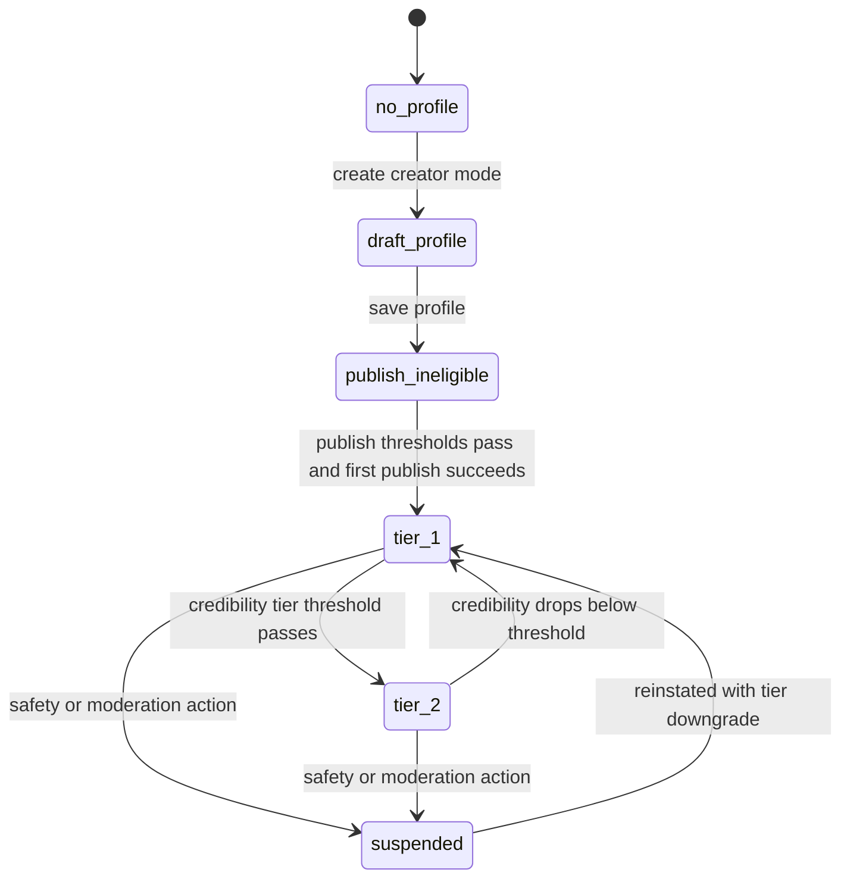
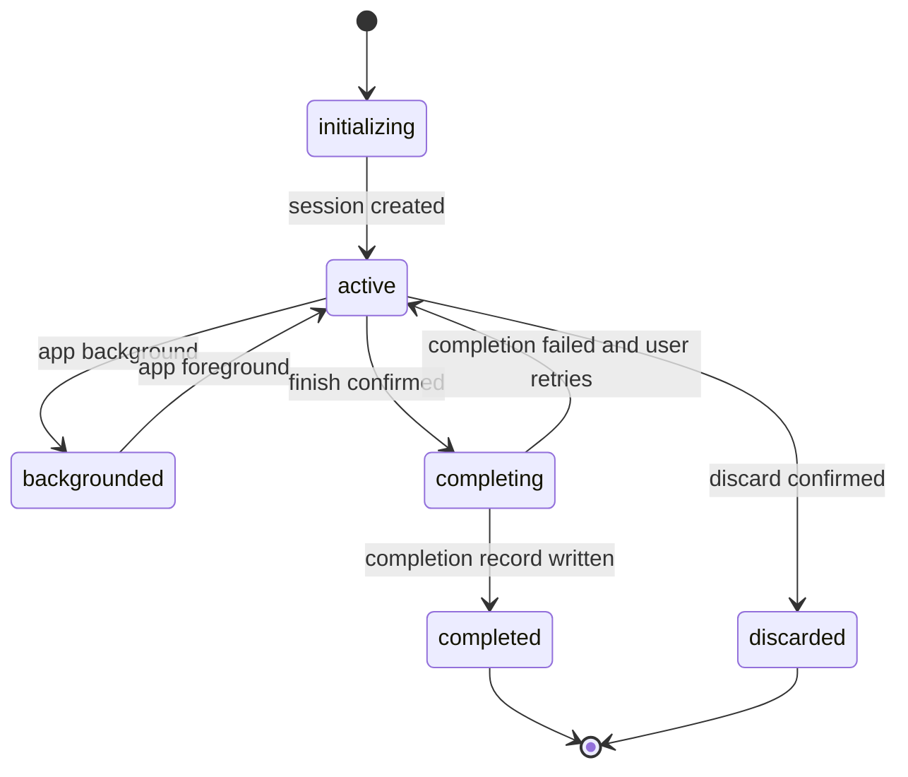

# yoked_prd.md

## 1. Product Overview

1. Yoked is an iPhone-first strength training and workout logging application with a routine and program marketplace layer.
2. The product category is locked to strength training and workout logging.
3. The product pillars are elite workout logging, AI-generated routines and programs, strength analytics, routine and program discovery marketplace, creator profiles, and Apple Health plus platform-native permission fit.
4. The product is not a generic social network.
5. The only permitted root navigation tabs are `Home`, `Train`, `My Workouts`, `Explore`, and `You`.
6. `Home` is a context and insight surface only. `Home` must not contain workout start, quick-start, resume, or active execution controls.
7. `Train` is the exclusive workout execution surface and owns every route that starts, resumes, logs, completes, or discards a workout session.
8. `My Workouts` owns user-managed training assets, including owned programs, owned routines, saved marketplace assets, drafts, and published-by-me assets.
9. `Explore` is a marketplace discovery surface with a horizontal category rail and a vertical ranked feed of metadata-rich cards for routines, programs, and creators.
10. `You` owns identity, profile, creator profile management, progress, history, analytics, settings, billing controls, integrations, support, and data governance.
11. Marketplace trust is enforced through threshold-gated publishing, completion-gated ratings, credibility-weighted ranking, and creator visibility tiers.
12. Launch exclusions are locked: comments, posts, messaging, groups, forums, generic social feeds, influencer timelines, TikTok-style fullscreen discovery default, nutrition tracking, mobility modules, rehab modules, and creator subscriptions.

## 2. Product Mission

1. Deliver the fastest and most reliable strength workout logging experience on iPhone.
2. Convert onboarding context into one included starter plan for every user, and use premium AI generation plus completion evidence for subsequent routines and programs that remain executable inside Train.
3. Make training progress legible through analytics that are explainable, localized, and anchored to real workout completion records.
4. Build a marketplace where discovery favors credible creators and trustworthy routines and programs rather than vanity engagement loops.
5. Use Apple platform capabilities such as Apple Health, notifications, and backup continuity to reduce workout friction and increase adherence without making launch UX depend on deferred surfaces.

## 3. User Problems

1. Serious lifters lose time during workouts because existing logging flows require too many taps, hide timers, or make numeric entry slow.
2. Users cannot trust many discovery surfaces because social engagement patterns elevate popularity over completion quality.
3. Generated plans often fail because they do not honor equipment, schedule, experience level, goals, or completed-session outcomes.
4. Progress data is frequently fragmented across history, PRs, charts, body metrics, and subscription-gated modules, making it hard to interpret training effectiveness.
5. Creators lack a trustworthy distribution model that distinguishes private drafts, basic publishing, and ranked marketplace visibility.
6. Users in the Apple ecosystem expect Health integration, native permission handling, and reliable notification behavior, but existing apps often treat those capabilities as secondary.
7. Offline and low-connectivity gym environments make cloud-dependent logging unreliable.
8. Permission prompts and paywalls are often shown without context, reducing opt-in trust and purchase confidence.

## 4. Product Pillars

1. Elite Workout Logging
   1. Low-latency set logging.
   2. Durable local session state.
   3. Timer-first runtime behavior.
   4. Safe finish and discard controls.
2. AI-Generated Routines and Programs
   1. One included onboarding starter-plan generation.
   2. Premium completion-aware evolution after onboarding.
   3. Output constrained to executable workouts, routines, and programs.
3. Strength Analytics
   1. Weekly KPI visibility.
   2. History and report windows.
   3. Body measurement tracking.
   4. Goal-aware interpretations.
4. Marketplace Discovery
   1. Routine and program discovery in Explore.
   2. Completion-gated ratings.
   3. Credibility-tier distribution.
5. Creator Profiles
   1. Publish eligibility enforcement.
   2. Creator libraries.
   3. Trust metadata.
   4. Visibility governance.
6. Apple Ecosystem Integrations
   1. Apple Health integration.
   2. Apple-first permission education.
   3. Notification and backup continuity on iPhone.
   4. Apple Watch is deferred to P2 and excluded from launch scope.

## 5. Non-Goals

1. Yoked does not ship as a social network.
2. Yoked does not include comments on ratings, routines, programs, or creator profiles at launch.
3. Yoked does not include posts, messaging, groups, forums, social feeds, or influencer content timelines.
4. Yoked does not include a sixth root tab or replace any locked root tab.
5. Yoked does not place workout execution controls on `Home`.
6. Yoked does not move analytics, history, or settings outside `You`.
7. Yoked does not ship `CF-029 Target Radar Analytics`.
8. Yoked does not ship `CF-034 Body Transformation and Nutrition Targets`.
9. Yoked does not ship `CF-051 AI Assistant Integrations`.
10. Yoked does not ship creator subscriptions or other creator monetization at launch.

## 6. Target Users

1. Strength trainees who need fast logging in commercial gym, home gym, and mixed-equipment contexts.
2. Users who want AI-generated routines or programs but still require editable structures and transparent execution.
3. Intermediate and advanced trainees who care about PRs, volume, progression, body metrics, and historical auditability.
4. Coaches and credible creators who want to publish structured routines and programs into a marketplace.
5. Apple ecosystem users who expect Health, notifications, and permission behavior to feel native on iPhone.

## 7. User Personas

### Persona A: Novice Guided Lifter
1. Goal: begin lifting with a schedule-constrained plan that matches available equipment.
2. Primary surfaces: onboarding, AI generation, Train, Home context cards, You > Progress.
3. Key needs:
   1. equipment-aware planning,
   2. low-friction set entry,
   3. visible completion progress,
   4. reminders and explanations.
4. Failure sensitivity: abandons quickly if onboarding is confusing, paywall appears without value framing, or workout logging feels intimidating.

### Persona B: Intermediate Structured Trainee
1. Goal: follow a program consistently, inspect weekly performance, and adapt to changing schedules.
2. Primary surfaces: Train, My Workouts, You > Progress, Explore.
3. Key needs:
   1. quick logging,
   2. reliable timers,
   3. history windows,
   4. save, copy, and start flows from marketplace assets.
4. Failure sensitivity: churn risk rises if offline logging fails or data sync is inconsistent.

### Persona C: Advanced Self-Coached Lifter
1. Goal: build or customize routines, author custom exercises, and monitor performance trends with precision.
2. Primary surfaces: My Workouts builder, Train runtime, You > Progress.
3. Key needs:
   1. composition controls,
   2. warm-up support,
   3. same-workout previous-value preload,
   4. PR feedback,
   5. private custom-exercise coverage.
4. Failure sensitivity: rejects opaque analytics and rigid AI behavior.

### Persona D: Credible Creator
1. Goal: publish high-quality routines and programs, build a discoverable profile, and earn trustworthy distribution through real outcomes.
2. Primary surfaces: My Workouts drafts and publishing, Explore detail pages, You > Profile creator mode.
3. Key needs:
   1. publish eligibility clarity,
   2. asset completeness feedback,
   3. tier visibility transparency,
   4. completion-gated ratings.
4. Failure sensitivity: distrusts discovery systems that reward vanity over real completion.

### Persona E: Apple Ecosystem Power User
1. Goal: capture workouts on iPhone while keeping Health data, notification behavior, and integration state reliable.
2. Primary surfaces: Train, You > Settings > Integrations, You > Settings > Notifications.
3. Key needs:
   1. pre-permission trust framing,
   2. reliable Health sync,
   3. clear integration status,
   4. minimal duplicate entry.
4. Failure sensitivity: abandons if integrations require repeated reconnects or permissions are unclear.

## 8. Product Principles

1. Trust completion over vanity.
   1. Ratings require completion evidence.
   2. Discoverability uses credibility and quality signals instead of likes.
2. Separate context from action.
   1. `Home` informs.
   2. `Train` executes.
3. Marketplace, not social feed.
   1. Explore uses category rails and ranked vertical cards.
   2. Explore never defaults to an immersive fullscreen feed.
4. Local-first execution.
   1. Workout logging must continue without network access.
   2. Session durability takes precedence over remote freshness.
5. Explainable adaptation.
   1. AI-generated output must honor explicit inputs.
   2. Analytics-derived coaching must surface why changes occurred.
6. Eligibility before amplification.
   1. Publishing requires creator threshold eligibility.
   2. Ranked distribution requires credibility-tier eligibility after publish.
7. One source of truth per surface.
   1. `Train` owns active sessions.
   2. `You` owns analytics, history, and settings.
8. Permission prompts follow education.
   1. Notifications and Health permissions require pre-permission explanation screens.

## 9. Core Object Model

### 9.1 Global Modeling Rules

1. All primary objects use UUIDv4 string identifiers.
2. All timestamps use ISO 8601 UTC strings persisted server-side and mirrored locally as epoch milliseconds for sort performance.
3. Every core object includes canonical fields `id`, `created_at`, `updated_at`, and optional `deleted_at`.
4. Object-specific identifiers such as `user_id`, `routine_id`, and `workout_session_id` are storage aliases that must equal the canonical `id` field.
5. `deleted_at` is null for active records and non-null for soft-deleted records.
6. Derived flags such as `is_deleted` and `is_removed` must be computed from `deleted_at` or preserved for backward-compatible client state projection.
7. All user-owned objects include `owner_user_id`.
8. Published assets include `publish_status`, `publish_version`, `visibility_tier`, and `credibility_snapshot_id`.
9. Objects rendered offline must be queryable from local storage without a network round trip.

### 9.2 Object Relationships

1. One `User` may own zero or one `CreatorProfile`.
2. One `User` may own many `Workout`, `Routine`, `Program`, and `WorkoutSession` records.
3. One `Routine` contains one or more workout day assignments referencing one or more `Workout` templates.
4. One `Program` contains one or more scheduled week blocks referencing one or more `Routine` assignments.
5. One `WorkoutSession` instantiates one `Workout` template or an empty quick-start flow.
6. One `WorkoutSession` contains one or more executed `Set` records referencing canonical `ExerciseDefinition` records.
7. One `CompletionRecord` is written per completed `WorkoutSession`.
8. One `Rating` belongs to one published routine or program and one user.
9. One `ExerciseDefinition` powers search, analytics attribution, and AI routine generation.

### 9.3 User Schema

| Attribute | Type | Required | Description | Validation |
|---|---|---|---|---|
| id | UUID | Yes | Canonical primary user identifier. | Immutable after creation. |
| user_id | UUID | Yes | Primary user identifier. | Immutable after creation. |
| auth_providers | array<string> | Yes | Linked providers: `apple`, `google`, `email`. | At least one value. |
| email | string | Conditional | Login email for email-auth or linked provider email. | RFC 5322 normalized lowercase. |
| email_verified | boolean | Yes | Email verification status. | Defaults `false` for email auth until verified. |
| display_name | string | Yes | User-visible name. | 1-60 characters. |
| avatar_url | string | No | User profile image URL. | HTTPS only when remote. |
| bio | string | No | User biography shown in profile. | Max 300 characters. |
| onboarding_completed | boolean | Yes | First-run flow completion flag. | Defaults `false`. |
| primary_goal | enum | Yes | Goal from onboarding. | One of configured goal catalog values. |
| experience_level | enum | Yes | Experience calibration. | One of `beginner`, `intermediate`, `advanced`. |
| equipment_profile | array<string> | Yes | Available equipment tags. | Non-empty. |
| training_days_per_week | integer | Yes | Intended schedule frequency. | Integer 1-7. |
| training_environment | enum | Yes | Primary environment. | One of `commercial_gym`, `home_gym`, `mixed`. |
| body_metrics | object | Yes | Height, weight, sex if collected, date recorded. | Units normalized per preference. |
| onboarding_source_attribution | string | No | Acquisition source answer. | Max 100 characters or catalog key. |
| unit_preference | enum | Yes | Weight and distance units. | One of `metric`, `imperial`. |
| load_helper_preferences | object | Yes | User-scoped load-helper preset groups for `metric` and `imperial`. | Must conform to the load-helper preference schema, including seeded defaults for both unit systems. |
| language_code | string | Yes | App language. | System-derived at launch; user-selectable override is P1 and uses a BCP 47 code. |
| appearance_mode | enum | Yes | Theme preference. | Defaults to system at launch; user-selectable override is P1 and uses `system`, `light`, or `dark`. |
| app_icon_key | string | No | Selected alternate icon. | Null at launch; user-selectable alternate app icons are P1 only. |
| notification_permission_state | enum | Yes | Current notification authorization state. | One of `unknown`, `preprompt_seen`, `authorized`, `denied`. |
| health_permission_state | enum | Yes | Apple Health authorization state. | One of `unknown`, `preprompt_seen`, `authorized`, `denied`, `partial_authorization`. |
| apple_health_workout_write_enabled | boolean | Yes | User-controlled switch for writing completed workouts to Apple Health. | Defaults `false` until the user explicitly enables workout writes and grants the required scope. |
| apple_health_body_metric_read_enabled | boolean | Yes | User-controlled switch for reading supported body metrics from Apple Health. | Defaults `false` until the user explicitly enables body-metric reads and grants the required scope. |
| apple_health_last_sync_at | datetime | No | Most recent successful Apple Health sync timestamp. | Null until the first successful Apple Health write or body-metric read sync completes. |
| apple_health_last_sync_status | enum | Yes | Current Apple Health sync status shown in launch integrations UI. | One of `never_synced`, `idle`, `syncing`, `succeeded`, `failed`, `permission_required`, `disabled`. |
| subscription_state | enum | Yes | Monetization entitlement state. | One of `none`, `trial`, `active`, `grace`, `expired`. |
| starter_plan_generation_state | enum | Yes | State of the one included onboarding starter-plan generation attempt. | One of `not_started`, `generating`, `completed`, `failed`. |
| included_starter_plan_consumed_at | datetime | No | Timestamp when the included onboarding starter-plan entitlement was consumed. | Set on the first onboarding generation attempt, even if fallback starter templates are used. |
| included_starter_plan_program_id | UUID | No | Program record created for the included onboarding starter plan. | Null until a starter plan or fallback starter template set is persisted. |
| goal_targets | object | Yes | User-level targets and per-exercise targets. | Must conform to goal target schema. |
| created_at | datetime | Yes | User record creation time. | Immutable after creation. |
| updated_at | datetime | Yes | Last user record update time. | Must advance on mutation. |
| deleted_at | datetime | No | Soft deletion timestamp. | Null when active. |
| sync_state | enum | Yes | Local sync state. | One of `synced`, `pending`, `failed`. |
| is_deleted | boolean | Yes | Soft delete marker. | Defaults `false`. |

### 9.4 CreatorProfile Schema

| Attribute | Type | Required | Description | Validation |
|---|---|---|---|---|
| id | UUID | Yes | Canonical primary creator profile identifier. | Immutable. |
| creator_profile_id | UUID | Yes | Primary creator profile identifier. | Immutable. |
| user_id | UUID | Yes | Owning user reference. | Must reference existing user. |
| public_slug | string | Yes | Shareable creator route key. | Unique, lowercase, 3-40 characters. |
| creator_display_name | string | Yes | Marketplace-visible creator name. | 1-60 characters. |
| creator_bio | string | No | Marketplace bio. | Max 500 characters. |
| specialization_tags | array<string> | No | Creator specialization labels. | Values from controlled tag taxonomy. |
| avatar_url | string | No | Creator avatar URL. | HTTPS only when remote. |
| external_links | array<object> | No | Approved outbound links. | Domain allowlist validation required. |
| profile_completeness_score | decimal | Yes | 0.00-1.00 completeness score. | Derived field. |
| publishing_eligibility_state | object | Yes | Threshold pass/fail state by configured rule. | Derived from completion and activity evidence. |
| visibility_tier | enum | Yes | Distribution tier. | One of `tier_0`, `tier_1`, `tier_2`. |
| credibility_score | decimal | Yes | Marketplace trust score. | Derived field. |
| blocked_creator_ids | array<UUID> | No | User-specific creator blocks. | No self-reference. |
| published_asset_ids | array<UUID> | No | Published workout, routine, and program asset IDs. | Read-only denormalized list. |
| created_at | datetime | Yes | Creator profile creation time. | Immutable after creation. |
| updated_at | datetime | Yes | Last creator profile update time. | Must advance on mutation. |
| deleted_at | datetime | No | Soft deletion timestamp. | Null when active. |
| sync_state | enum | Yes | Sync status. | One of `synced`, `pending`, `failed`. |
| is_deleted | boolean | Yes | Soft delete marker. | Defaults `false`. |

### 9.5 Workout Schema

| Attribute | Type | Required | Description | Validation |
|---|---|---|---|---|
| id | UUID | Yes | Canonical primary workout template identifier. | Immutable. |
| workout_id | UUID | Yes | Primary workout template identifier. | Immutable. |
| owner_user_id | UUID | Yes | Owner of template. | Existing user required. |
| source_type | enum | Yes | Origin of workout. | One of `manual`, `ai_generated`, `copied`, `imported`. |
| source_asset_id | UUID | No | Upstream published asset or copied source. | Required for `copied`. |
| source_creator_profile_id | UUID | No | Creator attribution for a copied or saved source asset. | Null for user-authored workouts with no marketplace lineage. |
| title | string | Yes | Workout title. | 1-80 characters. |
| description | string | No | Workout notes and purpose. | Max 500 characters. |
| goal_tags | array<string> | Yes | Goal descriptors. | At least one tag. |
| equipment_tags | array<string> | Yes | Required equipment. | Empty only for bodyweight-only workouts. |
| muscle_group_tags | array<string> | Yes | Primary muscle focus. | At least one tag. |
| estimated_duration_minutes | integer | Yes | Expected runtime. | Integer 5-240. |
| default_rest_seconds | integer | Yes | Baseline rest timer for workout. | Integer 0-1800. |
| exercise_blocks | array<object> | Yes | Ordered exercise plan blocks. | Minimum one block. |
| is_bodyweight_only | boolean | Yes | No load entry required by default. | Defaults `false`. |
| publish_status | enum | Yes | Publication state. | One of `draft`, `published`, `unpublished`, `archived`. |
| publish_version | integer | Yes | Incrementing version number. | Starts at 1 when published. |
| visibility_tier | enum | No | Discovery tier when published. | Null for drafts. |
| created_at | datetime | Yes | Workout creation time. | Immutable after creation. |
| updated_at | datetime | Yes | Last workout update time. | Must advance on mutation. |
| deleted_at | datetime | No | Soft deletion timestamp. | Null when active. |
| sync_state | enum | Yes | Sync status. | One of `synced`, `pending`, `failed`. |
| is_deleted | boolean | Yes | Soft delete marker. | Defaults `false`. |

### 9.6 Routine Schema

| Attribute | Type | Required | Description | Validation |
|---|---|---|---|---|
| id | UUID | Yes | Canonical primary routine identifier. | Immutable. |
| routine_id | UUID | Yes | Primary routine identifier. | Immutable. |
| owner_user_id | UUID | Yes | Owner of routine. | Existing user required. |
| source_type | enum | Yes | Origin of routine. | One of `manual`, `ai_generated`, `copied`, `imported`. |
| source_asset_id | UUID | No | Upstream published asset used for save or copy lineage. | Required for saved or copied marketplace routines. |
| source_creator_profile_id | UUID | No | Creator attribution for the source asset. | Required when the routine originated from a published marketplace asset. |
| title | string | Yes | Routine title. | 1-80 characters. |
| description | string | No | Routine summary. | Max 500 characters. |
| goal_tags | array<string> | Yes | Routine goal descriptors. | At least one tag. |
| difficulty_level | enum | Yes | Routine difficulty. | One of `beginner`, `intermediate`, `advanced`. |
| weeks_recommended | integer | No | Recommended routine duration. | Integer 1-52 when present. |
| day_assignments | array<object> | Yes | Ordered routine days and linked workout templates. | Minimum one day. |
| equipment_tags | array<string> | Yes | Aggregated equipment needs. | Derived from child workouts. |
| estimated_sessions_per_week | integer | Yes | Planned frequency. | Integer 1-7. |
| saved_state | enum | Yes | User asset state. | One of `owned`, `saved`, `draft`, `published_copy`. |
| publish_status | enum | Yes | Publication state. | One of `draft`, `published`, `unpublished`, `archived`. |
| publish_version | integer | Yes | Incrementing version number. | Starts at 1 when published. |
| visibility_tier | enum | No | Discovery tier when published. | Null for drafts. |
| created_at | datetime | Yes | Routine creation time. | Immutable after creation. |
| updated_at | datetime | Yes | Last routine update time. | Must advance on mutation. |
| deleted_at | datetime | No | Soft deletion timestamp. | Null when active. |
| sync_state | enum | Yes | Sync status. | One of `synced`, `pending`, `failed`. |
| is_deleted | boolean | Yes | Soft delete marker. | Defaults `false`. |

### 9.7 Program Schema

| Attribute | Type | Required | Description | Validation |
|---|---|---|---|---|
| id | UUID | Yes | Canonical primary program identifier. | Immutable. |
| program_id | UUID | Yes | Primary program identifier. | Immutable. |
| owner_user_id | UUID | Yes | Owner of program. | Existing user required. |
| source_type | enum | Yes | Origin of program. | One of `manual`, `ai_generated`, `copied`, `imported`. |
| source_asset_id | UUID | No | Upstream published asset used for save or copy lineage. | Required for saved or copied marketplace programs. |
| source_creator_profile_id | UUID | No | Creator attribution for the source asset. | Required when the program originated from a published marketplace asset. |
| title | string | Yes | Program title. | 1-80 characters. |
| description | string | No | Program summary. | Max 700 characters. |
| goal_tags | array<string> | Yes | Program goals. | At least one tag. |
| duration_weeks | integer | Yes | Program duration. | Integer 1-52. |
| weekly_schedule | array<object> | Yes | Week-by-week routine assignments. | Minimum one week. |
| progression_phase_model | object | No | AI progression phases and rules. | Required for AI-generated programs. |
| equipment_tags | array<string> | Yes | Aggregated equipment needs. | Derived from child routines. |
| difficulty_level | enum | Yes | Program difficulty. | One of `beginner`, `intermediate`, `advanced`. |
| completion_requirements | object | No | Completion semantics used by ratings and progress. | Derived when published. |
| saved_state | enum | Yes | User asset state. | One of `owned`, `saved`, `draft`, `published_copy`. |
| is_included_starter_plan | boolean | Yes | Marks the one onboarding-granted starter plan program. | Defaults `false`; at most one active program per user may be `true`. |
| publish_status | enum | Yes | Publication state. | One of `draft`, `published`, `unpublished`, `archived`. |
| publish_version | integer | Yes | Incrementing version number. | Starts at 1 when published. |
| visibility_tier | enum | No | Discovery tier when published. | Null for drafts. |
| created_at | datetime | Yes | Program creation time. | Immutable after creation. |
| updated_at | datetime | Yes | Last program update time. | Must advance on mutation. |
| deleted_at | datetime | No | Soft deletion timestamp. | Null when active. |
| sync_state | enum | Yes | Sync status. | One of `synced`, `pending`, `failed`. |
| is_deleted | boolean | Yes | Soft delete marker. | Defaults `false`. |

### 9.8 WorkoutSession Schema

| Attribute | Type | Required | Description | Validation |
|---|---|---|---|---|
| id | UUID | Yes | Canonical primary workout execution identifier. | Immutable. |
| workout_session_id | UUID | Yes | Primary workout execution identifier. | Immutable. |
| owner_user_id | UUID | Yes | Session owner. | Existing user required. |
| workout_id | UUID | No | Source workout template. | Nullable for empty quick-start. |
| source_routine_id | UUID | No | Parent routine context. | Optional. |
| source_program_id | UUID | No | Parent program context. | Optional. |
| entry_mode | enum | Yes | Session start path. | One of `today`, `instant`, `recent`, `detail_start`, `resume`. |
| state | enum | Yes | Session lifecycle state. | One of `initializing`, `active`, `backgrounded`, `completing`, `completed`, `discarded`. |
| started_at | datetime | Yes | Session start time. | Must exist once initialized. |
| ended_at | datetime | No | Session end time. | Required for completed sessions. |
| elapsed_seconds | integer | Yes | Running session duration. | Non-negative. |
| exercise_instances | array<object> | Yes | Executed exercise list. | Ordered, minimum one once active. |
| notes | string | No | Session note. | Max 1000 characters. |
| settings_snapshot | object | Yes | Save policy, timer defaults, units snapshot. | Persisted at session start. |
| live_activity_enabled | boolean | Yes | Runtime capability flag. | Derived from settings and OS capability. |
| created_at | datetime | Yes | Session record creation time. | Immutable after creation. |
| updated_at | datetime | Yes | Last session update time. | Must advance on mutation. |
| deleted_at | datetime | No | Soft deletion timestamp. | Null when active. |
| sync_state | enum | Yes | Sync status. | One of `synced`, `pending`, `failed`. |
| is_deleted | boolean | Yes | Soft delete marker. | Defaults `false`. |

### 9.9 ExerciseDefinition Schema

| Attribute | Type | Required | Description | Validation |
|---|---|---|---|---|
| id | UUID | Yes | Canonical primary exercise definition identifier. | Immutable. |
| exercise_id | UUID | Yes | Storage alias for the canonical `id` field. | Must equal `id`. |
| family_id | UUID | Yes | Movement-family identifier grouping closely related canonical variations. | Must reference an existing movement family record. |
| source_type | enum | Yes | Canonical or custom origin. | One of `canonical`, `custom`. |
| owner_user_id | UUID | No | Owner for custom exercise. | Required for `custom`. |
| canonical_name | string | Yes | Canonical launch-visible exercise name. | 1-120 characters; equipment appears in the canonical name when relevant. |
| family_name | string | Yes | Movement-family display name shared across canonical variations. | 1-100 characters; no equipment suffix unless the family itself is equipment-specific. |
| variation | string | No | Variation qualifier within a family. | Required when the family contains multiple canonical variations that differ by handle, stance, machine path, or attachment. |
| aliases | array<string> | No | Search synonyms and historical ingest names. | Unique normalized strings. |
| primary_muscle | string | Yes | Primary muscle used for search and analytics rollups. | Must match controlled muscle taxonomy. |
| secondary_muscles | array<string> | No | Supporting muscles used for search and analytics rollups. | Values must match controlled muscle taxonomy. |
| equipment | string | Yes | Primary equipment category used for naming, search, and AI matching. | Must match equipment taxonomy. |
| movement_pattern | string | Yes | Movement classification used by AI and analytics. | Must match pattern taxonomy. |
| difficulty | enum | Yes | Exercise difficulty. | One of `beginner`, `intermediate`, `advanced`. |
| instructions | array<string> | Yes | Canonical instruction steps for the exercise. | Minimum one step. |
| tips | array<string> | No | Concise technique reminders shown in exercise detail. | Each entry max 160 characters. |
| visual_media_url | string | No | Reserved future exercise visual asset URL. | Must be null at launch; visuals are P2 only. |
| visual_family | string | No | Reserved future visual grouping key for reuse across related exercises. | Null at launch or controlled future taxonomy value. |
| source_dataset | string | Yes | Internal provenance marker for the canonical or custom exercise. | One of `yoked_exercise_catalog`, `yuhonas_free_exercise_db`, `wrkout_exercises_json`, `custom_user_authored`. |
| source_url | string | No | Original source provenance URL retained for internal auditability only. | HTTPS only when remote. |
| license_type | string | Yes | License classification for ingest provenance. | Must match internal approved license taxonomy. |
| approved_for_launch_use | boolean | Yes | Whether the exercise is included in the frozen launch catalog. | `true` only after pipeline review or explicit custom-authoring acceptance. |
| is_unilateral | boolean | Yes | Indicates whether the movement is unilateral. | Defaults `false`. |
| is_compound | boolean | Yes | Indicates whether the movement is compound. | Defaults `false`. |
| primary_muscle_groups | array<string> | Yes | Main muscle groups. | At least one value. |
| secondary_muscle_groups | array<string> | No | Supporting muscle groups. | Optional. |
| equipment_tags | array<string> | Yes | Equipment requirements. | Empty only for bodyweight-only movements. |
| duration_tag | string | No | Expected time classification used for filters. | Must match duration taxonomy. |
| instruction_overview | string | No | Exercise summary. | Max 1000 characters. |
| guide_steps | array<string> | No | Ordered execution instructions. | Each step max 200 characters. |
| form_cues | array<string> | No | Technique cues. | Each cue max 160 characters. |
| common_mistakes | array<string> | No | Mistake list. | Each entry max 160 characters. |
| analytics_supported | boolean | Yes | Whether performance charts are supported. | Defaults `true` for canonical exercises. |
| is_excluded | boolean | No | User exclusion flag. | User-scoped projection. |
| created_at | datetime | Yes | Exercise definition creation time. | Immutable after creation. |
| updated_at | datetime | Yes | Last exercise definition update time. | Must advance on mutation. |
| deleted_at | datetime | No | Soft deletion timestamp. | Null when active. |
| sync_state | enum | Yes | Sync status. | One of `synced`, `pending`, `failed`. |
| is_deleted | boolean | Yes | Soft delete marker. | Defaults `false`. |

### 9.9.1 Yoked Exercise Catalog Strategy

1. Launch ships one internal curated canonical catalog named `Yoked Exercise Catalog`.
2. Launch catalog size target is `900-1300` canonical exercises after final freeze.
3. Third-party datasets may be used for ingest, normalization, duplicate detection, and gap analysis but may never be exposed directly in the shipped product as branded or raw-source catalogs.
4. Catalog build pipeline stages are:
   1. Stage 1: ingest permissive datasets from `yuhonas/free-exercise-db` as the primary ingest source and `wrkout/exercises.json` as the secondary ingest source.
   2. Stage 2: normalize exercise name, equipment, muscle names, movement patterns, aliases, difficulty, and instructions across all ingested rows.
   3. Stage 3: cluster duplicates using normalized name, primary muscle, equipment, and movement pattern similarity rules.
   4. Stage 4: select one canonical exercise per accepted variation cluster.
   5. Stage 5: write alias mappings from non-canonical names and ingest variants to the selected canonical exercise.
   6. Stage 6: run gap analysis using `exercemus/exercises`, `ExerciseDB/exercisedb-api`, and `wger` only to identify missing exercises or missing metadata; these reference datasets are not direct launch sources.
   7. Stage 7: enqueue manual review only for ambiguous duplicate clusters, important missing exercises, and canonical naming decisions.
   8. Stage 8: freeze the launch catalog only when the final approved exercise count falls inside the `900-1300` target range.
5. `approved_for_launch_use = true` is the sole inclusion flag for the frozen launch catalog.

### 9.9.2 Exercise Naming Convention

1. Canonical names must include equipment in the canonical name itself when equipment meaningfully distinguishes the movement.
2. Canonical naming must prefer:
   1. `Barbell Bench Press`,
   2. `Dumbbell Bench Press`,
   3. `Machine Chest Press`,
   4. `Cable Triceps Pushdown (Rope)`,
   5. `Cable Triceps Pushdown (V-Bar)`,
   6. `Cable Triceps Pushdown (Straight Bar)`.
3. Canonical naming must not use suffix forms such as `Bench Press (Barbell)` when the equipment can be placed directly in the base name.
4. Variation qualifiers in parentheses are reserved for same-family distinctions such as handle attachment, grip implementation, machine path, or closely related execution variants.

### 9.9.3 Movement Family Model

1. The catalog supports two levels:
   1. Level 1: movement family,
   2. Level 2: canonical exercise variation.
2. Example:
   1. family: `Cable Triceps Pushdown`,
   2. canonical exercises: `Cable Triceps Pushdown (Rope)`, `Cable Triceps Pushdown (V-Bar)`, `Cable Triceps Pushdown (Straight Bar)`.
3. The movement family model exists to enable:
   1. accurate strength tracking,
   2. clean search grouping,
   3. similar exercise recommendations,
   4. exercise family analytics.
4. Custom exercises may omit a `family_id` at creation time only if no confident family match exists. The system may propose a family assignment later through catalog review workflows.

### 9.10 Set Schema

| Attribute | Type | Required | Description | Validation |
|---|---|---|---|---|
| id | UUID | Yes | Canonical primary set identifier. | Immutable. |
| set_id | UUID | Yes | Primary set identifier. | Immutable. |
| workout_session_id | UUID | Yes | Parent session. | Existing session required. |
| exercise_id | UUID | Yes | Related exercise definition. | Existing exercise definition required. |
| order_index | integer | Yes | Display order within exercise block. | Zero-based, unique within exercise instance. |
| set_type | enum | Yes | Planned set classification. | One of `normal`, `warmup`, `superset`, `drop`, `circuit`, `giant`, `amrap`, `timed`. |
| set_group_id | UUID | No | Shared identifier for grouped set structures such as supersets, circuits, and giant sets. | Required when `set_type` is `superset`, `circuit`, or `giant`. |
| set_group_position | integer | No | Position within the grouped structure. | Required when `set_group_id` is present. |
| round_index | integer | No | Round number for circuits and giant sets. | Required for `circuit` and `giant`. |
| amrap_window_seconds | integer | No | AMRAP execution window. | Required for `amrap`. |
| planned_reps | integer | No | Planned reps. | Integer 0-999. |
| actual_reps | integer | No | Logged reps. | Integer 0-999. |
| load_entry_mode | enum | Yes | Launch load-input pattern for the set row. | One of `single`, `per_dumbbell`, `left_right`. Defaults from exercise metadata and never requires network. |
| planned_load | decimal | No | Canonical total planned load used by summaries and analytics. | Non-negative. Equals the single entered load, `2 x` per-dumbbell load, or `left + right`. |
| planned_load_left | decimal | No | Planned left-side load when side-aware entry applies. | Required for `left_right`; mirrors the per-dumbbell value when `per_dumbbell`. |
| planned_load_right | decimal | No | Planned right-side load when side-aware entry applies. | Required for `left_right`; mirrors the per-dumbbell value when `per_dumbbell`. |
| actual_load | decimal | No | Canonical total logged load used by summaries and analytics. | Non-negative. Equals the single entered load, `2 x` per-dumbbell load, or `left + right`. |
| actual_load_left | decimal | No | Logged left-side load when side-aware entry applies. | Required for `left_right` when completed; mirrors the per-dumbbell value when `per_dumbbell`. |
| actual_load_right | decimal | No | Logged right-side load when side-aware entry applies. | Required for `left_right` when completed; mirrors the per-dumbbell value when `per_dumbbell`. |
| rpe | decimal | No | Rated perceived exertion. | Decimal 1.0-10.0 in 0.5 increments. |
| reps_in_reserve | integer | No | Reps left estimate. | Integer 0-10. |
| duration_seconds | integer | No | Duration for timed sets. | Non-negative. |
| completed_at | datetime | No | Completion timestamp. | Required if completed. |
| is_completed | boolean | Yes | Completion flag. | Defaults `false`. |
| rest_seconds_after | integer | No | Rest timer started after this set. | Integer 0-1800. |
| note | string | No | Set note. | Max 240 characters. |
| created_at | datetime | Yes | Set record creation time. | Immutable after creation. |
| updated_at | datetime | Yes | Last set update time. | Must advance on mutation. |
| deleted_at | datetime | No | Soft deletion timestamp. | Null when active. |
| sync_state | enum | Yes | Sync status. | One of `synced`, `pending`, `failed`. |
| is_deleted | boolean | Yes | Soft delete marker. | Defaults `false`. |

### 9.11 CompletionRecord Schema

| Attribute | Type | Required | Description | Validation |
|---|---|---|---|---|
| id | UUID | Yes | Canonical primary completion ledger identifier. | Immutable. |
| completion_record_id | UUID | Yes | Primary completion ledger identifier. | Immutable. |
| owner_user_id | UUID | Yes | Completing user. | Existing user required. |
| workout_session_id | UUID | Yes | Source completed session. | Existing completed session required. |
| source_workout_id | UUID | No | Related workout template. | Optional for empty sessions. |
| source_routine_id | UUID | No | Related routine. | Optional. |
| source_program_id | UUID | No | Related program. | Optional. |
| completed_at | datetime | Yes | Completion timestamp. | Must be after session start. |
| completion_type | enum | Yes | Completion object type. | One of `workout`, `routine_session`, `program_session`. |
| volume_snapshot | object | Yes | Working volume, working-set counts, warm-up count, duration, and load summary. | Derived at write time; warm-up sets remain separate and are excluded from KPI volume totals. |
| pr_snapshot | object | No | PRs detected in completed session. | Derived at write time from non-warmup completed working sets only. |
| progress_snapshot | object | Yes | Routine and program progress before and after completion. | Required. |
| rating_eligibility_snapshot | object | Yes | Eligibility counters and remaining requirements. | Required. |
| credibility_signal_snapshot | object | Yes | Signals emitted to marketplace trust system. | Required. |
| created_at | datetime | Yes | Completion record creation time. | Immutable after creation. |
| updated_at | datetime | Yes | Last completion record update time. | Must advance on mutation. |
| deleted_at | datetime | No | Soft deletion timestamp. | Null when active. |
| sync_state | enum | Yes | Sync status. | One of `synced`, `pending`, `failed`. |
| is_deleted | boolean | Yes | Soft delete marker. | Defaults `false`. |

### 9.12 Rating Schema

| Attribute | Type | Required | Description | Validation |
|---|---|---|---|---|
| id | UUID | Yes | Canonical primary rating identifier. | Immutable. |
| rating_id | UUID | Yes | Primary rating identifier. | Immutable. |
| owner_user_id | UUID | Yes | Rating author. | Existing user required. |
| entity_type | enum | Yes | Rated object type. | One of `routine`, `program` at launch. |
| entity_id | UUID | Yes | Rated asset identifier. | Must reference published asset. |
| score | integer | Yes | Rating value. | Integer 1-5. |
| eligibility_basis | object | Yes | Completion evidence used to allow rating. | Required. |
| created_at | datetime | Yes | Rating create timestamp. | Immutable after first write. |
| updated_at | datetime | Yes | Last update timestamp. | Updated on edit. |
| deleted_at | datetime | No | Soft deletion timestamp. | Null when active. |
| version | integer | Yes | Optimistic concurrency version. | Starts at 1. |
| is_removed | boolean | Yes | Soft removal marker. | Defaults `false`. |
| sync_state | enum | Yes | Sync status. | One of `synced`, `pending`, `failed`. |

## 10. Navigation Architecture

### 10.1 Root Navigation Rules

1. The app root is a five-tab tab bar with independent navigation stacks for `Home`, `Train`, `My Workouts`, `Explore`, and `You`.
2. No additional root tabs are permitted.
3. Onboarding is a full-screen flow shown before tab-root entry when required. Paywalls are full-screen covers presented over the current owning surface when a premium trigger is reached.
4. Active workout session, AI program generation, and post-workout summary are full-screen routes owned by `Train` or `My Workouts` but presented without leaving the owning tab context.
5. Transactional actions use bottom sheets or modal overlays for copy confirmation, rating submission, publish confirmation, timer override, restore purchases, and support forms.

### 10.2 Home Tab

- Purpose: daily context and insight surface.
- Contained Features: `CF-012`, `CF-030`, `CF-037`, `CF-038`, `CF-041`.
- Excluded Features:
  1. no workout start button,
  2. no quick-start button,
  3. no resume session control,
  4. no fullscreen discovery feed,
  5. no history and settings modules.
- Navigation Handoffs:
  1. `View in Train` routes to the relevant Train entry context without starting a workout.
  2. `View in Explore` routes to marketplace detail or lane view.
  3. `View in You` routes to the corresponding analytics detail.
- Entry Points:
  1. default app root after onboarding,
  2. notification deep links for insight cards,
  3. return route after session completion.
- Layout Structure:
  1. top greeting and date row,
  2. informational today plan card,
  3. active program progress snapshot,
  4. one key weekly insight card,
  5. lightweight recommendation rail linking to Explore,
  6. optional free-tier banner slot after all required informational modules and the recommendation rail.
- Components:
  1. non-actionable today plan summary,
  2. goal progress chip,
  3. KPI delta card,
  4. recommendation cards with creator and trust metadata,
  5. optional banner container for free-tier users only.
- Component Interactions:
  1. tapping today plan opens Train context selector,
  2. tapping KPI card opens You > Progress,
  3. tapping recommendation opens Explore detail.
- Gestures:
  1. vertical scroll,
  2. pull-to-refresh for remote summaries,
  3. standard tap targets only.
- Animations:
  1. skeleton-to-content fade for cards,
  2. numeric count-up for KPI values,
  3. subtle progress bar fill on program snapshot.
- Empty States:
  1. no active program shows onboarding-derived recommendation prompt linking to My Workouts or Explore,
  2. no analytics history shows “complete workouts to unlock insights”.
- Loading States:
  1. skeleton today card,
  2. skeleton KPI card,
  3. deferred recommendation rail while cached content is shown first,
  4. banner slot reserves no height while ad loading is unresolved.
- Error States:
  1. inline retry for recommendation fetch failure,
  2. stale analytics card with last-sync timestamp,
  3. banner no-fill or load failure collapses the slot to zero height.
- Offline States:
  1. render cached today context and last synced KPIs,
  2. mark recommendations as stale,
  3. disable refresh until network returns,
  4. suppress the banner entirely when offline-cached-only browse is the active state.

### 10.3 Train Tab

- Purpose: exclusive workout execution surface.
- Contained Features: `CF-017`, `CF-020`, `CF-021`, `CF-023`, `CF-025`, `CF-026`.
- Excluded Features:
  1. no creator publishing controls,
  2. no deep marketplace browsing,
  3. no settings root surfaces outside in-session settings.
- Navigation Handoffs:
  1. routine or program `Start` actions from Explore and My Workouts route into Train,
  2. completion summary can hand off to You > Progress or back to Home,
  3. exercise detail knowledge surfaces open as in-session sheets and return to Train.
- Entry Points:
  1. `Today` segmented mode,
  2. `Instant` segmented mode,
  3. `Recent` segmented mode,
  4. deep link from marketplace detail start action,
  5. resume active session.
- Layout Structure:
  1. segmented control header,
  2. context-specific list or empty state,
  3. active session full-screen surface with session header, exercise blocks, timer strip, and finish action.
- Components:
  1. segmented mode control,
  2. today planned workouts,
  3. quick empty workout action,
  4. recent sessions list,
  5. live set table,
  6. numeric keypad,
  7. plate calculator and load helper,
  8. rest timer module,
  9. finish and discard safeguards.
- Component Interactions:
  1. start from Today, Instant, or Recent creates or resumes a `WorkoutSession`,
  2. tapping a set field opens keypad focus,
  3. tapping the load-helper trigger opens a non-blocking plate-calculator sheet prefilled from the current set load when applicable,
  4. completing a set starts rest timer when configured,
  5. tapping finish opens confirmation flow.
- Gestures:
  1. vertical scroll through exercise list,
  2. drag to reorder only in planning contexts, not active session,
  3. swipe actions on recent items for rerun,
  4. long press on timer quick-adjust buttons.
- Animations:
  1. timer pulse on completion,
  2. checkmark micro-animation on set completion,
  3. summary sheet slide-in after post-workout processing.
- Empty States:
  1. no planned session today,
  2. no recent sessions,
  3. empty instant workout before exercise selection.
- Loading States:
  1. session initialization progress,
  2. post-workout processing state,
  3. resume hydration spinner when re-entering an active session.
- Error States:
  1. local save failure banner with retry,
  2. session completion sync failure with queued badge,
  3. timer restore failure falls back to elapsed-only runtime.
- Offline States:
  1. full session logging remains enabled,
  2. completion queues sync,
  3. remote recommendations and cloud-dependent resume indicators are suppressed.

### 10.4 My Workouts Tab

- Purpose: manage user-owned training assets.
- Contained Features: `CF-011`, `CF-012`, `CF-013`, `CF-014`, `CF-015`, `CF-016` excluded exercise behavior, `CF-017`, `CF-018`, `CF-039`.
- Excluded Features:
  1. no workout history calendar,
  2. no deep analytics dashboard,
  3. no billing or settings controls.
- Navigation Handoffs:
  1. `Start` routes to Train,
  2. publish actions route to publish confirmation,
  3. AI generation routes to generation flow and returns saved assets to the appropriate segment.
- Entry Points:
  1. direct tab access,
  2. return from Explore `Save` or `Copy`,
  3. creation CTA from empty states.
- Layout Structure:
  1. segmented control with `Workouts`, `Programs`, `Routines`, `Saved`, `Drafts`,
  2. within `Workouts`, `Programs`, and `Routines`, a secondary filter row with `Owned` selected by default and `Published by Me` available only when the user has a creator profile,
  3. active routine usage indicator for free-tier routine slots,
  4. optional free-tier banner slot on non-builder list surfaces only, below routine-slot usage messaging and upgrade surfaces when present and above the asset list,
  5. per-segment list or grid of assets,
  6. floating create action,
  7. builder workspace with metadata header and exercise composition canvas.
- Components:
  1. asset cards,
  2. publish eligibility badge,
  3. ownership filter row for `Owned` and `Published by Me`,
  4. draft completeness checklist,
  5. routine-slot usage indicator,
  6. approaching-limit warning,
  7. upgrade card or locked-state upsell at slot cap,
  8. optional banner container on eligible free-tier list surfaces,
  9. search bar with exercise entry access,
  10. builder day controls,
  11. exercise composition row.
- Component Interactions:
  1. create new workout or routine directly, and expose program creation only for premium-entitled users or as a locked upsell entry when premium program-authoring entitlement is absent,
  2. edit metadata,
  3. add day,
  4. add exercise through library search,
  5. replace, reorder, or superset exercises,
  6. publish or unpublish eligible assets,
  7. successful publish confirmation returns to the originating `Workouts`, `Programs`, or `Routines` segment with `Published by Me` selected when the user has a creator profile,
  8. published workout templates remain manageable only through `Workouts > Published by Me`, never through Explore or public creator rails.
- Gestures:
  1. drag and drop reorder inside builder,
  2. swipe actions on asset rows for archive or duplicate,
  3. tap-to-expand day sections.
- Animations:
  1. drag shadow during reorder,
  2. card insertion animation on copy/save,
  3. completion pulse on AI-generated asset save.
- Empty States:
  1. no workouts,
  2. no programs,
  3. no routines,
  4. no `Published by Me` assets in the currently selected `Workouts`, `Programs`, or `Routines` segment,
  5. no saved marketplace assets,
  6. no drafts.
- Loading States:
  1. asset skeleton lists,
  2. builder autosave indicator,
  3. AI generation staged progress view,
  4. `Published by Me` keeps the secondary filter row visible while the current asset-type list hydrates,
  5. the optional banner slot reserves no height while ad loading is unresolved.
- Error States:
  1. draft save failure with local retry,
  2. publish validation failure sheet,
  3. copied asset conflict resolution prompt,
  4. slot-cap paywall trigger before sixth routine insert,
  5. `Published by Me` fetch failure shows an inline retry state scoped to the active asset-type segment,
  6. banner no-fill or load failure collapses the slot to zero height.
- Offline States:
  1. draft editing stays enabled,
  2. publish is disabled while offline,
  3. saved and copied local assets remain viewable,
  4. `Published by Me` shows last-synced published assets when cached, marks them stale, and disables publish-state mutations until connectivity returns,
  5. non-builder list-surface banners are suppressed entirely while offline-cached-only browse is active,
  6. builder workspace remains ad-free in every state.

### 10.5 Explore Tab

- Purpose: marketplace discovery for routines, programs, and creators.
- Contained Features: `CF-013`, `CF-015`, `CF-038`, `CF-039`, `CF-040`, `CF-041`, `CF-042`.
- Excluded Features:
  1. no generic social feed,
  2. no comments,
  3. no groups,
  4. no messaging,
  5. no fullscreen TikTok-style discovery default.
- Navigation Handoffs:
  1. detail `Copy` routes resulting asset into My Workouts,
  2. detail `Start` routes into Train,
  3. creator profile can route to You > Profile only when the current user owns that profile.
- Entry Points:
  1. direct tab access,
  2. deep links to asset detail or creator profile,
  3. Home recommendation handoff.
- Layout Structure:
  1. top search field,
  2. horizontal category rail,
  3. optional free-tier banner slot on root-lane and search-result browse surfaces only, below the search field and category rail and above the ranked feed or result list,
  4. vertical ranked feed,
  5. detail screens for routines, programs, and creators.
- Components:
  1. category chips,
  2. trust-rich marketplace cards,
  3. search filters for type and tags,
  4. detail action bar with `Start` visually primary and listed first, followed by `Save`, `Copy`, and `Rate`,
  5. creator trust block,
  6. optional banner container on eligible free-tier browse surfaces.
- Component Interactions:
  1. switch discovery lane by category,
  2. open detail,
  3. execute lifecycle actions,
  4. view rating lock requirements when ineligible.
- Gestures:
  1. horizontal scroll on category rail,
  2. vertical scroll on feed,
  3. pull-to-refresh on feed,
  4. tap on tags to refine filters.
- Animations:
  1. skeleton card shimmer,
  2. category chip selection transition,
  3. rating lock badge transition.
- Empty States:
  1. no results for search or filter,
  2. no eligible content in a category,
  3. no published assets on a creator profile.
- Loading States:
  1. category rail placeholder,
  2. ranked card skeletons,
  3. search result spinner after debounce,
  4. banner slot reserves no height while ad loading is unresolved.
- Error States:
  1. feed fetch retry card,
  2. action failure toast for save, copy, start, or rating,
  3. detail hydration fallback to cached summary,
  4. banner no-fill or load failure collapses the slot to zero height.
- Offline States:
  1. cached lanes remain browsable,
  2. save and copy queue only when the asset is cached locally,
  3. routine `Start` is allowed only when the required published snapshot is cached locally,
  4. program `Start` is unavailable offline unless an eligible local saved or owned program context already exists,
  5. rating remains unavailable until connectivity returns,
  6. banner slots are suppressed entirely when offline-cached-only browse is the active state.

### 10.6 You Tab

- Purpose: identity, progress, and settings surface.
- Contained Features: `CF-001`, `CF-007`, `CF-009`, `CF-028`, `CF-030`, `CF-032`, `CF-033`, `CF-037`, `CF-042`, `CF-043`, `CF-044` unit preference, `CF-045`, `CF-046`, `CF-047`, `CF-050` Apple Health integration only, `CF-052` launch sync and backup continuity only.
- Excluded Features:
  1. no active workout execution,
  2. no marketplace ranked feed,
  3. no builder workspace.
- Navigation Handoffs:
  1. analytics cards may route back to specific history entries,
  2. creator profile edit routes into creator management screens,
  3. integration connection flows route to provider-specific system dialogs.
- Entry Points:
  1. direct tab access,
  2. handoff from Home insight cards,
  3. account and support notifications.
- Layout Structure:
  1. segmented control with `Profile`, `Progress`, `Settings`,
  2. nested settings lists and detail pages, including `Settings > Training > Load Helper`,
  3. analytics modules,
  4. creator library and published assets.
- Components:
  1. profile header,
  2. creator mode summary,
  3. KPI cards,
  4. history calendar and report modules,
  5. body measurement charts and logs,
  6. one free-tier banner ad slot on `Profile` and `Progress` overview surfaces only, positioned below the required non-ad overview modules,
  7. settings rows, including `Training > Load Helper`,
  8. integration status cells,
  9. support cells.
- Component Interactions:
  1. edit profile,
  2. inspect progress ranges,
  3. manage notifications,
  4. connect Apple Health at launch,
  5. manage `Load Helper` preset libraries from `You > Settings > Training > Load Helper`,
  6. restore purchases,
  7. erase data at launch and export data only when the P1 export capability is enabled.
- Gestures:
  1. vertical scroll,
  2. pull-to-refresh for analytics snapshots,
  3. horizontal chart pan for time ranges.
- Animations:
  1. chart redraw on range change,
  2. profile avatar crossfade after update,
  3. entitlement badge transition after purchase recovery.
- Empty States:
  1. no history,
  2. no body measurements,
  3. no published assets,
  4. no integrations connected.
- Loading States:
  1. analytics skeletons,
  2. support content spinner,
  3. integration reconnect spinner,
  4. `Profile` and `Progress` banner slots do not reserve height while overview modules are loading.
- Error States:
  1. analytics fetch failure with last-sync fallback,
  2. billing restore failure message,
  3. erase job failure states at launch and export job failure states only when the P1 export capability is enabled,
  4. banner no-fill or banner-load failure collapses the slot to zero height and restores standard module spacing.
- Offline States:
  1. cached analytics snapshot and history remain readable,
  2. settings edits queue locally when safe,
  3. Apple Health connection attempts and support submission are disabled,
  4. `Profile` and `Progress` banner slots are suppressed on offline-cached-only overview states.

## 11. Feature Specifications

### 11.1 Identity and Onboarding

#### CF-001 Account Authentication and Login
- Feature ID: `CF-001`
- Feature Name: Account Authentication and Login
- Description: Support Apple, Google, and email authentication plus existing-account login. Authentication establishes the durable identity used by all owned objects, subscriptions, and sync state.
- User Stories:
  1. As a new user, I can create an account with my preferred provider.
  2. As a returning user, I can sign in and recover my existing data.
- Functional Requirements:
  1. Support sign-in with Apple, Google, and email.
  2. Support existing-account email login and password reset entry.
  3. Persist authenticated session tokens securely and auto-restore valid sessions at app launch.
  4. Route first-time users to onboarding and returning users to tab root.
- UI Requirements:
  1. Authentication screen shows provider buttons, email entry, login action, and recovery link.
  2. Loading states disable repeated submissions.
  3. Error messages render inline without clearing typed credentials.
- Edge Cases:
  1. Provider email matches an existing account with a different provider.
  2. User cancels provider sign-in after authorization begins.
  3. Device is offline during login attempt.
- Failure States:
  1. Provider token exchange fails.
  2. Session restore token is expired or revoked.
- Dependencies:
  1. `SYS-01 Identity & Access System`.
  2. `SYS-18 Sync & Data Portability System`.
- Acceptance Criteria:
  1. A user can sign in with each supported provider.
  2. Returning users resume their session without re-entering credentials when the token is valid.
  3. Failed sign-in does not create duplicate user records.

#### CF-002 Onboarding Personalization Core
- Feature ID: `CF-002`
- Feature Name: Onboarding Personalization Core
- Description: Collect the minimum structured inputs needed to personalize AI generation, recommendations, analytics, and reminders.
- User Stories:
  1. As a new user, I can define my goal and experience level.
  2. As a new user, I can complete onboarding in a predictable sequence.
- Functional Requirements:
  1. Present a multi-step onboarding flow with deterministic step order.
  2. Capture goal selection and experience calibration.
  3. Persist partial progress locally after every step.
  4. Prevent completion until required answers are valid.
- UI Requirements:
  1. Each step displays one primary question and supporting context.
  2. Back navigation preserves entered values.
  3. Required fields are visibly marked before continue is enabled.
- Edge Cases:
  1. App closes mid-onboarding.
  2. User skips optional explanatory content.
  3. Network is unavailable during onboarding.
- Failure States:
  1. Save of onboarding state fails locally.
  2. Final submission to remote profile seed fails after completion.
- Dependencies:
  1. `SYS-02 Onboarding Orchestration System`.
  2. `SYS-03 User Preferences & Settings System`.
  3. `SYS-09 AI Coaching System`.
- Acceptance Criteria:
  1. Goal and experience data are stored once onboarding completes.
  2. Incomplete onboarding resumes on the last valid step.
  3. Completed onboarding feeds the one included starter-plan generation inputs without manual re-entry.

#### CF-003 Onboarding Context Inputs
- Feature ID: `CF-003`
- Feature Name: Onboarding Context Inputs
- Description: Capture equipment, schedule, training environment, body metrics, manual fallback input, and source attribution.
- User Stories:
  1. As a user, I can specify what equipment I actually have.
  2. As a user, I can define how often and where I train.
- Functional Requirements:
  1. Capture equipment profile, training days per week, training environment, and body metrics.
  2. Provide manual data entry fallback for any unsupported selection flow.
  3. Capture source attribution for growth analytics.
  4. Normalize inputs to settings and AI-ready schema.
- UI Requirements:
  1. Equipment selection uses multi-select chips.
  2. Days-per-week uses a bounded integer selector.
  3. Body metrics show units based on current unit preference.
- Edge Cases:
  1. User selects no equipment.
  2. User changes units after entering body metrics.
  3. User declines optional attribution.
- Failure States:
  1. Metric normalization fails.
  2. Required context is missing at final onboarding submission.
- Dependencies:
  1. `SYS-02 Onboarding Orchestration System`.
  2. `SYS-03 User Preferences & Settings System`.
- Acceptance Criteria:
  1. AI plan generation receives all required context fields.
  2. Unit conversions are lossless within supported precision.
  3. Manual fallback is available for every required context field.

#### CF-004 Onboarding Progress Feedback
- Feature ID: `CF-004`
- Feature Name: Onboarding Progress Feedback
- Description: Render deterministic loading and progress states during onboarding transitions and one-time starter-plan generation.
- User Stories:
  1. As a user, I know how many onboarding steps remain.
  2. As a user, I can see what the app is doing while my plan is being prepared.
- Functional Requirements:
  1. Show step count and current step position during questionnaire flow.
  2. Show staged loading messages during profile finalization and included starter-plan generation.
  3. Persist the loading stage for crash-safe resume.
- UI Requirements:
  1. Progress indicator is visible on all onboarding steps.
  2. Loading screen uses deterministic, non-looping status copy.
  3. Completion state has a single clear next action.
- Edge Cases:
  1. AI generation completes faster than the staged animation.
  2. App resumes after backgrounding during loading.
- Failure States:
  1. Finalization exceeds timeout.
  2. AI generation fails and requires fallback plan.
- Dependencies:
  1. `SYS-02 Onboarding Orchestration System`.
  2. `SYS-09 AI Coaching System`.
  3. `SYS-15 Monetization System`.
- Acceptance Criteria:
  1. Users always see current onboarding step context.
  2. Loading screens never strand the user without status or retry path.
  3. Progress UI resumes in the correct state after app interruption.

#### CF-005 Pre-permission Education
- Feature ID: `CF-005`
- Feature Name: Pre-permission Education
- Description: Explain the value of notifications and Apple Health before the OS permission prompts are shown.
- User Stories:
  1. As a user, I understand why notifications matter before I am asked to allow them.
  2. As a user, I understand what Health data is used for before connecting it.
- Functional Requirements:
  1. Show a value-first pre-prompt screen for notifications.
  2. Show a value-first pre-prompt screen for Apple Health.
  3. Only present OS permission prompts after the corresponding education screen.
  4. Persist whether each education screen has been seen.
- UI Requirements:
  1. Each education screen contains benefit statements, privacy framing, and primary and secondary actions.
  2. Decline actions continue onboarding without blocking completion.
- Edge Cases:
  1. User denies permission after accepting pre-prompt.
  2. User already granted permission from device settings.
- Failure States:
  1. OS prompt cannot be shown.
  2. Permission state callback is unavailable.
- Dependencies:
  1. `SYS-02 Onboarding Orchestration System`.
  2. `SYS-16 Notification System`.
  3. `SYS-17 Integration Layer`.
- Acceptance Criteria:
  1. No OS permission prompt is reachable before its education screen.
  2. Denial does not block app access.
  3. Permission state is reflected correctly in settings after prompt completion.

#### CF-006 Onboarding Monetization Gate
- Feature ID: `CF-006`
- Feature Name: Onboarding Monetization Gate
- Description: Define starter-plan entitlement and premium gating after onboarding without blocking immediate free-tier use.
- User Stories:
  1. As a user, I can finish onboarding and enter the product in free mode without an immediate paywall interruption.
  2. As a business, premium moments are triggered at clear value boundaries instead of immediately after onboarding.
- Functional Requirements:
  1. Do not present an automatic paywall immediately after onboarding completion.
  2. Support trial and entitlement-aware bypass rules.
  3. Grant exactly one included onboarding-generated starter plan per account.
  4. Onboarding does not expose reroll, regenerate, rebuild, or evolution actions.
  5. Consume the included starter-plan entitlement on the first onboarding generation attempt, even if the AI pipeline falls back to deterministic starter templates.
  6. Treat the one included starter plan as the only free program a non-premium user may save, own, or start at launch.
  7. Allow premium gating when the user attempts:
     1. creating, copying, or saving the sixth active routine,
     2. using AI generation, regeneration, evolution, or rebuild after onboarding,
     3. accessing advanced analytics,
     4. saving, copying, or starting any non-included program that requires premium program access.
  8. Preserve onboarding completion even if purchase is deferred.
- UI Requirements:
  1. Paywall uses annual and monthly plan cards with one primary CTA.
  2. Restore, terms, privacy, and close actions are always visible.
  3. Free onboarding copy may say “we’ll build your starter plan” but must not imply unlimited AI planning.
- Edge Cases:
  1. User already has an active entitlement.
  2. User dismisses paywall and continues in free mode.
- Failure States:
  1. Product catalog fails to load.
  2. Purchase attempt is interrupted.
- Dependencies:
  1. `SYS-15 Monetization System`.
  2. `SYS-17 Integration Layer`.
- Acceptance Criteria:
  1. Users enter free mode directly after onboarding completion with one included starter plan when no premium trigger has been reached.
  2. Existing subscribers are not reprompted unnecessarily.
  3. Restore action is available from every paywall surface.

### 11.2 Monetization and Growth

#### CF-007 Paywall Plan Packaging
- Feature ID: `CF-007`
- Feature Name: Paywall Plan Packaging
- Description: Package the subscription offering into clear annual and monthly options with entitlement-aware copy.
- User Stories:
  1. As a user, I can compare plans without ambiguity.
  2. As a user, I know which plan is recommended.
- Functional Requirements:
  1. Support annual and monthly products.
  2. Resolve current price, trial, and introductory offer copy from billing configuration.
  3. Support entitlement state checks on every paywall render.
- UI Requirements:
  1. Plan cards show period, effective price label, and savings label when applicable.
  2. One plan card is visually primary.
  3. Billing legal text is visible without scrolling the CTA off-screen.
  4. When a trial or deferred-billing offer applies, the CTA region shows explicit billing-timing reassurance before store handoff.
- Edge Cases:
  1. One product is unavailable in a storefront.
  2. Trial eligibility differs by account state.
- Failure States:
  1. Product metadata is stale.
  2. Purchase selection fails before store handoff.
- Dependencies:
  1. `SYS-15 Monetization System`.
  2. `SYS-17 Integration Layer`.
- Acceptance Criteria:
  1. Annual and monthly plan options render when configured.
  2. Pricing labels match store metadata.
  3. The selected plan is unambiguous before purchase confirmation.
  4. Trial or delayed-billing timing is legible before purchase begins.

#### CF-008 Promotions and Offer Mechanics
- Feature ID: `CF-008`
- Feature Name: Promotions and Offer Mechanics
- Description: Support promo codes, seasonal offers, and gift mechanics in one promotions framework.
- User Stories:
  1. As a user, I can redeem a valid promo code.
  2. As a business, I can run a time-bounded offer without redesigning paywalls.
- Functional Requirements:
  1. Support promo code entry and validation.
  2. Support time-bounded seasonal campaign banners on eligible paywalls.
  3. Support gift and discount mechanics through billing-compatible entitlements.
  4. Keep promotions outside primary Explore and You root flows.
- UI Requirements:
  1. Promo entry is secondary to the primary purchase CTA.
  2. Offer banners clearly show eligibility window and discount messaging.
- Edge Cases:
  1. Code is expired.
  2. User is ineligible for the campaign.
  3. Gift product is redeemed on an already entitled account.
- Failure States:
  1. Promotion validation service is unavailable.
  2. Billing provider rejects discounted purchase.
- Dependencies:
  1. `SYS-15 Monetization System`.
  2. `SYS-17 Integration Layer`.
- Acceptance Criteria:
  1. Valid codes apply before purchase handoff.
  2. Invalid or expired codes return deterministic errors.
  3. Promotions never bypass entitlement validation.

#### CF-009 Purchase Recovery and Billing Controls
- Feature ID: `CF-009`
- Feature Name: Purchase Recovery and Billing Controls
- Description: Provide restore purchases, trial reminder messaging, store handoff, and subscription management controls.
- User Stories:
  1. As a subscriber, I can restore my purchase after reinstalling.
  2. As a user, I can manage my subscription without contacting support.
- Functional Requirements:
  1. Support restore purchases from any triggered paywall and You > Settings.
  2. Surface trial reminder copy on relevant paywalls.
  3. Link to native subscription management.
  4. Display current entitlement state and renewal status where available.
- UI Requirements:
  1. Restore is always a visible secondary action.
  2. Subscription management lives in You > Settings > Subscription.
  3. Failure messages specify whether retry or store action is required.
- Edge Cases:
  1. Store account differs from app account.
  2. Grace period or billing retry state is active.
- Failure States:
  1. Restore returns no entitlement.
  2. Store handoff fails.
- Dependencies:
  1. `SYS-15 Monetization System`.
  2. `SYS-17 Integration Layer`.
  3. `SYS-18 Sync & Data Portability System`.
- Acceptance Criteria:
  1. Entitlements can be restored on a new install.
  2. Current subscription state is visible in You.
  3. Failed restore does not alter existing entitlements.

#### CF-010 Referral and Free-pass Growth Loops
- Feature ID: `CF-010`
- Feature Name: Referral and Free-pass Growth Loops
- Description: Post-launch referral mechanics allow value-proven users to invite others or share free access windows.
- User Stories:
  1. As a satisfied user, I can invite another user after receiving value.
  2. As a business, I can test referral loops without distorting core navigation.
- Functional Requirements:
  1. Keep referral surfaces out of launch-critical Explore and You root flows.
  2. Trigger referral prompts only after high-value moments such as completed sessions or retained subscription state.
  3. Track invite issuance, redemption, and abuse risk.
- UI Requirements:
  1. Referral entry appears as a secondary post-value card or modal.
  2. Offer terms are explicit before share is initiated.
- Edge Cases:
  1. User exceeds invite allocation.
  2. Invite target already has an account.
- Failure States:
  1. Invite code generation fails.
  2. Redemption is rejected as duplicate or expired.
- Dependencies:
  1. `SYS-15 Monetization System`.
  2. `SYS-12 Creator Profile System`.
- Acceptance Criteria:
  1. Referral is not reachable in launch GA navigation.
  2. Redemption paths validate inviter, invitee, and offer eligibility.
  3. Abuse attempts are logged and rejected.

### 11.3 Routine System

#### CF-011 Workout, Routine, and Program Publishing Foundation
- Feature ID: `CF-011`
- Feature Name: Workout, Routine, and Program Publishing Foundation
- Description: Allow users to create workouts, routines, and programs, save them as drafts, and publish them only after creator eligibility thresholds pass. At launch, any published workout template remains limited to the author's published-by-me management surfaces and never enters consumer marketplace or public creator-profile discovery.
- User Stories:
  1. As a creator, I can build a routine or program from scratch.
  2. As a creator, I can see why publish is unavailable when I am not yet eligible.
- Functional Requirements:
  1. Support draft creation for workouts, routines, and programs.
  2. Support day assignment and asset ownership metadata.
  3. Evaluate publish eligibility using configured thresholds for completed workouts, training days, and routine completions.
  4. Block publish action until all eligibility rules pass.
  5. If a workout template is published at launch, keep it excluded from Explore, public creator-profile rails, save, copy, start, and rating flows.
- UI Requirements:
  1. Drafts show completeness and eligibility state.
  2. Publish CTA is disabled with deterministic reasons when blocked.
  3. Publish confirmation shows resulting visibility tier.
- Edge Cases:
  1. User loses eligibility because of moderation or policy change after drafting.
  2. Draft contains incomplete required metadata.
- Failure States:
  1. Publish package validation fails.
  2. Version creation fails after confirmation.
- Dependencies:
  1. `SYS-04 Routine Builder System`.
  2. `SYS-10 Routine Publishing System`.
  3. `SYS-12 Creator Profile System`.
- Acceptance Criteria:
  1. Publish cannot succeed when threshold checks fail.
  2. Eligible assets can transition from draft to published.
  3. Published assets are versioned and attributable to a creator.
  4. Published workout templates remain visible only in the author's published-by-me management surfaces at launch.

#### CF-012 AI Program Generation and Evolution
- Feature ID: `CF-012`
- Feature Name: AI Program Generation and Evolution
- Description: Generate routines and programs from onboarding and training data, then evolve them based on completion outcomes and progression phase logic.
- User Stories:
  1. As a user, I can generate a program matched to my goal, schedule, and equipment.
  2. As a returning user, I can receive evolved programming after completing sessions.
- Functional Requirements:
  1. Accept onboarding context, goal targets, exercise preferences, available assets, and completion history as inputs.
  2. Output executable workout, routine, and program objects saved into My Workouts.
  3. Support progression phase adaptation after meaningful completion evidence is available.
  4. Record explanation metadata for each generated plan revision.
- UI Requirements:
  1. AI generation flow shows staged progress and a final program preview.
  2. Generated plans include explanation blocks for schedule, equipment fit, and progression logic.
  3. Users can accept, edit, or discard generated assets before starting.
- Edge Cases:
  1. User has no completion history beyond onboarding.
  2. Equipment profile changes after program generation.
  3. AI output references an unavailable exercise.
- Failure States:
  1. Generation service timeout.
  2. Output schema validation failure.
- Dependencies:
  1. `SYS-09 AI Coaching System`.
  2. `SYS-04 Routine Builder System`.
  3. `SYS-08 Analytics Engine`.
- Acceptance Criteria:
  1. Generated output conforms to routine and program schema.
  2. Every generated exercise is valid for the user equipment profile or replaced before save.
  3. Adaptation events create a new saved revision instead of mutating history silently.

#### CF-013 Workout, Routine, and Program Catalog
- Feature ID: `CF-013`
- Feature Name: Workout, Routine, and Program Catalog
- Description: Maintain consistent catalog views for owned workouts, routines, and programs in `My Workouts`, and for discovered routines and programs in `Explore`.
- User Stories:
  1. As a user, I can browse my owned assets in My Workouts.
  2. As a user, I can browse discovered routines and programs in Explore with the same metadata language.
- Functional Requirements:
  1. Support catalog indexing for owned workouts, routines, and programs, and for discovered routines and programs.
  2. Expose consistent title, tags, creator, duration, equipment, and trust metadata.
  3. Separate owned, saved, draft, and published representations without duplicating source identity.
- UI Requirements:
  1. Asset cards have consistent metadata hierarchy across My Workouts and Explore.
  2. Empty states differ by owned versus discovered catalogs.
- Edge Cases:
  1. Source asset is unpublished after a user saved or copied it.
  2. Multiple versions of the same published asset exist.
- Failure States:
  1. Search index is stale.
  2. Catalog hydration fails for a segment.
- Dependencies:
  1. `SYS-11 Routine Discovery System`.
  2. `SYS-10 Routine Publishing System`.
- Acceptance Criteria:
  1. Owned and discovered assets render with consistent metadata contracts.
  2. Saved copies preserve source attribution.
  3. Catalog queries return stable ordering and pagination.

#### CF-014 Workout, Routine, and Program Builder Structure
- Feature ID: `CF-014`
- Feature Name: Workout, Routine, and Program Builder Structure
- Description: Provide the structural editing framework for multi-day workouts, routines, and programs.
- User Stories:
  1. As a user, I can create a workout or routine from scratch.
  2. As a creator, I can build a multi-week program with explicit day structure.
- Functional Requirements:
  1. Support workout creation and routine creation with add-day controls for all users, and support program creation with add-day controls only for premium-entitled users.
  2. Validate required fields before save or publish.
  3. Autosave draft mutations locally before remote sync.
  4. Preserve explicit day ordering.
- UI Requirements:
  1. Builder shows metadata header, day navigation, and exercise composition workspace.
  2. Add-day control is always available within valid maximum limits.
  3. Validation errors are field-specific.
- Edge Cases:
  1. User deletes the last remaining day.
  2. User duplicates a day with invalid exercises.
- Failure States:
  1. Draft autosave fails.
  2. Builder validation engine crashes on malformed asset state.
- Dependencies:
  1. `SYS-04 Routine Builder System`.
  2. `SYS-05 Exercise Library System`.
- Acceptance Criteria:
  1. Users can create, edit, and save workout and routine assets at launch, while program create and edit remain premium-gated.
  2. Invalid assets cannot publish.
  3. Builder restores unsynced drafts after app restart.

### 11.4 Exercise Library

#### 11.4.1 Catalog Governance and Launch Media Rules
- The shipped canonical catalog is the internal `Yoked Exercise Catalog`.
- Launch catalog size target is `900-1300` approved canonical exercises.
- Third-party dataset names, branding, and raw-source presentation must not appear in launch UI.
- Exercise detail surfaces at launch rely entirely on structured text instructions and tips.
- Launch exercise detail screens must include:
  1. exercise name,
  2. primary muscle,
  3. secondary muscles,
  4. equipment,
  5. movement pattern,
  6. instructions,
  7. tips.
- Launch exercise media is fully excluded:
  1. no images,
  2. no videos,
  3. no animation.
- Exercise detail UX must not include image placeholders, empty media containers, deferred visual slots, or layout reserved for future media.
- Future exercise visual media is a P2 feature only and must not influence launch screen structure, spacing, or interaction design.

#### CF-015 Exercise Search and Filter Engine
- Feature ID: `CF-015`
- Feature Name: Exercise Search and Filter Engine
- Description: Provide low-latency exercise discovery through alias-aware fuzzy search plus muscle, equipment, movement-pattern, and duration filters.
- User Stories:
  1. As a user, I can quickly find an exercise while building or editing a workout.
  2. As a user, I can narrow results to exercises that match my equipment.
- Functional Requirements:
  1. Support text search against canonical and custom exercises.
  2. Support alias mapping from historical, ingested, and colloquial names to canonical exercises.
  3. Support fuzzy search for misspellings and minor wording variation.
  4. Support filters by muscle, equipment, movement pattern, and duration.
  5. Return excluded preference state with result rows at launch. Favorite state is a P1-only projection and must not create a launch-visible toggle, badge, or result-row affordance.
  6. Use local indexing for builder and Train performance.
  7. Support similar exercise recommendations using movement-family and metadata similarity.
  8. Track internal popularity metrics for canonical exercises:
     1. `times_logged`,
     2. `unique_users`,
     3. `routine_usage_count`,
     4. `search_frequency`.
  9. Search ranking must prioritize:
     1. popularity,
     2. relevance,
     3. text similarity.
- UI Requirements:
  1. Search field is sticky in library views.
  2. Filter chips show active count.
  3. Result rows show canonical exercise name, equipment tags, muscle focus, and family grouping context when relevant.
- Edge Cases:
  1. Search term matches only excluded exercises.
  2. Filters produce zero results.
- Failure States:
  1. Local index is unavailable.
  2. Alias map or fuzzy ranking index is stale.
- Dependencies:
  1. `SYS-05 Exercise Library System`.
- Acceptance Criteria:
  1. Local search returns results without network dependency.
  2. Filter combinations are deterministic and reversible.
  3. Builder and Train use the same exercise-filter taxonomy.
  4. Similar exercise suggestions stay within the same movement family or the closest approved substitute family.
  5. Popularity signals influence search ordering without exposing raw internal counters as public social metrics.

#### CF-016 Exercise Preference Curation
- Feature ID: `CF-016`
- Feature Name: Exercise Preference Curation
- Description: At launch, let users exclude exercises so AI and recommendation systems can honor those exclusions. Favorites are deferred and are outside launch UX, launch APIs, and launch schema requirements.
- User Stories:
  1. As a user, I can exclude movements I do not want recommended at launch.
- Functional Requirements:
  1. Support the excluded list at launch.
  2. Excluded exercise behavior is mandatory for launch and must be readable by AI generation and recommendation systems.
  3. Launch preference state is binary for user-visible behavior:
     1. `excluded`,
     2. `not excluded`.
  4. Deferred favorites must not create launch-visible fields, launch DTO members, launch toggles, launch badges, or launch-specific planning requirements.
- UI Requirements:
  1. Launch preference controls expose `Exclude` only in exercise detail and result-row overflow.
  2. Current excluded state is visible in builder and Train search results at launch.
- Edge Cases:
  1. User excludes an exercise already present in an active program.
- Failure States:
  1. Preference sync fails.
  2. AI output ignores a newly updated exclusion.
- Dependencies:
  1. `SYS-05 Exercise Library System`.
  2. `SYS-09 AI Coaching System`.
- Acceptance Criteria:
  1. Excluded state persists across sessions at launch.
  2. Excluded exercises are not newly recommended by AI when valid alternatives exist.
  3. Preference state is reflected consistently in library UI, with excluded state visible at launch and no favorite toggle or favorite badge visible.

#### CF-017 Custom Exercise Authoring
- Feature ID: `CF-017`
- Feature Name: Custom Exercise Authoring
- Description: Launch custom exercise authoring allows users to author private, local-first exercises with sufficient metadata for logging, analytics, builder inclusion, and Train search without exposing those exercises to marketplace publication.
- User Stories:
  1. As an advanced user, I can log a movement that is not in the canonical library.
  2. As a user, I can use my custom exercise in owned workouts and routines.
- Functional Requirements:
  1. Support creating a custom exercise with name, muscle groups, equipment tags, and instructions.
  2. Make custom exercises searchable in builder and Train at launch.
  3. Allow custom exercises in owned workouts and owned routines at launch.
  4. Keep custom exercises private and local-first to the author, with sync limited to the same signed-in user account across that user's devices.
  5. Launch publish validation must reject any workout, routine, or program that references a custom exercise because marketplace-published assets may reference only launch-approved canonical exercises.
  6. Record custom exercise learning telemetry including:
     1. `custom_exercise_created`,
     2. `exercise_name`,
     3. `equipment`,
     4. `muscle_tags`,
     5. `usage_frequency`,
     6. `unique_user_count`.
  7. Generate internal reporting for:
     1. most created custom exercises,
     2. most searched missing exercises.
- UI Requirements:
  1. Authoring form shows required and optional fields.
  2. Builder and Train no-result states may route into the same authoring flow.
  3. Save action validates before closing.
- Edge Cases:
  1. Name collides with a canonical exercise.
  2. Author deletes a custom exercise used in an owned routine.
  3. User attempts to publish an asset containing a custom exercise.
- Failure States:
  1. Create mutation fails locally.
  2. Publish validation rejects a custom-exercise-backed asset for marketplace publication.
  3. Analytics engine rejects missing metadata.
- Dependencies:
  1. `SYS-05 Exercise Library System`.
  2. `SYS-04 Routine Builder System`.
- Acceptance Criteria:
  1. Saved custom exercises are available in search immediately.
  2. Required metadata is enforced before save.
  3. Custom exercises remain usable only in private owned assets and never appear in Explore or published creator libraries at launch.
  4. Publish attempts for assets containing custom exercises fail deterministically with actionable correction guidance.
  5. Deleting a custom exercise requires reassigning dependent owned-asset references.
  6. Internal reports can identify catalog gaps without exposing private user-authored exercise names publicly.

#### CF-018 Routine Composition Controls
- Feature ID: `CF-018`
- Feature Name: Routine Composition Controls
- Description: Provide superset creation, replace or swap exercise, and drag-and-drop reorder controls in planning contexts.
- User Stories:
  1. As a user, I can reorder exercises within a workout.
  2. As a creator, I can create supersets and swap movements without rebuilding the day.
- Functional Requirements:
  1. Support drag-and-drop reorder within workout builder.
  2. Support replace and swap exercise actions.
  3. Support superset grouping in planning contexts.
  4. Preserve composition metadata into active Train sessions.
- UI Requirements:
  1. Exercise rows expose reorder handles and overflow actions.
  2. Superset groups are visually bounded and labeled.
  3. Replacements preserve position in sequence.
- Edge Cases:
  1. User swaps an exercise that has already been completed in a copied session template.
  2. Reordering crosses superset boundaries.
- Failure States:
  1. Composition mutation conflicts with autosave.
  2. Layout fails to reconcile reorder result.
- Dependencies:
  1. `SYS-04 Routine Builder System`.
  2. `SYS-05 Exercise Library System`.
- Acceptance Criteria:
  1. Order changes persist after save and reopen.
  2. Superset and swap metadata carry into Train execution.
  3. Invalid reorder operations are blocked with deterministic feedback.

#### CF-019 Exercise Knowledge Surfaces
- Feature ID: `CF-019`
- Feature Name: Exercise Knowledge Surfaces
- Description: Unify exercise overview, structured instructions, form cues, related-variation guidance, launch performance curves, and launch exercise-history previews in a coherent exercise-detail surface without launch visuals.
- User Stories:
  1. As a user, I can learn how to perform an exercise correctly.
  2. As a user, I can inspect past performance for a specific exercise.
- Functional Requirements:
  1. Launch scope must include a text-first exercise knowledge surface with these required instructional sections in this exact order:
     1. `Overview`,
     2. `How to Perform`,
     3. `Tips`,
     4. launch analytics modules appended below the instructional sections,
     5. `Similar Exercises`.
  2. Launch analytics modules inside exercise detail are:
     1. `Performance`,
     2. `Recent History`.
  3. Allow read-only access from builder, Explore detail previews, Train, and historical drill-down contexts.
  4. Cache recent structured text metadata for fast open.
  5. Cache recent exercise-detail performance and history data for fast open and offline fallback.
  6. When a movement family contains multiple launch-approved canonical variations, the `Similar Exercises` section must distinguish same-family variations from broader substitute recommendations.
- UI Requirements:
  1. Launch exercise detail is one vertically scrolling text-first surface.
  2. Launch exercise detail must not use tabs or segmented controls.
  3. Launch detail surfaces must render `Overview`, `How to Perform`, `Tips`, `Performance`, `Recent History`, and `Similar Exercises` in one continuous vertical layout.
  4. Optional section anchors are allowed, but the default interaction model remains one continuous vertical detail surface.
  5. Launch detail surfaces must render text-first instruction content and tips with no image, video, or animation dependency.
  6. Launch detail surfaces must not render image placeholders, empty media containers, poster frames, shimmer media shells, or reserved future-media layout regions.
  7. Within `Similar Exercises`, same-family variations appear first with explicit variation labels, followed by the closest approved substitute movements.
  8. Performance and history modules must not displace the instructional sections above them or change the launch interaction model into tabs.
- Edge Cases:
  1. Exercise has insufficient history for performance or history modules.
  2. Exercise belongs to a family with multiple canonical variations.
- Failure States:
  1. Structured metadata retrieval fails.
  2. Exercise-detail analytics query fails.
- Dependencies:
  1. `SYS-05 Exercise Library System`.
  2. `SYS-08 Analytics Engine`.
- Acceptance Criteria:
  1. All supported exercises expose a consistent detail layout.
  2. Missing performance or history data degrades gracefully without blocking access to guidance text.
  3. Launch exercise detail screens render without any visual-media container.
  4. Same-family variations remain distinguishable from broader alternatives when the family contains multiple approved launch variations.
  5. Train can open and dismiss exercise knowledge surfaces without losing session state.

### 11.5 Workout Logging

#### CF-020 Session Entry and Start Modes
- Feature ID: `CF-020`
- Feature Name: Session Entry and Start Modes
- Description: `Train` owns all workout start and resume flows through segmented modes for Today, Instant, and Recent.
- User Stories:
  1. As a user, I can start today’s planned workout from Train.
  2. As a user, I can begin an empty workout or rerun a recent session.
- Functional Requirements:
  1. Support `Today`, `Instant`, and `Recent` entry segments.
  2. Support bodyweight-only mode, start empty workout, recommendation cards inside Train, and workout swap actions.
  3. Reject all direct execution controls from Home.
  4. Resume any active local session on Train re-entry.
- UI Requirements:
  1. Segment selector is persistent at the top of Train root.
  2. Each segment has explicit start or resume affordances.
  3. Today cards from other tabs can only route users to Train, never start directly.
- Edge Cases:
  1. User already has an active session and taps another start action.
  2. Today plan is missing or stale.
  3. Recent source workout was deleted.
- Failure States:
  1. Session initialization fails.
  2. Resume hydration cannot rebuild runtime state.
- Dependencies:
  1. `SYS-06 Workout Logging Engine`.
  2. `SYS-04 Routine Builder System`.
  3. `SYS-11 Routine Discovery System`.
- Acceptance Criteria:
  1. Workout execution is only reachable from Train-owned routes.
  2. Start and resume flows work for Today, Instant, Recent, and detail handoffs.
  3. Home contains no direct workout execution controls.
  4. If a local active session already exists, any new start attempt must present resume-or-discard resolution instead of creating a second active session.

#### CF-021 Set Logging Interaction Model
- Feature ID: `CF-021`
- Feature Name: Set Logging Interaction Model
- Description: Provide fast live set table logging with numeric keypad entry, completion checkmarks, and overflow actions.
- User Stories:
  1. As a user, I can log reps and load quickly between sets.
  2. As a user, I can mark sets complete with minimal taps.
- Functional Requirements:
  1. Render a live set table for each exercise.
  2. Support numeric keypad entry for reps and load fields.
  3. Support exercise-driven load entry modes:
     1. `single` for standard bilateral barbell, cable, and machine cases,
     2. `per_dumbbell` for bilateral dumbbell cases using one `Each` load field,
     3. `left_right` for unilateral asymmetry-tracked cases using separate `L` and `R` load fields.
  4. Keep side-specific launch scope limited to load entry only; reps remain a single shared field.
  5. Support set completion checkmarks.
  6. Support overflow actions for edit, duplicate, delete, and note where applicable.
- UI Requirements:
  1. Active input state is visually obvious.
  2. Keypad remains reachable with one-handed ergonomics.
  3. Completed sets use a strong but reversible visual state.
  4. The load column stays inline on the active set row and must visibly label `Each`, `L`, or `R` when those modes apply.
  5. Side-specific focus changes reuse the same keypad and keep the active set row anchored in place.
- Edge Cases:
  1. User logs zero load for a loaded exercise.
  2. User edits a completed set after timer start.
  3. Bilateral dumbbell entry shows one entered value but must still derive the canonical total load.
  4. Unilateral entry captures different left and right loads in the same set row.
- Failure States:
  1. Set mutation does not persist locally.
  2. Keypad focus gets lost during app interruption.
  3. Side-specific detail fails to recompute the canonical total load.
- Dependencies:
  1. `SYS-06 Workout Logging Engine`.
  2. `SYS-07 Session Runtime System`.
- Acceptance Criteria:
  1. Logging a set updates UI and local state immediately.
  2. Completed sets can be edited without corrupting session order.
  3. Overflow actions never remove data without confirmation when destructive.
  4. Bilateral dumbbell and unilateral rows persist the expected load-entry mode and canonical total without leaving the set row.

#### Plate Calculator and Load Helper (Launch P0 Contract)
- Launch Priority: `P0`
- Description: Provide a fast, non-disruptive load helper inside `Train` so users can convert a desired working weight into an actionable plate breakdown while logging sets, while managing their saved plate inventories from `You > Settings > Training > Load Helper`.
- User Stories:
  1. As a user, I can see how to load a target weight without leaving my workout.
  2. As a user, I can apply the calculated load directly back into the set I am logging.
  3. As a user, I can save my preferred bar, machine, and plate presets once and reuse them across sessions and devices.
- Functional Requirements:
  1. Expose the helper from active-session load entry surfaces for plate-loadable barbell, trap-bar, EZ-bar, and configurable plate-loaded machine contexts only.
  2. Prefill the helper from the current planned or entered load when a load value already exists.
  3. Persist a user-scoped `load_helper_preferences` object through the existing user settings path, not a dedicated helper endpoint.
  4. Store separate `metric` and `imperial` preset groups so changing unit preference never lossy-converts saved plate inventories.
  5. Support common base-implement profiles:
     1. Olympic bar,
     2. technique bar,
     3. EZ bar,
     4. trap bar,
     5. plate-loaded machine start weight.
  6. Seed default presets on first use for both unit systems:
     1. metric plate pairs: `25`, `20`, `15`, `10`, `5`, `2.5`, `1.25`,
     2. imperial plate pairs: `45`, `35`, `25`, `10`, `5`, `2.5`,
     3. Olympic bar base weight: `20 kg` and `45 lb`,
     4. technique bar base weight: `15 kg` and `35 lb`,
     5. EZ bar base weight: `10 kg` and `25 lb`,
     6. trap bar base weight: `25 kg` and `55 lb`,
     7. plate-loaded machine start weight defaults to `0` in each unit system and remains user-editable.
  7. Auto-load the saved default preset matching the current unit system and implement type when the helper opens; if that preset is missing or invalid, fall back to the seeded default for that unit system and implement type.
  8. Support exact and nearest-achievable plate breakdown calculation from the selected base implement and available plate set.
  9. Apply the chosen achieved load back into the focused set field without auto-completing the set.
  10. Keep the helper fully available offline with no network dependency.
  11. Allow temporary preset switching inside the active-session helper sheet, but persist long-lived preset edits and default selection only from `You > Settings > Training > Load Helper`.
- UI Requirements:
  1. Open as a bottom sheet over the active session instead of a full-screen route.
  2. Show target load, preset selector, base implement selector, per-side plate breakdown, achieved total load, and delta from the requested load.
  3. `You > Settings > Training > Load Helper` must expose separate `Metric` and `Imperial` sections with:
     1. a preset list,
     2. one default preset marker per implement type,
     3. editable base weight,
     4. editable plate-pair inventory,
     5. editable machine start weight.
  4. Provide `Apply` and `Cancel` actions that return the user to the same set row and scroll position.
  5. Hide the helper for bodyweight-only, timed-only, dumbbell `Each` entry, left-right side-specific entry, or otherwise unsupported machine-stack-only contexts.
- Edge Cases:
  1. Requested load is lower than the selected base implement weight.
  2. Exact requested load cannot be achieved from the currently selected plate configuration.
  3. User opens the helper while a rest timer is running.
  4. User changes unit preference after customizing both metric and imperial plate inventories.
  5. A previously saved machine start weight is blank or invalid.
- Failure States:
  1. Calculator cannot produce a valid breakdown from the selected configuration.
  2. Applying the calculated load fails to write back to the focused set field.
  3. Saving `Load Helper` settings fails remotely after a valid local write.
  4. Persisted preset data fails validation after sync hydration.
- Dependencies:
  1. `SYS-06 Workout Logging Engine`.
  2. `SYS-07 Session Runtime System`.
  3. `SYS-03 User Preferences & Settings System`.
- Acceptance Criteria:
  1. Users can reach the helper from active-session load entry without leaving `Train`.
  2. The helper can return an applied load in one confirmation step.
  3. Opening, dismissing, or applying the helper does not pause timers or discard in-progress set-entry context.
  4. Saved `Load Helper` presets persist across app restart and account sync.
  5. Editing the preset library never requires leaving the `You > Settings > Training > Load Helper` path.

#### CF-022 Effort and Intensity Capture
- Feature ID: `CF-022`
- Feature Name: Effort and Intensity Capture
- Description: Capture RPE, reps left, and contextual coach prompts as optional intensity metadata.
- User Stories:
  1. As a user, I can log how hard a set felt.
  2. As a user, I can receive lightweight effort guidance without interrupting the workout.
- Functional Requirements:
  1. Support optional RPE entry.
  2. Support optional reps-left capture.
  3. Support lightweight coach tips within the session.
  4. Keep intensity capture optional by context and plan type.
- UI Requirements:
  1. RPE and reps-left prompts are secondary controls, not blockers.
  2. Guidance legend is reachable from the intensity control.
- Edge Cases:
  1. User logs effort for some sets but not others.
  2. Bodyweight-only session omits load but includes effort.
- Failure States:
  1. Effort metadata fails validation.
  2. Coach tips cannot load.
- Dependencies:
  1. `SYS-06 Workout Logging Engine`.
  2. `SYS-09 AI Coaching System`.
- Acceptance Criteria:
  1. Users can complete workouts without entering intensity data.
  2. When entered, intensity data persists to analytics.
  3. Guidance never blocks set completion.

#### CF-023 Timer Stack
- Feature ID: `CF-023`
- Feature Name: Timer Stack
- Description: Provide per-exercise rest timer defaults, auto-start behavior, quick adjust, per-exercise override, and session elapsed timer.
- User Stories:
  1. As a user, I can rely on rest timers to pace my workout.
  2. As a user, I can adjust a timer quickly without leaving the session.
- Functional Requirements:
  1. Support default rest timer values per exercise.
  2. Auto-start the rest timer after set completion when configured.
  3. Support quick adjust, skip, and override sheet behavior.
  4. Render a live elapsed session timer.
- UI Requirements:
  1. Rest timer is visible without obscuring the active set table.
  2. Override sheet exposes exact seconds and preset increments.
  3. Expired timer state is visually distinct.
- Edge Cases:
  1. User completes a new set while a timer is running.
  2. App backgrounds during countdown.
- Failure States:
  1. Timer checkpoint is lost on background resume.
  2. Notification callback fails when timer ends in background.
- Dependencies:
  1. `SYS-07 Session Runtime System`.
  2. `SYS-06 Workout Logging Engine`.
  3. `SYS-16 Notification System`.
- Acceptance Criteria:
  1. Timer state resumes correctly after short app interruption.
  2. Quick adjust and override work without leaving the session.
  3. Elapsed timer continues accurately for the active session.

#### CF-024 Adaptive Defaults and PR Feedback
- Feature ID: `CF-024`
- Feature Name: Adaptive Defaults and PR Feedback
- Description: Improve logging speed and motivation through launch same-workout previous-value preload, warm-up support, and post-completion PR outputs, while deferring in-session PR micro-feedback to `P1`.
- User Stories:
  1. As a user, I can distinguish warm-up sets from working sets during authoring and logging.
  2. As a user, I can see when I achieved a new personal record after completion is finalized.
  3. As a user, I can reuse the last completed matching set values in the current workout instead of typing everything again.
- Functional Requirements:
  1. Launch scope shall support warm-up set classification and warm-up row visibility in builder, Train, completion, and downstream analytics surfaces.
  2. Launch previous-value preload shall hydrate only from the most recent completed set for the same exercise variation in the current workout.
  3. Launch previous-value preload shall never read cross-workout history, same-routine history, or network-backed data.
  4. Launch previous-value preload shall carry forward the compatible load-entry mode and associated canonical or side-specific load fields from the source set when applicable.
  5. Launch scope shall detect PRs from completed non-warmup working sets with confidence checks using final saved workout data only.
  6. Launch scope shall persist PR outcome snapshots to completion records and summary payloads.
  7. Launch scope shall surface PR results after completion processing in the summary, notifications, analytics snapshots, and Apple Health payloads where the dependent contracts already exist.
  8. `P1` scope may add in-session PR micro-feedback only after final post-completion PR outputs are stable.
- UI Requirements:
  1. Warm-up rows are visually distinct from working rows in builder and Train.
  2. Preloaded values are visually distinct from confirmed values until edited or completed.
  3. Post-completion PR feedback is celebratory but compact.
- Edge Cases:
  1. No compatible completed prior set exists in the current workout for preload.
  2. A set changes between `warmup` and working classification after downstream calculations have already been staged.
  3. PR candidate is invalidated by a later set edit before finish confirmation.
- Failure States:
  1. PR detection produces ambiguous result.
  2. Completion record persists without a `pr_snapshot` because summary generation failed and must retry from saved sets.
  3. The preload source set is deleted or invalidated before the target row hydrates.
- Dependencies:
  1. `SYS-06 Workout Logging Engine`.
  2. `SYS-08 Analytics Engine`.
  3. `SYS-09 AI Coaching System`.
- Acceptance Criteria:
  1. Launch preload uses only the most recent completed set for the same exercise variation in the current workout.
  2. Warm-up sets are distinguishable from working sets wherever `warmup` rows are rendered at launch.
  3. Completion-derived `pr_snapshot` and summary PR outputs reflect final saved data after session completion.
  4. Launch behavior does not imply cross-workout preload or in-session PR celebration before the `P1` scope is enabled.

#### CF-025 Session Safeguards and Controls
- Feature ID: `CF-025`
- Feature Name: Session Safeguards and Controls
- Description: Protect users from accidental data loss with finish confirmation, discard confirmation, save policy controls, and in-session settings.
- User Stories:
  1. As a user, I can confirm before ending or discarding a workout.
  2. As a user, I can adjust session settings without leaving Train.
- Functional Requirements:
  1. Require explicit confirmation before finish.
  2. Require explicit confirmation before discard.
  3. Support save policy toggles and in-session settings.
  4. Persist safeguard settings with the session snapshot.
- UI Requirements:
  1. Finish and discard modals summarize consequence of the action.
  2. In-session settings open as a sheet and return to the same scroll position.
- Edge Cases:
  1. User attempts to finish with incomplete fields.
  2. User backgrounds app while discard modal is open.
- Failure States:
  1. Confirmation action fails to commit.
  2. Session settings save fails locally.
- Dependencies:
  1. `SYS-06 Workout Logging Engine`.
  2. `SYS-18 Sync & Data Portability System`.
- Acceptance Criteria:
  1. Destructive actions always require explicit confirmation.
  2. Users can change session-level settings without losing entered sets.
  3. Finish flow cannot silently discard data.

#### CF-026 Session Completion Outputs and Routine Progress Tracking
- Feature ID: `CF-026`
- Feature Name: Session Completion Outputs and Routine Progress Tracking
- Description: Complete the workout with processing, confirmation-focused summary output, and completion-ledger writes that advance routine and program progress.
- User Stories:
  1. As a user, I can review what I completed immediately after a workout.
  2. As a user, I can trust that my routine and program progress advanced correctly.
- Functional Requirements:
  1. Show post-workout processing state before summary render.
  2. Render summary with completion confirmation, duration, working volume, warm-up count, PRs, progress snapshot, and return actions.
  3. Write a completion record at close.
  4. Update routine and program progress counters and rating eligibility.
- UI Requirements:
  1. Summary includes primary metrics, PR callouts, progress snapshot, and next-route actions.
  2. No share card, share-result CTA, or share-result route exists at launch.
- Edge Cases:
  1. Session has no linked routine or program.
  2. Completion occurs fully offline.
- Failure States:
  1. Completion record write fails.
  2. Progress counters update partially.
- Dependencies:
  1. `SYS-13 Completion Tracking System`.
  2. `SYS-06 Workout Logging Engine`.
  3. `SYS-08 Analytics Engine`.
  4. `SYS-14 Routine Credibility Metrics System`.
- Acceptance Criteria:
  1. Completed sessions always create one completion ledger record.
  2. Summary renders from local data even when remote sync is unavailable.
  3. Routine and program progress are incremented deterministically.

### 11.6 Analytics

#### CF-027 Strength and Recovery Scoring
- Feature ID: `CF-027`
- Feature Name: Strength and Recovery Scoring
- Description: Provide explainable strength score and recovery readiness metrics in You > Progress.
- User Stories:
  1. As a user, I can understand my current strength trend.
  2. As a user, I can see a recovery indicator before overreaching.
- Functional Requirements:
  1. Calculate a strength composite from completed-session performance facts.
  2. Calculate a recovery readiness zone from recent workload and continuity signals.
  3. Store explanation inputs for both scores.
- UI Requirements:
  1. Score cards show current value, direction, and explanation link.
  2. Confidence or data sufficiency state is visible when data is sparse.
- Edge Cases:
  1. User has too little history for stable scoring.
  2. User changes units or goal targets.
- Failure States:
  1. Score materialization fails.
  2. Required input facts are missing or stale.
- Dependencies:
  1. `SYS-08 Analytics Engine`.
  2. `SYS-09 AI Coaching System`.
- Acceptance Criteria:
  1. Score cards explain the inputs behind the current value.
  2. Sparse data downgrades confidence rather than showing false precision.
  3. Scores refresh after completed sessions are processed.

#### CF-028 Muscle Distribution Analytics
- Feature ID: `CF-028`
- Feature Name: Muscle Distribution Analytics
- Description: Show front and back body-map analytics and muscle-distribution summaries from completed non-warmup working sets.
- User Stories:
  1. As a user, I can see whether my training volume is balanced across muscle groups.
  2. As a user, I can review distribution for my last completed session or for launch time ranges.
- Functional Requirements:
  1. Support these launch range keys:
     1. `last_session`,
     2. `7d`,
     3. `30d`,
     4. `90d`.
  2. Aggregate workload by muscle group from completed non-warmup working sets only.
  3. Use these workload inputs in order:
     1. `actual_load * actual_reps` for load-bearing rep-based sets,
     2. `actual_reps` for loadless rep-based sets,
     3. `duration_seconds` for timed-only sets.
  4. Distribute each set’s contribution across the exercise taxonomy as follows:
     1. if both primary and secondary muscle groups exist, allocate `70%` evenly across primary groups and `30%` evenly across secondary groups,
     2. if only primary groups exist, allocate `100%` evenly across primary groups,
     3. if no valid launch muscle mapping exists, allocate the set to `unclassified` only.
  5. Warm-up sets are always excluded from muscle-distribution workload.
  6. Render synchronized front and back body-map views from the same aggregated fact set.
  7. Normalize body-map region intensity within the selected range so the highest non-zero region is `100%` intensity and all other non-zero regions scale linearly against that region.
  8. Provide a five-band legend:
     1. `none`,
     2. `very_low`,
     3. `low`,
     4. `medium`,
     5. `high`.
  9. Provide a summary list sorted by descending workload contribution with:
     1. region name,
     2. percent of selected-range workload,
     3. top contributing exercise.
  10. Tapping a body-map region or summary row filters the same-screen contributing-exercise list. Launch scope does not open a separate region-detail route.
- UI Requirements:
  1. The body map must support front and back views.
  2. Range controls must expose exactly `Last Session`, `7D`, `30D`, and `90D`.
  3. Legend clearly maps color intensity to workload.
  4. A same-screen contributing-exercise list appears below the map and summary list.
- Edge Cases:
  1. Custom exercise muscle mapping is incomplete.
  2. Selected range contains no completed non-warmup working sets.
- Failure States:
  1. Muscle aggregation fails because of missing taxonomy.
  2. Visualization data is stale.
- Dependencies:
  1. `SYS-08 Analytics Engine`.
  2. `SYS-06 Workout Logging Engine`.
- Acceptance Criteria:
  1. `Last Session`, `7D`, `30D`, and `90D` distributions match the underlying completion data.
  2. Users can inspect a muscle group’s contributing exercises without leaving the same screen.
  3. Missing mapping falls back to “unclassified” instead of crashing the chart.

#### CF-029 Target Radar Analytics
- Feature ID: `CF-029`
- Feature Name: Target Radar Analytics
- Description: Standalone target radar analytics are rejected from current product scope.
- User Stories:
  1. As a launch user, I do not see a separate target radar module.
- Functional Requirements:
  1. Do not ship a standalone target-radar module in launch scope.
  2. Do not add routes, APIs, or UI ownership for this feature.
- UI Requirements:
  1. No screen, card, or root surface may expose this feature.
- Edge Cases:
  1. Historical competitor analysis suggests similar visuals.
- Failure States:
  1. Any reachable route or component implementing target radar constitutes a release failure.
- Dependencies:
  1. Product direction guardrails.
- Acceptance Criteria:
  1. No launch build exposes `CF-029`.
  2. No analytics navigation references this feature.

#### CF-030 Weekly KPI Dashboard
- Feature ID: `CF-030`
- Feature Name: Weekly KPI Dashboard
- Description: Provide the core weekly progress dashboard, with lightweight summary cards in Home and full views in You > Progress.
- User Stories:
  1. As a user, I can see my weekly training performance at a glance.
  2. As a user, I can open a deeper analytics view when I need detail.
- Functional Requirements:
  1. Materialize weekly KPI snapshots from workout and completion facts using working-set counts and working volume only, while tracking warm-up counts separately outside KPI totals.
  2. Expose lightweight summary state to Home.
  3. Expose full KPI dashboard to You > Progress.
  4. Respect current goal targets when labeling KPI deltas.
- UI Requirements:
  1. Home shows only the lightweight KPI summary card.
  2. You > Progress shows the detailed KPI module with range controls.
- Edge Cases:
  1. Partial week with no completed workouts.
  2. Time zone changes mid-week.
- Failure States:
  1. KPI aggregation is stale.
  2. Home summary cannot fetch the latest snapshot.
- Dependencies:
  1. `SYS-08 Analytics Engine`.
  2. `SYS-13 Completion Tracking System`.
- Acceptance Criteria:
  1. Home and You draw from the same KPI snapshot source.
  2. KPI values update after completion processing finishes.
  3. Home remains informational and does not expose execution actions.

#### CF-031 Exercise Performance Curves, History Lists, and Rankings
- Feature ID: `CF-031`
- Feature Name: Exercise Performance Curves, History Lists, and Rankings
- Description: Show launch exercise-detail performance curves and recent history lists, while deferring broader cross-exercise rankings and leaderboard-style trend modules.
- User Stories:
  1. As a user, I can track whether a specific exercise variation is progressing.
  2. As a user, I can review my recent logged history for that same exercise variation.
- Functional Requirements:
  1. Launch exercise detail shall render one performance curve scoped to the exact canonical variation or exact custom exercise only. Same-family variations must not be merged into the same series.
  2. Launch exercise detail shall render a recent-history list below the performance curve.
  3. Default launch curve metric shall be determined by exercise data shape:
     1. `estimated_1rm` when the exercise has completed non-warmup working sets with both load and reps,
     2. `top_set_load` when the exercise has load but insufficient rep data for `estimated_1rm`,
     3. `best_completed_reps` for loadless rep-based exercises,
     4. `best_duration_seconds` for timed-only exercises.
  4. Alternate launch metric options shall be:
     1. `top_set_load` for load-bearing exercises,
     2. `session_working_volume` for load-bearing exercises,
     3. `best_completed_reps` for rep-based exercises,
     4. `best_duration_seconds` for timed-only exercises.
  5. Launch curve time windows shall be:
     1. `30d`,
     2. `90d`,
     3. `180d`,
     4. `1y`,
     5. `all_time`.
  6. Launch curve and history data shall derive only from completed non-warmup working sets plus completion records.
  7. Recent-history rows shall be ordered by `completed_at DESC`.
  8. Each recent-history row shall include:
     1. completion date,
     2. workout title,
     3. source routine or program context when present,
     4. best working-set summary for the scoped variation,
     5. session working volume for the scoped variation,
     6. PR marker when the completion snapshot includes a PR for that variation.
  9. Custom exercises use the same history and curve rules but remain scoped to the owner’s private exercise history only.
  10. Cross-exercise rankings, top-exercise leaderboards, and broader trend dashboards remain deferred and must not appear in launch UI.
- UI Requirements:
  1. Exercise detail curve supports time-window switching.
  2. Exercise detail curve is a single-series chart with tap-to-inspect point values and no compare mode.
  3. Exercise detail history rows link back to related completed-workout detail entries when those entries are available.
- Edge Cases:
  1. Sparse history yields too few points for a meaningful curve.
  2. A custom exercise is renamed after earlier history exists.
- Failure States:
  1. Exercise-detail trend rollup fails.
  2. Recent-history query times out or hydrates stale data only.
- Dependencies:
  1. `SYS-08 Analytics Engine`.
  2. `SYS-13 Completion Tracking System`.
- Acceptance Criteria:
  1. Exercise-detail curves and recent-history lists are derived from completed non-warmup working-set facts.
  2. Custom exercises show private history and curves only for the owner.
  3. Launch exercise detail supports changing metrics and windows without leaving the current exercise surface.
  4. Launch does not expose cross-exercise rankings or leaderboard-style trend modules.

#### CF-032 History and Report Windows
- Feature ID: `CF-032`
- Feature Name: History and Report Windows
- Description: Provide calendar-based history and date-range reports under You > Progress.
- User Stories:
  1. As a user, I can inspect a past workout from the calendar.
  2. As a user, I can generate a report for a date range.
- Functional Requirements:
  1. Provide calendar workout history.
  2. Provide date-range report views.
  3. Keep history exclusively in You, not as a separate root tab.
- UI Requirements:
  1. Calendar cells reflect completion state.
  2. Date range picker supports explicit start and end dates.
  3. Report view links back to workout detail and completion summary.
- Edge Cases:
  1. Date range spans time zone change.
  2. Multiple workouts completed on the same day.
- Failure States:
  1. History query is incomplete.
  2. Range report fetch fails.
- Dependencies:
  1. `SYS-08 Analytics Engine`.
  2. `SYS-06 Workout Logging Engine`.
- Acceptance Criteria:
  1. No standalone Progress root tab exists.
  2. History is reachable only within You.
  3. Range reports reconcile to the same underlying completion ledger as session history.

#### CF-033 Body Measurement Tracking
- Feature ID: `CF-033`
- Feature Name: Body Measurement Tracking
- Description: Support manual body measurement logging and charting over time.
- User Stories:
  1. As a user, I can record body measurements separately from workout logs.
  2. As a user, I can chart measurement changes over time.
- Functional Requirements:
  1. Support measurement entry and edit.
  2. Support charting with time filters.
  3. Store units in normalized form and render using current preference.
- UI Requirements:
  1. Entry form shows measurement categories and date.
  2. Charts support range switching.
- Edge Cases:
  1. User changes units after logging entries.
  2. Multiple entries on the same day.
- Failure States:
  1. Measurement save fails.
  2. Chart query returns partial data.
- Dependencies:
  1. `SYS-08 Analytics Engine`.
  2. `SYS-03 User Preferences & Settings System`.
- Acceptance Criteria:
  1. Measurement logs can be created, edited, and charted.
  2. Unit conversion is consistent across historical values.
  3. Missing data shows an empty state rather than broken charts.

#### CF-034 Body Transformation and Nutrition Targets
- Feature ID: `CF-034`
- Feature Name: Body Transformation and Nutrition Targets
- Description: Body transformation photo workflows and nutrition target calculations are rejected from current scope.
- User Stories:
  1. As a launch user, I do not see nutrition or transformation modules.
- Functional Requirements:
  1. Do not ship nutrition targets.
  2. Do not ship before-and-after photo workflows.
- UI Requirements:
  1. No screen, settings entry, or onboarding question may expose this feature.
- Edge Cases:
  1. Users request nutrition support through feedback.
- Failure States:
  1. Any reachable implementation of this feature blocks release.
- Dependencies:
  1. Product direction guardrails.
- Acceptance Criteria:
  1. No launch build exposes `CF-034`.
  2. No analytics system or onboarding flow references nutrition or transformation modules.

#### CF-035 Achievements and Milestones
- Feature ID: `CF-035`
- Feature Name: Achievements and Milestones
- Description: Reward measurable outcomes with badges and milestone cards anchored to real progress.
- User Stories:
  1. As a user, I can see achievements tied to completed training outcomes.
  2. As a user, I can inspect milestone progress over time.
- Functional Requirements:
  1. Compute achievements from completion, PR, and continuity data.
  2. Show milestone progress cards in You > Progress.
  3. Prevent achievements from being granted on incomplete or discarded sessions.
- UI Requirements:
  1. Achievement cards show unlock criteria and unlocked date.
  2. Milestone cards show current progress and next threshold.
- Edge Cases:
  1. Historical data backfills cause multiple achievements at once.
  2. A workout edit invalidates a previously earned milestone.
- Failure States:
  1. Achievement rule engine fails.
  2. Duplicate unlock issuance occurs.
- Dependencies:
  1. `SYS-08 Analytics Engine`.
  2. `SYS-13 Completion Tracking System`.
- Acceptance Criteria:
  1. Achievements are tied only to measurable outcome rules.
  2. Duplicate unlocks are prevented.
  3. Milestone progress updates after relevant completion processing.

#### CF-036 Streak and Habit Continuity Metrics
- Feature ID: `CF-036`
- Feature Name: Streak and Habit Continuity Metrics
- Description: Track streaks and weekly goal continuity using completion evidence.
- User Stories:
  1. As a user, I can see whether I am maintaining my training habit.
  2. As a user, I can configure a weekly continuity target.
- Functional Requirements:
  1. Track streaks from completed workout records.
  2. Track weekly goal continuity against configured targets.
  3. Support reminder hooks for continuity recovery.
- UI Requirements:
  1. Streak module shows current streak, longest streak, and weekly goal state.
  2. Broken streak state is visually distinct from active streak state.
- Edge Cases:
  1. User completes multiple sessions in one day.
  2. Time zone shift affects local date boundary.
- Failure States:
  1. Streak calculation double-counts sessions.
  2. Reminder schedule lags behind updated continuity state.
- Dependencies:
  1. `SYS-08 Analytics Engine`.
  2. `SYS-13 Completion Tracking System`.
  3. `SYS-16 Notification System`.
- Acceptance Criteria:
  1. Streaks are derived only from completed sessions.
  2. Weekly target continuity updates within the same post-completion pipeline.
  3. Continuity modules are visible in You and not as a separate leaderboard root surface.

#### CF-037 Goal and Target Modeling
- Feature ID: `CF-037`
- Feature Name: Goal and Target Modeling
- Description: Store user-level goals and per-exercise targets used by AI and analytics.
- User Stories:
  1. As a user, I can define what I am training toward.
  2. As a user, I can set specific exercise targets.
- Functional Requirements:
  1. Support one or more active user-level goals.
  2. Support per-exercise targets.
  3. Make targets available to Home summaries, You analytics, and AI generation.
- UI Requirements:
  1. Goal edit surfaces live in onboarding and You.
  2. Target status cards show progress against current target.
- Edge Cases:
  1. User changes goal mid-program.
  2. Per-exercise target references an archived exercise.
- Failure States:
  1. Goal change does not propagate to analytics.
  2. Target validation fails.
- Dependencies:
  1. `SYS-08 Analytics Engine`.
  2. `SYS-09 AI Coaching System`.
  3. `SYS-04 Routine Builder System`.
- Acceptance Criteria:
  1. Goals and targets persist across sessions.
  2. Home and You reflect the same active goal state.
  3. AI generation consumes current targets after updates.

### 11.7 Routine Marketplace

#### CF-038 Routine and Program Discovery Marketplace
- Feature ID: `CF-038`
- Feature Name: Routine and Program Discovery Marketplace
- Description: Explore is a marketplace discovery surface for routines, programs, and creators, implemented as category rail plus ranked vertical feed. Standalone workout templates are not consumer-discoverable at launch.
- User Stories:
  1. As a user, I can browse trustworthy routines and programs by category.
  2. As a user, I can search for creators and assets without entering a social feed.
- Functional Requirements:
  1. Render a horizontal category rail and vertical ranked feed.
  2. Support discovery lanes for trending, most copied, most completed, best rated, beginner programs, goal, equipment, duration, muscle group, and creator spotlights.
  3. Support search across routines, programs, and creators.
  4. Exclude immersive fullscreen discovery default.
- UI Requirements:
  1. Launch cards show creator, goal, equipment, duration, copy count, starts, completions, completion rate, and rating only. Active-runners counters and PR-outcome fields are excluded from launch cards.
  2. Search uses type filters and ranked results.
- Edge Cases:
  1. Category has no tier-eligible assets.
  2. Cached lane exists but network ranking is stale.
- Failure States:
  1. Ranked feed fetch fails.
  2. Search index is stale or unavailable.
- Dependencies:
  1. `SYS-11 Routine Discovery System`.
  2. `SYS-14 Routine Credibility Metrics System`.
  3. `SYS-12 Creator Profile System`.
- Acceptance Criteria:
  1. Explore launches with category rail and vertical ranked cards.
  2. No fullscreen TikTok-style default exists.
  3. Search returns routines, programs, and creators under one taxonomy.

#### CF-039 Routine Lifecycle Actions
- Feature ID: `CF-039`
- Feature Name: Routine Lifecycle Actions
- Description: Marketplace detail pages support `Start`, `Save`, `Copy`, and `Rate` actions for routines and programs at launch. Creator follow is deferred to P1 and is outside launch action inventories.
- User Stories:
  1. As a user, I can save an asset for later.
  2. As a user, I can copy an asset into My Workouts or start it in Train.
- Functional Requirements:
  1. Support save, copy, and start on marketplace detail screens at launch.
  2. Route `Copy` to My Workouts and `Start` to Train.
  3. `Save` creates a locally persisted read-only asset entry that preserves source attribution.
  4. `Copy` creates a locally persisted editable owned asset that preserves source attribution but never mutates the published source.
  5. Routine `Start` may execute directly from the published source snapshot without consuming a free routine slot or creating an editable copy.
  6. Program `Start` requires a local program context. If the viewed program is not already the included onboarding starter plan or an entitled owned or saved program, the app must run the same premium-program-access entitlement check used by save or copy before any local program record is created.
  7. `Start` must never bypass the free routine slot-cap rules, premium program-access rules, or moderation visibility rules.
  8. Use completion and rating states to determine when `Rate` is visible or locked.
- UI Requirements:
  1. Launch detail action bar shows `Start`, `Save`, `Copy`, and `Rate` with current state. `Start` is visually primary and listed first.
  2. Creator follow does not appear in launch marketplace action bars, launch creator-profile primary actions, or launch Explore action inventories.
  3. Locked rating action exposes remaining requirement text.
  4. Locked save or copy actions expose the slot-cap or premium-program-access reason before any paywall presentation.
- Edge Cases:
  1. User copies an asset already owned.
  2. Creator is blocked by the user.
  3. Saved asset is unpublished later.
- Failure States:
  1. Copy action creates conflicting local ownership.
- Dependencies:
  1. `SYS-11 Routine Discovery System`.
  2. `SYS-12 Creator Profile System`.
  3. `SYS-06 Workout Logging Engine`.
- Acceptance Criteria:
  1. Save, copy, and start work from detail screens at launch.
  2. Copy creates a user-owned asset without mutating the original published version.
  3. Routine `Start` can execute without silently consuming a free routine slot.
  4. Program `Start` cannot bypass premium-program access requirements.
  5. Launch marketplace action inventory remains limited to `Start`, `Save`, `Copy`, and `Rate`, with no follow action.

#### CF-040 Completion-Gated Ratings
- Feature ID: `CF-040`
- Feature Name: Completion-Gated Ratings
- Description: Ratings are allowed only after completion evidence and never include comments at launch. Launch ratings apply to routines and programs only.
- User Stories:
  1. As a user, I can rate an asset once I have actually used it enough.
  2. As a browsing user, I can trust that ratings came from qualified usage.
- Functional Requirements:
  1. Allow routine rating only after at least two completed sessions.
  2. Allow program rating only after server-configured completion threshold within 25-40 percent.
  3. Support numeric rating only and exclude comments, threads, and moderation surfaces.
  4. Workout-template ratings are excluded from launch consumer UX.
- UI Requirements:
  1. Rating action shows eligible or locked state.
  2. Rating modal is compact and numeric-only.
  3. Ineligible state lists the remaining requirement.
- Edge Cases:
  1. Completion ledger is delayed because of offline sync.
  2. User becomes eligible on a second device.
- Failure States:
  1. Eligibility check disagrees with local snapshot.
  2. Rating submit fails after user selects score.
- Dependencies:
  1. `SYS-14 Routine Credibility Metrics System`.
  2. `SYS-13 Completion Tracking System`.
- Acceptance Criteria:
  1. Ineligible users cannot submit ratings.
  2. No comment UI, API field, or moderation route exists.
  3. Submitted ratings update trust signals after write success.

#### CF-041 Creator Distribution Eligibility, Credibility, Visibility, and Safety Controls
- Feature ID: `CF-041`
- Feature Name: Creator Distribution Eligibility, Credibility, Visibility, and Safety Controls
- Description: Determine whether creators may publish and whether published assets may reach Tier 1 or Tier 2 visibility based on trust signals and safety controls.
- User Stories:
  1. As a creator, I can see my current tier and what is required to improve it.
  2. As a user, I see discovery results filtered by trust and safety policies.
- Functional Requirements:
  1. Support creator visibility tiers `tier_0`, `tier_1`, and `tier_2`.
  2. Use configured publish thresholds plus profile completeness, asset completeness, copies, starts, completions, completion rate, ratings, and spam or report signals for credibility scoring.
  3. Exclude likes as a primary ranking signal.
  4. Support creator blocking and visibility suppression at the user level.
  5. PR outcomes may remain only in completion metadata at launch and may be used for future experimentation inputs after launch; they must not be used in launch ranking, launch Explore cards, or launch marketplace detail contracts.
  6. Launch spam or report inputs are operator-entered or support-originated moderation inputs only; no in-app community reporting surface exists at launch.
- UI Requirements:
  1. Creator profile and publish surfaces show current eligibility and visibility tier.
  2. Explore detail surfaces show trust metadata and safety-relevant labels where needed.
- Edge Cases:
  1. Creator is publish-eligible but not tier-2 eligible.
  2. Asset loses visibility because of spam or trust degradation.
- Failure States:
  1. Credibility score cannot be recalculated.
  2. Visibility tier replication to Explore is stale.
- Dependencies:
  1. `SYS-14 Routine Credibility Metrics System`.
  2. `SYS-12 Creator Profile System`.
  3. `SYS-11 Routine Discovery System`.
  4. `SYS-13 Completion Tracking System`.
- Acceptance Criteria:
  1. Publish eligibility and distribution tier are enforced independently.
  2. Explore excludes assets that fail current visibility rules.
  3. Likes are not required by any ranking formula.

### 11.8 Account and UX Infrastructure

#### CF-042 Creator and User Profile Management
- Feature ID: `CF-042`
- Feature Name: Creator and User Profile Management
- Description: Manage user profile and creator profile data, including bio, photo, published assets, and trust metadata.
- User Stories:
  1. As a user, I can edit my name, photo, and bio.
  2. As a creator, I can present a public creator page with published assets and trust state.
- Functional Requirements:
  1. Support editing name, photo, and bio.
  2. Support creator profile mode with public slug, specialization tags, external links, and published libraries.
  3. Render creator and user profile surfaces in You and Explore according to ownership context.
- UI Requirements:
  1. You > Profile supports edit mode and creator mode.
  2. Creator profile shows identity, bio, specialization, trust metrics, published routines and programs, and external links at launch.
  3. Follow state, follow CTA, and follower counts are excluded from launch creator-profile primary actions and may appear only when the P1 follow surface is enabled.
- Edge Cases:
  1. User has no creator profile yet.
  2. External link domain is not approved.
- Failure States:
  1. Profile image upload fails.
  2. Public slug validation fails.
- Dependencies:
  1. `SYS-12 Creator Profile System`.
  2. `SYS-03 User Preferences & Settings System`.
  3. `SYS-14 Routine Credibility Metrics System`.
- Acceptance Criteria:
  1. Users can edit profile basics from You.
  2. Creator profile renders published assets and trust metadata.
  3. Explore and You profile surfaces share the same source of truth.

#### CF-043 Account Lifecycle and Recovery
- Feature ID: `CF-043`
- Feature Name: Account Lifecycle and Recovery
- Description: Provide account deletion, verification, and recovery controls in You > Settings.
- User Stories:
  1. As a user, I can recover access to my account.
  2. As a user, I can request account deletion from settings.
- Functional Requirements:
  1. Support account verification flows where required.
  2. Support recovery entry points for locked or lost accounts.
  3. Support account deletion request with identity verification.
  4. Prevent accidental deletion through multi-step confirmation.
- UI Requirements:
  1. Account controls live under You > Settings > Account.
  2. Destructive deletion copy explains data consequences and delay windows if applicable.
- Edge Cases:
  1. User is offline when attempting deletion.
  2. User is currently subscribed when requesting deletion.
- Failure States:
  1. Identity re-verification fails.
  2. Deletion job cannot be scheduled.
- Dependencies:
  1. `SYS-01 Identity & Access System`.
  2. `SYS-18 Sync & Data Portability System`.
- Acceptance Criteria:
  1. Recovery and deletion are both reachable from You > Settings.
  2. Deletion cannot complete without explicit confirmation.
  3. Recovery does not create duplicate accounts.

#### CF-044 Appearance Localization and Units
- Feature ID: `CF-044`
- Feature Name: Appearance Localization and Units
- Description: Support unit preference at launch. Theme selection, alternate app icon selection, and manual language override are deferred to P1 and must not appear as launch-required controls.
- User Stories:
  1. As a user, I can choose my preferred units at launch.
  2. As a post-launch user, I can optionally override theme, app icon, or language when those P1 controls are enabled.
- Functional Requirements:
  1. Support metric or imperial unit preference at launch.
  2. Support theme selection in P1.
  3. Support app icon selection in P1.
  4. Support manual language selection in P1.
- UI Requirements:
  1. Launch settings show the unit-preference control for this feature area, while `You > Settings > Training > Load Helper` remains a separate launch `Training` settings surface.
  2. Unit changes update preview labels immediately.
  3. Theme, app icon, and manual language controls may appear later only when their P1 capability is enabled.
- Edge Cases:
  1. User changes units while a workout is active.
  2. Selected language pack is unavailable on device when the P1 language override is enabled.
- Failure States:
  1. Unit preference save fails.
  2. App icon change or localization bundle reload fails when the corresponding P1 control is enabled.
- Dependencies:
  1. `SYS-03 User Preferences & Settings System`.
  2. `SYS-21 Platform Experience System`.
- Acceptance Criteria:
  1. Settings are only reachable in You.
  2. Unit changes propagate consistently across analytics and logging views.
  3. Theme, app icon, and manual language changes persist across app restart when the corresponding P1 controls are enabled.

#### CF-045 Notification and Reminder Controls
- Feature ID: `CF-045`
- Feature Name: Notification and Reminder Controls
- Description: Manage notification categories and reminder schedules from You > Settings.
- User Stories:
  1. As a user, I can choose which reminders I receive.
  2. As a user, I can schedule habit reminders around my training plan.
- Functional Requirements:
  1. Support notification category toggles.
  2. Support reminder scheduling for habits and adherence loops.
  3. Reflect current OS permission state.
  4. Support deep links back into relevant destinations.
- UI Requirements:
  1. Settings screen groups categories and reminder schedules.
  2. Disabled OS authorization state is visible with re-enable guidance.
- Edge Cases:
  1. User enables reminders but OS permission is denied.
  2. Schedule overlaps with the device’s do-not-disturb rules.
- Failure States:
  1. Notification schedule write fails.
  2. Deep-link payload generation fails.
- Dependencies:
  1. `SYS-16 Notification System`.
  2. `SYS-03 User Preferences & Settings System`.
- Acceptance Criteria:
  1. Users can enable and disable categories independently.
  2. Reminder schedules persist and survive app restarts.
  3. Permission-denied state is shown without misleading toggle behavior.

#### CF-046 Support and Product Communications
- Feature ID: `CF-046`
- Feature Name: Support and Product Communications
- Description: Provide FAQ, help center, contact support, about, and product feedback entry points.
- User Stories:
  1. As a user, I can find answers without leaving the app.
  2. As a user, I can contact support or submit product feedback.
- Functional Requirements:
  1. Support FAQ and help content rendering.
  2. Support support ticket submission.
  3. Support product feedback and feature request intake.
  4. Support About and version surfaces.
- UI Requirements:
  1. All support routes live under You > Settings > Support.
  2. Support forms validate required contact and issue fields.
- Edge Cases:
  1. Offline user attempts support submission.
  2. App version manifest is unavailable.
- Failure States:
  1. Support submission fails.
  2. Help content cannot refresh.
- Dependencies:
  1. `SYS-20 Support & Feedback System`.
  2. `SYS-18 Sync & Data Portability System`.
- Acceptance Criteria:
  1. FAQ, contact, feedback, and About are all reachable from You.
  2. Support submissions queue or fail deterministically.
  3. Version screen reflects the installed app build.

#### CF-047 Data Governance Controls
- Feature ID: `CF-047`
- Feature Name: Data Governance Controls
- Description: Provide data erase controls and cross-platform transfer guidance.
- User Stories:
  1. As a user, I can request my data be erased.
  2. As a user, I can understand how to move or export my data.
- Functional Requirements:
  1. Support data erase initiation with confirmation.
  2. Support transfer and migration guidance entry point.
  3. Reflect export and import availability status.
- UI Requirements:
  1. Governance controls live in You > Settings > Data.
  2. Destructive actions use warning-first copy and multi-step confirmation.
- Edge Cases:
  1. Export job is in progress when erase is requested.
  2. User has unsynced local mutations.
- Failure States:
  1. Erase job scheduling fails.
  2. Transfer guidance content cannot load.
- Dependencies:
  1. `SYS-18 Sync & Data Portability System`.
  2. `SYS-20 Support & Feedback System`.
- Acceptance Criteria:
  1. Users can initiate erase from You.
  2. Transfer guidance is visible even if export is temporarily unavailable.
  3. Governance actions do not bypass confirmation flows.

### 11.9 Platform Features

#### CF-048 Live Activity and Lock-screen Runtime
- Feature ID: `CF-048`
- Feature Name: Live Activity and Lock-screen Runtime
- Launch Status: `P1 deferred`; excluded from GA launch scope.
- Description: Post-launch Live Activity exposes active workout runtime information through lock-screen surfaces tied to Train sessions.
- User Stories:
  1. As a user, I can monitor my workout timer from the lock screen.
  2. As a user, I can return to the active workout quickly.
- Functional Requirements:
  1. Start Live Activity only for active Train sessions.
  2. Show elapsed time, current exercise context, and timer state where supported.
  3. Stop Live Activity when the session completes or is discarded.
- UI Requirements:
  1. Live Activity content remains glanceable and compact.
  2. Tapping the Live Activity returns to Train.
- Edge Cases:
  1. Device does not support Live Activities.
  2. User disables Live Activity permission while a session is active.
- Failure States:
  1. Live Activity fails to start.
  2. Runtime snapshot becomes stale.
- Dependencies:
  1. `SYS-21 Platform Experience System`.
  2. `SYS-07 Session Runtime System`.
  3. `SYS-06 Workout Logging Engine`.
- Acceptance Criteria:
  1. Live Activity is tied only to active Train sessions.
  2. Ending the session dismisses the runtime surface.
  3. Lack of device support does not impair session logging.

#### CF-049 Voice Assistant Integrations
- Feature ID: `CF-049`
- Feature Name: Voice Assistant Integrations
- Description: Post-launch voice flows support assistant-driven workout actions without broadening launch scope.
- User Stories:
  1. As a post-launch user, I can invoke simple workout actions by voice.
- Functional Requirements:
  1. Defer broad voice assistant surface area from launch.
  2. Limit post-launch scope to explicit Train commands only.
  3. Route all assistant intents through the platform capability layer.
- UI Requirements:
  1. Voice capability settings, when shipped, belong in You > Settings > Integrations.
- Edge Cases:
  1. Voice command arrives while no active session exists.
  2. Assistant mishears exercise name.
- Failure States:
  1. Intent routing fails.
  2. Provider capability is unavailable.
- Dependencies:
  1. `SYS-21 Platform Experience System`.
  2. `SYS-17 Integration Layer`.
- Acceptance Criteria:
  1. No GA launch flow depends on voice integrations.
  2. When enabled later, assistant intents cannot bypass Train ownership.
  3. Unsupported commands fail safely.

#### CF-050 Fitness Ecosystem Integrations
- Feature ID: `CF-050`
- Feature Name: Fitness Ecosystem Integrations
- Launch Status: `P0` for Apple Health only; Strava, Fitbit, and Apple Watch remain `P2` deferred.
- Description: Support Apple Health integration at launch. Strava, Fitbit, and Apple Watch integrations are excluded from launch and deferred to P2.
- User Stories:
  1. As a user, I can write completed workouts to Apple Health.
  2. As a user, I can optionally read supported body metrics from Apple Health.
- Functional Requirements:
  1. Support Apple Health connection management at launch.
  2. Write completed workouts to HealthKit only when the user has enabled workout writes and granted the required write scope.
  3. Support optional body-metric reads from HealthKit only when the user has enabled body-metric reads and granted the required read scope.
  4. Expose separate launch controls for:
     1. `Write Workouts to Apple Health`,
     2. `Read Body Metrics from Apple Health`.
  5. Surface current Apple Health status in You > Settings > Integrations, including:
     1. connection state,
     2. workout-write enabled or disabled state,
     3. body-metric-read enabled or disabled state,
     4. last successful sync timestamp when present,
     5. current sync status.
  6. Launch sync status values are:
     1. `never_synced`,
     2. `idle`,
     3. `syncing`,
     4. `succeeded`,
     5. `failed`,
     6. `permission_required`,
     7. `disabled`.
  7. Strava and Fitbit integrations are P2 and must not appear as launch-supported integrations.
  8. Apple Watch runtime, pairing, mirroring, and command transport are excluded from launch requirements and deferred to P2.
- UI Requirements:
  1. Apple Health has a dedicated launch settings screen with one connection cell, one workout-write toggle, one body-metric-read toggle, one last-sync row, one current-status row, and one reconnect action.
  2. Permissions and sync scope are explained before HealthKit authorization handoff.
- Edge Cases:
  1. Health authorization is partially granted.
  2. A workout already exists in HealthKit under the same external UUID.
  3. User disables workout writes while leaving body-metric reads enabled.
  4. User disables body-metric reads while leaving workout writes enabled.
- Failure States:
  1. HealthKit authorization fails.
  2. Workout write is rejected or deferred.
- Dependencies:
  1. `SYS-17 Integration Layer`.
  2. `SYS-18 Sync & Data Portability System`.
  3. `SYS-06 Workout Logging Engine`.
- Acceptance Criteria:
  1. Connection state, workout-write state, body-metric-read state, current sync status, and last successful sync timestamp are visible and recoverable in You.
  2. Apple Health failures do not block local workout completion.
  3. No launch UI, copy, or route presents Strava or Fitbit as supported integrations.

#### CF-051 AI Assistant Integrations
- Feature ID: `CF-051`
- Feature Name: AI Assistant Integrations
- Description: External AI assistant integrations are rejected from current scope.
- User Stories:
  1. As a launch user, I do not see ChatGPT or Apple Intelligence assistant integration surfaces.
- Functional Requirements:
  1. Do not ship external AI assistant routes, settings, prompts, or provider connections.
- UI Requirements:
  1. No launch UI references external AI assistants.
- Edge Cases:
  1. Existing platform capabilities expose generic AI branding.
- Failure States:
  1. Any reachable integration with external AI assistants blocks release.
- Dependencies:
  1. Product direction guardrails.
- Acceptance Criteria:
  1. No launch build exposes `CF-051`.
  2. No provider adapter or setting references this feature in GA.

#### CF-052 Sync Export Import and Cloud
- Feature ID: `CF-052`
- Feature Name: Sync Export Import and Cloud
- Description: Provide local-first sync and cloud continuity at launch, with staged governance portability features after launch.
- User Stories:
  1. As a user, I can trust that my data syncs across devices.
  2. As a post-launch user, I can export my data or import third-party workout data when those capabilities are enabled.
- Functional Requirements:
  1. Persist all mutable state locally first.
  2. Replicate mutations through queued cloud sync.
  3. Support conflict resolution for multi-device convergence.
  4. Treat iCloud backup and restore continuity as an OS-level recovery path, not as live sync.
  5. CSV export is P1.
  6. Third-party data import is P2.
  7. Public API and external integration request intake are P2.
- UI Requirements:
  1. Launch data screens show sync state, last sync time, and backup or restore guidance.
  2. CSV export surfaces and job progress are visible only when the P1 export capability is enabled.
  3. Import and external integration request flows do not appear in launch UI.
- Edge Cases:
  1. Conflicting edits occur on two devices.
  2. Device is restored from iCloud while unsynced cloud state also exists.
- Failure States:
  1. Sync conflict cannot auto-resolve.
  2. CSV export job fails mid-run when the P1 export capability is enabled.
- Dependencies:
  1. `SYS-18 Sync & Data Portability System`.
  2. `SYS-17 Integration Layer`.
  3. `SYS-20 Support & Feedback System`.
- Acceptance Criteria:
  1. Train can operate offline and sync later.
  2. Conflict states are surfaced and recoverable.
  3. Launch UI does not expose import or public API request intake.

### 11.10 Coaching

#### CF-053 Personal Coach and Trainer Modes
- Feature ID: `CF-053`
- Feature Name: Personal Coach and Trainer Modes
- Description: Deliver personal coach behavior that uses completion evidence, creator quality signals, and current user goals to recommend actions and plan changes.
- User Stories:
  1. As a user, I can receive coaching guidance that reflects my actual completion history.
  2. As a user, I can understand why a recommendation was made.
- Functional Requirements:
  1. Generate coaching recommendations from analytics, completion history, goal targets, exercise preferences, and creator trust signals where relevant.
  2. Support coach cues in You and lightweight guidance in Train.
  3. Persist explanation metadata for every recommendation.
- UI Requirements:
  1. Coach recommendations show rationale and primary next action.
  2. Recommendations never impersonate a human coach or open a messaging thread.
- Edge Cases:
  1. User has insufficient history for personalized coaching.
  2. Creator-quality signal is unavailable for a recommended marketplace asset.
- Failure States:
  1. Recommendation generation fails.
  2. Explanation metadata is missing.
- Dependencies:
  1. `SYS-09 AI Coaching System`.
  2. `SYS-08 Analytics Engine`.
  3. `SYS-13 Completion Tracking System`.
  4. `SYS-12 Creator Profile System`.
- Acceptance Criteria:
  1. Coach outputs are tied to explicit user data and goals.
  2. Recommendations are explainable.
  3. No messaging, comments, or human-chat surfaces are introduced.

## 12. Marketplace Model

### 12.1 Marketplace Scope

1. Launch consumer marketplace objects are published routines, published programs, and creator profiles.
2. Standalone workout templates remain part of the shared asset model for forward compatibility, but they are not consumer-discoverable, searchable, saveable, copyable, startable from Explore, or rateable in launch UX. If a workout template is published at launch, it remains limited to the author's published-by-me management surfaces and is excluded from public creator-profile rails.
3. Launch marketplace actions are `Start`, `Save`, `Copy`, and `Rate`, with `Start` visually primary and listed first. Creator follow is P1 only.
4. Marketplace excludes comments, posts, messaging, groups, forums, and generic social feeds.

### 12.2 Discovery Model

1. Explore root renders a horizontal category rail and a vertical ranked feed.
2. Launch category lanes are:
   1. Trending,
   2. Most Copied,
   3. Most Completed,
   4. Best Rated,
   5. Beginner Programs,
   6. By Goal,
   7. By Equipment,
   8. By Duration,
   9. By Muscle Group,
   10. Creator Spotlights.
3. Search scope includes routines, programs, and creators only.
4. Search ranking order is:
   1. exact text match,
   2. filter compliance,
   3. visibility-tier eligibility,
   4. creator credibility score,
   5. approved launch ranking signals where applicable:
      1. `completion_rate`,
      2. `copy_count`,
      3. `rating_score`,
      4. `recency_weight`.

### 12.3 Candidate Filtering and Ranking

1. Candidate eligibility gates are:
   1. current published state,
   2. profile completeness minimum,
   3. asset completeness minimum,
   4. safety suppression and block status,
   5. visibility tier eligibility.
2. Launch gating inputs are limited to:
   1. current published state,
   2. current visibility-tier eligibility,
   3. profile completeness threshold result,
   4. asset completeness threshold result,
   5. user block state,
   6. operator-set safety suppression state.
3. Launch ranked candidate pools contain only published routines and published programs; creator rows appear only in the dedicated creator-spotlight lane or creator search results.
4. Launch scored ranking inputs are limited to:
   1. `completion_rate`,
   2. `copy_count`,
   3. `rating_score`,
   4. `creator_credibility_score`,
   5. `recency_weight`.
5. PR outcomes must not be a launch ranking input and must not appear in launch Explore card or launch marketplace detail display contracts. They may remain only in completion metadata or future experimentation inputs after launch.
6. Likes are not a primary ranking signal and are not required by any ranking contract.
7. Weighting is server-configurable, but the ranking engine may only consume the approved scored input list above.
8. Ranked lane snapshots are cached locally for offline browse with visible staleness markers.

### 12.4 Explicit Ranking Signal Contract

1. The canonical Explore ranking signals are:
   1. `completion_rate`,
   2. `copy_count`,
   3. `rating_score`,
   4. `creator_credibility_score`,
   5. `recency_weight`.
2. Signal normalization rules are:
   1. `completion_rate` is normalized to `0.00-1.00` from actual completions divided by starts,
   2. `copy_count` is log-normalized to `0.00-1.00` within the current lane population,
   3. `rating_score` is normalized from the 1-5 rating scale to `0.00-1.00`,
   4. `creator_credibility_score` is already stored as `0.00-1.00`,
   5. `recency_weight` decays from `1.00` at publish or significant revision time toward `0.00` as the asset ages.
3. Default discovery ranking score formula is:
   1. `0.30 * completion_rate`,
   2. `0.20 * copy_count`,
   3. `0.20 * rating_score`,
   4. `0.20 * creator_credibility_score`,
   5. `0.10 * recency_weight`.
4. Lane-specific ordering rules are:
   1. `Trending` uses the default discovery ranking score,
   2. `Most Copied` sorts first by `copy_count` and then by discovery ranking score,
   3. `Most Completed` sorts first by completion count and then by discovery ranking score,
   4. `Best Rated` sorts first by `rating_score` and then by discovery ranking score,
   5. category lanes such as goal, equipment, duration, and muscle group apply taxonomy filtering first and then use the default discovery ranking score.
5. Safety and tier gates apply before ranking calculations so ineligible assets never enter the candidate pool.

### 12.5 Asset Detail Contract

1. Routine and program detail pages contain:
   1. title,
   2. creator identity,
   3. goal tags,
   4. equipment tags,
   5. duration,
   6. muscle focus,
   7. copy count,
   8. starts,
   9. completions,
   10. completion rate,
   11. rating,
   12. structure preview,
   13. action bar.
2. Launch marketplace detail must not display active-runners counters.
3. Launch marketplace detail must not display PR outcomes, PR badges, or PR-derived marketplace metadata.
4. Launch action bar order is `Start`, `Save`, `Copy`, `Rate`, with `Start` visually primary and listed first.
5. `Rate` must resolve against the completion ledger before enabling submission.
6. `Save` persists a read-only local asset entry with source attribution preserved.
7. `Copy` persists an editable owned asset with source attribution preserved.
8. Routine `Start` executes against the published routine snapshot and must not silently create an editable copy or consume a free routine slot.
9. Program `Start` requires a local saved or owned program context and must run premium-program-access preflight before any local program record is materialized.
10. No comment composer, thread, reply, or moderation controls may exist.

### 12.6 Marketplace Publishing Eligibility

1. Publish eligibility is evaluated before the publish CTA is enabled.
2. Workout publish minimum thresholds are identical to routine publish minimum thresholds at launch:
   1. minimum completed workouts: `12`,
   2. minimum account age: `14` days,
   3. minimum routine completion history: `2` completed routine sessions.
3. Routine publish minimum thresholds are:
   1. minimum completed workouts: `12`,
   2. minimum account age: `14` days,
   3. minimum routine completion history: `2` completed routine sessions.
4. Program publish minimum thresholds are:
   1. minimum completed workouts: `20`,
   2. minimum account age: `30` days,
   3. minimum routine completion history: `4` completed routine sessions.
5. Thresholds are enforced client-side for UX clarity and server-side as the source of truth.
6. If a threshold is not met, the publish CTA remains disabled and the blocking requirement is enumerated inline.

### 12.7 Marketplace State Machines

1. Asset visibility state machine:
   1. `draft_private` -> `published_tier_1` when publish eligibility passes and publish succeeds.
   2. `published_tier_1` -> `published_tier_2` when credibility rules pass.
   3. `published_tier_2` -> `published_tier_1` when credibility degrades below threshold.
   4. `published_tier_1` or `published_tier_2` -> `unpublished` by creator action or moderation rule.
2. User action state machine:
   1. `discoverable` -> `saved` on save.
   2. `discoverable` -> `copied` on copy.
   3. `discoverable` -> `started` on start.
   4. `started` -> `completed` after completion record write.
   5. `completed` -> `rated` only if rating eligibility passes.

## 13. Creator System

### 13.1 Creator Profile Lifecycle



### 13.2 Creator Eligibility and Visibility

1. Creator publishing eligibility uses configured thresholds for:
   1. minimum completed workouts,
   2. minimum account age,
   3. minimum routine completion history.
2. Visibility tiers are:
   1. `Tier 0`: private drafts, not discoverable,
   2. `Tier 1`: published, accessible by direct link and search, low distribution,
   3. `Tier 2`: eligible for ranked Explore distribution.
3. Distribution promotion and demotion are asynchronous recomputations triggered by:
   1. publish or unpublish,
   2. new completion records,
   3. new ratings,
   4. spam or report signals,
   5. profile completeness changes.

### 13.3 Creator Profile Surface

1. Creator profile blocks are:
  1. avatar and display name,
  2. bio,
  3. specialization tags,
  4. trust and credibility block,
  5. published routine and program rail,
  6. external links.
2. External links require domain allowlist validation and open in safe system browser handoff.
3. Launch creator profiles do not expose follow CTAs, follower counts, or follower surfaces.
4. Follow relationships, when enabled in P1, are one-directional and do not create messaging or feed surfaces.
5. User-level block rules hide blocked creators from Explore, search, and recommendation surfaces.

### 13.4 Creator Safety Controls

1. Safety state is stored separately from visibility tier so a creator can remain published but suppressed from ranked distribution.
2. User block behavior is per-user, immediate, and local-first, with remote sync following.
3. Spam or report penalty inputs affect credibility scoring but do not create public reporting or moderation community surfaces.
4. `limited` safety state may keep an asset accessible by direct link with a warning label while excluding it from ranked amplification.
5. `suppressed` safety state removes the asset or creator from ranked feeds, search, creator public rails, recommendation surfaces, and direct-link detail hydration.

### 13.5 Creator Credibility Scoring

1. `creator_credibility_score` is a normalized `0.00-1.00` score computed per creator.
2. The score inputs are:
   1. `routine_completion_rate`,
   2. `routine_copy_count`,
   3. `average_rating`,
   4. `program_completion_rate`.
3. Default credibility weighting is:
   1. `0.35 * routine_completion_rate`,
   2. `0.20 * routine_copy_count`,
   3. `0.25 * average_rating`,
   4. `0.20 * program_completion_rate`.
4. Input normalization rules are:
   1. `routine_completion_rate` is normalized from completed routine sessions divided by routine starts,
   2. `routine_copy_count` is log-normalized against the current creator cohort,
   3. `average_rating` is normalized from 1-5 to `0.00-1.00`,
   4. `program_completion_rate` is normalized from completed program sessions divided by program starts.
5. Discovery impact rules are:
   1. the creator credibility score is a direct input into Explore asset ranking,
   2. higher credibility increases the baseline ranking of all published assets owned by that creator,
   3. creators below the Tier 2 threshold remain discoverable through direct link and search but do not receive ranked-lane amplification,
   4. creators with severe safety penalties may be suppressed regardless of raw credibility score.

### 13.6 Launch Moderation and Operator Model

1. Launch moderation is a manual operator-set backend process outside the consumer app.
2. No in-app admin UI, moderator queue, public reporting surface, or community moderation workflow is required at launch.
3. Backend-managed moderation fields are:
   1. `creator_safety_status`,
   2. `asset_safety_status`,
   3. `suppression_reason`,
   4. `visibility_override`,
   5. `reviewed_at`,
   6. `reviewed_by`.
4. `creator_safety_status` and `asset_safety_status` define whether a creator or asset is clear, under review, limited, or suppressed.
5. `suppression_reason` stores the operator-selected cause for ranking suppression or visibility restriction.
6. `visibility_override` allows manual override of computed visibility tier or full suppression.
7. `reviewed_at` stores the last operator review timestamp.
8. `reviewed_by` stores the operator identity or service account that applied the moderation decision.
9. Launch discovery, search, creator public rails, recommendation surfaces, and direct-link visibility must honor these backend-managed moderation fields.

## 14. AI Coaching System

### 14.1 AI Responsibilities

1. Generate one included onboarding starter plan from onboarding inputs for every account.
2. Gate all post-onboarding AI generation, regeneration, evolution, and rebuild actions behind premium entitlement.
3. Produce coach recommendations in You and lightweight guidance in Train.
4. Explain why a recommendation or adaptation was made.

### 14.2 Prompt Structure

```text
SYSTEM
You are Yoked AI Programming. Generate executable strength workouts, routines, and programs only.
Honor user goals, equipment, schedule, experience, training environment, body metrics, current targets, exercise preferences, and completion history.
Do not generate nutrition plans, mobility modules, rehab modules, social content, comments, or messaging behavior.
Only use exercises available in the canonical or user custom exercise library.

USER CONTEXT
- goal
- experience_level
- equipment_profile
- training_days_per_week
- training_environment
- body_metrics
- unit_preference
- active_goal_targets
- excluded_exercises
- recent_completion_summary
- progression_phase_state

TASK
Generate or adapt a workout, routine, or program that is executable in Train and editable in My Workouts.
Return only the output schema.
```

### 14.3 Input Schema

```json
{
  "user_id": "uuid",
  "goal": "string",
  "experience_level": "beginner|intermediate|advanced",
  "equipment_profile": ["string"],
  "training_days_per_week": 4,
  "training_environment": "commercial_gym|home_gym|mixed",
  "body_metrics": {"height": 180, "weight": 82, "unit_system": "metric"},
  "goal_targets": [{"type": "user_goal|exercise_target", "key": "string", "value": "number|string"}],
  "exercise_preferences": {"excluded": ["uuid"]},
  "completion_summary": {"completed_workouts": 24, "recent_volume_delta": 0.08, "streak_days": 5},
  "progression_phase_state": {"phase_key": "string", "week_index": 3},
  "request_type": "initial_generation|program_evolution|coach_recommendation"
}
```

### 14.4 Output Schema

```json
{
  "request_type": "initial_generation|program_evolution|coach_recommendation",
  "assets": [
    {
      "asset_type": "workout|routine|program",
      "title": "string",
      "description": "string",
      "goal_tags": ["string"],
      "duration_weeks": 8,
      "day_assignments": [],
      "weekly_schedule": []
    }
  ],
  "recommendations": [
    {
      "kind": "swap|progress|deload|consistency|recovery",
      "title": "string",
      "reason": "string",
      "primary_action": "string"
    }
  ],
  "explanations": [
    {
      "topic": "equipment_fit|schedule_fit|goal_alignment|progression_phase|recovery",
      "detail": "string"
    }
  ],
  "confidence": "low|medium|high"
}
```

### 14.5 Guardrails

1. AI may only emit workouts, routines, programs, and recommendations that fit existing canonical schemas.
2. AI may not emit nutrition instructions, mobility modules, rehab modules, comments, messages, or community behaviors.
3. AI must exclude exercises marked as excluded when valid alternatives exist.
4. AI must flag `low` confidence when insufficient completion history exists.
5. AI output must be schema-validated before it is saved.

### 14.6 Fallback Behavior

1. If AI generation fails, the system falls back to:
   1. onboarding-compatible starter templates,
   2. editable draft assets,
   3. deterministic error message with retry.
2. If evolution fails, the current saved program remains active and the user receives a non-destructive retry path.
3. If explanation metadata is missing, the recommendation is not surfaced.
4. Free users do not receive reroll or regenerate actions after onboarding, even if the included starter-plan generation failed and required fallback starter templates.

## 15. Workout Execution System

### 15.1 Session State Machine



### 15.2 Execution Algorithm

1. Start flow:
   1. resolve entry mode,
   2. create local `WorkoutSession`,
   3. hydrate exercise blocks,
   4. restore active runtime state if session exists,
   5. open active session UI.
2. Set logging flow:
   1. user selects set field,
   2. numeric keypad writes local mutation,
   3. completion check marks set complete,
   4. timer auto-start evaluates,
   5. analytics event is enqueued.
3. Completion flow:
   1. finish confirmation,
   2. local session freeze,
   3. completion record write,
   4. progress and rating eligibility update,
   5. summary render,
   6. sync queue enqueue.

### 15.3 Runtime Rules

1. Session mutations are written locally before remote sync.
2. Timer checkpointing runs on every set completion and app lifecycle transition.
3. When the P1 Live Activity capability is enabled, it is a read-only projection of Train runtime state.
4. In-session settings cannot mutate historical completion records after finish.

### 15.4 Set Type Representation

1. Supported execution set types are:
   1. normal sets,
   2. warmup sets,
   3. supersets,
   4. drop sets,
   5. circuits,
   6. giant sets,
   7. AMRAP sets,
   8. timed sets.
2. Session model representation rules are:
   1. `normal` sets are standalone rows with no `set_group_id`,
   2. `warmup` sets are standalone rows with `set_type = warmup`,
   3. `superset` sets share a common `set_group_id` and increment `set_group_position`,
   4. `drop` sets remain sequential rows with `set_type = drop` and decreasing planned or actual load,
   5. `circuit` sets share a common `set_group_id`, use `set_type = circuit`, and increment `round_index`,
   6. `giant` sets share a common `set_group_id`, use `set_type = giant`, and increment `round_index`,
   7. `amrap` sets use `set_type = amrap` and require `amrap_window_seconds`,
   8. `timed` sets use `set_type = timed` and require `duration_seconds`.
3. Grouped set types must preserve display order with `order_index` while also preserving logical grouping with `set_group_id`.
4. Completion and analytics pipelines must treat grouped sets as individual completed set facts plus grouped context metadata.
5. Load-entry representation rules are:
   1. `single` rows use one load field and store that value directly in canonical `planned_load` or `actual_load`,
   2. `per_dumbbell` rows display one `Each` load field, mirror that value into left and right detail fields, and store canonical total load as `2 x entered value`,
   3. `left_right` rows display `L` and `R` load fields and store canonical total load as `left + right`,
   4. side-specific launch scope applies to load only and keeps reps shared.
6. Warm-up counting rules are:
   1. `warmup` sets remain visible in session detail, history, and completion summaries,
   2. `warmup` sets are excluded from volume summary and total logged volume,
   3. `warmup` sets are excluded from weekly KPI set counts and KPI volume totals,
   4. `warmup` sets are excluded from PR detection,
   5. `warmup` sets are excluded from muscle-distribution workload,
   6. warm-up counts may be surfaced separately in summary and progress detail modules outside the KPI totals.

### 15.5 Session Summary Contents

1. completed exercises,
2. completed working sets,
3. total duration,
4. working-set volume summary,
5. warm-up set count,
6. PR outcomes,
7. routine or program progress state,
8. next eligible action links.

## 16. Analytics System

### 16.1 Data Pipeline

1. `WorkoutSession` and `Set` events are emitted from Train.
2. `CompletionRecord` is the source of truth for completion-based analytics, streaks, ratings, and credibility.
3. Analytics materialization outputs:
   1. weekly KPI snapshot,
   2. trend series,
   3. history snapshot,
   4. body measurement series,
   5. milestone state,
   6. strength and recovery score snapshot.
4. Warm-up counts are materialized separately from KPI and workload aggregates and must not be folded into canonical volume or PR totals.

### 16.2 Weekly KPI Default Metrics

1. completed workouts,
2. completed working sets,
3. total logged working volume,
4. total training duration,
5. PR count,
6. current streak state,
7. weekly goal completion status.

### 16.3 Analytics Refresh Rules

1. Session summary reads from immediate local session outputs.
2. Weekly KPI snapshot refreshes after every completion pipeline success.
3. Trend and ranking views refresh on next analytics materialization cycle or foreground refresh.
4. Home summary always reads the latest available KPI snapshot but remains informational only.

### 16.4 Score Transparency Rules

1. Every score must expose the input dimensions used.
2. Low-confidence states must be labeled when data volume is insufficient.
3. Rejected analytics features `CF-029` and `CF-034` must not appear anywhere in the analytics navigation tree.

### 16.5 Required Analytics Events

1. The analytics pipeline must ingest the following canonical events:
   1. `workout_started`,
   2. `workout_completed`,
   3. `routine_copied`,
   4. `routine_published`,
   5. `rating_eligible`,
   6. `rating_submitted`,
   7. `program_started`,
   8. `program_completed`,
   9. `custom_exercise_created`,
   10. `exercise_search_no_result`.
2. Event-to-system mapping rules are:
   1. `workout_started` is emitted when a `WorkoutSession` first enters `active`,
   2. `workout_completed` is emitted when a completion record is successfully written for any completed workout session,
   3. `routine_copied` is emitted when a routine copy action creates a user-owned copy in My Workouts,
   4. `routine_published` is emitted when a routine publish write succeeds,
   5. `rating_eligible` is emitted when a user first becomes eligible to rate a routine or program after completion processing or eligibility recompute,
   6. `rating_submitted` is emitted when a routine or program rating write succeeds,
   7. `program_started` is emitted when a workout session is started with a non-null `source_program_id`,
   8. `program_completed` is emitted when a completion record is written with a non-null `source_program_id`,
   9. `custom_exercise_created` is emitted when a custom exercise is successfully saved,
   10. `exercise_search_no_result` is emitted when the final post-filter exercise result set is empty.

## 17. Monetization Model

### 17.1 Subscription Contract

1. Launch subscription packaging supports annual and monthly plans.
2. Billing implementation uses StoreKit 2 on device.
3. Supabase maintains the server-side entitlement mirror.
4. App Store Server Notifications synchronize purchase and renewal state into the entitlement mirror.
5. Paywalls appear only on premium entitlement triggers and not immediately after onboarding completion.
6. Restore purchases is available on every paywall and in You > Settings.
7. Creator monetization is excluded at launch.

### 17.2 Entitlement States

1. `none`: account has no current premium entitlement and has never had an active trial or paid period on the current entitlement mirror.
2. `trial`: account is in a free-trial period and has full premium access with ads suppressed.
3. `active`: account is in a paid premium period and has full premium access with ads suppressed.
4. `grace`: account is in billing grace or billing-retry recovery and retains premium access with ads suppressed until the grace window closes.
5. `expired`: account previously held premium access but no longer has an active entitlement. Expirations, refunds, and revocations all converge to `expired` for launch UX and billing gating.

### 17.2.1 Entitlement Matrix

1. Free tier allows:
   1. unlimited workout logging,
   2. unlimited workout templates,
   3. up to `5` active routines,
   4. one included onboarding-generated starter plan,
   5. Explore browsing,
   6. saving and copying routines into available free routine slots,
   7. exercise search,
   8. exercise instructions,
   9. basic analytics and workout history,
   10. local storage.
2. Free tier limitations are:
   1. the `5`-slot cap applies only to active locally materialized routine records in `saved_state in ('owned', 'saved', 'draft', 'published_copy')`,
   2. archived, deleted, and soft-deleted routines do not count toward the cap,
   3. workouts do not count toward the cap,
   4. programs are premium-only except the one included onboarding starter plan,
   5. free users may view and execute the included onboarding starter plan but program authoring and multi-week program editing remain premium-only,
   6. the included onboarding starter-plan entitlement is consumed on the first onboarding generation attempt, even if fallback starter templates are used,
   7. ads enabled on allowed surfaces only.
3. Premium unlocks:
   1. unlimited routines,
   2. AI routine and program generation,
   3. AI regeneration, evolution, and rebuild,
   4. advanced analytics,
   5. advanced builder tools, specifically program authoring, multi-week schedule editing, and progression-phase editing,
   6. programs beyond the one included onboarding starter plan,
   7. ad removal,
   8. future media packs.
4. Paywall triggers are:
  1. attempting to create, copy, or save the sixth active routine in My Workouts,
  2. attempting to use AI generation, regeneration, evolution, or rebuild after onboarding,
  3. accessing advanced analytics,
  4. attempting premium program access beyond the one included onboarding starter plan, including save, copy, or start of a non-included program.
5. The app must not present an automatic paywall immediately after onboarding completion.

### 17.2.2 Free Routine Slot-Cap UX Contract

1. `My Workouts` must display an active routine usage indicator formatted as `x/5 active routines used`.
2. The usage indicator must count only locally materialized routines in `saved_state in ('owned', 'saved', 'draft', 'published_copy')` and must exclude archived, deleted, and soft-deleted routines.
3. Workouts must not count toward the usage indicator or the routine slot cap.
4. When a free user reaches `4/5` active routines, `My Workouts` must show an approaching-limit warning message next to the usage indicator.
5. When a free user reaches `5/5` active routines, `My Workouts` must show an upgrade card or locked-state upsell explaining:
   1. workouts are unlimited,
   2. active routines are capped at `5`,
   3. premium unlocks unlimited routines.
6. When a free user attempts to create, copy, or save the sixth active routine, the paywall must trigger before the local insert is committed.
7. Free-tier save, copy, and creation flows that can consume a routine slot must explicitly state:
   1. workouts are unlimited,
   2. active routines are capped at `5`,
   3. premium unlocks unlimited routines.
8. This slot-cap UX contract is launch-required and must be represented in Stage-3C design outputs.

### 17.3 Offer Rules

1. Promotions are optional overlays on top of the core paywall, not separate products.
2. Offer eligibility must be validated before billing handoff.
3. P2 referral mechanics remain outside GA launch scope.

### 17.4 Launch Advertising Model

1. Free tier may include ads.
2. Premium tier removes ads completely.
3. Launch ad format is banner ads only.
4. Interstitial ads are excluded from launch scope.
5. Rewarded ads are excluded from launch scope.
6. Ad provider is Google AdMob.
7. Ad policy is contextual ads only with no personalized ads at launch.
8. App Tracking Transparency is not required at launch because personalized advertising is not enabled.
9. Banner ads refresh every `60` seconds.
10. Banner failure fallback collapses the banner container.
11. Banner ads are allowed only in:
   1. Home root below primary informational modules,
   2. My Workouts non-builder list surfaces,
   3. Explore root lane and search-result browse surfaces,
   4. `You > Profile` overview below the profile header and creator summary block, or below the first non-ad overview module when creator summary is absent,
   5. `You > Progress` overview below the primary KPI and overview analytics cluster.
12. Ads are not allowed during:
   1. onboarding,
   2. paywall screens,
   3. purchase flow,
   4. restore purchase,
   5. post workout summary,
   6. Train tab,
   7. routine builder,
   8. active workout,
   9. `You > Profile` edit and creator-management screens,
   10. `You > Progress` history, reports, chart-detail, and drill-down screens,
   11. Settings,
   12. Subscription,
   13. Support,
   14. Integrations,
   15. Privacy and governance surfaces,
   16. marketplace asset detail,
   17. creator profile detail.
13. `Home` shall render at most one banner slot for free users, after the required informational modules and recommendation rail, and never above the greeting, today card, active program snapshot, or KPI card.
14. `My Workouts` shall render at most one banner slot for free users on non-builder list surfaces only, below the routine-slot usage strip, approaching-limit warning, and upgrade card when present, and above the asset list.
15. `Explore` shall render at most one banner slot for free users on root-lane and search-result browse surfaces only, below the search field and category rail and above the ranked feed or search results. Marketplace asset detail and creator profile detail remain ad-free.
16. Within `You`, ads are permitted only on the root `Profile` and `Progress` overview surfaces for free users. All settings, billing, support, integration, privacy, governance, edit, and drill-down routes remain ad-free.
17. `You > Profile` shall render at most one banner slot, below the profile header and creator-summary modules, or below the first non-ad overview module when creator summary is absent, and never above trust-critical overview content.
18. `You > Progress` shall render at most one banner slot, below the primary KPI and overview analytics cluster, with at least one completed non-ad overview section above it, and never between cards inside the same KPI cluster.
19. Allowed launch banner slots shall not reserve height during loading or skeleton states.
20. If an allowed launch banner fails to load or returns no fill, the banner section shall collapse to zero height and adjacent modules shall return to the owning screen's normal inter-section spacing.
21. Allowed launch banners shall be suppressed entirely when offline-cached-only browse is the active state for that surface.
22. Loaded `You` overview banners shall use normal page horizontal insets plus `24 pt` top spacing and `24 pt` bottom spacing around the banner section.
23. Ad rendering must not interrupt or block active workout logging interactions.

### 17.5 Runtime Configuration System

1. `SYS-22 Runtime Configuration System` is a P0 launch system.
2. The owner is the backend configuration service with read-only consumption by the iPhone client.
3. Runtime configuration must define:
   1. config schema,
   2. defaults,
   3. cache TTL,
   4. offline fallback behavior,
   5. rollout rules,
   6. versioning and audit trail.
4. The runtime configuration schema must include:
   1. `routine_slot_cap`,
   2. `paywall_triggers`,
   3. `feature_gates`,
   4. `ranking_weights`,
   5. `provider_capability_flags`,
   6. `ad_placement_allowlist`,
   7. `starter_plan_entitlement_behavior`.
5. Launch defaults are:
   1. routine slot cap = `5`,
   2. paywall triggers = sixth active routine, post-onboarding AI use, advanced analytics access, premium program access,
   3. provider capability flags = Apple Health enabled, Strava disabled, Fitbit disabled, Apple Watch disabled,
   4. ad placement allowlist = Home root below primary informational modules, My Workouts non-builder list surfaces, Explore root lane and search-result browse surfaces, `You > Profile` overview, and `You > Progress` overview only,
   5. starter-plan entitlement behavior = one included onboarding-generated starter plan, no onboarding reroll or regenerate, premium required for later AI planning.
6. Cache TTL must be explicitly defined and the app must use last-known-good configuration when offline.
7. Configuration rollout rules must allow staged rollout by app version and account cohort.
8. Every published configuration change must record version, publish timestamp, publisher identity, and change note in an audit trail.

## 18. Platform Integrations

### 18.1 Integration Architecture

1. All external provider communication is mediated only through the integration layer.
2. Provider capabilities are configuration-driven and surfaced in You > Settings > Integrations.
3. Integration failures may not block local session execution or completion.

### 18.2 Provider Categories

1. Launch-supported provider:
   1. Apple Health.
2. Deferred provider and platform surfaces:
   1. Live Activity and lock-screen runtime in P1 only,
   2. Apple Watch in P2 only,
   3. Strava in P2 only,
   4. Fitbit in P2 only,
   5. voice assistants post-launch only.

### 18.3 Integration UX Rules

1. No OS permission prompt is shown without pre-permission education when applicable.
2. Launch integrations UI renders exactly one Apple Health surface.
3. The Apple Health surface shows connection status, workout-write enabled state, body-metric-read enabled state, last sync time where available, current sync status, and retry or reconnect action.
4. Disconnect or disable actions require confirmation when data flow consequences are material.

### 18.4 Storage Architecture Boundaries

1. Local device storage uses SQLite for:
   1. workout sessions,
   2. sets,
   3. exercise history,
   4. workout drafts,
   5. routine drafts,
   6. program drafts,
   7. progress metrics,
   8. offline caches.
2. Backend storage uses Supabase for:
   1. authentication,
   2. creator profiles,
   3. published workouts,
   4. published routines,
   5. published programs,
   6. ratings,
   7. marketplace ranking inputs,
   8. credibility scoring inputs,
   9. notification jobs.
3. iCloud is used only for device backup and restore continuity.
4. iCloud Drive must not be used as the live synchronization system for the SQLite database.

### 18.5 Launch Platform Scope

1. Launch platforms are:
   1. iPhone.
2. P2 roadmap platforms and surfaces are:
   1. Apple Watch,
   2. iPad,
   3. AirPlay and TV casting.
3. No launch requirement may depend on Apple Watch support, iPad support, or AirPlay support.

## 19. Notification System

### 19.1 Notification Categories

1. workout reminder,
2. program day reminder,
3. rest timer completion,
4. missed workout reminder,
5. personal record achievement,
6. rating eligibility reminder.

### 19.2 Notification Logic

1. Workout reminders are user-configured reminders generated from user schedule and active plan context.
2. Program day reminders trigger when the current day matches a scheduled program day and the user has not yet started the day’s workout.
3. Rest timer completion notifications are session-runtime driven and valid only during an active Train session.
4. Missed workout reminders trigger when a scheduled workout window passes without a started session and the user has enabled adherence reminders.
5. Personal record achievement notifications trigger immediately after completion processing detects a new PR.
6. Rating eligibility reminders are generated only when a user newly becomes eligible for a rating and has enabled the category.
7. All notifications deep-link into `Train`, `Explore`, or `You` based on destination ownership.

### 19.3 Permission Rules

1. Permission prompts follow pre-permission education.
2. Denied permission state must be visible in settings.
3. Scheduling UI remains available even when permission is denied, but it must indicate that delivery is blocked until OS authorization changes.

## 20. Data Governance

### 20.1 Data Classes

1. Identity data.
2. Training assets.
3. Workout execution data.
4. Completion and analytics data.
5. Billing and entitlement data.
6. Integration connection data.
7. Support and governance requests.

### 20.2 Governance Operations

1. export data in P1,
2. import third-party workout data in P2,
3. erase data,
4. view transfer guidance.

### 20.3 Governance Rules

1. Erase and deletion are separate user flows and both require confirmation.
2. CSV export jobs are asynchronous and progress-visible when the P1 export capability is enabled.
3. Import jobs are P2 and are not exposed in launch UI.
4. Governance screens must show last known sync state before destructive action.
5. Governance jobs may proceed from You only.

## 21. Offline Behavior

1. Train is fully local-first for active sessions.
2. My Workouts draft creation and editing are local-first.
3. Explore supports cached browse only; rating and non-cached save or copy require network.
4. You supports cached analytics and history snapshots with visible staleness markers.
5. Offline mutation queue priorities are:
   1. session writes,
   2. completion records,
   3. asset edits,
   4. profile edits,
   5. rating mutations.
6. Conflict resolution order is:
   1. preserve local session integrity,
   2. preserve published asset version history,
   3. request user choice only when automatic merge is unsafe.

## 22. Performance Requirements

1. Cold launch to first interactive frame on supported iPhone hardware:
   1. p50 under 2.0 seconds,
   2. p95 under 3.5 seconds.
2. Warm tab switch latency:
   1. p50 under 120 ms,
   2. p95 under 250 ms.
3. Local set logging confirmation:
   1. visible UI update under 50 ms,
   2. local persistence under 100 ms.
4. Exercise library local search results:
   1. first result set under 100 ms for cached indexes.
5. Timer drift:
   1. under 100 ms over 30 minutes of runtime.
6. Completion summary render:
   1. local summary visible within 500 ms of finish confirmation when sync is available,
   2. within 800 ms when fully offline.
7. Ranked Explore feed initial cached render:
   1. under 400 ms from tab open when cache exists.

## 23. Security Requirements

1. Authentication tokens and provider secrets must be stored in Keychain-backed secure storage.
2. Sensitive local data stores must use OS-level file protection classes appropriate to background logging requirements.
3. All remote transport uses TLS.
4. Destructive actions require explicit confirmation and recent identity context where required.
5. Integration connections require least-privilege scopes and visible disconnect controls.
6. External creator links require domain allowlist validation.
7. Soft-deleted records must be excluded from default queries.
8. Security failures may not auto-discard local workout data.

## 24. Error Handling

| Error Class | Examples | User Treatment | Recovery Path |
|---|---|---|---|
| Auth | provider cancel, expired session | inline message on auth screen | retry sign-in or session restore |
| Onboarding | save failure, generation timeout | full-screen retry with preserved answers | retry or use fallback starter plan |
| Train Runtime | local write failure, timer restore failure | non-blocking banner inside session | retry local save, keep session active |
| Completion | summary materialization failure, sync queue failure | summary from local data plus sync warning | retry sync without redoing workout |
| Explore | ranked feed fetch failure, action mutation failure | inline retry card or toast | retry fetch or queue action when valid |
| Analytics | stale snapshot, chart query failure | stale marker and retry | use last snapshot until refresh succeeds |
| Billing | restore failure, store handoff failure | explicit billing error sheet | retry or open store management |
| Governance | `P1` export failure, erase job failure | persistent status card | retry job or contact support |

## 25. Launch Scope

### 25.1 Mandatory GA Features (P0)

`CF-001`, `CF-002`, `CF-003`, `CF-004`, `CF-005`, `CF-006`, `CF-007`, `CF-009`, `CF-011`, `CF-012`, `CF-013`, `CF-014`, `CF-015`, `CF-016` excluded exercise behavior, `CF-017`, `CF-018`, `CF-019` text-first exercise knowledge surfaces with launch performance and history modules, `CF-020`, `CF-021`, launch plate calculator and load helper, `CF-023`, `CF-024` same-exercise current-workout previous-value preload, warm-up set classification, and post-completion PR outputs, `CF-025`, `CF-026`, `CF-028`, `CF-030`, `CF-031` launch exercise-detail performance curves and recent history lists, `CF-032`, `CF-033`, `CF-037`, `CF-038`, `CF-039` save, copy, and start actions, `CF-040`, `CF-041`, `CF-042`, `CF-043`, `CF-044` unit preference, `CF-045`, `CF-046`, `CF-047`, `CF-050` Apple Health integration only, `CF-052` local-first sync, conflict resolution, and iCloud backup restore continuity, `SYS-22 Runtime Configuration System`.

### 25.2 Deferred Differentiators (P1, Ship When Stable After GA)

`CF-008`, `CF-016` favorite exercise behavior, `CF-022`, `CF-024` in-session PR micro-feedback, `CF-027`, `CF-031` cross-exercise rankings and broader trend dashboards, `CF-035`, `CF-036`, `CF-039` creator follow, `CF-044` theme selection, `CF-044` app icon selection, `CF-044` manual language selection, `CF-048`, `CF-052` CSV export, `CF-053`.

### 25.3 Post-launch Roadmap (P2)

`CF-010`, `CF-049`, `CF-050` Strava, Fitbit, and Apple Watch integrations, `CF-052` data import, public API, and external integration request intake.

## 26. Launch Exclusions

1. `CF-029 Target Radar Analytics`.
2. `CF-034 Body Transformation and Nutrition Targets`.
3. `CF-051 AI Assistant Integrations`.
4. Comments.
5. Posts.
6. Direct messaging.
7. Groups and forums.
8. Generic social feeds.
9. TikTok-style fullscreen discovery default.
10. Influencer content timelines.
11. Creator subscriptions and creator monetization.
12. Nutrition tracking.
13. Mobility modules.
14. Rehab modules.
15. Any root tab outside `Home`, `Train`, `My Workouts`, `Explore`, `You`.

## 27. Release Gates

1. Navigation gate: app contains exactly five root tabs and no additional root tab.
2. Home gate: Home contains no direct workout execution controls.
3. Train gate: all start, resume, active session, finish, discard, and completion flows are owned by Train.
4. Explore gate: Explore launches as category rail plus ranked vertical feed and not as a fullscreen immersive feed.
5. Ratings gate: completion-gated ratings are enforced for routines and programs only, and no comment surface is reachable.
6. Publishing gate: publish eligibility thresholds are enforced before workout, routine, or program publishing is enabled, and published workout templates remain excluded from consumer marketplace surfaces at launch.
7. Distribution gate: ranked Explore distribution enforces credibility-tier gating.
8. You gate: history, analytics, and settings live in You and do not appear as standalone tabs.
9. Offline gate: active workout sessions can be started, logged, and completed without network.
10. Sync gate: completion records queue and retry after connectivity returns.
11. Runtime configuration gate: slot cap, paywall triggers, ranking weights, provider capability flags, ad placement allowlist, and starter-plan entitlement behavior resolve from the active runtime configuration snapshot with offline fallback.
12. Load-helper gate: plate calculator or load helper is reachable from plate-loadable active-session set rows only, applies the selected load back to the focused field, and does not interrupt timer or session context.
13. Validation pass:
   1. all `CF-001` through `CF-053` plus `SYS-22` are present in the PRD,
    2. no forbidden social feature is included,
    3. navigation uses exactly five tabs,
    4. Home does not contain workout start controls,
    5. Train owns workout execution,
    6. Explore is marketplace discovery,
    7. You owns analytics, history, and settings.

## 28. Event Tracking Model

### 28.1 Common Event Envelope

Every event must include the following fields:

| Field | Type | Description |
|---|---|---|
| event_name | string | Snake-case event identifier. |
| event_time | datetime | ISO 8601 UTC timestamp. |
| user_id | UUID | Authenticated user if available. |
| session_id | UUID | App session identifier. |
| app_build | string | Installed build number. |
| platform | string | `ios`. |
| tab_context | string | One of the five root tabs or `onboarding`. |
| network_state | string | `online` or `offline`. |
| entitlement_state | string | Current monetization state. |

### 28.2 Core Events

| Event Name | Trigger | Required Properties |
|---|---|---|
| auth_viewed | Auth screen shown | auth_providers_visible |
| auth_completed | Sign-in succeeds | provider |
| onboarding_step_viewed | Onboarding step becomes visible | step_key, step_index |
| onboarding_completed | Onboarding submitted successfully | goal, experience_level, training_days_per_week |
| prepermission_viewed | Notifications or Health education viewed | permission_type |
| paywall_viewed | Any paywall shown | source_surface, offer_campaign_id |
| purchase_started | Purchase CTA tapped | product_id, billing_period |
| purchase_restored | Restore succeeds | entitlement_state |
| builder_asset_created | New workout, routine, or program draft created | asset_type, source_type |
| builder_asset_saved | Draft save succeeds | asset_type, save_mode |
| publish_attempted | Publish CTA tapped | asset_type, eligibility_state |
| publish_completed | Publish succeeds | asset_type, publish_version, visibility_tier |
| ai_generation_requested | AI generation begins | request_type |
| ai_generation_completed | AI output accepted | request_type, asset_count, confidence |
| workout_started | Session first enters active state | workout_session_id, entry_mode, source_workout_id |
| workout_completed | Completion record write succeeds for any workout | workout_session_id, completion_record_id |
| train_entry_selected | Train segment selected | entry_mode |
| workout_session_started | Session created | entry_mode, source_workout_id, source_routine_id, source_program_id |
| set_logged | Set mutation saved | exercise_id, set_type, reps, load |
| timer_started | Rest timer begins | rest_seconds, exercise_id |
| workout_finished | Finish confirmed | workout_session_id |
| completion_record_written | Completion ledger write succeeds | completion_record_id, completion_type |
| routine_copied | Routine copy creates owned asset | routine_id, copied_routine_id, source_creator_id |
| routine_published | Routine publish succeeds | routine_id, publish_version, visibility_tier |
| rating_eligible | User newly becomes eligible to rate | entity_type, entity_id, eligibility_basis, remaining_requirements |
| rating_submitted | Rating write succeeds | entity_type, entity_id, rating_id, score, eligibility_basis |
| program_started | Session starts from program context | workout_session_id, source_program_id |
| program_completed | Completion record written for program context | completion_record_id, source_program_id |
| explore_viewed | Explore root shown | selected_category |
| explore_search_executed | Search submitted | query, result_type |
| marketplace_asset_opened | Asset detail viewed | asset_type, asset_id, visibility_tier |
| marketplace_action_taken | Save, copy, or start succeeds | action_type, asset_type, asset_id |
| profile_updated | User or creator profile saved | profile_type |
| analytics_viewed | Progress module opened | module_key, range_key |
| measurement_logged | Body measurement saved | measurement_type |
| integration_connected | Provider connection succeeds | provider |
| notification_schedule_updated | Reminder configuration saved | category_key |
| custom_exercise_created | Custom exercise save succeeds | exercise_id, exercise_name, equipment, muscle_tags, usage_frequency, unique_user_count |
| exercise_search_no_result | Final exercise search result set is empty | query, active_filters, tab_context |
| export_requested | Export job created | export_type; emitted only when the P1 export capability is enabled |
| import_requested | Import job created | import_type; emitted only when the P2 import capability is enabled |
| erase_requested | Data erase job created | erase_scope |
| support_submitted | Support or feedback submitted | submission_type |

### 28.3 Event Integrity Rules

1. Train events must never be emitted from Home-owned direct execution controls because such controls are forbidden.
2. Explore events may not reference comments, posts, groups, or messaging actions.
3. Rating events must include eligibility basis metadata.
4. Publish and distribution events must include creator visibility tier and eligibility state at event time.
5. Offline-created events queue locally and preserve original event time during sync.
6. `custom_exercise_created` is a required launch event for successful custom-exercise saves.
7. `exercise_search_no_result` is a required launch event.
