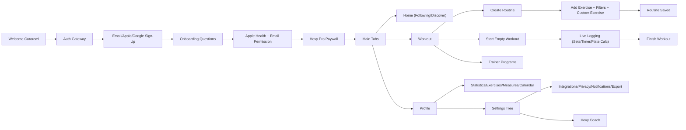
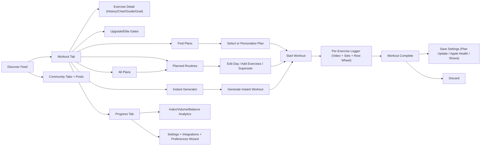
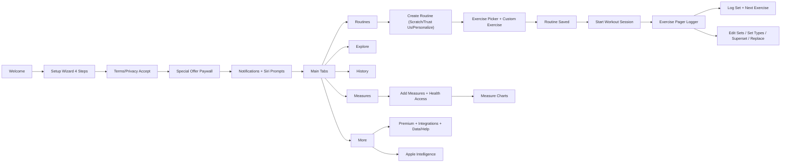
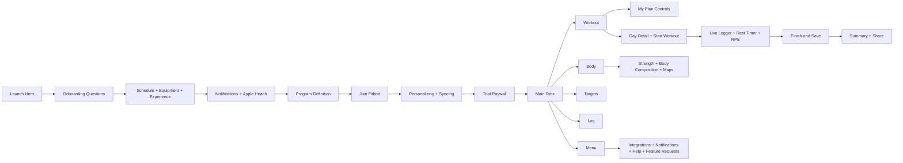
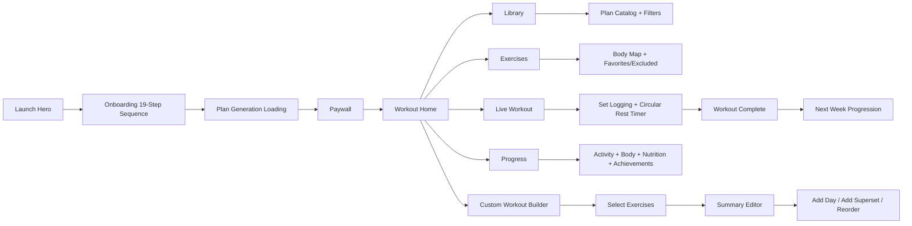
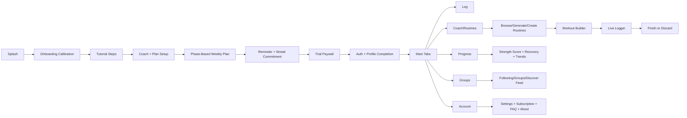

# Competitor UX Forensic Reverse Engineering

Generated: 2026-03-05
Workspace: `/Users/Apple/Documents/New project`

## Source Corpus Coverage

- `Hevy`: 118 screenshots analyzed.
- `JEFIT`: 125 screenshots analyzed.
- `SmartGym`: 60 screenshots analyzed.
- `Fitbod`: 169 screenshots analyzed.
- `GymVerse`: 82 screenshots analyzed.
- `Stronger`: 126 screenshots analyzed.
- `Onboarding Inspiration Source (non-fitness)`: 19 screenshots analyzed.

## Competitor Set Normalization

- Legacy competitor removed from active competitor set.
- `Stronger` retained as active competitor.
- All downstream sections and matrix columns normalized to: `Hevy`, `JEFIT`, `SmartGym`, `Fitbod`, `GymVerse`, `Stronger`.

---

# Hevy

## H-01. Full Navigation Map

1. `AuthCarousel` (3-slide landing) -> `AuthGateway`.
2. `AuthGateway` -> `SignupApple`, `SignupGoogle`, `SignupEmail`, `Login`.
3. `SignupEmail` -> validation and server error states.
4. `OnboardingFlow` -> profile questions and permissions.
5. `OnboardingFlow` -> `PaywallOnboarding` intercept.
6. `MainTabs` -> `Home`, `Workout`, `Profile`.
7. `Home` has mode switch -> `FollowingHome`, `DiscoverHome`.
8. `Workout` has mode switch -> `WorkoutRoot`, `TrainerRoot`.
9. `WorkoutRoot` -> `CreateRoutine`, `ExplorePrograms`, `StartEmptyWorkout`.
10. `ProfileRoot` -> dashboards and settings branches.
11. `Settings` -> Account, Workout, Privacy, Integrations, Notifications, Help, Export/Import.
12. `LiveWorkout` persistent mini-player appears at tab root while active session exists.
13. `HevyCoach` branch is reachable via settings and role-based flow.

## H-02. Complete Screen List (Unique IDs)

1. `H-S01` Welcome slide: workout logger preview.
2. `H-S02` Welcome slide: exercise analytics preview.
3. `H-S03` Welcome slide: community feed preview.
4. `H-S04` Auth CTA screen.
5. `H-S05` Email signup form.
6. `H-S06` Signup error state (`Email already exists`).
7. `H-S07` Onboarding: gender.
8. `H-S08` Onboarding: birthday.
9. `H-S09` Onboarding: weight.
10. `H-S10` Onboarding: height.
11. `H-S11` Onboarding: units.
12. `H-S12` Onboarding: top goal.
13. `H-S13` Onboarding: training experience.
14. `H-S14` Onboarding: guided vs self-built.
15. `H-S15` Onboarding: source attribution (`How did you hear about Hevy?`).
16. `H-S16` Apple Health permission pre-screen.
17. `H-S17` Email opt-in pre-screen.
18. `H-S18` Onboarding walkthrough slide: logging.
19. `H-S19` Onboarding walkthrough slide: progress.
20. `H-S20` Onboarding walkthrough slide: community.
21. `H-S21` Onboarding walkthrough slide: ready/get started.
22. `H-S22` Paywall landing cards (monthly/yearly/lifetime).
23. `H-S23` Paywall compare table (Free vs Pro).
24. `H-S24` Paywall FAQ + restore purchases.
25. `H-S25` Home following empty state with founder card.
26. `H-S26` Home following empty state without founder card.
27. `H-S27` Home mode dropdown.
28. `H-S28` Discover feed populated.
29. `H-S29` Workout root empty state.
30. `H-S30` Workout mode dropdown.
31. `H-S31` Trainer landing.
32. `H-S32` Program explore list.
33. `H-S33` Routine Help page 1.
34. `H-S34` Routine Help page 2.
35. `H-S35` Create Routine empty.
36. `H-S36` Add Exercise list.
37. `H-S37` Add Exercise search + keyboard.
38. `H-S38` Add Exercise filter sheet: muscle.
39. `H-S39` Add Exercise filter sheet: equipment.
40. `H-S40` Create Custom Exercise.
41. `H-S41` Add Exercise multi-select (`Add 7 exercises`).
42. `H-S42` Create Routine populated (top segment).
43. `H-S43` Create Routine populated (middle segment).
44. `H-S44` Create Routine populated (bottom segment).
45. `H-S45` Rest timer picker sheet in routine editor.
46. `H-S46` Notification permission warning modal.
47. `H-S47` Set row swipe-delete in routine editor.
48. `H-S48` Routine exercise overflow sheet.
49. `H-S49` Workout root with created routine card.
50. `H-S50` Routine card action sheet.
51. `H-S51` Live workout initial.
52. `H-S52` Live workout numeric entry.
53. `H-S53` Plate calculator sheet.
54. `H-S54` Manage equipment sheet for plate calculator.
55. `H-S55` Live workout rest timer controls active.
56. `H-S56` Live workout scrolled with timer rail.
57. `H-S57` Clock modal (`Timer`/`Stopwatch`).
58. `H-S58` Timer settings modal.
59. `H-S59` Exercise detail summary no data.
60. `H-S60` Exercise detail summary PR rows.
61. `H-S61` Exercise detail history empty.
62. `H-S62` Exercise detail how-to.
63. `H-S63` Exercise detail leaderboard empty.
64. `H-S64` Exercise overflow menu (`Weight Units`, `Duplicate`).
65. `H-S65` Share PR card composer.
66. `H-S66` Graph range picker (`Last 3 months`, `Year PRO`, `All time PRO`).
67. `H-S67` Superset selection sheet.
68. `H-S68` Replace exercise sheet.
69. `H-S69` Reorder full-screen.
70. `H-S70` Profile dashboard.
71. `H-S71` Statistics top section.
72. `H-S72` Statistics extended list.
73. `H-S73` Exercises library (profile branch).
74. `H-S74` Measurements graph.
75. `H-S75` Log measurements form.
76. `H-S76` Calendar month with streak/rest-day.
77. `H-S77` Edit profile.
78. `H-S78` Settings root top.
79. `H-S79` Account settings.
80. `H-S80` Settings root lower/help.
81. `H-S81` Manage subscription.
82. `H-S82` Push notifications top with OS warning.
83. `H-S83` Push notifications lower categories.
84. `H-S84` Workout settings top.
85. `H-S85` Workout settings lower.
86. `H-S86` Privacy & Social.
87. `H-S87` Units page.
88. `H-S88` Language page.
89. `H-S89` Theme page.
90. `H-S90` Theme action sheet.
91. `H-S91` Apple Health integration page.
92. `H-S92` Integrations page (`Strava`, `ChatGPT`).
93. `H-S93` Export & Import root.
94. `H-S94` Export Data page.
95. `H-S95` Import Data page (third-party CSV).
96. `H-S96` Getting started page 1.
97. `H-S97` Getting started page 2.
98. `H-S98` Getting started page 3.
99. `H-S99` FAQ list section A.
100. `H-S100` FAQ list section B.
101. `H-S101` FAQ list section C.
102. `H-S102` FAQ list section D.
103. `H-S103` FAQ list section E.
104. `H-S104` FAQ list section F.
105. `H-S105` Contact Us.
106. `H-S106` About page.
107. `H-S107` Hevy Coach role-selection.
108. `H-S108` Hevy Coach intro.
109. `H-S109` Hevy Coach feature section.
110. `H-S110` Hevy Coach pricing section.

## H-03. UX Flow Diagram

## H-04. Feature Inventory

1. Community feed with post interactions.
2. Discover feed with follow actions.
3. Routine creation and editing.
4. Routine notes and exercise notes.
5. Rest timer per exercise.
6. Reorder/replace/remove exercises.
7. Superset creation.
8. Add custom exercise.
9. Exercise filters by equipment and muscle.
10. Empty workout start.
11. Session logging with per-row completion.
12. Previous value display.
13. Plate calculator.
14. Manage bar/plate equipment profiles.
15. Clock modal timer/stopwatch.
16. Graph metrics (weight/1RM/volume/reps variants).
17. Exercise history/how-to/leaderboard tabs.
18. PR share card generation.
19. Statistics dashboard with body maps.
20. Calendar with streaks and rest day metrics.
21. Measurements tracking with extensive fields.
22. CSV export workouts.
23. CSV export measurements.
24. Import third-party workout CSV.
25. Apple Health integration.
26. Strava integration.
27. ChatGPT integration.
28. Theme, language, and unit controls.
29. Privacy controls and visibility defaults.
30. Rich notification category controls.
31. Subscription management with restore.
32. FAQ/help/contact.
33. Hevy Coach entry flow.

## H-05. Hidden Features

1. ChatGPT integration in first-party integrations page.
2. One-time third-party CSV import with explicit limitations.
3. Warm-up set counting policy in stats.
4. Previous values strategy toggle (`Any workout` vs `Same routine`).
5. Smart superset auto-scrolling toggle.
6. Inline timer for duration exercises.
7. Live PR notifications toggle.
8. Per-exercise unit override menu.
9. Notification warning can be permanently dismissed.
10. Hevy Coach branch with trainer-client workflow messaging.

## H-06. Premium Features

1. Hevy Trainer access.
2. Unlimited routines.
3. Unlimited custom exercises.
4. Full measurement tracking.
5. Unlimited graph history.
6. Advanced statistics modules.
7. Year and all-time range unlocks.
8. Warm-up calculator.
9. Program and trainer content unlock.
10. Plans shown: Monthly `$2.99`, Yearly `$23.99`, Lifetime `$74.99`.

## H-07. Paywall Mechanics

1. Onboarding intercept paywall with skip path.
2. Three-tier plan cards and yearly emphasis.
3. Social proof sections and reviews.
4. Free-vs-Pro comparison table embedded.
5. FAQ accordion and legal links inside paywall.
6. Restore purchases exposed on paywall.
7. Separate manage-subscription screen mirrors offers.
8. Additional in-product PRO locks and unlock buttons.

## H-08. Workout Logging UX

1. Entry from routine or empty workout.
2. Session header exposes duration/volume/sets.
3. Exercise block has set table and notes.
4. Completion checkboxes per set.
5. Swipe-delete set rows.
6. Exercise overflow actions.
7. Numeric keyboard set entry.
8. Rest timer lifecycle with +/- and skip controls.
9. Plate calculator integrated at point-of-entry.
10. Bottom mini-player persists across tabs during active workout.
11. Finish action leads to save/discard decisions.

## H-09. Routine System

1. Create from workout root.
2. Add metadata (title/notes/goal context).
3. Add from exercise library.
4. Create custom exercises inline.
5. Set reps/weights templates.
6. Set rest timer templates.
7. Reorder by drag.
8. Replace/remove by actions.
9. Add supersets.
10. Save and start routine from card.
11. Card-level actions: share, duplicate, edit, delete.

## H-10. Analytics System

1. Profile dashboard view.
2. Exercise-level PR and graph analytics.
3. Statistics with body map and muscle distributions.
4. Main exercise frequency tracking.
5. Leaderboard-eligible exercise list.
6. Monthly report module.
7. Calendar-based training history.
8. Measurement history and charts.

## H-11. Community Features

1. Following feed.
2. Discover feed.
3. Like/comment interactions.
4. Follow athletes.
5. Invite friend from exercise leaderboard context.
6. Discover athletes and contact-connect onboarding CTAs.
7. Workout visibility controls.

## H-12. Integrations

1. Apple Health.
2. Strava.
3. ChatGPT.
4. Instagram stories sharing from PR card.
5. Third-party CSV import path.
6. Apple Watch and Live Activities surfaced in FAQ/support content.

---

# JEFIT

## J-01. Full Navigation Map

1. Main tabs: `Discover`, `Workout`, `Progress`.
2. Workout subtabs: `Find`, `Planned`, `Instant`.
3. `Find` routes into category programs and all-plans inventory.
4. `Planned` routes into day editor and day-details runtime launch.
5. `Instant` routes into generated ad-hoc workout editor/launch.
6. In-session runtime is exercise-first with media header and timer wheel.
7. End-of-workout routes into save/discard summary page.
8. `Progress` routes into analytics + account settings.
9. Settings route into privacy, preferences, integrations, referral, support.

## J-02. Complete Screen List (Unique IDs)

1. `J-S01` Discover feed with challenge hero.
2. `J-S02` Workout `Find` root.
3. `J-S03` Category drill-down list.
4. `J-S04` Instant workout list (45-min upper body).
5. `J-S05` Instant generator sheet top.
6. `J-S06` Instant generator sheet with custom session length wheel.
7. `J-S07` Instant generator lower-body target selection.
8. `J-S08` Instant generated list (60-min lower body) top.
9. `J-S09` Instant generated list scrolled.
10. `J-S10` Instant start-from-scratch warning modal.
11. `J-S11` Instant save-plan action sheet.
12. `J-S12` All Plans list with current/selection cards.
13. `J-S13` Planned root empty plan state.
14. `J-S14` All Plans scrolled (plan-limit note).
15. `J-S15` Day action sheet.
16. `J-S16` Edit day empty.
17. `J-S17` Delete routine confirmation.
18. `J-S18` Add day modal.
19. `J-S19` Change day picker sheet.
20. `J-S20` Planned overview populated (multi-day).
21. `J-S21` Planned day details top.
22. `J-S22` Planned day details scrolled.
23. `J-S23` Autoplay promo card overlay.
24. `J-S24` Day details action-row state.
25. `J-S25` Add exercises list popular sort.
26. `J-S26` Add exercises list A-Z sort.
27. `J-S27` Filter sheet muscle.
28. `J-S28` Filter sheet equipment.
29. `J-S29` Filter sheet type.
30. `J-S30` Create custom exercise top.
31. `J-S31` Create custom exercise extended.
32. `J-S32` Add exercises custom-only state.
33. `J-S33` Day details with inserted block and action icons.
34. `J-S34` Edit day detailed set editor top.
35. `J-S35` Day details swipe action state.
36. `J-S36` Edit day detailed set editor middle.
37. `J-S37` Edit day detailed set editor lower.
38. `J-S38` Exercise detail history tab.
39. `J-S39` Exercise detail guide tab top.
40. `J-S40` Exercise detail guide tab scrolled.
41. `J-S41` Exercise detail chart tab.
42. `J-S42` Exercise full media header state.
43. `J-S43` In-exercise set logger with keyboard.
44. `J-S44` Enter custom 1RM modal.
45. `J-S45` Add note editor.
46. `J-S46` Invite and get free Elite modal.
47. `J-S47` In-exercise timer wheel idle.
48. `J-S48` In-exercise rest timer running.
49. `J-S49` In-exercise rest timer adjusted.
50. `J-S50` Rest timer picker sheet.
51. `J-S51` In-exercise timeout state.
52. `J-S52` Swap sheet.
53. `J-S53` 1RM calculator lock upsell.
54. `J-S54` 1RM calculator unlocked.
55. `J-S55` Dumbbell per-DB logging state.
56. `J-S56` Barbell decline logging state.
57. `J-S57` Cable cross-over logging state.
58. `J-S58` Skull crushers logging state.
59. `J-S59` Machine fly logging state.
60. `J-S60` Workout complete summary.
61. `J-S61` Workout complete with save toggles expanded.
62. `J-S62` Discard workout confirmation.
63. `J-S63` BodyMap summary sheet.
64. `J-S64` BodyMap chest subgroup (lower).
65. `J-S65` BodyMap chest subgroup (inner).
66. `J-S66` BodyMap chest subgroup (upper).
67. `J-S67` BodyMap chest subgroup (outer).
68. `J-S68` BodyMap triceps subgroup (medial).
69. `J-S69` BodyMap triceps subgroup (lateral).
70. `J-S70` BodyMap tooltip.
71. `J-S71` Progress overview top.
72. `J-S72` Progress index details.
73. `J-S73` Strength sample screen.
74. `J-S74` Stimulus volume sample screen.
75. `J-S75` Movement balance sample screen.
76. `J-S76` Movement pattern chart continuation.
77. `J-S77` Insights unlock overlay.
78. `J-S78` Time range sheet.
79. `J-S79` Total volume chart.
80. `J-S80` Workout time compare sample (locked).
81. `J-S81` Workout time chart standard.
82. `J-S82` Progress overview extended calendar/streak/sessions.
83. `J-S83` Streak leaderboard.
84. `J-S84` Muscle breakdown donut.
85. `J-S85` Progress overview with goals/assessment/achievements.
86. `J-S86` Settings root account/preferences.
87. `J-S87` Syncing data overlay.
88. `J-S88` Training preference wizard: goal.
89. `J-S89` Training preference wizard: level.
90. `J-S90` Training preference wizard: frequency.
91. `J-S91` Training preference wizard: duration.
92. `J-S92` Training preference wizard: equipment.
93. `J-S93` Training preference wizard: target zones.
94. `J-S94` Training preference adaptation loading.
95. `J-S95` Privacy settings page.
96. `J-S96` Privacy visibility picker sheet.
97. `J-S97` Refer & get free Elite (light page).
98. `J-S98` Unit picker sheet.
99. `J-S99` Appearance settings.
100. `J-S100` Workout settings top.
101. `J-S101` Workout settings bottom.
102. `J-S102` Connected apps + support + version page.
103. `J-S103` Splash icon.
104. `J-S104` Splash logo overlay.
105. `J-S105` Light theme planned detail variant.
106. `J-S106` Light theme logger variant.
107. `J-S107` Light theme workout complete variant.

## J-03. UX Flow Diagram

## J-04. Feature Inventory

1. Plan discovery by category.
2. Instant workout generation.
3. Planned day-by-day programming.
4. Day-level copy/delete/change-day operations.
5. Exercise database with filters.
6. Custom exercise creation.
7. Detailed set programming in planner.
8. Superset and interval fields in planner.
9. Autoplay mode education card.
10. Start workout from day details.
11. Video-guided in-workout logging.
12. Per-dumbbell weight logging.
13. Rest timer wheel with controls.
14. Exercise swap and superset in runtime.
15. 1RM and goal setting.
16. Notes and note history.
17. BodyMap focus and subgroup details.
18. Progress index/strength/stimulus/movement analytics.
19. Total volume and workout-time charts.
20. Calendar/streak analytics.
21. Achievement and points system.
22. Assessment and goal modules.
23. Referral and elite incentives.
24. Privacy visibility granularity.
25. Training preference wizard.
26. Connected apps and support hub.

## J-05. Hidden Features

1. Refine Training History tool.
2. Detailed “About Reps” algorithm explanation.
3. Compare-with-user analytics mode.
4. Day row action includes link action in addition to edit/delete.
5. Coaches entry for personalized tips.
6. In-session HD video toggle.
7. BodyMap tooltip explanation modal.
8. Save workout option can update plan baselines.

## J-06. Premium Features

1. Elite plans and locked plan cards.
2. Locked insights dashboards.
3. Compare results lock (`Go Elite to Unlock Results`).
4. Extended analytic windows with bolt-marked ranges.
5. 1RM calculator premium-lock moments.
6. BodyMap advanced details with elite prompts.

## J-07. Paywall Mechanics

1. Distributed contextual paywall triggers.
2. Upgrade banners inside workout/discovery/progress surfaces.
3. Locked overlays in analytics and calculators.
4. Referral mechanism tied to free elite rewards.
5. No single mandatory checkout screen captured in this corpus.

## J-08. Workout Logging UX

1. Plan day -> exercise logger transition.
2. Logger includes media header and set grid.
3. Rest wheel auto-starts post set logging.
4. Adjustable timer and skip behavior.
5. Timeout state explicitly rendered.
6. In-session exercise swap and supersets.
7. Workout complete summary includes save policy toggles.
8. Discard path has explicit confirmation.

## J-09. Routine System

1. Plan selection from all-plans catalog.
2. Weekly structure in planned tab.
3. Day create/copy/rename/reassign.
4. Day contains ordered exercise stacks.
5. Per-exercise set schema in day editor.
6. Per-exercise interval defaults.
7. Add exercises via massive filtered list.
8. Add custom exercises.
9. Start workout from day details.
10. Save generated instant plan into plan library.

## J-10. Analytics System

1. Progress index.
2. Strength model.
3. Stimulus volume model.
4. Movement balance model.
5. Total volume chart.
6. Total workout-time chart.
7. BodyMap summary and subgroups.
8. Muscle breakdown donut.
9. Calendar and streak stats.
10. Streak leaderboard.
11. Achievements and goals.

## J-11. Community Features

1. Discover feed.
2. Community channels (`My Circle`, `Popular`, `Q&A`, `Blog`, `Meal Plan`).
3. Post cards with training summaries.
4. Public/private indicators.
5. Friend/invite flows linked to social and referral loops.

## J-12. Integrations

1. Apple Health.
2. Apple Watch.
3. Strava.
4. Referral links and sharing.

---

# SmartGym

## S-01. Full Navigation Map

1. Welcome -> setup wizard.
2. Setup -> terms/privacy acceptance.
3. Setup -> special offer paywall.
4. Setup -> notifications + Siri prompts.
5. Main tabs: `Routines`, `Explore`, `History`, `Measures`, `More`.
6. `Routines` -> create/manage/start routines.
7. `Explore` -> smart trainer and pre-made workouts.
8. `History` -> chart/calendar history.
9. `Measures` -> add measures and view measure charts.
10. `More` -> premium, settings, integrations, data management, help.

## S-02. Complete Screen List (Unique IDs)

1. `S-S01` Welcome landing.
2. `S-S02` Setup step 1 experience.
3. `S-S03` Setup step 2 equipment.
4. `S-S04` Setup step 3 goal.
5. `S-S05` Setup step 4 days/duration.
6. `S-S06` Terms/privacy acceptance.
7. `S-S07` Special offer paywall top.
8. `S-S08` Special offer paywall mid (Loved by Apple).
9. `S-S09` Special offer paywall lower (PT switch, restore).
10. `S-S10` Quit setup modal.
11. `S-S11` Notifications pre-permission.
12. `S-S12` Siri pre-permission.
13. `S-S13` Routines empty state.
14. `S-S14` Add routine method sheet.
15. `S-S15` Routine editor empty.
16. `S-S16` Exercises browser with premium toggle.
17. `S-S17` Custom exercise editor.
18. `S-S18` Exercises selected-state.
19. `S-S19` Routine editor populated.
20. `S-S20` Routine detail with Siri prompt.
21. `S-S21` Siri permission system dialog.
22. `S-S22` Siri phrase recording page.
23. `S-S23` Routine row swipe actions.
24. `S-S24` Routines non-empty home.
25. `S-S25` Explore screen.
26. `S-S26` History chart mode empty.
27. `S-S27` History calendar mode empty.
28. `S-S28` Measures empty state.
29. `S-S29` Health Access sheet.
30. `S-S30` Add measure form top.
31. `S-S31` Add measure form circumferences.
32. `S-S32` Add measure form skinfold.
33. `S-S33` Measures populated list/date view.
34. `S-S34` All charts page.
35. `S-S35` More tab top with inline trial card.
36. `S-S36` More tab settings section A.
37. `S-S37` More tab settings section B.
38. `S-S38` More tab Apple Watch/connected/share.
39. `S-S39` More tab app-store/help/about.
40. `S-S40` Save-workout option modal.
41. `S-S41` Apple Intelligence help page top.
42. `S-S42` Apple Intelligence help page insights section.
43. `S-S43` Apple Intelligence help page import-from-text section.
44. `S-S44` Apple Intelligence help page AI personality section.
45. `S-S45` Premium features list page 1.
46. `S-S46` Premium features list page 2.
47. `S-S47` Active workout page (exercise 1 of 3).
48. `S-S48` Active workout edit mode with keyboard.
49. `S-S49` Active workout multi-set editing state.
50. `S-S50` Set-type info sheet.
51. `S-S51` Drop-set tagged state.
52. `S-S52` Warm-up tagged state.
53. `S-S53` Sets-done panel state.
54. `S-S54` Exercise overflow menu.
55. `S-S55` Replace/alternate exercise sheet.
56. `S-S56` Active workout page (exercise 2 of 3).

## S-03. UX Flow Diagram

## S-04. Feature Inventory

1. 4-step personalization setup.
2. Equipment-aware training profile.
3. Goal-aware plan profile.
4. Duration/day scheduling profile.
5. Routine creation modes (`Scratch`, `Trust us`, `Personalize`).
6. Exercise catalog with premium toggle.
7. Custom exercise creation.
8. In-routine swipe actions.
9. Superset with next exercise.
10. Replace exercise this workout vs permanently.
11. Pager-style workout execution.
12. Set logging with quick next progression.
13. In-session editing and add/remove set.
14. Set type taxonomy (regular/warm-up/drop).
15. HIIT duration toggle.
16. Apply set changes to all sets.
17. Default-value update choice from logged sessions.
18. Measures logging extensive fields.
19. Measures chart drilldown.
20. History chart and calendar modes.
21. Apple Watch support pages.
22. Siri Shortcuts integration.
23. Notifications and alarms settings.
24. Export data and erase data controls.
25. Apple Intelligence toggle and docs.
26. Personal trainer account mode.
27. Premium features and trial surfaces.

## S-05. Hidden Features

1. Apple Intelligence requirements gate (`iOS 26+`, app version, Premium+).
2. Import-from-text routine conversion capability.
3. AI personality modes for coaching tone.
4. Save-workout conflict resolution policy modal.
5. Routine replacement permanence split.
6. Equipment-list concept (up to 5 sets) in premium docs.
7. Siri commands for full session lifecycle.

## S-06. Premium Features

1. Smart Trainer personalization depth.
2. 130+ pro-made workouts.
3. 700+ exercises.
4. Standalone Apple Watch app.
5. Custom goals.
6. Equipment lists.
7. Weight personalization.
8. Unlimited routines.
9. Unlimited histories.
10. Unlimited measures.
11. Charts.
12. Heart-rate zones.
13. Live Activities.
14. Cloud sync.
15. Awards.
16. Daily motivational quotes.
17. Monthly summary insights.
18. iPad sync.
19. Lock screen widgets.
20. Routine sharing.

## S-07. Paywall Mechanics

1. Onboarding paywall with long-form scroll narrative.
2. Persistent trial CTA.
3. Quit intercept modal before exiting setup.
4. Restore purchases in paywall body.
5. PT-mode upsell branch.
6. Inline paywall card in `More` tab after setup.
7. Lock indicators in exercise list and feature cards.
8. Pricing shown: `$59.99/year`, displayed as `$5/month billed yearly` and `7-day trial`.

## S-08. Workout Logging UX

1. Runtime is one-exercise-at-a-time pager.
2. Main CTA can log and advance to next exercise.
3. In-place edit mode with numeric keypad.
4. Set row operations and ordering.
5. Rest and HIIT toggles in set editor.
6. Warm-up/drop-set tagging.
7. Superset and replacement actions from overflow.
8. Session timer bar with pause/cancel.
9. “Log different sets” avoids overwriting routine values.
10. “Make these default values” can propagate edits back to routine defaults.

## S-09. Routine System

1. Create routine from routines root.
2. Define name/goal/renewal/notes.
3. Add exercises from filtered list.
4. Add custom exercises.
5. Reorder exercises.
6. Swipe for replace/superset/remove.
7. Save routine and start session.
8. Archive routines from settings.

## S-10. Analytics System

1. History charts mode.
2. History calendar mode.
3. Measures trend cards.
4. All charts multi-metric drilldown.
5. Date-indexed measure timeline.
6. Premium docs mention monthly summaries and heart-rate zones.

## S-11. Community Features

1. No first-party social feed, comments, likes, or athlete graph surfaced in provided captures.
2. Share features are app/story and routine-share oriented.

## S-12. Integrations

1. Apple Health.
2. Apple Watch.
3. Siri Shortcuts.
4. Strava.
5. Workouts-from-other-apps connector entry.
6. Apple Intelligence.
7. Cloud sync and iPad sync positioning.

---

# Fitbod

## F-01. Full Navigation Map

1. `Launch` -> `Train Smarter Live Better` hero (`Start`, `Log In`).
2. `Start` -> `Onboarding Questionnaire` branch.
3. `Onboarding Questionnaire` -> goal, consistency, experience, gym location, equipment, schedule.
4. `Onboarding Questionnaire` -> `Workout Preview Notification Pre-Prompt`.
5. `Onboarding Questionnaire` -> `Apple Health Sync or Manual Data Entry`.
6. `Onboarding Questionnaire` -> `Program Definition` (split, focus muscles, difficulty, duration).
7. `Program Definition` -> `Join Fitbod` (`Apple`, `Google`, `Email`, existing login).
8. `Join Fitbod` -> `Personalizing Experience` / `Syncing Data` intermediates.
9. `Join Fitbod` -> `Trial Paywall` -> App Store purchase sheet or web checkout path.
10. `Main Tabs` -> `Workout`, `Body`, `Targets`, `Log`.
11. `Workout` -> `My Plan` sheet -> goal/equipment/profile/recommendation controls.
12. `Workout` -> `Day Detail` -> `Live Logger` -> `Finish and Save`.
13. `Workout` -> `Exercise Detail` tabs (`Overview`, `Performance`, `How To`).
14. `Body` -> strength and composition dashboards -> body maps and weekly target radar.
15. `Log` -> workout history list and per-session replay.
16. `Hamburger Menu` -> notifications, app icon, account, subscription, integrations, help center, feature requests.
17. `Integrations` -> Apple Health, Fitbit, Siri, Alexa, Strava-on-save toggle, iOS Flex billing info.

## F-02. Complete Screen List (Unique IDs)

1. `F-S01` Launch hero (`Train Smarter. Live Better.`).
2. `F-S02` Onboarding goal question.
3. `F-S03` Onboarding strength consistency question.
4. `F-S04` Onboarding training experience.
5. `F-S05` Onboarding workout location.
6. `F-S06` Onboarding gym picker list.
7. `F-S07` Onboarding equipment multi-select.
8. `F-S08` Onboarding equipment selected state.
9. `F-S09` Onboarding calibration prompt (`You seem like an experienced lifter`).
10. `F-S10` Calibration best-lift entry list.
11. `F-S11` Weekly schedule selector (`Days per week`).
12. `F-S12` Weekly schedule selector (`Specific days`).
13. `F-S13` Workout preview notification pre-screen.
14. `F-S14` iOS notification system card overlay.
15. `F-S15` Apple Health sync screen with manual fallback.
16. `F-S16` Manual demographic entry form.
17. `F-S17` Referral source question (`How did you hear about Fitbod?`).
18. `F-S18` Program summary (`Build muscle` with plan factors).
19. `F-S19` Join Fitbod social sign-up screen.
20. `F-S20` Join Fitbod email form.
21. `F-S21` Personalizing experience loading screen.
22. `F-S22` Syncing data loading screen.
23. `F-S23` Trial paywall main screen (yearly/monthly toggle).
24. `F-S24` App Store subscription purchase sheet (`A Year of Fitbod Elite`).
25. `F-S25` Workout tab day card (`Push Day`) with swap coachmark.
26. `F-S26` My Plan sheet with goal and training format blocks.
27. `F-S27` My Gym equipment profile list.
28. `F-S28` Strength training experience picker.
29. `F-S29` Routine flexibility picker.
30. `F-S30` Travel mode toggle.
31. `F-S31` Goal picker list.
32. `F-S32` Focus exercises picker.
33. `F-S33` Browsing recommendations toggles.
34. `F-S34` Manage exercises list.
35. `F-S35` Manage exercises add sheet.
36. `F-S36` Day exercise list with `Start Workout` CTA.
37. `F-S37` Exercise detail overview tab.
38. `F-S38` Exercise detail instructions tab.
39. `F-S39` Exercise detail performance chart tab.
40. `F-S40` Exercise detail history tab.
41. `F-S41` Exercise options overflow sheet.
42. `F-S42` Live logger initial set table.
43. `F-S43` Live logger with keyboard set edit.
44. `F-S44` Live logger with timer sheet (`Rest 0:43`).
45. `F-S45` Live logger with set action sheet (remove set).
46. `F-S46` Remove set confirmation modal.
47. `F-S47` Auto-max recommendation prompt.
48. `F-S48` Effort capture row (`How hard was this set?`).
49. `F-S49` In-session elapsed timer docked state.
50. `F-S50` Finish workout sheet with save toggles.
51. `F-S51` Save processing overlay.
52. `F-S52` Saved workout summary list.
53. `F-S53` Share workout card composer.
54. `F-S54` Reward card (`free workout` claim).
55. `F-S55` Guest pass modal (`14-day`).
56. `F-S56` Streak unlock modal.
57. `F-S57` Body tab overview with calendar and past workouts.
58. `F-S58` Body tab strength and focus exercise cards.
59. `F-S59` Body composition screen with upload CTA.
60. `F-S60` Body map front with recent exercise history.
61. `F-S61` Body map back.
62. `F-S62` Weekly set targets radar card.
63. `F-S63` Weekly set targets detailed list.
64. `F-S64` App icon customization grid.
65. `F-S65` Change email form.
66. `F-S66` Account verification screen.
67. `F-S67` Password reset screen.
68. `F-S68` Subscription and account management page.
69. `F-S69` Workout report date-range modal.
70. `F-S70` iOS Flex entry screen.
71. `F-S71` Apple Health integration settings toggles.
72. `F-S72` Fitbit integration page.
73. `F-S73` Siri integration page.
74. `F-S74` Alexa integration page.
75. `F-S75` Notifications settings.
76. `F-S76` Help center article index.
77. `F-S77` Feature requests board trending list.
78. `F-S78` App settings page with lock-screen and health data controls.

## F-03. UX Flow Diagram

## F-04. Feature Inventory

1. Adaptive onboarding questionnaire with profile calibration.
2. Equipment-aware gym profile modeling.
3. Weekly schedule commitment capture.
4. Notification preview pre-prompt before OS dialog.
5. Apple Health sync + manual data fallback.
6. Program synthesis from onboarding constraints.
7. Multi-provider authentication.
8. Trial paywall with annual/monthly option.
9. App Store purchase handoff.
10. Workout day list with swap entry point.
11. `My Plan` control panel for goals and constraints.
12. Exercise recommendation controls.
13. Manage exercise include/exclude controls.
14. Day-level exercise list with focus labels.
15. Rich exercise detail tabs (overview/performance/history/how-to).
16. In-session set table logging.
17. Keyboard-based set editing.
18. Rest timer with pause and quick adjustments.
19. Set-level action sheet (remove/edit behavior).
20. Auto max-weight recommendation prompts.
21. Effort feedback (`How hard was this set?`).
22. Finish-save flow with destination toggles.
23. Post-workout summary and share composer.
24. Reward and guest-pass surfaces.
25. Streak-specific upsell and progression cards.
26. Body dashboard with workout and calendar snapshots.
27. Body composition and progress image capture CTA.
28. Front/back body maps with recent-exercise traces.
29. Weekly set target radar.
30. App icon customization.
31. Account management (email, password, verification).
32. Subscription management and billing policy surface.
33. Date-range workout report modal.
34. Apple Health integration controls.
35. Fitbit integration.
36. Siri integration.
37. Alexa integration.
38. Notification category controls.
39. Embedded help center knowledge base.
40. Embedded feature-request board with voting and statuses.

## F-05. Hidden Features

1. Feature-request board is first-class in-app surface with vote counts and status tags (`Planned`, `Considering`).
2. Public API appears as a user-voted request category, exposing integration demand telemetry.
3. Trial checkout supports both App Store flow and web checkout fallback.
4. `Save workout progress if phone dies` appears as requested resilience pattern from production users.
5. App settings include lock-screen quick log capability.
6. Apple Health settings allow bidirectional sync toggles and recovery-state impact toggle.
7. Feature board exposes high-demand roadmap themes (rest timers, live heart rate, structured plans).
8. iOS Flex (FSA/HSA) billing support is present in account support taxonomy.
9. Cross-platform account transfer guidance appears in support taxonomy.
10. Marketing communications are partitioned under notification settings.
11. Workout report modal supports historical date-window comparisons.
12. Guest-pass mechanics are positioned as post-workout virality trigger.

## F-06. Premium Features

1. Personalized workout plan generation.
2. 2000+ guided exercise videos (paywall claim).
3. Progress tracking depth and PR improvements.
4. Muscle targeting optimization.
5. Advanced recommendation controls in `My Plan`.
6. Streak and progression unlock surfaces tied to trial prompts.
7. Full integration set bundled into paid experience messaging.
8. Yearly plan highlighted as default plan card.
9. 7-day free trial with annual billing path.
10. Pricing shown in captures: `then $95.99/year ($8.00/month)`.

## F-07. Paywall Mechanics

1. Paywall appears after full personalization and account join.
2. Annual plan is visually emphasized as default.
3. Monthly option is available via segmented control.
4. Trial reminder toggle (`Remind me before my trial ends`).
5. Primary CTA triggers external purchase handoff.
6. Explicit legal links (`Privacy`, `Terms`) are in paywall body.
7. `Continue with App Store` fallback is present below primary CTA.
8. In-product streak/reward screens function as secondary upsell points.
9. Help center includes billing and trial FAQ for post-paywall recovery.
10. Subscription management exists in account settings with renewal visibility.

## F-08. Workout Logging UX

1. Day starts from plan card with session duration context.
2. Live logger shows set rows with previous and target values.
3. Numeric keypad is contextually docked to active input.
4. Rest timer opens as bottom sheet and updates in-session state.
5. Per-set completion checkmarks are immediate and persistent.
6. Action sheet allows set-level delete and adjustments.
7. Recommendation prompts appear immediately after sets.
8. Session timer persists while navigating exercise rows.
9. Finish flow requests destination/save policy before persist.
10. Save path includes external sync toggles.
11. Post-save summary opens share and referral hooks.
12. Recovery path exists through discard/cancel modals.

## F-09. Routine System

1. Plan template generated from onboarding.
2. Goal, split, exercise variability, and focus controls can mutate plan.
3. Equipment profile constrains exercise recommendation set.
4. Add exercise from library to day-level list.
5. Swap action replaces exercise in plan session context.
6. Manage exercises screen allows recommendation inclusion/exclusion.
7. Day details keep set and rep templates per exercise.
8. Progression logic surfaces recommended max and target reps.
9. Start workout from any plan day card.
10. Workout history can replay days and reload structures.
11. Support docs define normalization rules for superset and circuit weights.
12. Saved sessions can be reused as baseline for future progression.

## F-10. Analytics System

1. Strength overview on body dashboard.
2. Body composition module with upload CTA.
3. Front/back body maps with targeted regions.
4. Weekly set target radar and per-muscle completion.
5. Exercise detail performance curves.
6. Exercise-level history lists.
7. Recent PR and milestone surfacing.
8. Calendar-backed workout history.
9. Date-range workout report modal.
10. Streak and consistency widgets tied to goals.

## F-11. Community Features

1. No first-party social feed is shown in captured Fitbod app surfaces.
2. Viral distribution is implemented via guest-pass and referral modals.
3. Feature request board acts as community feedback channel.
4. Vote counts and comment counts expose collective demand signals.
5. Share-card export from workout summary supports off-platform distribution.

## F-12. Integrations

1. Apple Health with granular sync-direction toggles.
2. Fitbit connection path.
3. Siri connection path.
4. Alexa connection path.
5. Strava sync toggle in finish-workout flow.
6. Lock-screen quick-log entry support in settings.
7. iOS Flex billing support (FSA/HSA policy visibility).

---

# GymVerse

## G-01. Full Navigation Map

1. `Launch` -> onboarding entry with `Start` CTA.
2. Onboarding -> demographic and goal branch.
3. Onboarding -> challenge and availability branch.
4. Onboarding -> location, equipment, schedule, and duration branch.
5. Onboarding -> body metrics and nutrition target calibration.
6. Onboarding -> attribution and notifications pre-prompt.
7. Onboarding -> multi-stage plan generation loading.
8. Onboarding -> paywall (`Yearly`, `Monthly`, promo code).
9. Post-paywall -> `Workout` home with `Start Workout`.
10. Main tabs -> `Workout`, `Exercises`, `Library`, `Progress`, `Settings`.
11. `Library` -> plan catalog and filtered workout cards.
12. `Exercises` -> body map plus favorites/excluded partition.
13. `Workout` -> live logger with circular rest timer.
14. `Workout` -> workout completion and next-week progression cards.
15. `Progress` -> `Activity` and `Body` splits.
16. `Workout` -> custom workout builder and summary editor.
17. `Workout` -> custom routine editor with add-exercise, superset, and add-day actions.

## G-02. Complete Screen List (Unique IDs)

1. `G-S01` Launch video hero.
2. `G-S02` Onboarding gender screen.
3. `G-S03` Onboarding top goal screen.
4. `G-S04` Onboarding challenge-at-the-gym screen.
5. `G-S05` Challenge confidence screen.
6. `G-S06` Training availability screen.
7. `G-S07` Workout location screen.
8. `G-S08` Equipment checklist.
9. `G-S09` Workouts-per-week selector.
10. `G-S10` Workout-duration selector.
11. `G-S11` Body type selector.
12. `G-S12` Age wheel.
13. `G-S13` Height wheel.
14. `G-S14` Weight wheel.
15. `G-S15` Nutrition target output screen.
16. `G-S16` First workout day naming screen.
17. `G-S17` Social proof growth screen (`5.7x`).
18. `G-S18` Notification reminder pre-screen.
19. `G-S19` Feedback attribution screen.
20. `G-S20` Plan loading stage 1 (`Building your plan`).
21. `G-S21` Plan loading stage 2 (`Created by coaches`).
22. `G-S22` Plan loading stage 3 (`Plan continues to adapt`).
23. `G-S23` Paywall with yearly/monthly and promo code.
24. `G-S24` 7-day free pass card.
25. `G-S25` Workout home with `My Plan` and `Start Workout`.
26. `G-S26` Referral spread-the-word screen.
27. `G-S27` Library list with equipment/muscle/time chips.
28. `G-S28` Library variant by split labels.
29. `G-S29` Muscle map customization modal.
30. `G-S30` Exercises tab body model.
31. `G-S31` Exercise catalog card grid.
32. `G-S32` Smart weight suggestions screen.
33. `G-S33` Exercise detail overview tab.
34. `G-S34` Exercise detail performance tab.
35. `G-S35` Exercise detail guides tab.
36. `G-S36` Performance trend chart with history rows.
37. `G-S37` Favorites/excluded empty state.
38. `G-S38` Favorites/excluded selected state.
39. `G-S39` Warmup video full-screen player.
40. `G-S40` Warmup completion confirmation.
41. `G-S41` Live logger exercise 1 of 5.
42. `G-S42` Live logger with keyboard entry.
43. `G-S43` Live logger circular rest timer running.
44. `G-S44` Rest timer adjustment bottom sheet.
45. `G-S45` Reps-left optimization prompt.
46. `G-S46` Live logger exercise 2 of 5.
47. `G-S47` Workout complete hero (`Great Job`).
48. `G-S48` Workout complete details with muscles worked.
49. `G-S49` Next week progression card.
50. `G-S50` Progress activity summary and calendar.
51. `G-S51` Progress body measurements card.
52. `G-S52` Nutrition card (`Calories`, `Protein`).
53. `G-S53` Before/after upload card.
54. `G-S54` Achievements card.
55. `G-S55` Exercise graphs card.
56. `G-S56` Custom workout empty state.
57. `G-S57` Custom workout list state.
58. `G-S58` Custom workout details with start CTA.
59. `G-S59` Custom workout exercise grid selector.
60. `G-S60` Summary set-rep editor.
61. `G-S61` Summary editor adjusted reps.
62. `G-S62` Custom workout editor with add controls.
63. `G-S63` Custom workout editor reorder state.
64. `G-S64` Day detail start-workout bottom sheet.
65. `G-S65` Selected-exercise add-all summary state.
66. `G-S66` Premium crown locked indicator on core tabs.
67. `G-S67` Gift and referral entry icons in top nav.

## G-03. UX Flow Diagram

## G-04. Feature Inventory

1. 19-step onboarding sequence with high personalization density.
2. Body model configuration by muscle emphasis.
3. Equipment-aware plan adaptation.
4. Schedule and workout-duration targeting.
5. Nutrition target initialization from onboarding data.
6. Notification-value pre-prompt before OS permission.
7. Multi-stage loading narrative to reduce wait drop-off.
8. Paywall with yearly/monthly plans.
9. Promo code input in checkout surface.
10. 7-day free-pass upsell variant.
11. Workout tab with plan card and quick start.
12. Referral invitation screen.
13. Library chip filters by equipment, muscle, and duration.
14. Exercises tab with body model and category navigation.
15. Favorites/excluded exercise partition.
16. Smart weight suggestion module.
17. Exercise detail tabs for overview/performance/guides.
18. Exercise performance chart with historical progression rows.
19. Warmup video with explicit completion gate.
20. Live set logger with suggestion row and redo actions.
21. Circular rest timer with skip and adjustment affordances.
22. Reps-left feedback prompt for adaptive progression.
23. Multi-exercise session progression (exercise x of y).
24. Workout completion summary with muscle maps.
25. Next-week progression recommendation list.
26. Progress tab with activity and body segmentation.
27. Measurement chart card.
28. Nutrition card for calorie and protein targets.
29. Before/after photo CTA.
30. Achievements module.
31. Exercise graph module with goal editing affordance.
32. Custom workout empty-state creation flow.
33. Custom exercise selection via grid cards.
34. Summary editor for per-exercise sets and reps.
35. Custom workout editor add-day control.
36. Custom workout editor add-superset control.
37. Custom workout editor reorder capability.
38. Premium crown indicators in top navigation.
39. Gift/reward entry points for virality.
40. In-session customize-exercise entry point.

## G-05. Hidden Features

1. Promo code in paywall is exposed inline instead of hidden in secondary checkout.
2. `How many more reps could you do?` directly feeds progression tuning.
3. Favorites/excluded split enables negative preference modeling.
4. Smart weight engine is explainable via dedicated recommendation screen.
5. Warmup flow can be hard-gated (`Complete Warmup`) before main work.
6. Session header continuously tracks `Time`, `Volume`, `Reps`.
7. `Redo` affordance permits immediate set correction without leaving logger.
8. Plan adaptation language is repeated during onboarding loading to set expectation of dynamic re-planning.
9. Custom workout editor has day-level pagination dots and controls.
10. Referral screen is placed near core workflow rather than isolated in settings.

## G-06. Premium Features

1. `GymVerse PRO` branded paywall.
2. Premium crown lock indicators in tab-level UI.
3. Yearly plan marked as `BEST VALUE`.
4. 7-day free trial access path.
5. Promotional seasonal discount surface (`Get Ready for Summer`).
6. Gift/reward icon access in top nav.
7. Premium-visible modules in progress surfaces.
8. Pricing shown in captures: `Yearly $119.99`, `Monthly $19.99`.

## G-07. Paywall Mechanics

1. Paywall appears immediately after onboarding plan synthesis.
2. Value props are concise and action-oriented.
3. Dual-plan pricing with annual anchor and monthly alternative.
4. Promo code entry is inline.
5. Seasonal campaign banner increases urgency.
6. No-payment-now style language appears in free-pass continuation.
7. CTA copy is direct and singular (`START MY FREE TRIAL`).
8. Secondary free-pass card repeats conversion opportunity.
9. Exit control exists but paywall remains dominant visual layer.
10. Premium cues persist in downstream tab navigation.

## G-08. Workout Logging UX

1. Logger uses one-exercise-at-a-time progression with explicit index (`exercise 2/5`).
2. Suggested weight and reps are first-class cells.
3. Redo action reduces correction friction.
4. Keyboard entry supports rapid numeric edits.
5. Circular timer is central and tap-to-skip.
6. Rest timer edit sheet supports per-exercise timer adjustment.
7. RIR-like feedback (`How many more reps`) closes each set cycle.
8. `Customize Exercise` is accessible mid-session.
9. Next-exercise preview keeps user orientation.
10. Completion flow summarizes muscles worked and next progression.
11. Warmup steps are integrated into workout execution.
12. Session summary offers immediate continuation into planning.

## G-09. Routine System

1. Initial plan is generated from onboarding constraints.
2. Library and exercises tabs support routine discovery and composition.
3. Custom workout entry allows blank start.
4. Exercise selection supports multi-select add-all operation.
5. Set/rep defaults editable in summary editor.
6. Day editor supports add exercise.
7. Day editor supports add superset.
8. Day editor supports add day.
9. Reorder of exercises available in custom editor.
10. Start workout from edited custom day detail.
11. Favorites/excluded filtering influences future builder choices.
12. Next-week progression recommendations close loop into routine updates.

## G-10. Analytics System

1. Progress tab split by `Activity` and `Body`.
2. Session-level metrics: time, volume, reps.
3. Workout-completion muscle map summary.
4. Next-week progression delta cards.
5. Body measurements card with trend visualization.
6. Nutrition target card (calories and protein).
7. Before/after transformation card.
8. Achievements card.
9. Exercise graph chart with goal hooks.
10. Calendar and frequency history in progress view.

## G-11. Community Features

1. In-app referral (`Spread the Word`) is explicit.
2. Gift icon indicates reward-oriented social loop.
3. No first-party public feed with comments/likes was captured.
4. Sharing mechanics are centered on invite and plan outcomes.
5. Social proof is embedded in onboarding and paywall layers.

## G-12. Integrations

1. No direct Apple Health integration surface captured.
2. No direct Strava integration surface captured.
3. No wearable-specific integration page captured.
4. Referral/share channels are present as growth integrations.
5. Promo code redemption path is integrated into monetization flow.

---

# Stronger

## ST-01. Full Navigation Map

1. `Splash` -> onboarding intro carousel.
2. `Onboarding` -> units, gender, bodyweight, strength-score calibration.
3. `Onboarding` -> tutorial for first workout logging behavior.
4. `Onboarding` -> routine preference and experience branch.
5. `Onboarding` -> coach assignment and training-day schedule.
6. `Onboarding` -> phase-based weekly plan reveal.
7. `Onboarding` -> recovery tags, streak commitment, reminder setup.
8. `Onboarding` -> paywall with trial and social proof.
9. `Paywall` -> account creation gate (`Apple`, `Google`, `Email`) and profile completion.
10. Main tabs -> `Log`, `Coach`, `Progress`, `Groups`, `Account`.
11. `Coach` -> today workout card, training plan cards, cycle controls.
12. `Routines` subtab -> browse, generate, create, and recipe catalog.
13. `Workout Builder` -> select exercises, configure sets, save workout.
14. `Live Logger` -> set table + RPE + rest timer + settings.
15. `Progress` -> score, recovery, muscle balance, PRs, volume trends.
16. `Groups` -> following/groups/discover feeds.
17. `Account` -> profile stats, badges, settings, subscription, FAQ, about.

## ST-02. Complete Screen List (Unique IDs)

1. `ST-S01` Splash screen.
2. `ST-S02` Intro screen (`See Your Strength`).
3. `ST-S03` Intro screen (`Log Workouts Fast`).
4. `ST-S04` Personal coach intro card.
5. `ST-S05` Getting-to-know-you welcome.
6. `ST-S06` Unit selector (`kg`/`lbs`).
7. `ST-S07` Gender selector.
8. `ST-S08` Bodyweight wheel.
9. `ST-S09` Strength-score tutorial intro.
10. `ST-S10` Tutorial step pick exercise.
11. `ST-S11` Tutorial sample workout edit state.
12. `ST-S12` Tutorial completion state.
13. `ST-S13` Strength score card (`Intermediate I`).
14. `ST-S14` Strength score card (`Advanced`).
15. `ST-S15` Potential projection chart.
16. `ST-S16` Routine path selector (`Build me a plan` vs own workout).
17. `ST-S17` Experience level selector.
18. `ST-S18` Primary goal selector.
19. `ST-S19` Meet your coach card.
20. `ST-S20` Training days per week selector.
21. `ST-S21` Plan-ready summary.
22. `ST-S22` Weekly phase card `Foundation`.
23. `ST-S23` Weekly phase card `Building`.
24. `ST-S24` Weekly phase card `Peak`.
25. `ST-S25` Weekly phase card `Recovery`.
26. `ST-S26` Recovery tags checklist.
27. `ST-S27` Weekly streak explainer.
28. `ST-S28` Commitment selector (target streak).
29. `ST-S29` Reminder setup screen.
30. `ST-S30` iOS reminder custom dialog.
31. `ST-S31` Onboarding completion screen.
32. `ST-S32` Get stronger confirmation.
33. `ST-S33` Paywall pre-reminder card (`2 days before trial ends`).
34. `ST-S34` Paywall pricing screen.
35. `ST-S35` App Store purchase sheet.
36. `ST-S36` Auth gate (`Continue with Apple/Google/email`).
37. `ST-S37` Profile completion name screen.
38. `ST-S38` Username screen.
39. `ST-S39` Log tab with start-empty-workout CTA.
40. `ST-S40` In-app plan ready card.
41. `ST-S41` Roadmap phases list.
42. `ST-S42` Weekly plan day drawer.
43. `ST-S43` Coach tab with daily recommendation.
44. `ST-S44` Coach tab with this-week blocks.
45. `ST-S45` Routines tab (`Browse`, `Generate`, `Create`).
46. `ST-S46` My workouts empty state.
47. `ST-S47` Workout recipes catalog.
48. `ST-S48` Select exercises list with chips.
49. `ST-S49` Select exercises selected state.
50. `ST-S50` New workout builder set rows.
51. `ST-S51` New workout with superset block.
52. `ST-S52` Exercise tip card (`Keep these in mind`).
53. `ST-S53` Save workout name modal.
54. `ST-S54` Workout tutorial step (`Basic Actions`).
55. `ST-S55` Workout tutorial step (`Supersets`).
56. `ST-S56` Workout tutorial step (`Rest Timer`).
57. `ST-S57` Workout tutorial step (`RPE Tracking`).
58. `ST-S58` Workout tutorial step (`Set Types`).
59. `ST-S59` Workout tutorial step (`Exercise History`).
60. `ST-S60` Coach settings modal.
61. `ST-S61` Coach settings save state.
62. `ST-S62` Live logger with keypad.
63. `ST-S63` New personal record toast.
64. `ST-S64` Set overflow menu.
65. `ST-S65` RPE scale legend sheet.
66. `ST-S66` Rest timer picker.
67. `ST-S67` Workout settings sheet top.
68. `ST-S68` Workout settings sheet bottom.
69. `ST-S69` Add-exercises in-session flow.
70. `ST-S70` Discard workout modal.
71. `ST-S71` Finish workout modal.
72. `ST-S72` Workout history empty tab.
73. `ST-S73` Progress dashboard top.
74. `ST-S74` Muscle balance time-period sheet.
75. `ST-S75` Weekly metrics cards.
76. `ST-S76` Strength score muscles tab.
77. `ST-S77` Strength score progression tab.
78. `ST-S78` Per-muscle detail with insights.
79. `ST-S79` Groups discover feed.
80. `ST-S80` Group post detail card.
81. `ST-S81` Account profile with badges and streak heatmap.
82. `ST-S82` Account advanced analytics tab.
83. `ST-S83` Following/groups empty placeholders.
84. `ST-S84` App settings root.
85. `ST-S85` Profile settings form.
86. `ST-S86` Account settings (`Sign out`, `Delete Account`).
87. `ST-S87` Subscription settings.
88. `ST-S88` Blocked users screen.
89. `ST-S89` Theme preferences and color palette.
90. `ST-S90` FAQ list.
91. `ST-S91` About screen with version.

## ST-03. UX Flow Diagram

## ST-04. Feature Inventory

1. Comprehensive onboarding with units, gender, bodyweight, and strength calibration.
2. Built-in multi-step workout tutorial.
3. Strength score classification and progression model.
4. Potential projection chart.
5. Coach assignment and recommendation feed.
6. AI-powered routine generation option.
7. Browse and create routine options.
8. Phase-based weekly plan (`Foundation`, `Building`, `Peak`, `Recovery`).
9. Recovery-zone tagging.
10. Streak commitment controls.
11. Reminder setup with custom schedule support.
12. Trial paywall with social proof and plan details.
13. Multi-provider authentication.
14. Profile completion and username flow.
15. Log tab with quick-start and history calendar.
16. Coach tab with daily focus and tips.
17. Recipe catalog for ready-made routines.
18. Exercise selection with category chips and search.
19. New-workout set builder.
20. Superset insertion in builder.
21. Exercise info cards with technique warnings.
22. Save-workout naming flow.
23. Live logger set table with previous/reps/lb/rpe.
24. Numeric keypad row editing.
25. New PR toasts.
26. Set-level overflow actions.
27. RPE legend and validation aid.
28. Rest timer picker.
29. In-session workout settings sheet.
30. Live Activity lock-screen toggle.
31. Auto-load previous sets toggle.
32. Coach tips toggle.
33. Rest timer notification toggle.
34. Discard and finish confirmation modals.
35. Progress dashboard with score, recovery, and metrics.
36. Muscle balance radar with time-range filter.
37. Recent PR chip list.
38. Top exercises card.
39. Volume trend chart.
40. Strength-score deep-dive by muscle.
41. Insights and recommendations cards.
42. Groups tab with discover feed.
43. Feed cards with body-map post previews.
44. Account profile with badges and streak heatmap.
45. App settings root and preference navigation.
46. Theme and color customization.
47. Blocked users management.
48. Subscription management and renewal visibility.
49. FAQ and about pages.
50. Account deletion support.

## ST-05. Hidden Features

1. Weekly plan phases are explicit and can be used as retention narrative anchors.
2. `Generate` routine is AI-powered and distinct from browse/create paths.
3. Coach settings include progression model and rest interval controls.
4. RPE scoring system has color-coded legend with textual descriptors.
5. Live Activity is exposed directly in in-session settings.
6. `Show tutorial` lets users replay onboarding-style workout education later.
7. Groups tab supports three modes (`Following`, `Groups`, `Discover`) though captures are discover-heavy.
8. Account page has advanced tab with deeper analytics beyond feed.
9. Theme editor supports app banner and broad palette, not only dark/light switch.
10. Blocked-users list indicates moderation tooling is built in.
11. FAQ includes advanced operational topics (supersets, custom exercises, account migration).
12. Subscription screen exposes exact renewal date with platform-specific cancellation guidance.

## ST-06. Premium Features

1. `PRO` subscription identity in account and paywall screens.
2. 7-day free trial with annual billing conversion.
3. Strength score personalization depth.
4. Coach recommendation and progression intelligence.
5. Full analytics stack (recovery, muscle balance, trends, PR tracking).
6. Badge and milestone systems.
7. Groups and social layers in paid context.
8. Customizable theme and personalization options.
9. Pricing shown in captures: `then $3.33/month` and `$39.99 billed yearly after trial`.
10. App Store subscription object: `Stronger PRO Annual`.

## ST-07. Paywall Mechanics

1. Two-step paywall sequence (`reminder` then `pricing/social proof`).
2. Emphasis on no-payment-now framing.
3. Trust elements include ratings and review quotes.
4. `View All Plans` secondary path is present.
5. Purchase routed through Apple Pay/App Store sheet.
6. Auth gate follows paywall to secure user data before long-term use.
7. Back navigation exists but paywall is foregrounded during onboarding completion.
8. Subscription settings provide post-purchase transparency.
9. Trial reminder timing is surfaced (`2 days before trial ends`).
10. Renewal and cancellation policy is repeated in subscription settings.

## ST-08. Workout Logging UX

1. Live logger prioritizes compact set table for rapid entry.
2. Columns include previous value and current target/value context.
3. RPE is captured at set-level.
4. Numeric keyboard opens inline without route change.
5. New PR toast appears immediately after qualifying set.
6. Rest timer can be changed from inline picker.
7. Per-session settings are available without leaving logger.
8. Set overflow exposes superset/replace/remove controls.
9. Add-exercise entry can occur mid-session.
10. Distinct finish and discard confirmations reduce accidental loss.
11. Coach tips are injected above set table.
12. Session-level settings include Live Activity and timer notifications.

## ST-09. Routine System

1. Three routine acquisition modes (`Browse`, `Generate`, `Create`).
2. Recipe library provides prebuilt split templates.
3. Create flow supports search and category chips.
4. Exercise list supports selected-state review before add.
5. Builder supports per-exercise set templates.
6. Supersets can be inserted in builder and in-session.
7. Builder can be saved as named workout.
8. Weekly plan card supports per-day drilldown.
9. Coach tab links daily session to long-cycle plan.
10. Roadmap view visualizes phase progression.
11. In-session edit path supports on-the-fly structure updates.
12. Saved workouts are surfaced under coach/routines root.

## ST-10. Analytics System

1. Strength score summary card with class-level progression.
2. Recovery zone readiness card.
3. Muscle balance radar.
4. Weekly stats (`Workouts`, `Volume`, `Sets`, `PBs`).
5. Streak card with adjustable weekly goal.
6. Milestone card.
7. Recent PR chips and drilldown.
8. Top exercises ranking card.
9. Volume trend chart.
10. Per-muscle drilldown with weekly volume bars.
11. Progression tab comparing start vs now body maps.
12. Insights and recommendations cards per muscle.

## ST-11. Community Features

1. Dedicated `Groups` tab with three segmented feeds.
2. Discover feed shows user workout cards.
3. Post cards include muscle maps, volume, and rep totals.
4. Comment counts are visible on feed cards.
5. User identity and recency metadata appear in feed rows.
6. Following and groups empty states are clearly defined.
7. Account feed tab is distinct from analytics tabs.
8. Badge display reinforces profile-based social status.

## ST-12. Integrations

1. Apple and Google auth providers.
2. App Store subscription management integration.
3. Live Activity and lock-screen workout surfacing.
4. No Apple Health integration page captured.
5. No Strava integration page captured.
6. No wearable device integration page captured.

---

# UX Pattern Inspiration Sources

## U-01. Onboarding UX Patterns (Non-fitness Source)

1. Thin persistent progress bar at top of every onboarding step.
2. One-question-per-screen rhythm with large tap targets.
3. Context sentence under question title (`This will be used to calibrate your custom plan`).
4. Mixed input controls by data type with wheel pickers for birth date and anthropometrics.
5. Card buttons for categorical choices.
6. Horizontal ruler for desired-weight targets.
8. Immediate personalized output before account creation (`custom plan is ready`).
9. Structured summary of recommendations with editable fields.
10. Transition from planning into save/auth in the final steps.

### Fitness App Improvement Mapping

1. Add persistent step progress bar to all onboarding funnels.
2. Pair each question with a one-line model-use explanation.
3. Use modality-specific controls (wheel/ruler/cards) for speed and confidence.
4. Show pre-auth personalized plan preview to increase conversion before paywall.
5. Present editable recommendation summary before trial conversion.

## U-02. Permission Request Patterns

1. Value-first framing before permission or paywall action.
2. Permission-relevant preview visuals (camera frame mockup).
3. Deferred permission asks after user intent and personalization are established.
4. Lightweight interstitial copy rather than immediate OS prompt.

### Fitness App Improvement Mapping

1. Gate camera/health/notification prompts behind a clear user action and intent.
2. Show micro-previews of permission payoff (meal scan, progress capture, reminder example).
3. Batch low-priority permissions into post-onboarding settings completion step.
4. Track prompt deferrals and re-ask only after feature-specific re-engagement.

## U-03. Paywall Presentation Patterns

1. Late-funnel paywall after plan personalization.
2. Explicit `Restore` in top-right.
3. `No Payment Due Now` reassurance near CTA.
4. Price normalization (`$29.99/year` with monthly equivalent).
5. CTA-only footer with minimal distractions.
6. Clear visual hierarchy: headline -> proof -> CTA.

### Fitness App Improvement Mapping

1. Move primary paywall later in onboarding after personalized output reveal.
2. Normalize annual price into monthly equivalent on every plan card.
3. Add reassurance strip under CTA (`No payment now`, cancel path).
4. Keep restore visible without navigating to secondary settings.
5. Use single dominant CTA with secondary options de-emphasized.

## U-04. Habit Formation UX Patterns

1. Goal-date projection (`Gain X lbs by date`) directly tied to user input.
2. Daily macro target set shown as circles and simple numbers.
3. Health score included as single quality metric.
4. Completion check states in setup-progress screen.
5. Granular loading status messaging (`Applying BMR formula...`).

### Fitness App Improvement Mapping

1. Show goal-date projection in onboarding completion and weekly dashboards.
2. Surface daily targets in compact rings within home/workout surfaces.
3. Add health score or readiness score as single attention anchor.
4. Convert backend generation into user-readable staged progress messages.
5. Persist onboarding recommendations into first-week habit checklist.

## U-05. Retention UX Patterns

1. Social proof screen mid-onboarding (`ratings`, `user testimonials`).
2. Personalized plan card before account wall.
3. Save-progress auth gate at moment of maximum perceived value.
4. Post-plan unlock CTA tied to primary use case (`Unlock ... to reach your goals faster`).
5. Repeated continuity framing (`your custom plan is ready`, `you can edit this anytime`).

### Fitness App Improvement Mapping

1. Insert social proof one step before paywall.
2. Place account creation after plan reveal and before first workout launch.
3. Use continuity copy to reduce abandonment risk after trial start.
4. Tie retention prompts to explicit next action (`Start first week`, `Log first session`).
5. Ensure every retention gate references user-specific targets generated in onboarding.

# Master Feature List Across Provided Evidence (H/J/S/F/G/ST)

- Canonical source: `competitor_master_feature_matrix.csv` (MF-001 through MF-130).

1. MF-001 Auth with Apple Google Email (`H=yes`, `J=unknown`, `S=unknown`, `F=yes`, `G=no_evidence`, `ST=yes`).
2. MF-002 Existing account email login (`H=yes`, `J=unknown`, `S=unknown`, `F=yes`, `G=no_evidence`, `ST=partial`).
3. MF-003 Multi-step onboarding personalization (`H=yes`, `J=yes`, `S=yes`, `F=yes`, `G=yes`, `ST=yes`).
4. MF-004 Onboarding goal selection (`H=yes`, `J=yes`, `S=yes`, `F=yes`, `G=yes`, `ST=yes`).
5. MF-005 Onboarding experience level calibration (`H=yes`, `J=yes`, `S=yes`, `F=yes`, `G=yes`, `ST=yes`).
6. MF-006 Onboarding equipment profiling (`H=partial`, `J=yes`, `S=yes`, `F=yes`, `G=yes`, `ST=no_evidence`).
7. MF-007 Onboarding schedule by days per week (`H=no_evidence`, `J=yes`, `S=yes`, `F=yes`, `G=yes`, `ST=yes`).
8. MF-008 Onboarding location training environment selection (`H=no_evidence`, `J=no_evidence`, `S=partial`, `F=yes`, `G=yes`, `ST=no_evidence`).
9. MF-009 Onboarding body metrics capture (`H=yes`, `J=partial`, `S=partial`, `F=yes`, `G=yes`, `ST=yes`).
10. MF-010 Onboarding manual data-entry fallback (`H=no_evidence`, `J=no_evidence`, `S=no_evidence`, `F=yes`, `G=no_evidence`, `ST=no_evidence`).
11. MF-011 Onboarding source attribution question (`H=yes`, `J=no_evidence`, `S=no_evidence`, `F=yes`, `G=yes`, `ST=no_evidence`).
12. MF-012 Onboarding loading progress states (`H=no_evidence`, `J=partial`, `S=no_evidence`, `F=yes`, `G=yes`, `ST=no_evidence`).
13. MF-013 Notifications pre-permission value prompt (`H=yes`, `J=no_evidence`, `S=yes`, `F=yes`, `G=yes`, `ST=yes`).
14. MF-014 Apple Health pre-permission step (`H=yes`, `J=no_evidence`, `S=yes`, `F=yes`, `G=no_evidence`, `ST=no_evidence`).
15. MF-015 Onboarding paywall intercept (`H=yes`, `J=no_evidence`, `S=yes`, `F=yes`, `G=yes`, `ST=yes`).
16. MF-016 Paywall yearly monthly selector (`H=yes`, `J=partial`, `S=yes`, `F=yes`, `G=yes`, `ST=partial`).
17. MF-017 Paywall promo code entry (`H=no_evidence`, `J=no_evidence`, `S=no_evidence`, `F=no_evidence`, `G=yes`, `ST=no_evidence`).
18. MF-018 Restore purchases on paywall (`H=yes`, `J=no_evidence`, `S=yes`, `F=yes`, `G=no_evidence`, `ST=partial`).
19. MF-019 Trial reminder messaging in paywall (`H=no_evidence`, `J=no_evidence`, `S=no_evidence`, `F=yes`, `G=no_evidence`, `ST=yes`).
20. MF-020 App Store subscription sheet handoff (`H=no_evidence`, `J=no_evidence`, `S=no_evidence`, `F=yes`, `G=no_evidence`, `ST=yes`).
21. MF-021 Seasonal promo campaign banner (`H=no_evidence`, `J=no_evidence`, `S=no_evidence`, `F=no_evidence`, `G=yes`, `ST=no_evidence`).
22. MF-022 Free pass invite flow (`H=no_evidence`, `J=yes`, `S=no_evidence`, `F=yes`, `G=yes`, `ST=no_evidence`).
23. MF-023 Routine creation from scratch (`H=yes`, `J=yes`, `S=yes`, `F=yes`, `G=yes`, `ST=yes`).
24. MF-024 AI routine generation (`H=no_evidence`, `J=no_evidence`, `S=partial`, `F=yes`, `G=yes`, `ST=yes`).
25. MF-025 Routine template catalog (`H=yes`, `J=yes`, `S=yes`, `F=no_evidence`, `G=yes`, `ST=yes`).
26. MF-026 Routine day assignment (`H=partial`, `J=yes`, `S=partial`, `F=no_evidence`, `G=yes`, `ST=yes`).
27. MF-027 Add exercise via searchable library (`H=yes`, `J=yes`, `S=yes`, `F=yes`, `G=yes`, `ST=yes`).
28. MF-028 Exercise filters by muscle (`H=yes`, `J=yes`, `S=yes`, `F=yes`, `G=yes`, `ST=yes`).
29. MF-029 Exercise filters by equipment (`H=yes`, `J=yes`, `S=yes`, `F=yes`, `G=yes`, `ST=no_evidence`).
30. MF-030 Exercise filters by duration (`H=no_evidence`, `J=no_evidence`, `S=no_evidence`, `F=no_evidence`, `G=yes`, `ST=partial`).
31. MF-031 Favorite and excluded exercise lists (`H=no_evidence`, `J=no_evidence`, `S=no_evidence`, `F=no_evidence`, `G=yes`, `ST=no_evidence`).
32. MF-032 Custom exercise creation (`H=yes`, `J=yes`, `S=yes`, `F=no_evidence`, `G=no_evidence`, `ST=yes`).
33. MF-033 Superset creation in planner (`H=yes`, `J=yes`, `S=yes`, `F=no_evidence`, `G=yes`, `ST=yes`).
34. MF-034 Replace or swap exercise (`H=yes`, `J=yes`, `S=yes`, `F=yes`, `G=yes`, `ST=yes`).
35. MF-035 Reorder exercises drag and drop (`H=yes`, `J=yes`, `S=yes`, `F=yes`, `G=yes`, `ST=yes`).
36. MF-036 Per-exercise rest timer defaults (`H=yes`, `J=yes`, `S=partial`, `F=no_evidence`, `G=yes`, `ST=yes`).
37. MF-037 Warm-up set support (`H=yes`, `J=partial`, `S=yes`, `F=yes`, `G=yes`, `ST=no_evidence`).
38. MF-038 Bodyweight-only mode toggle (`H=no_evidence`, `J=partial`, `S=yes`, `F=yes`, `G=no_evidence`, `ST=yes`).
39. MF-039 Start empty workout flow (`H=yes`, `J=partial`, `S=no_evidence`, `F=yes`, `G=no_evidence`, `ST=yes`).
40. MF-040 Workout quick-start from today card (`H=partial`, `J=yes`, `S=yes`, `F=yes`, `G=yes`, `ST=yes`).
41. MF-041 Workout recommendation cards (`H=no_evidence`, `J=yes`, `S=yes`, `F=yes`, `G=yes`, `ST=yes`).
42. MF-042 Workout swap current session (`H=no_evidence`, `J=yes`, `S=partial`, `F=yes`, `G=partial`, `ST=no_evidence`).
43. MF-043 Live set table logging (`H=yes`, `J=yes`, `S=yes`, `F=yes`, `G=yes`, `ST=yes`).
44. MF-044 Numeric keypad set entry (`H=yes`, `J=yes`, `S=yes`, `F=yes`, `G=yes`, `ST=yes`).
45. MF-045 Set completion checkmarks (`H=yes`, `J=partial`, `S=yes`, `F=yes`, `G=yes`, `ST=yes`).
46. MF-046 In-session set overflow actions (`H=yes`, `J=yes`, `S=yes`, `F=yes`, `G=no_evidence`, `ST=yes`).
47. MF-047 RPE tracking in session (`H=no_evidence`, `J=partial`, `S=no_evidence`, `F=no_evidence`, `G=no_evidence`, `ST=yes`).
48. MF-048 RPE guidance legend (`H=no_evidence`, `J=no_evidence`, `S=no_evidence`, `F=no_evidence`, `G=no_evidence`, `ST=yes`).
49. MF-049 Rest timer auto-start (`H=yes`, `J=yes`, `S=yes`, `F=yes`, `G=yes`, `ST=yes`).
50. MF-050 Rest timer quick adjust and skip (`H=yes`, `J=yes`, `S=partial`, `F=yes`, `G=yes`, `ST=yes`).
51. MF-051 Rest timer per-exercise override sheet (`H=yes`, `J=yes`, `S=no_evidence`, `F=yes`, `G=yes`, `ST=no_evidence`).
52. MF-052 Live session elapsed timer (`H=yes`, `J=yes`, `S=yes`, `F=yes`, `G=yes`, `ST=yes`).
53. MF-053 Auto-load previous set values (`H=partial`, `J=partial`, `S=no_evidence`, `F=yes`, `G=yes`, `ST=yes`).
54. MF-054 Coach tips within workout (`H=no_evidence`, `J=partial`, `S=no_evidence`, `F=no_evidence`, `G=no_evidence`, `ST=yes`).
55. MF-055 New personal record detection (`H=yes`, `J=partial`, `S=no_evidence`, `F=yes`, `G=yes`, `ST=yes`).
56. MF-056 Effort prompt reps-left question (`H=no_evidence`, `J=no_evidence`, `S=no_evidence`, `F=no_evidence`, `G=yes`, `ST=no_evidence`).
57. MF-057 Workout finish confirmation modal (`H=yes`, `J=no_evidence`, `S=yes`, `F=yes`, `G=no_evidence`, `ST=yes`).
58. MF-058 Workout discard confirmation modal (`H=yes`, `J=yes`, `S=yes`, `F=no_evidence`, `G=no_evidence`, `ST=yes`).
59. MF-059 Save workout policy toggles (`H=yes`, `J=yes`, `S=yes`, `F=yes`, `G=no_evidence`, `ST=no_evidence`).
60. MF-060 Post-workout processing loading (`H=no_evidence`, `J=no_evidence`, `S=no_evidence`, `F=yes`, `G=no_evidence`, `ST=no_evidence`).
61. MF-061 Post-workout summary screen (`H=yes`, `J=yes`, `S=no_evidence`, `F=yes`, `G=yes`, `ST=yes`).
62. MF-062 Shareable workout result card (`H=yes`, `J=no_evidence`, `S=yes`, `F=yes`, `G=no_evidence`, `ST=partial`).
63. MF-063 Workout tutorial walkthrough (`H=partial`, `J=no_evidence`, `S=no_evidence`, `F=no_evidence`, `G=no_evidence`, `ST=yes`).
64. MF-064 Workout settings sheet in session (`H=no_evidence`, `J=no_evidence`, `S=no_evidence`, `F=yes`, `G=yes`, `ST=yes`).
65. MF-065 Exercise detail overview tab (`H=yes`, `J=yes`, `S=no_evidence`, `F=yes`, `G=yes`, `ST=partial`).
66. MF-066 Exercise detail performance charts (`H=yes`, `J=yes`, `S=no_evidence`, `F=yes`, `G=yes`, `ST=partial`).
67. MF-067 Exercise detail guide instructions (`H=yes`, `J=yes`, `S=no_evidence`, `F=yes`, `G=yes`, `ST=partial`).
68. MF-068 Exercise demo media playback (`H=partial`, `J=yes`, `S=partial`, `F=yes`, `G=yes`, `ST=no_evidence`).
69. MF-069 Exercise form cues and mistakes (`H=no_evidence`, `J=partial`, `S=no_evidence`, `F=yes`, `G=no_evidence`, `ST=yes`).
70. MF-070 Strength score composite metric (`H=no_evidence`, `J=no_evidence`, `S=no_evidence`, `F=yes`, `G=no_evidence`, `ST=yes`).
71. MF-071 Recovery readiness zone (`H=no_evidence`, `J=no_evidence`, `S=no_evidence`, `F=yes`, `G=no_evidence`, `ST=yes`).
72. MF-072 Muscle balance radar chart (`H=no_evidence`, `J=partial`, `S=no_evidence`, `F=no_evidence`, `G=no_evidence`, `ST=yes`).
73. MF-073 Body map analytics (`H=yes`, `J=yes`, `S=no_evidence`, `F=yes`, `G=yes`, `ST=yes`).
74. MF-074 Weekly set target radar (`H=no_evidence`, `J=no_evidence`, `S=no_evidence`, `F=yes`, `G=no_evidence`, `ST=no_evidence`).
75. MF-075 Progress dashboard weekly metrics (`H=yes`, `J=yes`, `S=yes`, `F=yes`, `G=yes`, `ST=yes`).
76. MF-076 Volume trend charts (`H=yes`, `J=yes`, `S=partial`, `F=yes`, `G=yes`, `ST=yes`).
77. MF-077 Top exercises ranking (`H=yes`, `J=partial`, `S=no_evidence`, `F=yes`, `G=no_evidence`, `ST=yes`).
78. MF-078 Recent PR history list (`H=yes`, `J=yes`, `S=no_evidence`, `F=yes`, `G=no_evidence`, `ST=yes`).
79. MF-079 Calendar workout history (`H=yes`, `J=yes`, `S=yes`, `F=yes`, `G=yes`, `ST=yes`).
80. MF-080 Workout report by date range (`H=partial`, `J=no_evidence`, `S=partial`, `F=yes`, `G=no_evidence`, `ST=no_evidence`).
81. MF-081 Body measurements logging (`H=yes`, `J=partial`, `S=yes`, `F=partial`, `G=no_evidence`, `ST=no_evidence`).
82. MF-082 Body measurements charts (`H=yes`, `J=no_evidence`, `S=yes`, `F=partial`, `G=yes`, `ST=no_evidence`).
83. MF-083 Before and after progress photos (`H=no_evidence`, `J=no_evidence`, `S=no_evidence`, `F=no_evidence`, `G=yes`, `ST=no_evidence`).
84. MF-084 Nutrition target calculations (`H=no_evidence`, `J=no_evidence`, `S=no_evidence`, `F=no_evidence`, `G=yes`, `ST=no_evidence`).
85. MF-085 Achievements and badges (`H=no_evidence`, `J=yes`, `S=partial`, `F=yes`, `G=yes`, `ST=yes`).
86. MF-086 Milestone progress cards (`H=no_evidence`, `J=yes`, `S=no_evidence`, `F=no_evidence`, `G=no_evidence`, `ST=yes`).
87. MF-087 Streak tracking and weekly goals (`H=yes`, `J=yes`, `S=no_evidence`, `F=yes`, `G=yes`, `ST=yes`).
88. MF-088 Referral and sharing incentives (`H=no_evidence`, `J=yes`, `S=no_evidence`, `F=yes`, `G=yes`, `ST=no_evidence`).
89. MF-089 Community feed and discover (`H=yes`, `J=yes`, `S=no_evidence`, `F=no_evidence`, `G=no_evidence`, `ST=yes`).
90. MF-090 Likes and comments interactions (`H=yes`, `J=partial`, `S=no_evidence`, `F=no_evidence`, `G=no_evidence`, `ST=partial`).
91. MF-091 Groups and communities (`H=no_evidence`, `J=partial`, `S=no_evidence`, `F=no_evidence`, `G=no_evidence`, `ST=yes`).
92. MF-092 Follow athletes or users (`H=yes`, `J=partial`, `S=no_evidence`, `F=no_evidence`, `G=no_evidence`, `ST=yes`).
93. MF-093 Privacy and social visibility controls (`H=yes`, `J=yes`, `S=partial`, `F=no_evidence`, `G=no_evidence`, `ST=yes`).
94. MF-094 Blocked users management (`H=no_evidence`, `J=no_evidence`, `S=no_evidence`, `F=no_evidence`, `G=no_evidence`, `ST=yes`).
95. MF-095 Profile editing name photo bio (`H=yes`, `J=partial`, `S=partial`, `F=no_evidence`, `G=no_evidence`, `ST=yes`).
96. MF-096 Account deletion workflow (`H=yes`, `J=yes`, `S=yes`, `F=no_evidence`, `G=no_evidence`, `ST=yes`).
97. MF-097 Subscription management page (`H=yes`, `J=partial`, `S=yes`, `F=yes`, `G=no_evidence`, `ST=yes`).
98. MF-098 Theme and color customization (`H=yes`, `J=yes`, `S=partial`, `F=no_evidence`, `G=no_evidence`, `ST=yes`).
99. MF-099 App icon customization (`H=no_evidence`, `J=no_evidence`, `S=no_evidence`, `F=yes`, `G=no_evidence`, `ST=no_evidence`).
100. MF-100 Language controls (`H=yes`, `J=no_evidence`, `S=partial`, `F=no_evidence`, `G=no_evidence`, `ST=no_evidence`).
101. MF-101 Unit controls kg lbs (`H=yes`, `J=yes`, `S=yes`, `F=yes`, `G=yes`, `ST=yes`).
102. MF-102 Notification settings granularity (`H=yes`, `J=partial`, `S=yes`, `F=yes`, `G=no_evidence`, `ST=no_evidence`).
103. MF-103 Live Activities and lock-screen support (`H=partial`, `J=no_evidence`, `S=yes`, `F=yes`, `G=no_evidence`, `ST=yes`).
104. MF-104 Siri integration (`H=partial`, `J=no_evidence`, `S=yes`, `F=yes`, `G=no_evidence`, `ST=no_evidence`).
105. MF-105 Alexa integration (`H=no_evidence`, `J=no_evidence`, `S=no_evidence`, `F=yes`, `G=no_evidence`, `ST=no_evidence`).
106. MF-106 Fitbit integration (`H=no_evidence`, `J=no_evidence`, `S=no_evidence`, `F=yes`, `G=no_evidence`, `ST=no_evidence`).
107. MF-107 Apple Health integration controls (`H=yes`, `J=yes`, `S=yes`, `F=yes`, `G=no_evidence`, `ST=no_evidence`).
108. MF-108 Strava sync support (`H=yes`, `J=yes`, `S=yes`, `F=yes`, `G=no_evidence`, `ST=no_evidence`).
109. MF-109 Apple Watch support (`H=partial`, `J=yes`, `S=yes`, `F=no_evidence`, `G=no_evidence`, `ST=no_evidence`).
110. MF-110 ChatGPT integration (`H=yes`, `J=no_evidence`, `S=no_evidence`, `F=no_evidence`, `G=no_evidence`, `ST=no_evidence`).
111. MF-111 Apple Intelligence integration (`H=no_evidence`, `J=no_evidence`, `S=yes`, `F=no_evidence`, `G=no_evidence`, `ST=no_evidence`).
112. MF-112 Cloud sync positioning (`H=no_evidence`, `J=no_evidence`, `S=yes`, `F=no_evidence`, `G=no_evidence`, `ST=no_evidence`).
113. MF-113 Export data capability (`H=yes`, `J=no_evidence`, `S=yes`, `F=no_evidence`, `G=no_evidence`, `ST=no_evidence`).
114. MF-114 Import third-party workout CSV (`H=yes`, `J=no_evidence`, `S=no_evidence`, `F=no_evidence`, `G=no_evidence`, `ST=no_evidence`).
115. MF-115 Feature request board voting (`H=no_evidence`, `J=no_evidence`, `S=no_evidence`, `F=yes`, `G=no_evidence`, `ST=no_evidence`).
116. MF-116 Help center and FAQ hub (`H=yes`, `J=yes`, `S=yes`, `F=yes`, `G=no_evidence`, `ST=yes`).
117. MF-117 Contact support entry (`H=yes`, `J=yes`, `S=yes`, `F=yes`, `G=no_evidence`, `ST=partial`).
118. MF-118 About and version screen (`H=yes`, `J=partial`, `S=yes`, `F=no_evidence`, `G=no_evidence`, `ST=yes`).
119. MF-119 Personal trainer or coach mode (`H=yes`, `J=partial`, `S=yes`, `F=no_evidence`, `G=no_evidence`, `ST=yes`).
120. MF-120 Program explore library (`H=yes`, `J=yes`, `S=yes`, `F=yes`, `G=yes`, `ST=yes`).
121. MF-121 Habit reminder scheduling (`H=partial`, `J=partial`, `S=yes`, `F=yes`, `G=yes`, `ST=yes`).
122. MF-122 Account verification and recovery tools (`H=yes`, `J=partial`, `S=no_evidence`, `F=yes`, `G=no_evidence`, `ST=partial`).
123. MF-123 Plan progression phases (`H=no_evidence`, `J=partial`, `S=no_evidence`, `F=no_evidence`, `G=yes`, `ST=yes`).
124. MF-124 Custom workout builder with add-day controls (`H=yes`, `J=yes`, `S=yes`, `F=no_evidence`, `G=yes`, `ST=no_evidence`).
125. MF-125 Promo discount and gift mechanics (`H=no_evidence`, `J=no_evidence`, `S=yes`, `F=yes`, `G=yes`, `ST=no_evidence`).
126. MF-126 In-app goals and per-exercise targets (`H=yes`, `J=yes`, `S=partial`, `F=yes`, `G=yes`, `ST=yes`).
127. MF-127 Workout streak leaderboard (`H=no_evidence`, `J=yes`, `S=no_evidence`, `F=no_evidence`, `G=no_evidence`, `ST=no_evidence`).
128. MF-128 Data erase controls (`H=partial`, `J=partial`, `S=yes`, `F=no_evidence`, `G=no_evidence`, `ST=no_evidence`).
129. MF-129 Cross-platform account transfer guidance (`H=partial`, `J=yes`, `S=partial`, `F=no_evidence`, `G=no_evidence`, `ST=no_evidence`).
130. MF-130 Public API and external integration requests (`H=no_evidence`, `J=no_evidence`, `S=no_evidence`, `F=yes`, `G=no_evidence`, `ST=no_evidence`).
