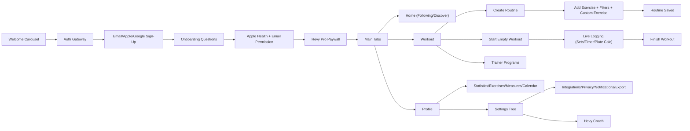
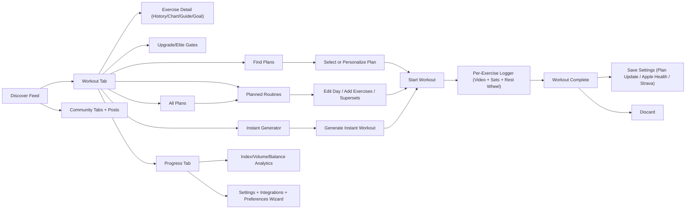
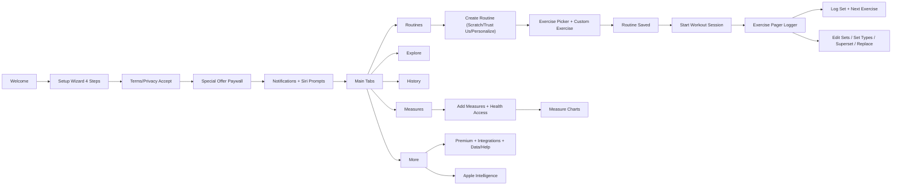

# Competitor UX Forensic Reverse Engineering

Generated: 2026-03-05
Workspace: `/Users/Apple/Documents/New project`

## Source Corpus Coverage

- `Hevy`: 118 screenshots analyzed.
- `JEFIT`: 125 screenshots analyzed.
- `SmartGym`: 60 screenshots analyzed.
- `Strong`: no screenshot folder provided in `Competitors ux screenshots`.
- `Fitbod`: no screenshot folder provided in `Competitors ux screenshots`.

## Missing Competitor Evidence

- `Strong` and `Fitbod` are listed in your competitor set but were **not present** in the local screenshot corpus.
- No architecture claims are made for `Strong` and `Fitbod` due to absent evidence.

---

# Hevy

## H-01. Full Navigation Map

1. `AuthCarousel` (3-slide landing) -> `AuthGateway`.
2. `AuthGateway` -> `SignupApple`, `SignupGoogle`, `SignupEmail`, `Login`.
3. `SignupEmail` -> validation and server error states.
4. `OnboardingFlow` -> profile questions and permissions.
5. `OnboardingFlow` -> `PaywallOnboarding` intercept.
6. `MainTabs` -> `Home`, `Workout`, `Profile`.
7. `Home` has mode switch -> `FollowingHome`, `DiscoverHome`.
8. `Workout` has mode switch -> `WorkoutRoot`, `TrainerRoot`.
9. `WorkoutRoot` -> `CreateRoutine`, `ExplorePrograms`, `StartEmptyWorkout`.
10. `ProfileRoot` -> dashboards and settings branches.
11. `Settings` -> Account, Workout, Privacy, Integrations, Notifications, Help, Export/Import.
12. `LiveWorkout` persistent mini-player appears at tab root while active session exists.
13. `HevyCoach` branch is reachable via settings and role-based flow.

## H-02. Complete Screen List (Unique IDs)

1. `H-S01` Welcome slide: workout logger preview.
2. `H-S02` Welcome slide: exercise analytics preview.
3. `H-S03` Welcome slide: community feed preview.
4. `H-S04` Auth CTA screen.
5. `H-S05` Email signup form.
6. `H-S06` Signup error state (`Email already exists`).
7. `H-S07` Onboarding: gender.
8. `H-S08` Onboarding: birthday.
9. `H-S09` Onboarding: weight.
10. `H-S10` Onboarding: height.
11. `H-S11` Onboarding: units.
12. `H-S12` Onboarding: top goal.
13. `H-S13` Onboarding: training experience.
14. `H-S14` Onboarding: guided vs self-built.
15. `H-S15` Onboarding: source attribution (`How did you hear about Hevy?`).
16. `H-S16` Apple Health permission pre-screen.
17. `H-S17` Email opt-in pre-screen.
18. `H-S18` Onboarding walkthrough slide: logging.
19. `H-S19` Onboarding walkthrough slide: progress.
20. `H-S20` Onboarding walkthrough slide: community.
21. `H-S21` Onboarding walkthrough slide: ready/get started.
22. `H-S22` Paywall landing cards (monthly/yearly/lifetime).
23. `H-S23` Paywall compare table (Free vs Pro).
24. `H-S24` Paywall FAQ + restore purchases.
25. `H-S25` Home following empty state with founder card.
26. `H-S26` Home following empty state without founder card.
27. `H-S27` Home mode dropdown.
28. `H-S28` Discover feed populated.
29. `H-S29` Workout root empty state.
30. `H-S30` Workout mode dropdown.
31. `H-S31` Trainer landing.
32. `H-S32` Program explore list.
33. `H-S33` Routine Help page 1.
34. `H-S34` Routine Help page 2.
35. `H-S35` Create Routine empty.
36. `H-S36` Add Exercise list.
37. `H-S37` Add Exercise search + keyboard.
38. `H-S38` Add Exercise filter sheet: muscle.
39. `H-S39` Add Exercise filter sheet: equipment.
40. `H-S40` Create Custom Exercise.
41. `H-S41` Add Exercise multi-select (`Add 7 exercises`).
42. `H-S42` Create Routine populated (top segment).
43. `H-S43` Create Routine populated (middle segment).
44. `H-S44` Create Routine populated (bottom segment).
45. `H-S45` Rest timer picker sheet in routine editor.
46. `H-S46` Notification permission warning modal.
47. `H-S47` Set row swipe-delete in routine editor.
48. `H-S48` Routine exercise overflow sheet.
49. `H-S49` Workout root with created routine card.
50. `H-S50` Routine card action sheet.
51. `H-S51` Live workout initial.
52. `H-S52` Live workout numeric entry.
53. `H-S53` Plate calculator sheet.
54. `H-S54` Manage equipment sheet for plate calculator.
55. `H-S55` Live workout rest timer controls active.
56. `H-S56` Live workout scrolled with timer rail.
57. `H-S57` Clock modal (`Timer`/`Stopwatch`).
58. `H-S58` Timer settings modal.
59. `H-S59` Exercise detail summary no data.
60. `H-S60` Exercise detail summary PR rows.
61. `H-S61` Exercise detail history empty.
62. `H-S62` Exercise detail how-to.
63. `H-S63` Exercise detail leaderboard empty.
64. `H-S64` Exercise overflow menu (`Weight Units`, `Duplicate`).
65. `H-S65` Share PR card composer.
66. `H-S66` Graph range picker (`Last 3 months`, `Year PRO`, `All time PRO`).
67. `H-S67` Superset selection sheet.
68. `H-S68` Replace exercise sheet.
69. `H-S69` Reorder full-screen.
70. `H-S70` Profile dashboard.
71. `H-S71` Statistics top section.
72. `H-S72` Statistics extended list.
73. `H-S73` Exercises library (profile branch).
74. `H-S74` Measurements graph.
75. `H-S75` Log measurements form.
76. `H-S76` Calendar month with streak/rest-day.
77. `H-S77` Edit profile.
78. `H-S78` Settings root top.
79. `H-S79` Account settings.
80. `H-S80` Settings root lower/help.
81. `H-S81` Manage subscription.
82. `H-S82` Push notifications top with OS warning.
83. `H-S83` Push notifications lower categories.
84. `H-S84` Workout settings top.
85. `H-S85` Workout settings lower.
86. `H-S86` Privacy & Social.
87. `H-S87` Units page.
88. `H-S88` Language page.
89. `H-S89` Theme page.
90. `H-S90` Theme action sheet.
91. `H-S91` Apple Health integration page.
92. `H-S92` Integrations page (`Strava`, `ChatGPT`).
93. `H-S93` Export & Import root.
94. `H-S94` Export Data page.
95. `H-S95` Import Data page (Strong CSV).
96. `H-S96` Getting started page 1.
97. `H-S97` Getting started page 2.
98. `H-S98` Getting started page 3.
99. `H-S99` FAQ list section A.
100. `H-S100` FAQ list section B.
101. `H-S101` FAQ list section C.
102. `H-S102` FAQ list section D.
103. `H-S103` FAQ list section E.
104. `H-S104` FAQ list section F.
105. `H-S105` Contact Us.
106. `H-S106` About page.
107. `H-S107` Hevy Coach role-selection.
108. `H-S108` Hevy Coach intro.
109. `H-S109` Hevy Coach feature section.
110. `H-S110` Hevy Coach pricing section.

## H-03. UX Flow Diagram

## H-04. Feature Inventory

1. Community feed with post interactions.
2. Discover feed with follow actions.
3. Routine creation and editing.
4. Routine notes and exercise notes.
5. Rest timer per exercise.
6. Reorder/replace/remove exercises.
7. Superset creation.
8. Add custom exercise.
9. Exercise filters by equipment and muscle.
10. Empty workout start.
11. Session logging with per-row completion.
12. Previous value display.
13. Plate calculator.
14. Manage bar/plate equipment profiles.
15. Clock modal timer/stopwatch.
16. Graph metrics (weight/1RM/volume/reps variants).
17. Exercise history/how-to/leaderboard tabs.
18. PR share card generation.
19. Statistics dashboard with body maps.
20. Calendar with streaks and rest day metrics.
21. Measurements tracking with extensive fields.
22. CSV export workouts.
23. CSV export measurements.
24. Import Strong CSV.
25. Apple Health integration.
26. Strava integration.
27. ChatGPT integration.
28. Theme, language, and unit controls.
29. Privacy controls and visibility defaults.
30. Rich notification category controls.
31. Subscription management with restore.
32. FAQ/help/contact.
33. Hevy Coach entry flow.

## H-05. Hidden Features

1. ChatGPT integration in first-party integrations page.
2. One-time Strong import with explicit limitations.
3. Warm-up set counting policy in stats.
4. Previous values strategy toggle (`Any workout` vs `Same routine`).
5. Smart superset auto-scrolling toggle.
6. Inline timer for duration exercises.
7. Live PR notifications toggle.
8. Per-exercise unit override menu.
9. Notification warning can be permanently dismissed.
10. Hevy Coach branch with trainer-client workflow messaging.

## H-06. Premium Features

1. Hevy Trainer access.
2. Unlimited routines.
3. Unlimited custom exercises.
4. Full measurement tracking.
5. Unlimited graph history.
6. Advanced statistics modules.
7. Year and all-time range unlocks.
8. Warm-up calculator.
9. Program and trainer content unlock.
10. Plans shown: Monthly `$2.99`, Yearly `$23.99`, Lifetime `$74.99`.

## H-07. Paywall Mechanics

1. Onboarding intercept paywall with skip path.
2. Three-tier plan cards and yearly emphasis.
3. Social proof sections and reviews.
4. Free-vs-Pro comparison table embedded.
5. FAQ accordion and legal links inside paywall.
6. Restore purchases exposed on paywall.
7. Separate manage-subscription screen mirrors offers.
8. Additional in-product PRO locks and unlock buttons.

## H-08. Workout Logging UX

1. Entry from routine or empty workout.
2. Session header exposes duration/volume/sets.
3. Exercise block has set table and notes.
4. Completion checkboxes per set.
5. Swipe-delete set rows.
6. Exercise overflow actions.
7. Numeric keyboard set entry.
8. Rest timer lifecycle with +/- and skip controls.
9. Plate calculator integrated at point-of-entry.
10. Bottom mini-player persists across tabs during active workout.
11. Finish action leads to save/discard decisions.

## H-09. Routine System

1. Create from workout root.
2. Add metadata (title/notes/goal context).
3. Add from exercise library.
4. Create custom exercises inline.
5. Set reps/weights templates.
6. Set rest timer templates.
7. Reorder by drag.
8. Replace/remove by actions.
9. Add supersets.
10. Save and start routine from card.
11. Card-level actions: share, duplicate, edit, delete.

## H-10. Analytics System

1. Profile dashboard view.
2. Exercise-level PR and graph analytics.
3. Statistics with body map and muscle distributions.
4. Main exercise frequency tracking.
5. Leaderboard-eligible exercise list.
6. Monthly report module.
7. Calendar-based training history.
8. Measurement history and charts.

## H-11. Community Features

1. Following feed.
2. Discover feed.
3. Like/comment interactions.
4. Follow athletes.
5. Invite friend from exercise leaderboard context.
6. Discover athletes and contact-connect onboarding CTAs.
7. Workout visibility controls.

## H-12. Integrations

1. Apple Health.
2. Strava.
3. ChatGPT.
4. Instagram stories sharing from PR card.
5. Strong CSV import path.
6. Apple Watch and Live Activities surfaced in FAQ/support content.

---

# JEFIT

## J-01. Full Navigation Map

1. Main tabs: `Discover`, `Workout`, `Progress`.
2. Workout subtabs: `Find`, `Planned`, `Instant`.
3. `Find` routes into category programs and all-plans inventory.
4. `Planned` routes into day editor and day-details runtime launch.
5. `Instant` routes into generated ad-hoc workout editor/launch.
6. In-session runtime is exercise-first with media header and timer wheel.
7. End-of-workout routes into save/discard summary page.
8. `Progress` routes into analytics + account settings.
9. Settings route into privacy, preferences, integrations, referral, support.

## J-02. Complete Screen List (Unique IDs)

1. `J-S01` Discover feed with challenge hero.
2. `J-S02` Workout `Find` root.
3. `J-S03` Category drill-down list.
4. `J-S04` Instant workout list (45-min upper body).
5. `J-S05` Instant generator sheet top.
6. `J-S06` Instant generator sheet with custom session length wheel.
7. `J-S07` Instant generator lower-body target selection.
8. `J-S08` Instant generated list (60-min lower body) top.
9. `J-S09` Instant generated list scrolled.
10. `J-S10` Instant start-from-scratch warning modal.
11. `J-S11` Instant save-plan action sheet.
12. `J-S12` All Plans list with current/selection cards.
13. `J-S13` Planned root empty plan state.
14. `J-S14` All Plans scrolled (plan-limit note).
15. `J-S15` Day action sheet.
16. `J-S16` Edit day empty.
17. `J-S17` Delete routine confirmation.
18. `J-S18` Add day modal.
19. `J-S19` Change day picker sheet.
20. `J-S20` Planned overview populated (multi-day).
21. `J-S21` Planned day details top.
22. `J-S22` Planned day details scrolled.
23. `J-S23` Autoplay promo card overlay.
24. `J-S24` Day details action-row state.
25. `J-S25` Add exercises list popular sort.
26. `J-S26` Add exercises list A-Z sort.
27. `J-S27` Filter sheet muscle.
28. `J-S28` Filter sheet equipment.
29. `J-S29` Filter sheet type.
30. `J-S30` Create custom exercise top.
31. `J-S31` Create custom exercise extended.
32. `J-S32` Add exercises custom-only state.
33. `J-S33` Day details with inserted block and action icons.
34. `J-S34` Edit day detailed set editor top.
35. `J-S35` Day details swipe action state.
36. `J-S36` Edit day detailed set editor middle.
37. `J-S37` Edit day detailed set editor lower.
38. `J-S38` Exercise detail history tab.
39. `J-S39` Exercise detail guide tab top.
40. `J-S40` Exercise detail guide tab scrolled.
41. `J-S41` Exercise detail chart tab.
42. `J-S42` Exercise full media header state.
43. `J-S43` In-exercise set logger with keyboard.
44. `J-S44` Enter custom 1RM modal.
45. `J-S45` Add note editor.
46. `J-S46` Invite and get free Elite modal.
47. `J-S47` In-exercise timer wheel idle.
48. `J-S48` In-exercise rest timer running.
49. `J-S49` In-exercise rest timer adjusted.
50. `J-S50` Rest timer picker sheet.
51. `J-S51` In-exercise timeout state.
52. `J-S52` Swap sheet.
53. `J-S53` 1RM calculator lock upsell.
54. `J-S54` 1RM calculator unlocked.
55. `J-S55` Dumbbell per-DB logging state.
56. `J-S56` Barbell decline logging state.
57. `J-S57` Cable cross-over logging state.
58. `J-S58` Skull crushers logging state.
59. `J-S59` Machine fly logging state.
60. `J-S60` Workout complete summary.
61. `J-S61` Workout complete with save toggles expanded.
62. `J-S62` Discard workout confirmation.
63. `J-S63` BodyMap summary sheet.
64. `J-S64` BodyMap chest subgroup (lower).
65. `J-S65` BodyMap chest subgroup (inner).
66. `J-S66` BodyMap chest subgroup (upper).
67. `J-S67` BodyMap chest subgroup (outer).
68. `J-S68` BodyMap triceps subgroup (medial).
69. `J-S69` BodyMap triceps subgroup (lateral).
70. `J-S70` BodyMap tooltip.
71. `J-S71` Progress overview top.
72. `J-S72` Progress index details.
73. `J-S73` Strength sample screen.
74. `J-S74` Stimulus volume sample screen.
75. `J-S75` Movement balance sample screen.
76. `J-S76` Movement pattern chart continuation.
77. `J-S77` Insights unlock overlay.
78. `J-S78` Time range sheet.
79. `J-S79` Total volume chart.
80. `J-S80` Workout time compare sample (locked).
81. `J-S81` Workout time chart standard.
82. `J-S82` Progress overview extended calendar/streak/sessions.
83. `J-S83` Streak leaderboard.
84. `J-S84` Muscle breakdown donut.
85. `J-S85` Progress overview with goals/assessment/achievements.
86. `J-S86` Settings root account/preferences.
87. `J-S87` Syncing data overlay.
88. `J-S88` Training preference wizard: goal.
89. `J-S89` Training preference wizard: level.
90. `J-S90` Training preference wizard: frequency.
91. `J-S91` Training preference wizard: duration.
92. `J-S92` Training preference wizard: equipment.
93. `J-S93` Training preference wizard: target zones.
94. `J-S94` Training preference adaptation loading.
95. `J-S95` Privacy settings page.
96. `J-S96` Privacy visibility picker sheet.
97. `J-S97` Refer & get free Elite (light page).
98. `J-S98` Unit picker sheet.
99. `J-S99` Appearance settings.
100. `J-S100` Workout settings top.
101. `J-S101` Workout settings bottom.
102. `J-S102` Connected apps + support + version page.
103. `J-S103` Splash icon.
104. `J-S104` Splash logo overlay.
105. `J-S105` Light theme planned detail variant.
106. `J-S106` Light theme logger variant.
107. `J-S107` Light theme workout complete variant.

## J-03. UX Flow Diagram

## J-04. Feature Inventory

1. Plan discovery by category.
2. Instant workout generation.
3. Planned day-by-day programming.
4. Day-level copy/delete/change-day operations.
5. Exercise database with filters.
6. Custom exercise creation.
7. Detailed set programming in planner.
8. Superset and interval fields in planner.
9. Autoplay mode education card.
10. Start workout from day details.
11. Video-guided in-workout logging.
12. Per-dumbbell weight logging.
13. Rest timer wheel with controls.
14. Exercise swap and superset in runtime.
15. 1RM and goal setting.
16. Notes and note history.
17. BodyMap focus and subgroup details.
18. Progress index/strength/stimulus/movement analytics.
19. Total volume and workout-time charts.
20. Calendar/streak analytics.
21. Achievement and points system.
22. Assessment and goal modules.
23. Referral and elite incentives.
24. Privacy visibility granularity.
25. Training preference wizard.
26. Connected apps and support hub.

## J-05. Hidden Features

1. Refine Training History tool.
2. Detailed “About Reps” algorithm explanation.
3. Compare-with-user analytics mode.
4. Day row action includes link action in addition to edit/delete.
5. Coaches entry for personalized tips.
6. In-session HD video toggle.
7. BodyMap tooltip explanation modal.
8. Save workout option can update plan baselines.

## J-06. Premium Features

1. Elite plans and locked plan cards.
2. Locked insights dashboards.
3. Compare results lock (`Go Elite to Unlock Results`).
4. Extended analytic windows with bolt-marked ranges.
5. 1RM calculator premium-lock moments.
6. BodyMap advanced details with elite prompts.

## J-07. Paywall Mechanics

1. Distributed contextual paywall triggers.
2. Upgrade banners inside workout/discovery/progress surfaces.
3. Locked overlays in analytics and calculators.
4. Referral mechanism tied to free elite rewards.
5. No single mandatory checkout screen captured in this corpus.

## J-08. Workout Logging UX

1. Plan day -> exercise logger transition.
2. Logger includes media header and set grid.
3. Rest wheel auto-starts post set logging.
4. Adjustable timer and skip behavior.
5. Timeout state explicitly rendered.
6. In-session exercise swap and supersets.
7. Workout complete summary includes save policy toggles.
8. Discard path has explicit confirmation.

## J-09. Routine System

1. Plan selection from all-plans catalog.
2. Weekly structure in planned tab.
3. Day create/copy/rename/reassign.
4. Day contains ordered exercise stacks.
5. Per-exercise set schema in day editor.
6. Per-exercise interval defaults.
7. Add exercises via massive filtered list.
8. Add custom exercises.
9. Start workout from day details.
10. Save generated instant plan into plan library.

## J-10. Analytics System

1. Progress index.
2. Strength model.
3. Stimulus volume model.
4. Movement balance model.
5. Total volume chart.
6. Total workout-time chart.
7. BodyMap summary and subgroups.
8. Muscle breakdown donut.
9. Calendar and streak stats.
10. Streak leaderboard.
11. Achievements and goals.

## J-11. Community Features

1. Discover feed.
2. Community channels (`My Circle`, `Popular`, `Q&A`, `Blog`, `Meal Plan`).
3. Post cards with training summaries.
4. Public/private indicators.
5. Friend/invite flows linked to social and referral loops.

## J-12. Integrations

1. Apple Health.
2. Apple Watch.
3. Strava.
4. Referral links and sharing.

---

# SmartGym

## S-01. Full Navigation Map

1. Welcome -> setup wizard.
2. Setup -> terms/privacy acceptance.
3. Setup -> special offer paywall.
4. Setup -> notifications + Siri prompts.
5. Main tabs: `Routines`, `Explore`, `History`, `Measures`, `More`.
6. `Routines` -> create/manage/start routines.
7. `Explore` -> smart trainer and pre-made workouts.
8. `History` -> chart/calendar history.
9. `Measures` -> add measures and view measure charts.
10. `More` -> premium, settings, integrations, data management, help.

## S-02. Complete Screen List (Unique IDs)

1. `S-S01` Welcome landing.
2. `S-S02` Setup step 1 experience.
3. `S-S03` Setup step 2 equipment.
4. `S-S04` Setup step 3 goal.
5. `S-S05` Setup step 4 days/duration.
6. `S-S06` Terms/privacy acceptance.
7. `S-S07` Special offer paywall top.
8. `S-S08` Special offer paywall mid (Loved by Apple).
9. `S-S09` Special offer paywall lower (PT switch, restore).
10. `S-S10` Quit setup modal.
11. `S-S11` Notifications pre-permission.
12. `S-S12` Siri pre-permission.
13. `S-S13` Routines empty state.
14. `S-S14` Add routine method sheet.
15. `S-S15` Routine editor empty.
16. `S-S16` Exercises browser with premium toggle.
17. `S-S17` Custom exercise editor.
18. `S-S18` Exercises selected-state.
19. `S-S19` Routine editor populated.
20. `S-S20` Routine detail with Siri prompt.
21. `S-S21` Siri permission system dialog.
22. `S-S22` Siri phrase recording page.
23. `S-S23` Routine row swipe actions.
24. `S-S24` Routines non-empty home.
25. `S-S25` Explore screen.
26. `S-S26` History chart mode empty.
27. `S-S27` History calendar mode empty.
28. `S-S28` Measures empty state.
29. `S-S29` Health Access sheet.
30. `S-S30` Add measure form top.
31. `S-S31` Add measure form circumferences.
32. `S-S32` Add measure form skinfold.
33. `S-S33` Measures populated list/date view.
34. `S-S34` All charts page.
35. `S-S35` More tab top with inline trial card.
36. `S-S36` More tab settings section A.
37. `S-S37` More tab settings section B.
38. `S-S38` More tab Apple Watch/connected/share.
39. `S-S39` More tab app-store/help/about.
40. `S-S40` Save-workout option modal.
41. `S-S41` Apple Intelligence help page top.
42. `S-S42` Apple Intelligence help page insights section.
43. `S-S43` Apple Intelligence help page import-from-text section.
44. `S-S44` Apple Intelligence help page AI personality section.
45. `S-S45` Premium features list page 1.
46. `S-S46` Premium features list page 2.
47. `S-S47` Active workout page (exercise 1 of 3).
48. `S-S48` Active workout edit mode with keyboard.
49. `S-S49` Active workout multi-set editing state.
50. `S-S50` Set-type info sheet.
51. `S-S51` Drop-set tagged state.
52. `S-S52` Warm-up tagged state.
53. `S-S53` Sets-done panel state.
54. `S-S54` Exercise overflow menu.
55. `S-S55` Replace/alternate exercise sheet.
56. `S-S56` Active workout page (exercise 2 of 3).

## S-03. UX Flow Diagram

## S-04. Feature Inventory

1. 4-step personalization setup.
2. Equipment-aware training profile.
3. Goal-aware plan profile.
4. Duration/day scheduling profile.
5. Routine creation modes (`Scratch`, `Trust us`, `Personalize`).
6. Exercise catalog with premium toggle.
7. Custom exercise creation.
8. In-routine swipe actions.
9. Superset with next exercise.
10. Replace exercise this workout vs permanently.
11. Pager-style workout execution.
12. Set logging with quick next progression.
13. In-session editing and add/remove set.
14. Set type taxonomy (regular/warm-up/drop).
15. HIIT duration toggle.
16. Apply set changes to all sets.
17. Default-value update choice from logged sessions.
18. Measures logging extensive fields.
19. Measures chart drilldown.
20. History chart and calendar modes.
21. Apple Watch support pages.
22. Siri Shortcuts integration.
23. Notifications and alarms settings.
24. Export data and erase data controls.
25. Apple Intelligence toggle and docs.
26. Personal trainer account mode.
27. Premium features and trial surfaces.

## S-05. Hidden Features

1. Apple Intelligence requirements gate (`iOS 26+`, app version, Premium+).
2. Import-from-text routine conversion capability.
3. AI personality modes for coaching tone.
4. Save-workout conflict resolution policy modal.
5. Routine replacement permanence split.
6. Equipment-list concept (up to 5 sets) in premium docs.
7. Siri commands for full session lifecycle.

## S-06. Premium Features

1. Smart Trainer personalization depth.
2. 130+ pro-made workouts.
3. 700+ exercises.
4. Standalone Apple Watch app.
5. Custom goals.
6. Equipment lists.
7. Weight personalization.
8. Unlimited routines.
9. Unlimited histories.
10. Unlimited measures.
11. Charts.
12. Heart-rate zones.
13. Live Activities.
14. Cloud sync.
15. Awards.
16. Daily motivational quotes.
17. Monthly summary insights.
18. iPad sync.
19. Lock screen widgets.
20. Routine sharing.

## S-07. Paywall Mechanics

1. Onboarding paywall with long-form scroll narrative.
2. Persistent trial CTA.
3. Quit intercept modal before exiting setup.
4. Restore purchases in paywall body.
5. PT-mode upsell branch.
6. Inline paywall card in `More` tab after setup.
7. Lock indicators in exercise list and feature cards.
8. Pricing shown: `$59.99/year`, displayed as `$5/month billed yearly` and `7-day trial`.

## S-08. Workout Logging UX

1. Runtime is one-exercise-at-a-time pager.
2. Main CTA can log and advance to next exercise.
3. In-place edit mode with numeric keypad.
4. Set row operations and ordering.
5. Rest and HIIT toggles in set editor.
6. Warm-up/drop-set tagging.
7. Superset and replacement actions from overflow.
8. Session timer bar with pause/cancel.
9. “Log different sets” avoids overwriting routine values.
10. “Make these default values” can propagate edits back to routine defaults.

## S-09. Routine System

1. Create routine from routines root.
2. Define name/goal/renewal/notes.
3. Add exercises from filtered list.
4. Add custom exercises.
5. Reorder exercises.
6. Swipe for replace/superset/remove.
7. Save routine and start session.
8. Archive routines from settings.

## S-10. Analytics System

1. History charts mode.
2. History calendar mode.
3. Measures trend cards.
4. All charts multi-metric drilldown.
5. Date-indexed measure timeline.
6. Premium docs mention monthly summaries and heart-rate zones.

## S-11. Community Features

1. No first-party social feed, comments, likes, or athlete graph surfaced in provided captures.
2. Share features are app/story and routine-share oriented.

## S-12. Integrations

1. Apple Health.
2. Apple Watch.
3. Siri Shortcuts.
4. Strava.
5. Workouts-from-other-apps connector entry.
6. Apple Intelligence.
7. Cloud sync and iPad sync positioning.

---

# Master Feature List Across Provided Evidence (H/J/S)

- `Strong` and `Fitbod` are marked unknown due to missing evidence.

1. MF-001 Auth with Apple/Google/Email (`H=yes`, `J=unknown`, `S=unknown`).
2. MF-002 Multi-step onboarding personalization (`H=yes`, `J=yes`, `S=yes`).
3. MF-003 Onboarding paywall intercept (`H=yes`, `J=no evidence`, `S=yes`).
4. MF-004 Routine creation (`H=yes`, `J=yes`, `S=yes`).
5. MF-005 Routine day assignment (`H=partial`, `J=yes`, `S=partial`).
6. MF-006 Add exercise from filtered library (`H=yes`, `J=yes`, `S=yes`).
7. MF-007 Custom exercise creation (`H=yes`, `J=yes`, `S=yes`).
8. MF-008 Superset support (`H=yes`, `J=yes`, `S=yes`).
9. MF-009 Replace exercise (`H=yes`, `J=yes`, `S=yes`).
10. MF-010 Reorder exercises (`H=yes`, `J=yes`, `S=yes`).
11. MF-011 Rest timer per exercise (`H=yes`, `J=yes`, `S=yes`).
12. MF-012 Timer quick-adjust/skip (`H=yes`, `J=yes`, `S=partial`).
13. MF-013 Plate calculator (`H=yes`, `J=no evidence`, `S=no evidence`).
14. MF-014 In-workout media playback (`H=animation`, `J=video`, `S=animation`).
15. MF-015 Workout completion save/discard (`H=yes`, `J=yes`, `S=yes`).
16. MF-016 Save-workout policy controls (`H=yes`, `J=yes`, `S=yes`).
17. MF-017 Exercise detail tabs (history/chart/guide) (`H=yes`, `J=yes`, `S=partial`).
18. MF-018 Exercise 1RM tools (`H=yes`, `J=yes`, `S=no evidence`).
19. MF-019 Exercise notes (`H=yes`, `J=yes`, `S=no evidence`).
20. MF-020 Body map analytics (`H=yes`, `J=yes`, `S=no evidence`).
21. MF-021 Advanced progression index (`H=partial`, `J=yes`, `S=no evidence`).
22. MF-022 Calendar analytics (`H=yes`, `J=yes`, `S=yes`).
23. MF-023 Measurement logging (`H=yes`, `J=partial`, `S=yes`).
24. MF-024 Measurement charts (`H=yes`, `J=no evidence`, `S=yes`).
25. MF-025 Export data (`H=yes`, `J=no evidence`, `S=yes`).
26. MF-026 Import competitor data (`H=Strong CSV`, `J=no evidence`, `S=no evidence`).
27. MF-027 Apple Health integration (`H=yes`, `J=yes`, `S=yes`).
28. MF-028 Strava integration (`H=yes`, `J=yes`, `S=yes`).
29. MF-029 Apple Watch integration (`H=faq mentions`, `J=yes`, `S=yes`).
30. MF-030 ChatGPT integration (`H=yes`, `J=no evidence`, `S=indirect via docs`).
31. MF-031 Apple Intelligence integration (`H=no evidence`, `J=no evidence`, `S=yes`).
32. MF-032 Social feed (`H=yes`, `J=yes`, `S=no evidence`).
33. MF-033 Likes/comments/follows (`H=yes`, `J=partial`, `S=no evidence`).
34. MF-034 Discover athletes (`H=yes`, `J=partial`, `S=no evidence`).
35. MF-035 Privacy controls (`H=yes`, `J=yes`, `S=partial`).
36. MF-036 Notification settings granularity (`H=yes`, `J=partial`, `S=yes`).
37. MF-037 Theme controls (`H=yes`, `J=yes`, `S=partial`).
38. MF-038 Language controls (`H=yes`, `J=no evidence`, `S=exercise language`).
39. MF-039 Unit controls (`H=yes`, `J=yes`, `S=yes`).
40. MF-040 Help center and support (`H=yes`, `J=yes`, `S=yes`).
41. MF-041 Referral incentives (`H=no evidence`, `J=yes`, `S=no evidence`).
42. MF-042 Personal trainer mode (`H=Hevy Coach branch`, `J=coaches tips`, `S=yes`).
43. MF-043 Siri shortcuts workflow (`H=faq mention`, `J=no evidence`, `S=yes`).
44. MF-044 Live activities mention (`H=faq mention`, `J=no evidence`, `S=yes`).
45. MF-045 Lock-screen widgets mention (`H=no evidence`, `J=no evidence`, `S=yes`).
46. MF-046 Cloud sync premium claim (`H=no explicit claim`, `J=no explicit claim`, `S=yes`).
47. MF-047 Achievements/badges (`H=no evidence`, `J=yes`, `S=premium claim`).
48. MF-048 Streak leaderboard (`H=no evidence`, `J=yes`, `S=no evidence`).
49. MF-049 Program explore catalogs (`H=yes`, `J=yes`, `S=yes`).
50. MF-050 Inline contextual upsell patterns (`H=yes`, `J=yes`, `S=yes`).

